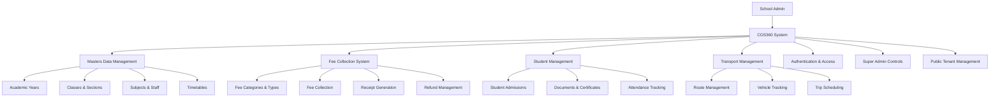
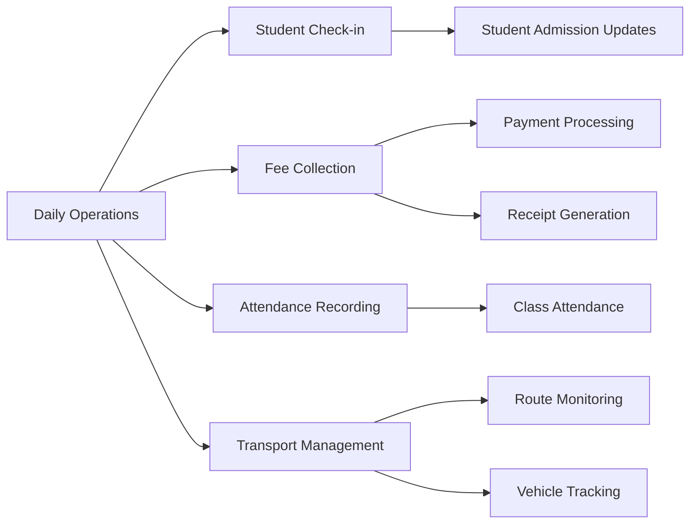
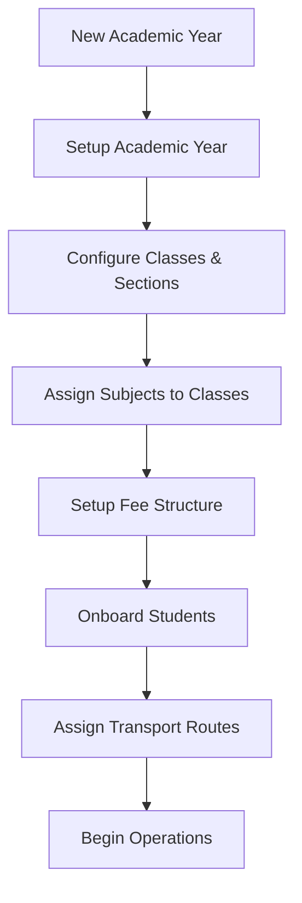

# COS360 School Management System - Business Guide

## 🎯 Overview
COS360 is a comprehensive multi-tenant school management system designed to streamline educational institution operations. This documentation provides business stakeholders with clear insights into system capabilities, workflows, and feature functionality.

## 🏗️ System Architecture Overview

## 📚 Module Documentation

### Core Business Modules

1. **[Masters Data Management](./masters-module.md)**
   - Academic year setup and management
   - Class, section, and subject organization
   - Staff and designation management
   - Holiday and timetable planning

2. **[Fee Collection System](./fee-module.md)**
   - Fee structure configuration
   - Payment processing workflows
   - Receipt generation and verification
   - Refund request management

3. **[Student Management](./student-module.md)**
   - Student admission processes
   - Document and certificate management
   - Attendance tracking systems
   - Transport assignment

4. **[Transport Management](./transport-module.md)**
   - Route planning and management
   - Vehicle allocation and tracking
   - Trip scheduling and monitoring
   - Student transport assignments

### System Administration Modules

5. **[Authentication & Access Control](./auth-module.md)**
   - User login and permission management
   - Role-based access control
   - Security and audit features

6. **[Super Admin System](./super-admin-module.md)**
   - Multi-tenant management
   - System-wide administration
   - Plan and permission management
   - Cross-tenant operations

7. **[Public Tenant Management](./public-module.md)**
   - Tenant configuration
   - Subscription plan management
   - System-wide settings

## 🔄 Key Business Workflows

### Daily Operations Flow

### Academic Setup Flow

## 🎛️ System Capabilities

### Multi-Tenant Architecture
- **Isolated Data**: Each school operates with completely separate data
- **Shared Infrastructure**: Common system features with tenant-specific customization
- **Scalable Design**: Supports multiple schools on single platform

### Permission & Security
- **Role-Based Access**: Different access levels for administrators, staff, and users
- **Plan-Based Features**: Subscription plans control available features
- **Audit Logging**: Complete tracking of all system operations

### Data Management
- **Academic Year Segregation**: All data organized by academic year
- **Relationship Management**: Connected data across students, classes, fees, and transport
- **Reporting Capabilities**: Comprehensive data export and analysis

## 🚀 Getting Started

### For School Administrators
1. Review the [Fee Collection System](./fee-module.md) for payment processing setup
2. Understand [Student Management](./student-module.md) for admission workflows
3. Configure [Masters Data](./masters-module.md) for academic structure

### For System Administrators
1. Start with [Super Admin System](./super-admin-module.md) for tenant management
2. Review [Authentication & Access Control](./auth-module.md) for user management
3. Configure [Public Tenant Management](./public-module.md) for system settings

## 📋 System Status

- **Current Version**: Phase 1 Complete
- **Total Features**: 29 operational features
- **API Endpoints**: 211+ active endpoints
- **Status**: Production Ready ✅

## 🔗 Quick Navigation

| Module | Business Function | Key Features |
|--------|------------------|--------------|
| [Masters](./masters-module.md) | Academic Structure | Years, Classes, Subjects, Staff |
| [Fee](./fee-module.md) | Financial Management | Payments, Receipts, Refunds |
| [Student](./student-module.md) | Student Lifecycle | Admissions, Documents, Attendance |
| [Transport](./transport-module.md) | Transportation | Routes, Vehicles, Scheduling |
| [Auth](./auth-module.md) | Access Control | Login, Permissions, Security |
| [Super Admin](./super-admin-module.md) | System Management | Tenants, Plans, Administration |
| [Public](./public-module.md) | Configuration | Settings, Plans, Global Config |

---

**Documentation Purpose**: This guide helps business stakeholders understand COS360's capabilities, workflows, and operational features without technical implementation details.

**Last Updated**: 2025-09-13