# Authentication & Access Control Module

## 📋 Module Overview
The Authentication & Access Control module provides comprehensive security and user management for COS360. It implements a sophisticated multi-tier permission system, ensuring secure access to system features while maintaining tenant isolation and role-based functionality.

## 🎯 Business Purpose
- **Security Assurance**: Protect sensitive educational and financial data
- **Access Control**: Ensure users can only access appropriate system features
- **Tenant Isolation**: Maintain strict data separation between different institutions
- **Role Management**: Support various organizational roles with appropriate permissions
- **Audit Compliance**: Complete access logging and security monitoring

## 🔧 Core Features

### 1. Multi-Tier Authentication System

#### Three-Level Access Hierarchy
**Business Value**: Structured access control supporting different organizational levels and responsibilities.

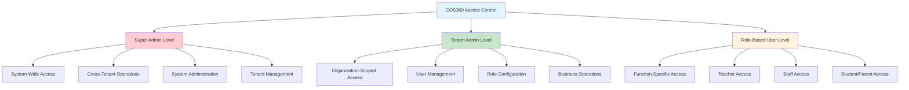

#### Token-Based Authentication
**Business Value**: Secure, stateless authentication supporting mobile and web applications with session management.

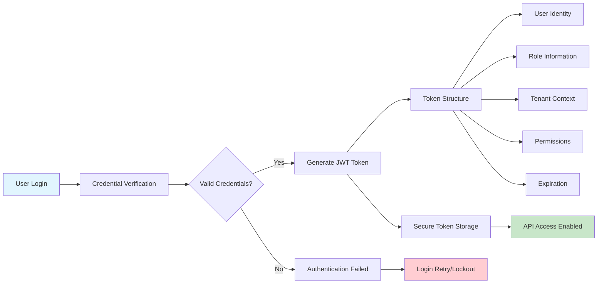

**Key Workflows**:
- Secure user login with credential verification
- JWT token generation with role and tenant information
- Token-based API access for all system operations
- Automatic token refresh and session management
- Account lockout protection after failed attempts

### 2. Dual-Layer Permission System

#### Plan-Based Permission Layer
**Business Value**: Subscription-based feature access ensuring customers receive appropriate service levels.

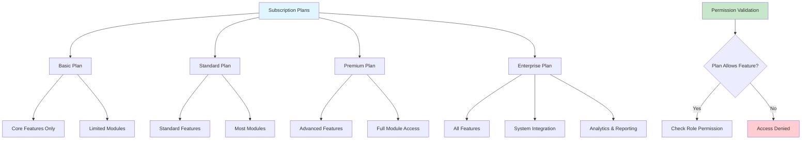

#### Role-Based Permission Layer
**Business Value**: Granular access control within available features ensuring appropriate user access levels.

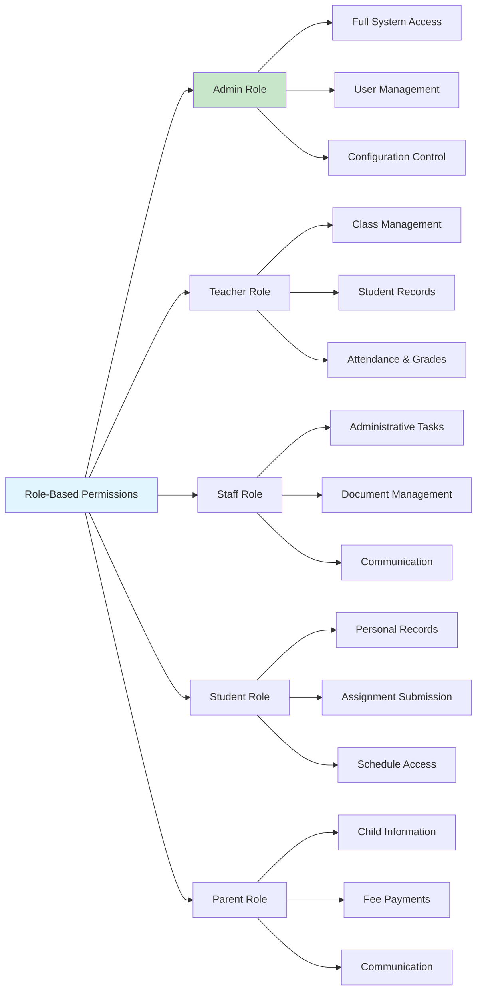

**Key Workflows**:
- Two-layer permission validation for all system access
- Plan-based feature availability checking
- Role-based action permission verification
- Dynamic permission updates based on plan changes
- Comprehensive permission audit logging

### 3. Tenant Isolation & Security

#### Multi-Tenant Data Security
**Business Value**: Complete data isolation ensuring institutional privacy and compliance with data protection requirements.

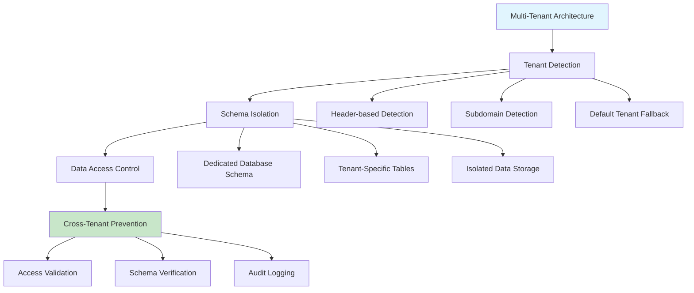

#### Security Monitoring & Audit
**Business Value**: Comprehensive security monitoring and audit trail for compliance and threat detection.

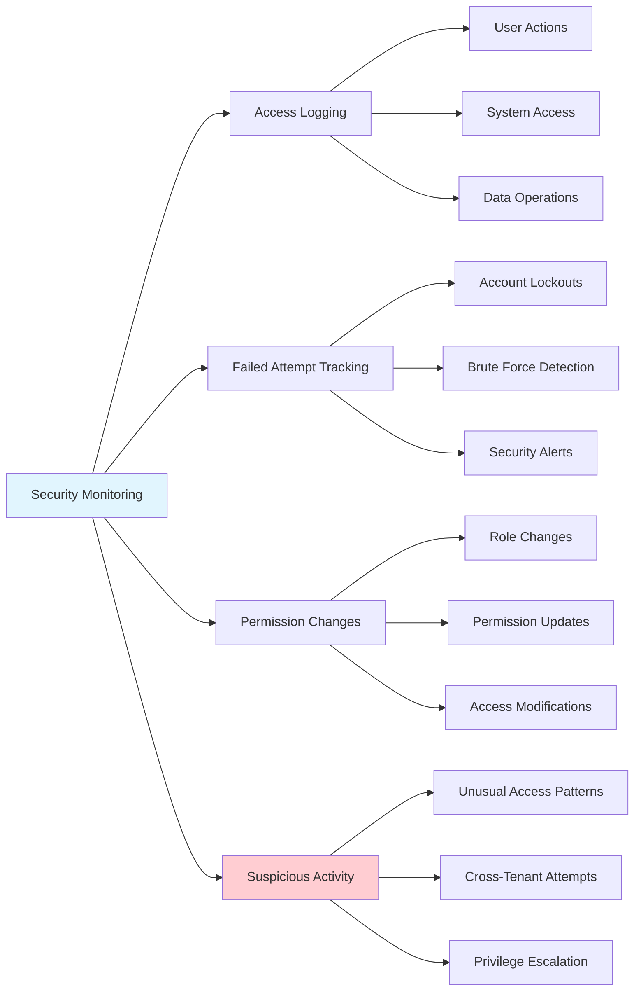

**Key Workflows**:
- Automatic tenant detection and context setting
- Strict database schema isolation per tenant
- Prevention of cross-tenant data access
- Comprehensive security audit logging
- Real-time security threat monitoring

### 4. User Management & Role Administration

#### User Lifecycle Management
**Business Value**: Streamlined user onboarding and management with appropriate role assignment and access control.

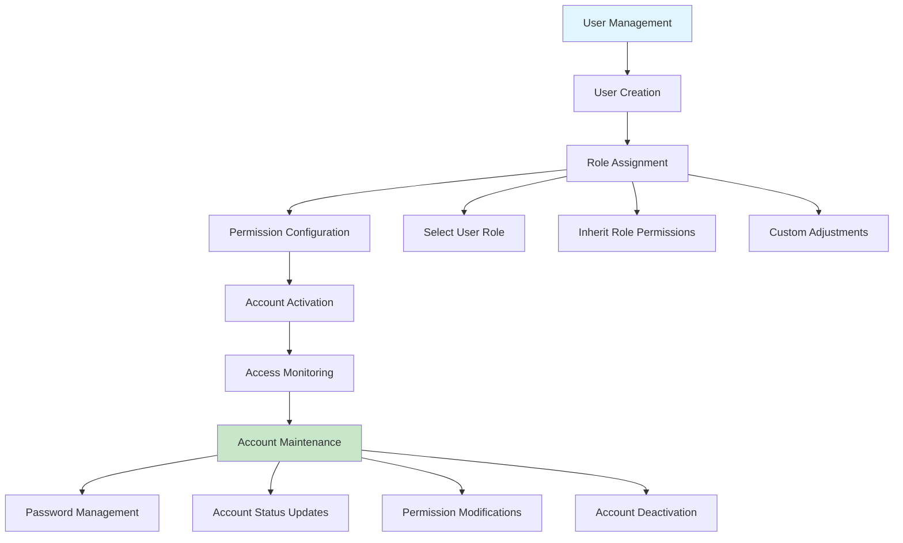

#### Role Configuration & Management
**Business Value**: Flexible role management supporting organizational structure and changing business requirements.

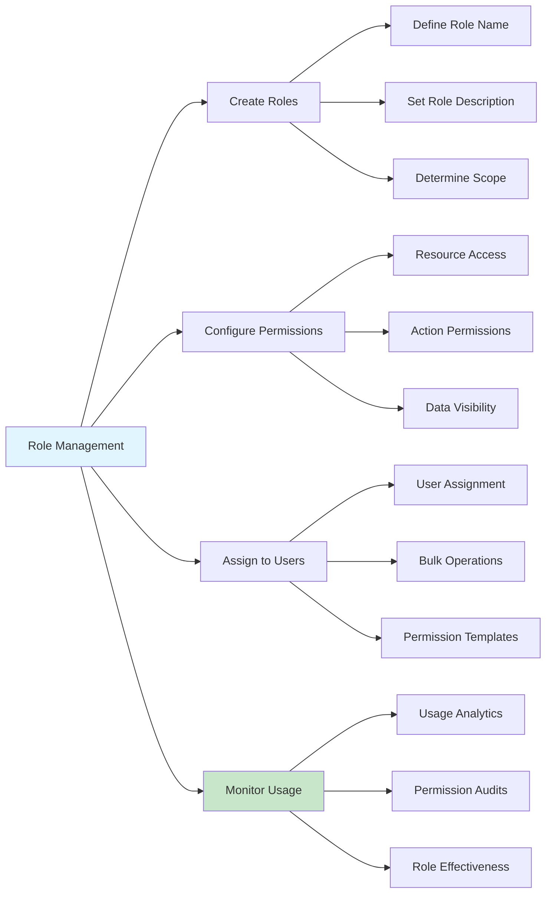

**Key Workflows**:
- Create and manage user accounts with appropriate roles
- Configure role-based permissions for system resources
- Monitor user access patterns and permissions usage
- Handle user account lifecycle from creation to deactivation
- Support bulk user operations for efficiency

## 🔄 Integrated Business Workflows

### User Onboarding Process
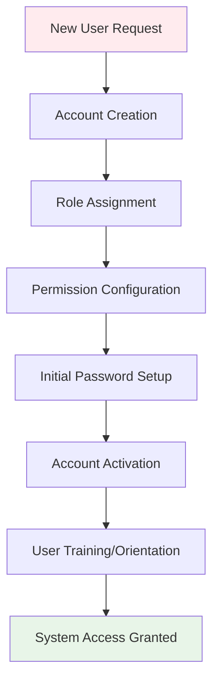

### Daily Authentication Flow
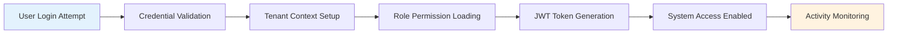

### Permission Change Workflow
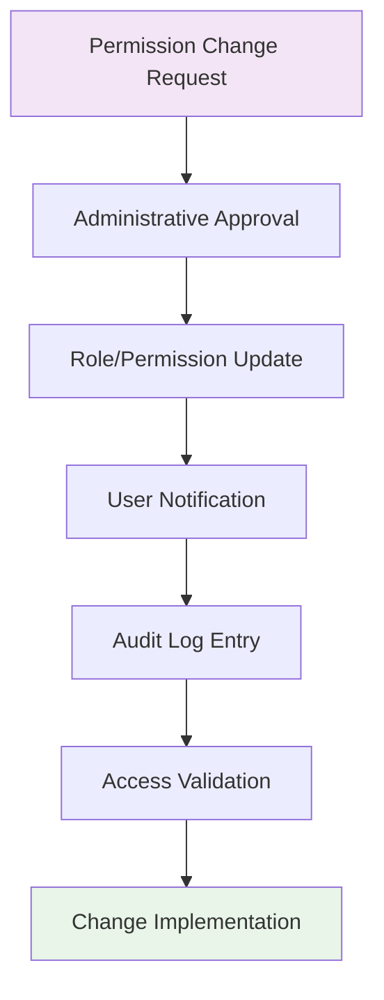

## 📊 Data Relationships

### Authentication Data Hierarchy
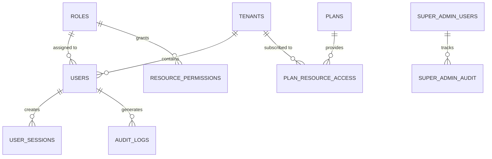

## 💼 Business Benefits

### For System Security
- **Data Protection**: Multi-layer security ensuring data confidentiality and integrity
- **Access Control**: Granular permission management with dual-layer validation
- **Audit Compliance**: Complete access logging and security monitoring
- **Threat Prevention**: Account lockout and suspicious activity detection

### For Institution Administration
- **User Management**: Streamlined user onboarding and role management
- **Flexible Permissions**: Role-based access supporting organizational structure
- **Tenant Isolation**: Complete data separation and privacy protection
- **Operational Control**: Administrative oversight of user access and permissions

### For End Users
- **Secure Access**: Reliable authentication with appropriate feature access
- **Role-Appropriate Interface**: System features aligned with user responsibilities
- **Session Management**: Secure session handling with automatic timeout
- **Account Security**: Password management and security notifications

### For Compliance & Auditing
- **Complete Audit Trail**: Comprehensive logging of all access and permission changes
- **Security Monitoring**: Real-time threat detection and response
- **Regulatory Compliance**: Data protection and access control compliance support
- **Incident Investigation**: Detailed logs for security incident analysis

## 🚀 Getting Started

### Initial Setup Checklist
1. **Configure Tenant Settings** - Setup tenant identification and isolation
2. **Define Role Structure** - Create roles matching organizational hierarchy
3. **Setup Permission Templates** - Configure standard permission sets
4. **Create Administrative Users** - Setup initial admin accounts with full access
5. **Configure Security Policies** - Set password policies and lockout rules
6. **Enable Audit Logging** - Activate comprehensive access logging
7. **Test Authentication Flow** - Verify login and permission validation
8. **Setup Monitoring** - Configure security monitoring and alerting

### Best Practices
- Use strong password policies and regular password changes
- Implement principle of least privilege for all user roles
- Regular review and audit of user permissions
- Monitor failed login attempts and unusual access patterns
- Keep role definitions aligned with organizational structure
- Regular security training for administrative users
- Maintain comprehensive audit logs for compliance
- Test disaster recovery and account recovery procedures

---

**Next Module**: [Super Admin System →](./super-admin-module.md)

**Previous Module**: [← Transport Management](./transport-module.md)

**Back to**: [Main Documentation](./README.md)