# Fee Collection System Module

## 📋 Module Overview
The Fee Collection System is the financial backbone of COS360, handling all aspects of fee management from structure definition to payment processing, receipt generation, and refund management. This module ensures transparent, auditable, and efficient financial operations.

## 🎯 Business Purpose
- **Financial Management**: Complete fee lifecycle management
- **Payment Processing**: Multiple payment methods and secure transactions
- **Audit Compliance**: Full financial audit trail and receipt verification
- **Revenue Tracking**: Comprehensive financial reporting and analytics
- **Refund Management**: Structured refund request and approval workflow

## 🔧 Core Features

### 1. Fee Structure Configuration

#### Fee Categories & Types
**Business Value**: Organized fee structure enabling flexible pricing and clear financial categorization.

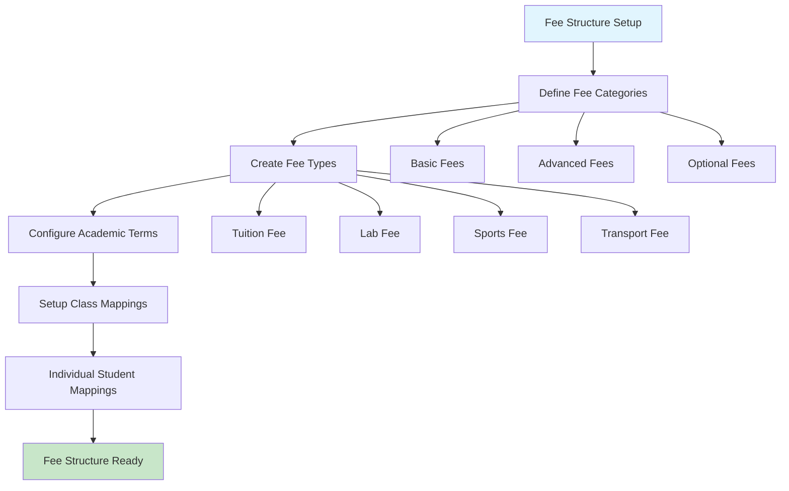

**Key Workflows**:
- Create fee categories for organizational grouping
- Define specific fee types under each category
- Configure terms (monthly, quarterly, annual) for payment scheduling

### 2. Fee Assignment System

#### Class-Based Fee Mapping
**Business Value**: Automated fee assignment based on class enrollment, reducing manual work and ensuring consistency.

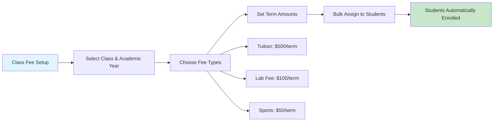

#### Individual Student Overrides
**Business Value**: Handles special cases, scholarships, and individual fee adjustments while maintaining audit trail.

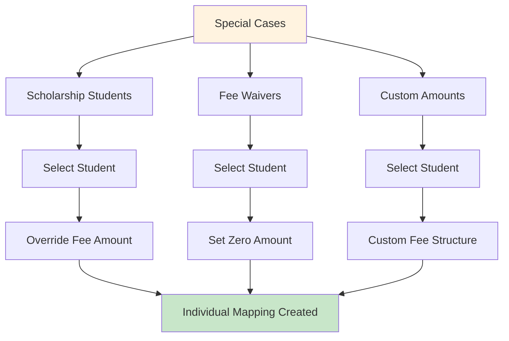

**Key Workflows**:
- Bulk assignment of fees to entire classes
- Individual student fee customization for special cases
- Term-wise amount configuration for payment scheduling

### 3. Payment Processing System

#### Multi-Method Payment Support
**Business Value**: Flexible payment options to accommodate different stakeholder preferences and circumstances.

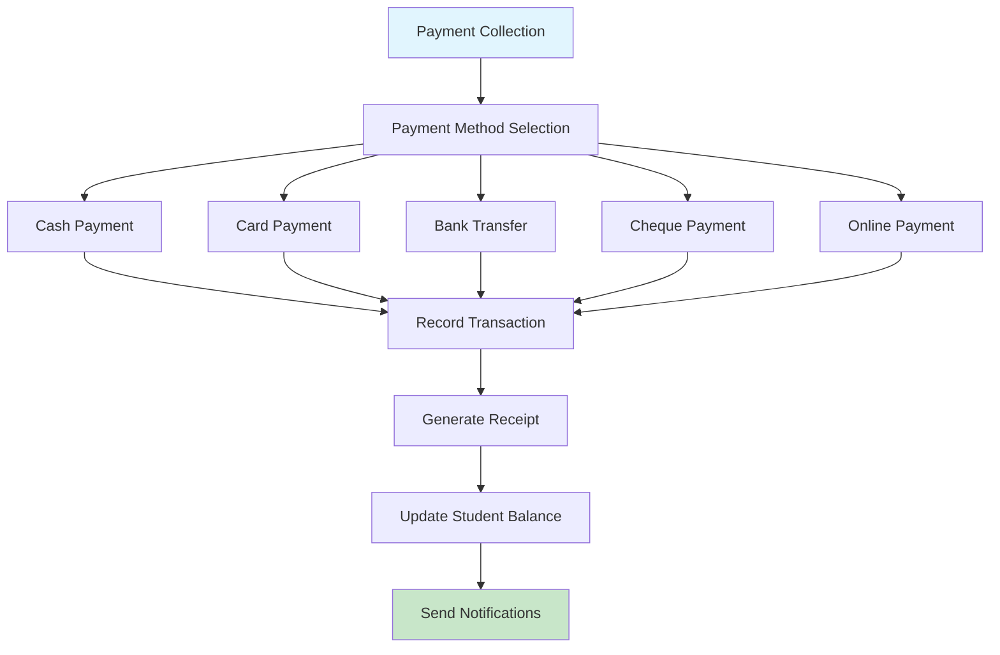

#### Transaction Management
**Business Value**: Comprehensive transaction tracking with status management and audit capabilities.

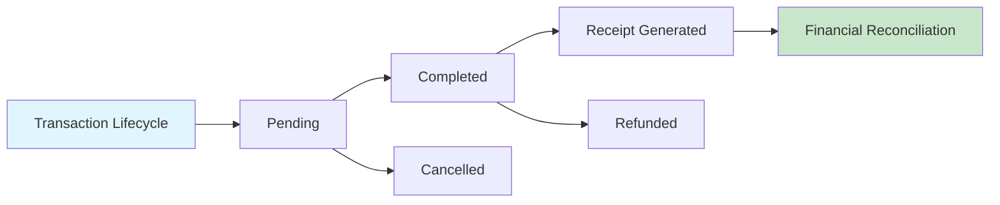

**Key Workflows**:
- Create transactions with multiple fee items
- Process payments through various methods
- Track transaction status throughout lifecycle
- Generate comprehensive payment history

### 4. Receipt Management System

#### Secure Receipt Generation
**Business Value**: Legal compliance and fraud prevention through cryptographically secured receipts.

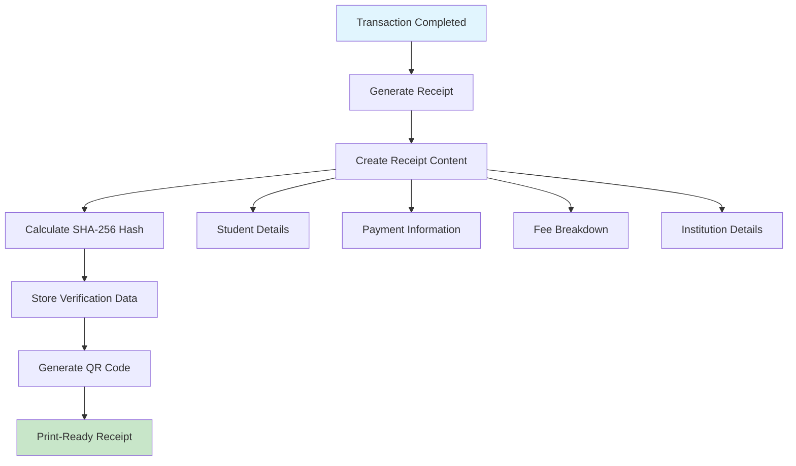

#### Receipt Verification & Reprinting
**Business Value**: Audit compliance and receipt authenticity verification for stakeholder confidence.

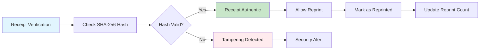

**Key Workflows**:
- Automatic receipt generation post-payment
- Cryptographic integrity verification
- Controlled reprinting with audit trail
- QR code generation for digital verification

### 5. Refund Management System

#### Structured Refund Workflow
**Business Value**: Transparent and accountable refund process with proper authorization and audit trail.

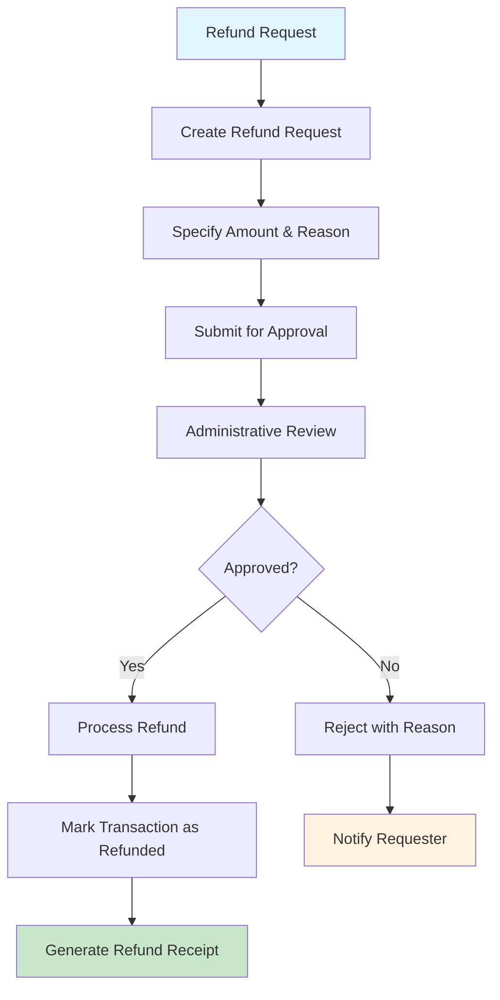

#### Refund Types & Processing
**Business Value**: Flexible refund handling for various scenarios while maintaining financial control.

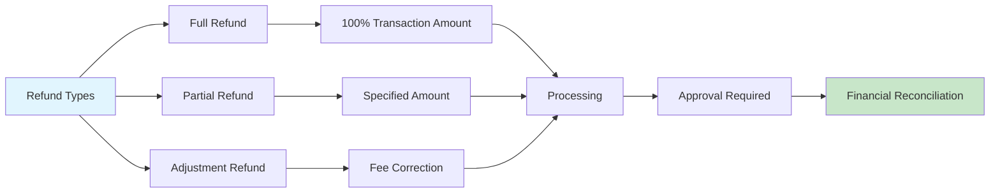

**Key Workflows**:
- Submit refund requests with detailed justification
- Multi-level approval process for financial control
- Process approved refunds with complete audit trail
- Generate refund documentation for compliance

### 6. Financial Reporting & Analytics

#### Outstanding Fees Tracking
**Business Value**: Real-time visibility into pending payments and cash flow management.

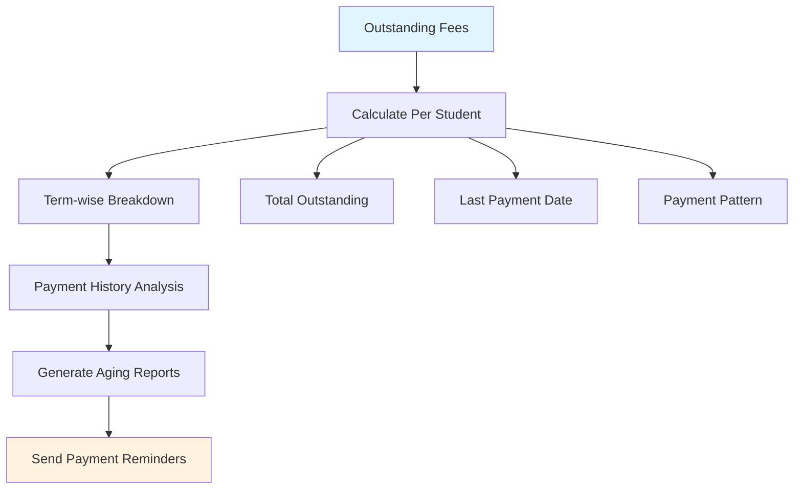

#### Transaction Analytics
**Business Value**: Financial insights for institutional planning and decision-making.

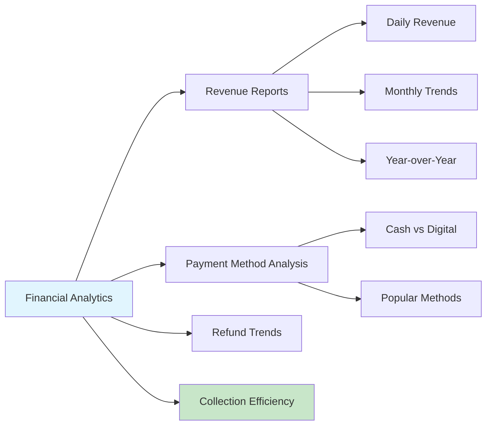

**Key Workflows**:
- Real-time outstanding fee calculations
- Comprehensive transaction history and search
- Payment method preference analysis
- Financial trend reporting

## 🔄 Integrated Business Workflows

### Complete Fee Collection Process
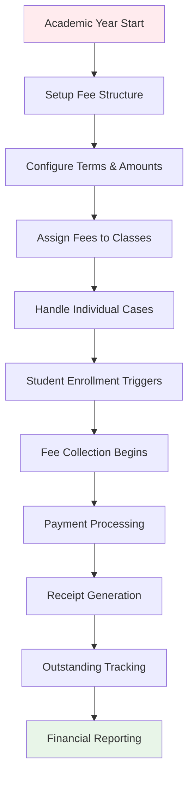

### Daily Payment Operations

### Monthly Financial Cycle
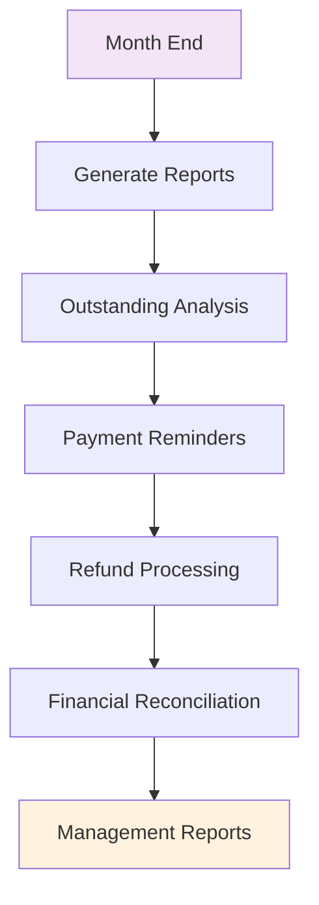

## 📊 Data Relationships

### Fee Structure Hierarchy
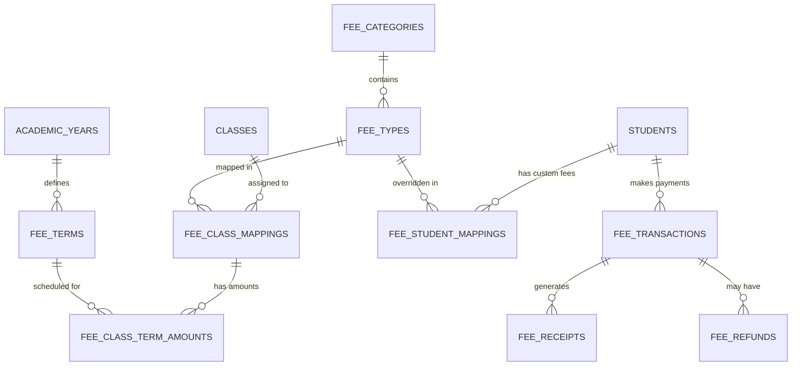

## 💼 Business Benefits

### For Financial Management
- **Revenue Tracking**: Real-time financial visibility and reporting
- **Audit Compliance**: Complete transaction audit trail and receipt verification
- **Cash Flow Management**: Outstanding fee tracking and payment analytics
- **Fraud Prevention**: Cryptographically secured receipts and verification

### For Administrative Staff
- **Efficient Processing**: Streamlined payment collection and receipt generation
- **Flexible Structure**: Support for various fee types and payment methods
- **Automated Workflows**: Bulk fee assignment and automated calculations
- **Exception Handling**: Individual student fee customization capabilities

### For Students & Parents
- **Payment Flexibility**: Multiple payment method options
- **Transparent Receipts**: Clear, verifiable payment documentation
- **Outstanding Visibility**: Real-time fee balance information
- **Refund Process**: Structured refund request and tracking system

## 🚀 Getting Started

### Initial Setup Checklist
1. **Configure Fee Categories** - Create organizational fee groupings
2. **Define Fee Types** - Set up specific fee types under categories
3. **Setup Academic Terms** - Configure payment term structure
4. **Create Class Mappings** - Assign fee structures to classes
5. **Configure Payment Methods** - Enable required payment options
6. **Test Receipt Generation** - Verify receipt formatting and security
7. **Setup Refund Workflow** - Configure approval process and roles

### Best Practices
- Design fee structure before academic year begins
- Use bulk class mappings for efficiency
- Regular financial reconciliation and reporting
- Maintain secure receipt verification processes
- Monitor outstanding fees for proactive collection
- Document refund policies and approval workflows

---

**Next Module**: [Student Management →](./student-module.md)

**Previous Module**: [← Masters Data Management](./masters-module.md)

**Back to**: [Main Documentation](./README.md)