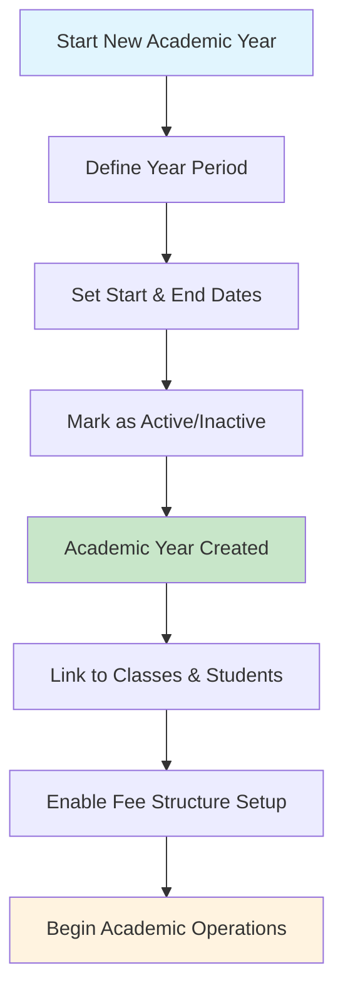
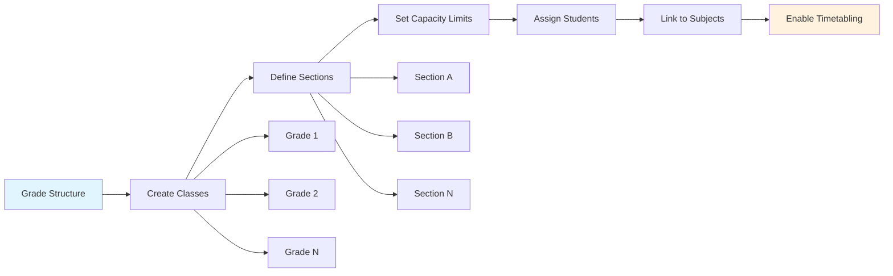
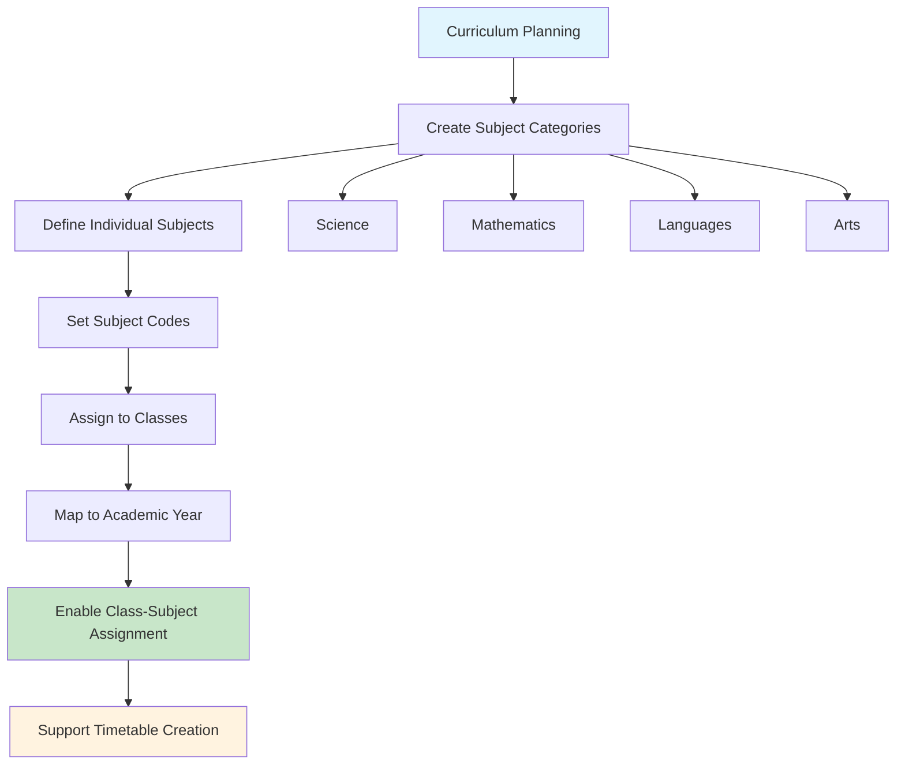
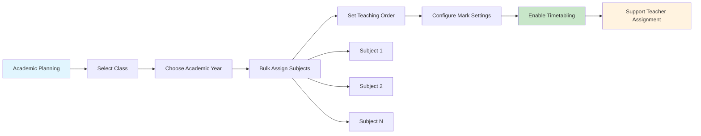
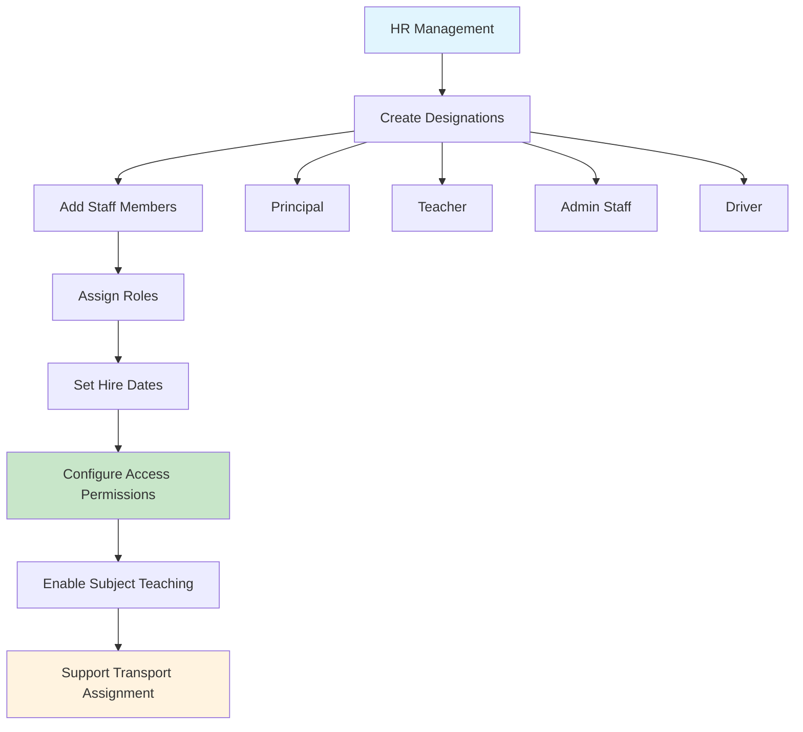
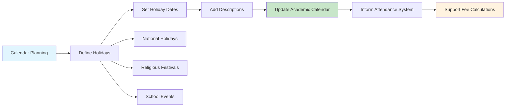
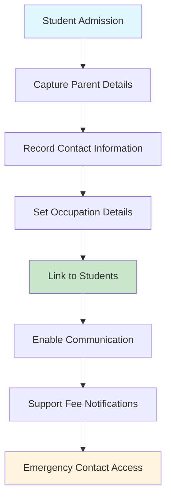
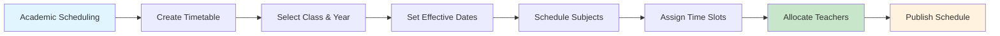
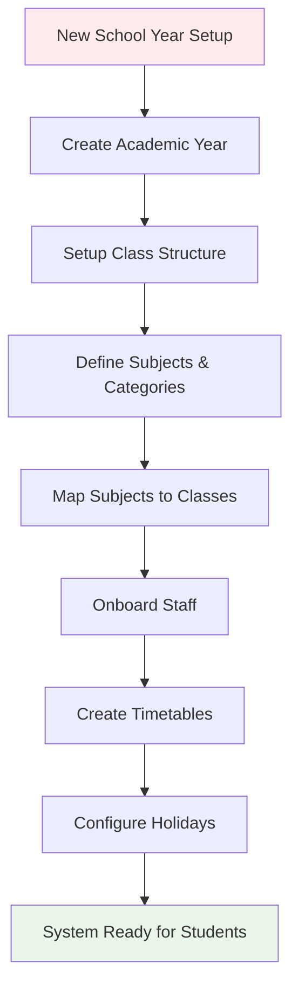
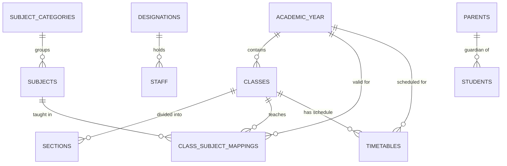

# Masters Data Management Module

## 📋 Module Overview
The Masters module forms the foundation of COS360, managing all core academic data structures. This module handles the organizational hierarchy of educational institutions, from academic years to individual class-subject assignments.

## 🎯 Business Purpose
- **Academic Structure**: Establish the fundamental academic framework
- **Data Foundation**: Provide reference data for all other system modules
- **Organizational Hierarchy**: Define relationships between academic entities
- **Planning Support**: Enable academic year planning and resource allocation

## 🔧 Core Features

### 1. Academic Year Management
**Business Value**: Segregates all academic activities by year, enabling year-over-year tracking and planning.

**Key Workflows**:
- Create academic year with date ranges
- Activate/deactivate years for data segregation
- Dropdown selection for year-based filtering

### 2. Class & Section Management
**Business Value**: Organizes students into manageable groups for instruction and administration.

**Key Workflows**:
- Create grade levels (classes)
- Subdivide into sections with capacity limits
- Retrieve sections by class for student assignment

### 3. Subject Management
**Business Value**: Defines curriculum structure and enables academic planning.

**Key Workflows**:
- Categorize subjects for organization
- Create subjects with unique codes
- Filter subjects by category for assignment

### 4. Class-Subject Mapping
**Business Value**: Defines which subjects are taught to which classes, supporting academic planning and timetabling.

**Key Workflows**:
- Map multiple subjects to a class at once
- Set subject order for display and scheduling
- Configure exam/marking preferences per subject

### 5. Staff & Designation Management
**Business Value**: Manages human resources and organizational roles within the institution.

**Key Workflows**:
- Define organizational roles and titles
- Onboard staff with complete profiles
- Link staff to system permissions and duties

### 6. Holiday Management
**Business Value**: Plans academic calendar and manages institutional holidays.

**Key Workflows**:
- Plan yearly holiday calendar
- Filter holidays by month/year for planning
- Integrate with attendance and fee systems

### 7. Parent Management
**Business Value**: Maintains parent/guardian information for student relationships and communication.

**Key Workflows**:
- Register parents during student admission
- Maintain updated contact information
- Link parents to multiple children if applicable

### 8. Timetable Management
**Business Value**: Schedules academic activities and optimizes resource utilization.

**Key Workflows**:
- Create term-based timetables for classes
- Set validity periods for schedule changes
- Link to class-subject mappings for consistency

## 🔄 Integrated Business Workflows

### Complete Academic Setup Process

### Daily Operational Flow

## 📊 Data Relationships

### Master Data Hierarchy

## 💼 Business Benefits

### For School Administrators
- **Structured Data**: Clear academic hierarchy and organization
- **Planning Support**: Tools for academic year and curriculum planning
- **Resource Management**: Staff and facility allocation support
- **Compliance**: Holiday planning and calendar management

### For Academic Staff
- **Clear Structure**: Well-defined class and subject organization
- **Schedule Management**: Integrated timetable and holiday systems
- **Student Context**: Parent and guardian information access

### For System Operations
- **Data Foundation**: Reliable reference data for all other modules
- **Relationship Integrity**: Consistent data relationships across the system
- **Flexibility**: Support for various academic structures and requirements

## 🚀 Getting Started

### Initial Setup Checklist
1. **Create Academic Year** - Define the current academic period
2. **Setup Class Structure** - Create grades and sections
3. **Configure Subjects** - Define curriculum and subject categories
4. **Onboard Staff** - Add teachers and administrative staff
5. **Plan Calendar** - Configure holidays and important dates
6. **Create Mappings** - Link subjects to appropriate classes
7. **Generate Timetables** - Schedule academic activities

### Best Practices
- Start with academic year setup before any other configuration
- Maintain consistent naming conventions for classes and subjects
- Regularly update staff and parent contact information
- Plan holiday calendar at the beginning of each academic year
- Use bulk operations for efficient class-subject mapping

---

**Next Module**: [Fee Collection System →](./fee-module.md)

**Back to**: [Main Documentation](./README.md)