# Public Tenant Management Module

## 📋 Module Overview
The Public Tenant Management module handles system-wide configuration and tenant relationship management within the COS360 platform. This module provides the foundational infrastructure supporting multi-tenancy, plan management, and cross-tenant operations.

## 🎯 Business Purpose
- **Platform Foundation**: Core infrastructure supporting multi-tenant architecture
- **Tenant Registry**: Central registry of all tenants and their configurations
- **Plan Management**: Subscription plan definitions and tenant assignments
- **System Configuration**: Global settings and platform-wide configurations
- **Integration Support**: APIs and services supporting external integrations

## 🔧 Core Features

### 1. Tenant Registry & Configuration

#### Central Tenant Management
**Business Value**: Centralized tenant information and configuration management supporting platform scalability and administration.

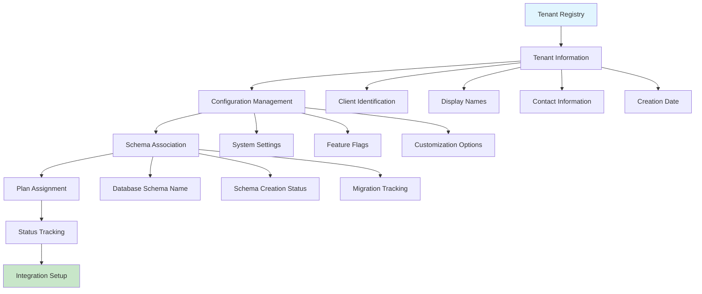

#### Tenant Lifecycle Management
**Business Value**: Comprehensive tenant lifecycle support from creation to deactivation with proper data management.

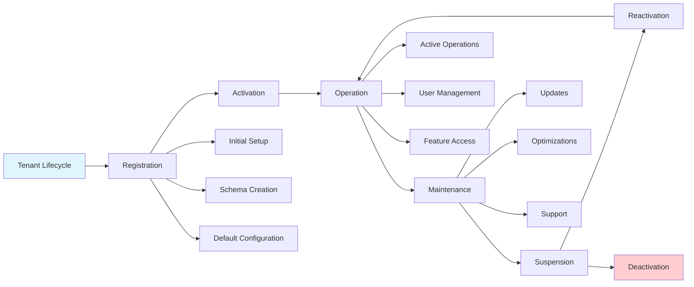

**Key Workflows**:
- Register new tenants with unique identifiers and configurations
- Associate tenants with appropriate database schemas
- Track tenant status and operational health
- Manage tenant-specific settings and customizations
- Support tenant lifecycle operations and status changes

### 2. Subscription Plan Management

#### Plan Definition & Structure
**Business Value**: Flexible subscription plan architecture supporting diverse business models and customer requirements.

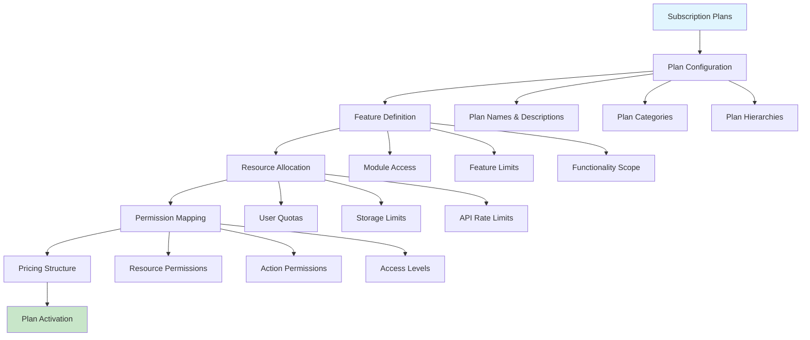

#### Plan-Tenant Relationships
**Business Value**: Dynamic plan assignment and management enabling flexible subscription model changes and upgrades.

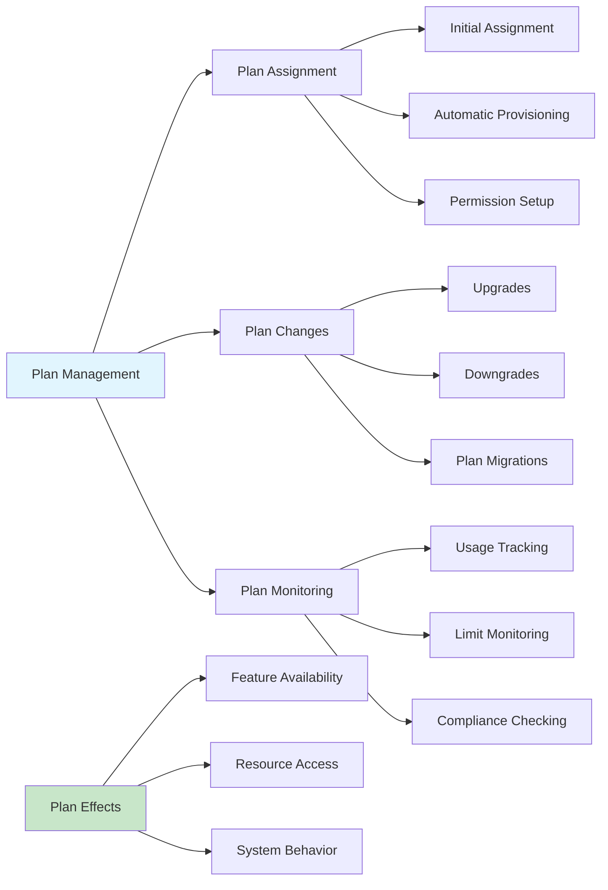

**Key Workflows**:
- Define subscription plans with feature sets and resource allocations
- Assign plans to tenants and manage plan changes
- Monitor plan usage and compliance with limits
- Support plan upgrades, downgrades, and migrations
- Track plan effectiveness and utilization analytics

### 3. Global Configuration Management

#### System-Wide Settings
**Business Value**: Centralized configuration management supporting consistent platform behavior and administration.

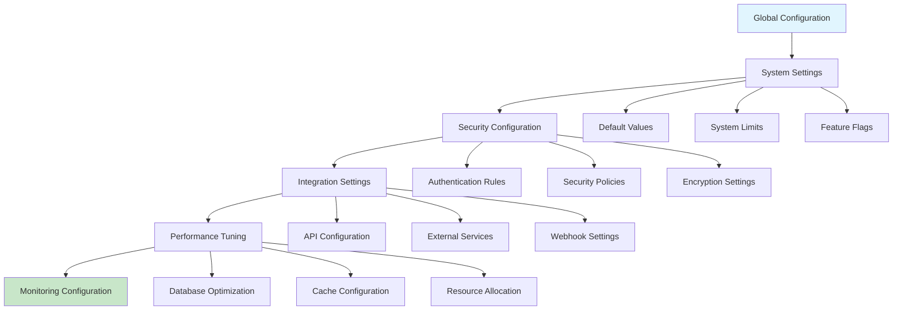

#### Platform Defaults & Templates
**Business Value**: Standardized defaults and templates ensuring consistent tenant experience and reducing setup complexity.

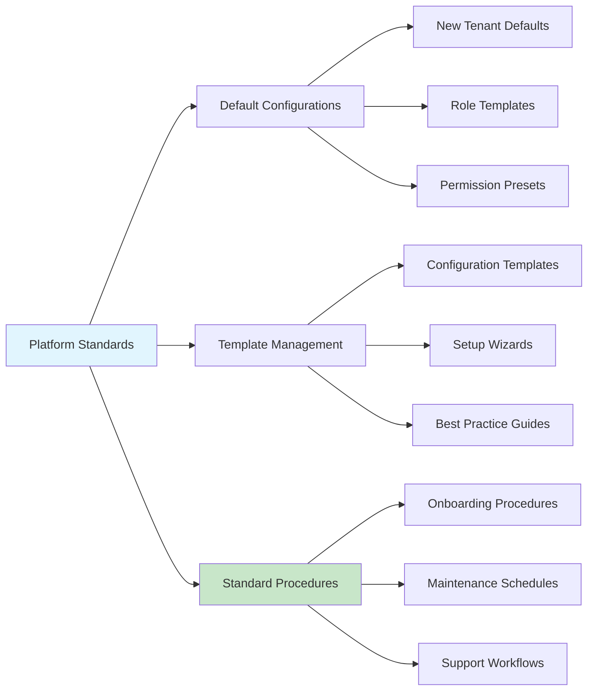

**Key Workflows**:
- Manage system-wide configuration settings and defaults
- Configure platform security policies and authentication rules
- Setup integration endpoints and external service connections
- Maintain configuration templates for new tenant onboarding
- Monitor configuration changes and their impact

### 4. Cross-Tenant Services & APIs

#### Public API Management
**Business Value**: Standardized APIs supporting external integrations and cross-tenant operations while maintaining security.

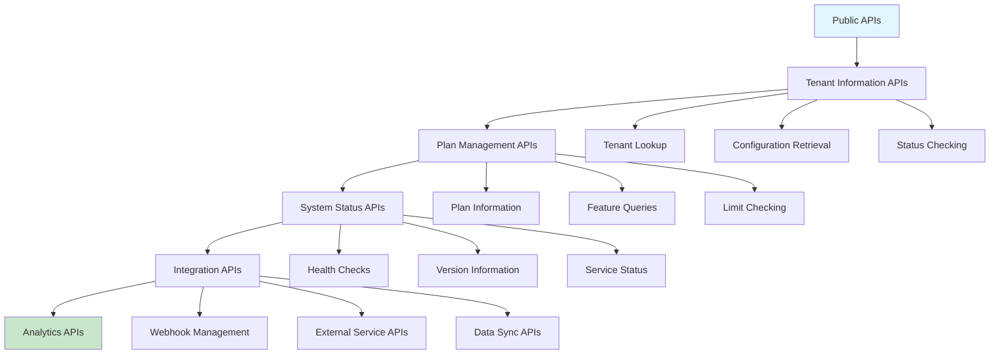

#### Platform Integration Support
**Business Value**: Robust integration capabilities supporting external systems and third-party service connections.

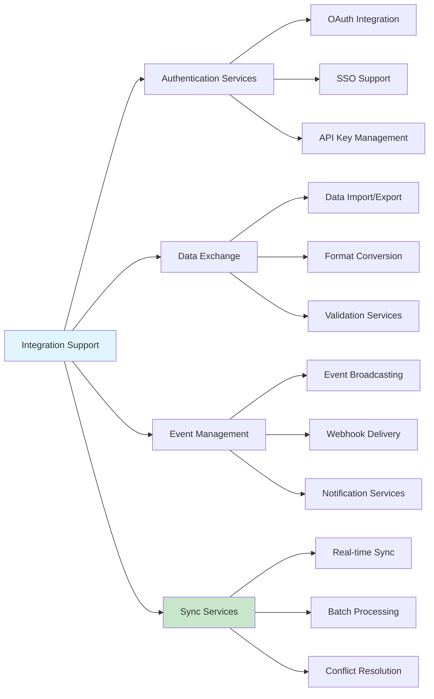

**Key Workflows**:
- Provide public APIs for tenant information and configuration access
- Support external integrations with authentication and authorization
- Manage webhooks and event notifications for external systems
- Handle data synchronization between COS360 and external services
- Monitor API usage and performance across the platform

## 🔄 Integrated Business Workflows

### Platform Initialization Process
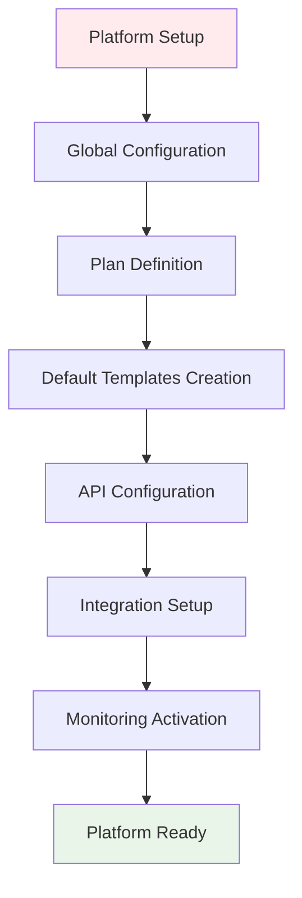

### New Tenant Integration Flow
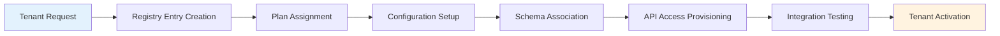

### Platform Maintenance Cycle
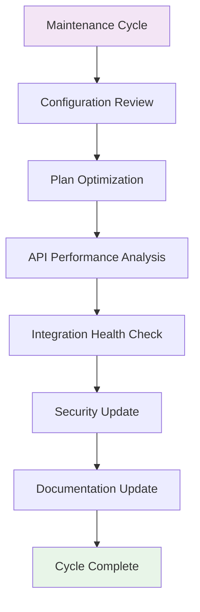

## 📊 Data Relationships

### Public Schema Data Hierarchy
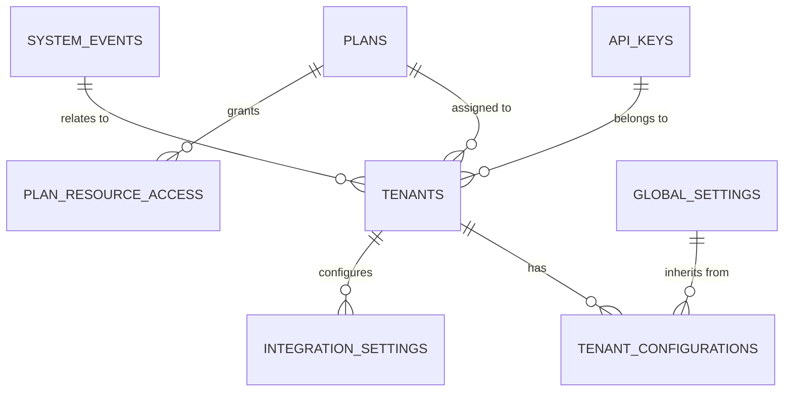

## 💼 Business Benefits

### For Platform Administration
- **Centralized Management**: Single point of control for tenant and plan management
- **Scalability**: Support for unlimited tenant growth and platform expansion
- **Standardization**: Consistent configuration and setup processes
- **Monitoring**: Comprehensive platform health and usage monitoring

### For System Integration
- **API Standardization**: Consistent APIs for external system integration
- **Integration Support**: Robust support for third-party service connections
- **Data Exchange**: Reliable data import/export and synchronization
- **Event Management**: Comprehensive event and notification systems

### For Business Operations
- **Plan Flexibility**: Dynamic subscription plan management and changes
- **Revenue Optimization**: Support for various business models and pricing
- **Customer Management**: Efficient tenant onboarding and lifecycle management
- **Analytics**: Platform usage and performance insights

### For Technical Operations
- **Configuration Management**: Centralized system configuration and defaults
- **Performance Optimization**: Platform-wide performance monitoring and tuning
- **Security Management**: Global security policies and authentication management
- **Maintenance Support**: Systematic platform maintenance and update procedures

## 🚀 Getting Started

### Initial Setup Checklist
1. **Global Configuration** - Setup system-wide settings and defaults
2. **Plan Definition** - Create subscription plans with feature sets
3. **Template Creation** - Develop tenant onboarding templates
4. **API Configuration** - Setup public APIs and integration endpoints
5. **Security Setup** - Configure global security policies and authentication
6. **Monitoring Setup** - Enable platform monitoring and analytics
7. **Documentation** - Create platform administration documentation
8. **Testing** - Validate all public APIs and integration capabilities

### Best Practices
- Maintain centralized configuration for consistency across tenants
- Regular review and optimization of subscription plans
- Comprehensive monitoring of platform health and performance
- Secure API management with proper authentication and rate limiting
- Regular backup of tenant registry and configuration data
- Proactive monitoring of integration health and performance
- Systematic approach to platform updates and maintenance
- Clear documentation of all configuration changes and impacts

---

**Previous Module**: [← Super Admin System](./super-admin-module.md)

**Back to**: [Main Documentation](./README.md)