# Student Management Module

## 📋 Module Overview
The Student Management module handles the complete student lifecycle from admission to graduation. It manages student records, documents, certificates, attendance tracking, and transport assignments, providing a comprehensive view of each student's academic journey.

## 🎯 Business Purpose
- **Student Lifecycle Management**: Complete student record management from admission to graduation
- **Document Management**: Secure storage and retrieval of student documents and certificates
- **Attendance Tracking**: Comprehensive attendance monitoring and reporting
- **Academic Records**: Integration with academic performance and progress tracking
- **Transport Integration**: Student transport assignment and management

## 🔧 Core Features

### 1. Student Admission System

#### Admission Process Workflow
**Business Value**: Streamlined student onboarding with complete profile creation and academic year assignment.

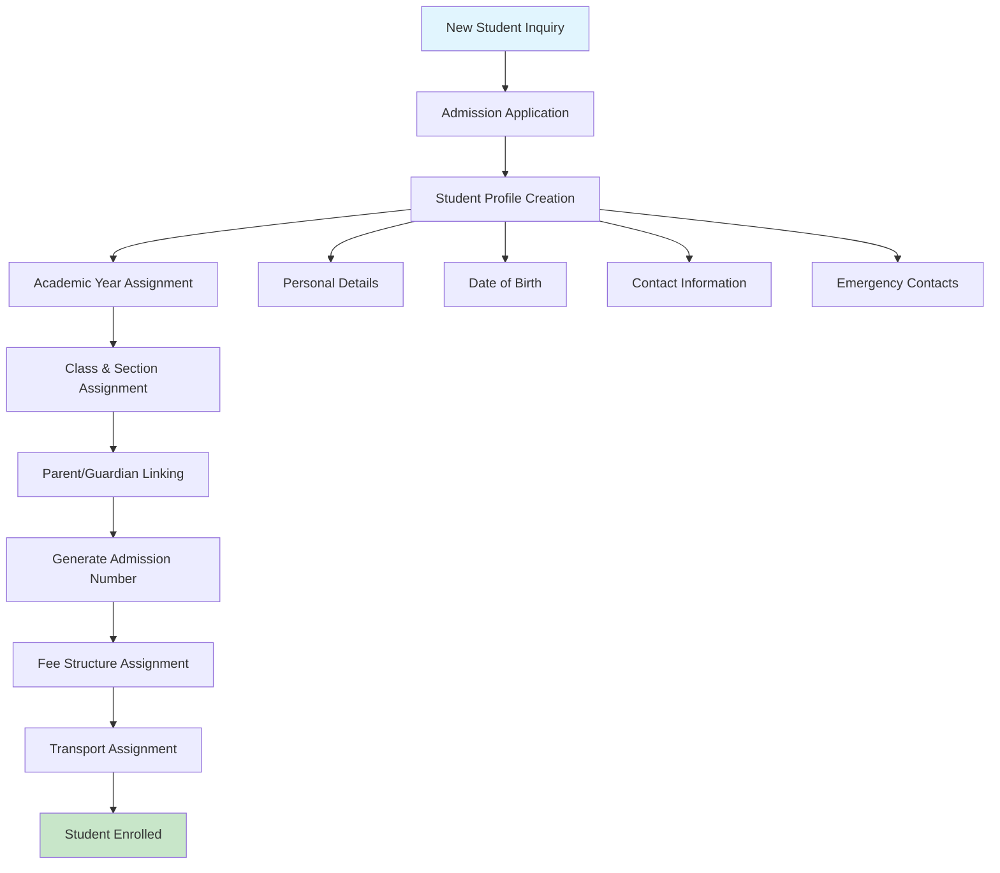

#### Student Profile Management
**Business Value**: Comprehensive student information management with academic year context and relationship tracking.

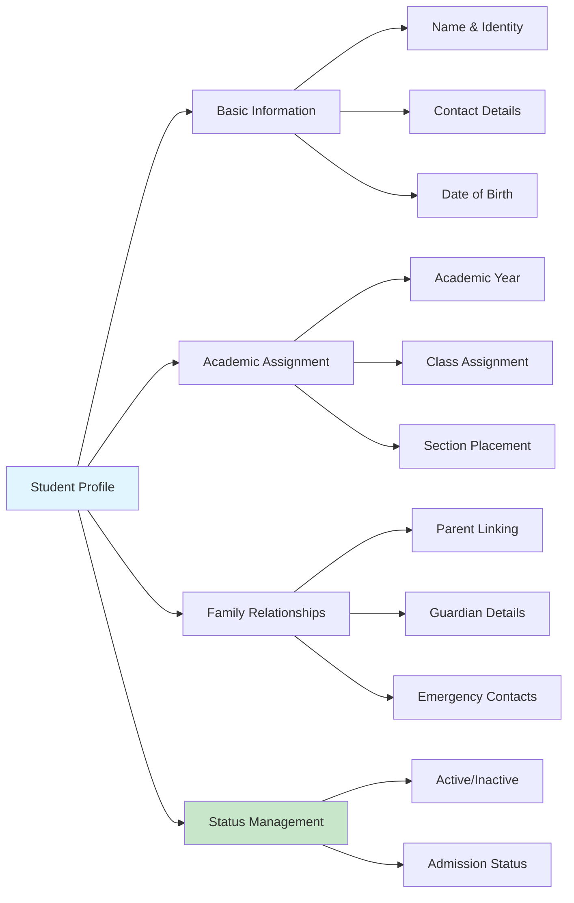

**Key Workflows**:
- Create comprehensive student profiles during admission
- Link students to parents/guardians for communication
- Assign students to appropriate academic year, class, and section
- Generate unique admission numbers for identification
- Manage student status (active, inactive, transferred)

### 2. Document Management System

#### Document Storage & Retrieval
**Business Value**: Centralized, secure document storage with easy retrieval for administrative and compliance purposes.

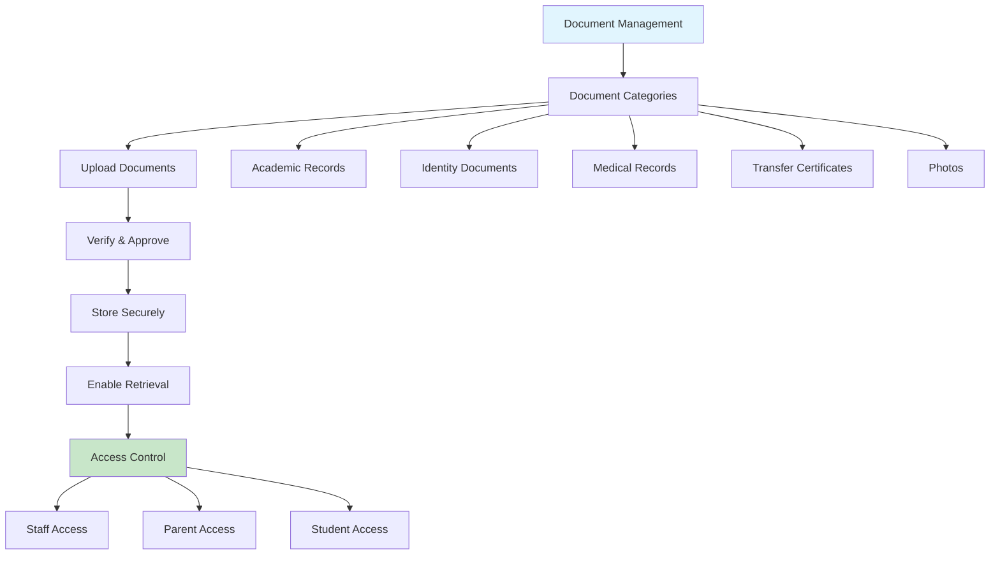

#### Document Lifecycle Management
**Business Value**: Structured document approval and verification process ensuring data quality and compliance.

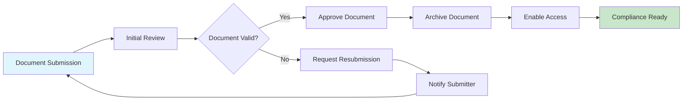

**Key Workflows**:
- Upload and categorize student documents
- Review and approve submitted documents
- Secure storage with access control
- Document retrieval for administrative purposes
- Compliance reporting and audit support

### 3. Certificate Management System

#### Certificate Generation & Tracking
**Business Value**: Automated certificate generation with tracking and verification capabilities for academic milestones.

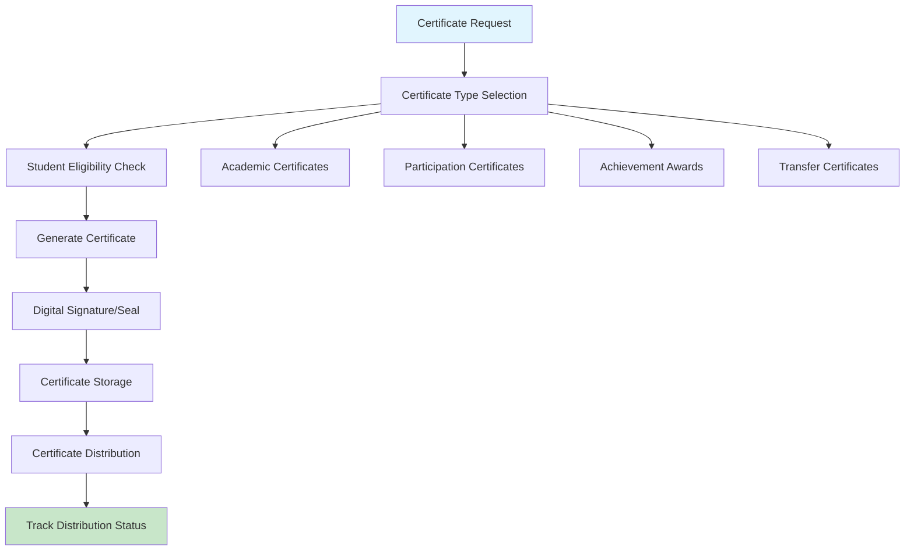

#### Certificate Types & Templates
**Business Value**: Standardized certificate templates ensuring consistency and professional appearance.

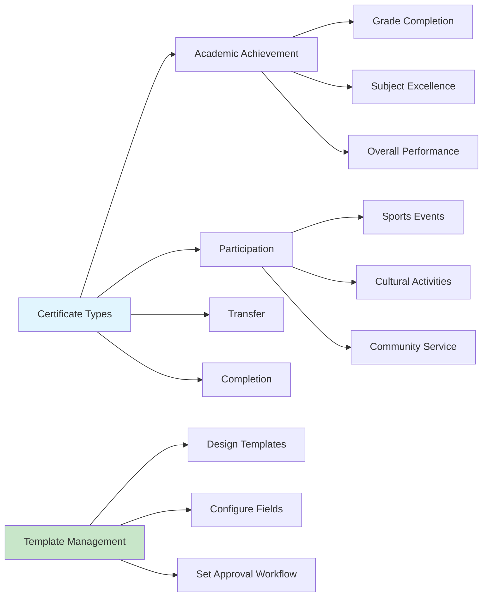

**Key Workflows**:
- Configure certificate types and templates
- Generate certificates based on student achievements
- Digital signature and verification capabilities
- Track certificate issuance and distribution
- Maintain certificate registry for verification

### 4. Attendance Tracking System

#### Daily Attendance Management
**Business Value**: Comprehensive attendance tracking with real-time visibility and automated reporting for academic and compliance purposes.

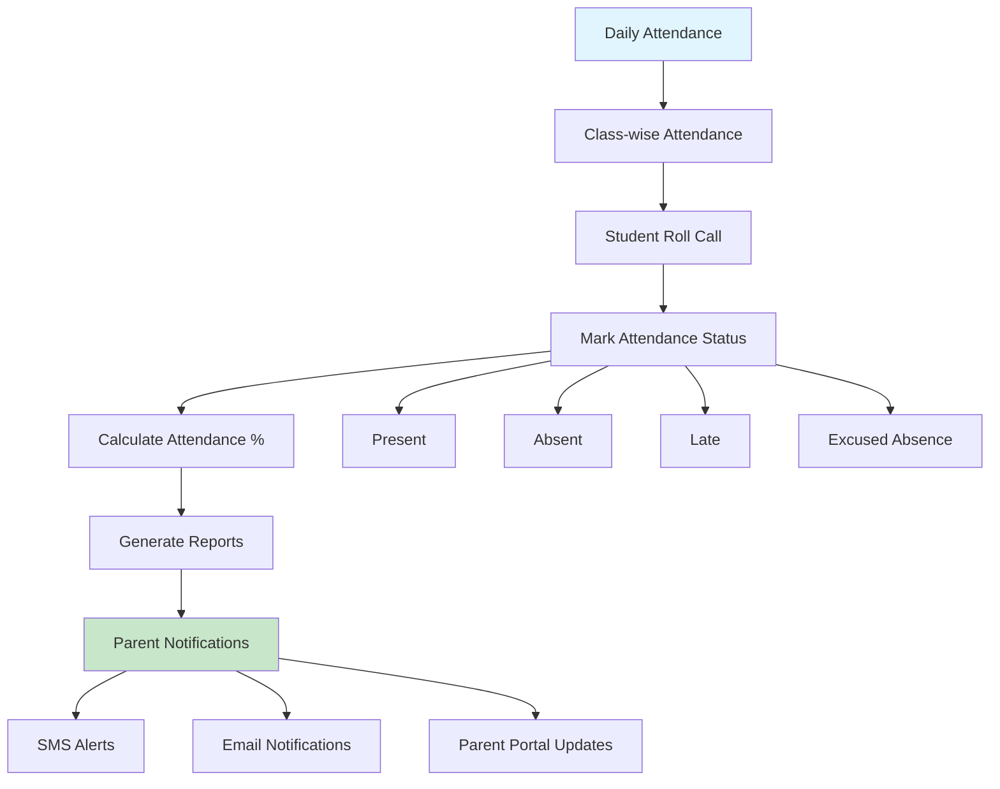

#### Attendance Analytics & Reporting
**Business Value**: Insights into student attendance patterns for academic intervention and institutional planning.

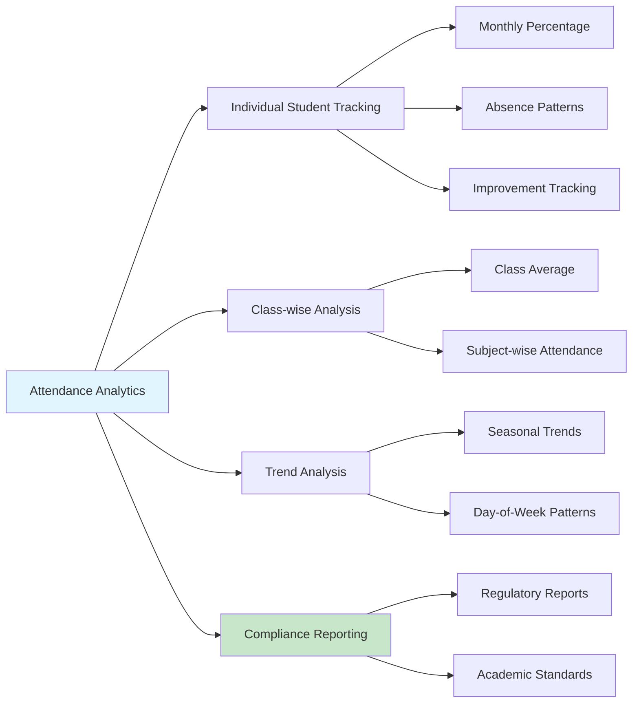

**Key Workflows**:
- Daily attendance recording by teachers
- Real-time attendance percentage calculation
- Automated parent notifications for absences
- Attendance trend analysis and reporting
- Integration with academic performance tracking

### 5. Student Transport Management

#### Transport Assignment & Tracking
**Business Value**: Efficient student transport coordination ensuring safety and optimized route utilization.

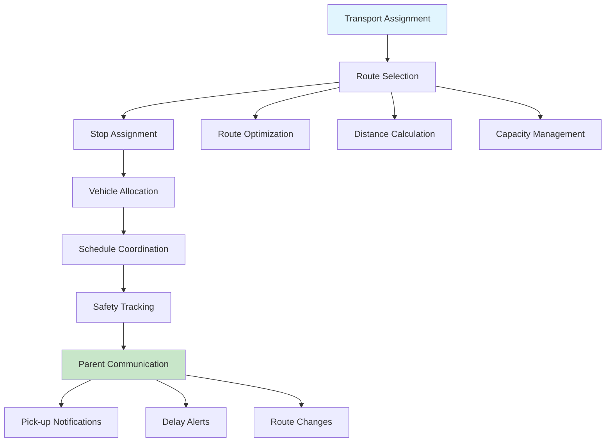

#### Transport Safety & Communication
**Business Value**: Enhanced student safety through real-time tracking and proactive parent communication.

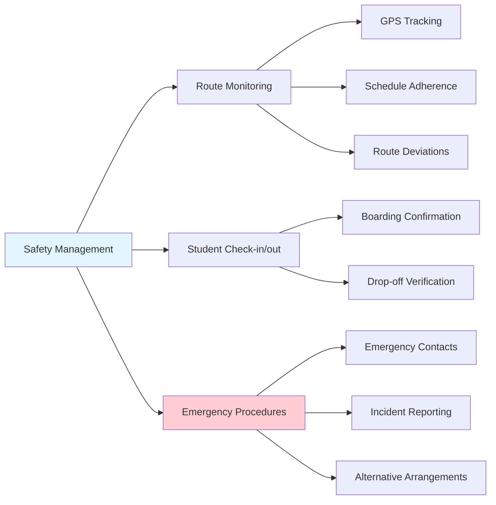

**Key Workflows**:
- Assign students to appropriate transport routes
- Coordinate with transport module for scheduling
- Track student boarding and drop-off
- Manage transport-related communications with parents
- Handle transport fee integration

## 🔄 Integrated Business Workflows

### Complete Student Onboarding Process
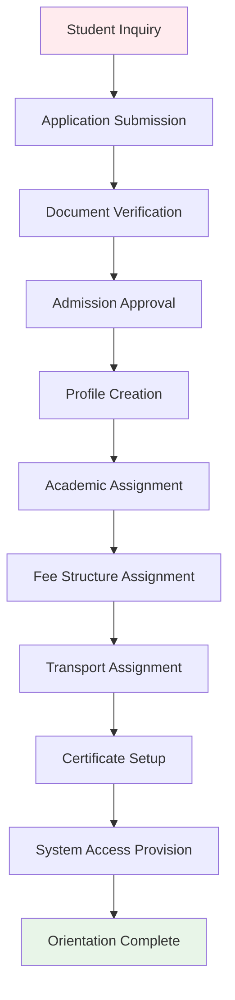

### Daily Student Operations
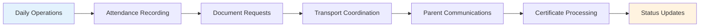

### Academic Year Transition
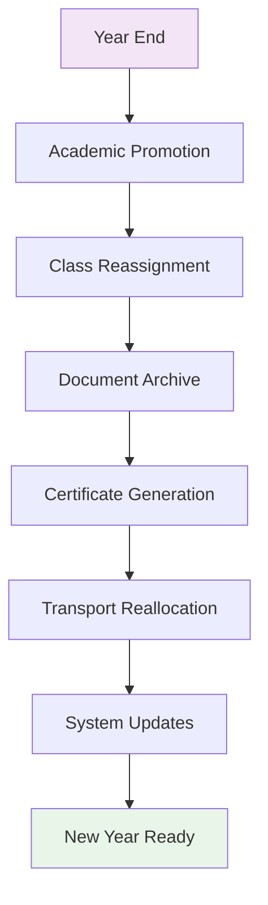

## 📊 Data Relationships

### Student Data Hierarchy
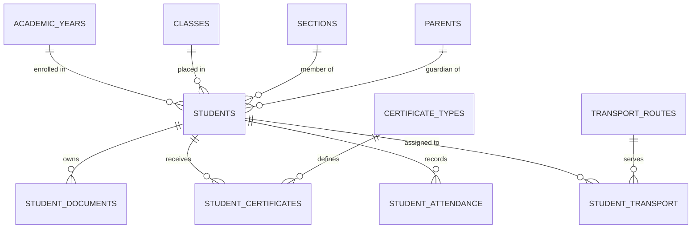

## 💼 Business Benefits

### For Academic Administration
- **Complete Records**: Comprehensive student lifecycle management
- **Compliance Support**: Document management and certificate tracking
- **Analytics**: Attendance patterns and academic progress insights
- **Efficiency**: Automated processes and integrated workflows

### For Teachers & Staff
- **Easy Access**: Quick student information and document retrieval
- **Attendance Tools**: Streamlined daily attendance recording
- **Communication**: Direct parent contact capabilities
- **Certificate Processing**: Simplified achievement recognition

### For Students & Parents
- **Transparency**: Real-time access to attendance and academic records
- **Document Access**: Secure access to student documents and certificates
- **Transport Coordination**: Clear transport assignment and communication
- **Progress Tracking**: Visibility into academic journey and achievements

### For Transport Coordination
- **Student Safety**: Comprehensive tracking and communication
- **Route Optimization**: Efficient student-route assignment
- **Parent Communication**: Proactive transport-related updates
- **Emergency Management**: Quick access to student and parent information

## 🚀 Getting Started

### Initial Setup Checklist
1. **Configure Document Types** - Set up document categories and requirements
2. **Setup Certificate Templates** - Create standard certificate formats
3. **Define Attendance Policies** - Configure attendance rules and thresholds
4. **Coordinate with Transport** - Establish transport assignment procedures
5. **Setup Parent Communication** - Configure notification systems
6. **Train Staff** - Provide training on student management workflows
7. **Test Integration** - Verify integration with other system modules

### Best Practices
- Maintain complete student profiles from admission
- Regular document verification and approval processes
- Consistent attendance recording and monitoring
- Proactive parent communication for attendance and achievements
- Regular backup of student documents and certificates
- Coordinate closely with transport module for student safety
- Use analytics for early intervention in attendance issues

---

**Next Module**: [Transport Management →](./transport-module.md)

**Previous Module**: [← Fee Collection System](./fee-module.md)

**Back to**: [Main Documentation](./README.md)