# Super Admin System Module

## 📋 Module Overview
The Super Admin System provides system-wide administrative control over the COS360 multi-tenant platform. This module enables complete system management, tenant administration, plan management, and cross-tenant operations while maintaining security and audit compliance.

## 🎯 Business Purpose
- **System Administration**: Complete control over the entire COS360 platform
- **Tenant Management**: Create, configure, and manage multiple educational institutions
- **Plan Administration**: Subscription plan management and feature control
- **Cross-Tenant Operations**: System-wide analytics and administration capabilities
- **Platform Scalability**: Support platform growth and multi-tenant operations

## 🔧 Core Features

### 1. Super Admin Authentication System

#### Enhanced Security Authentication
**Business Value**: Ultra-secure authentication for system-level administrators with advanced security features.

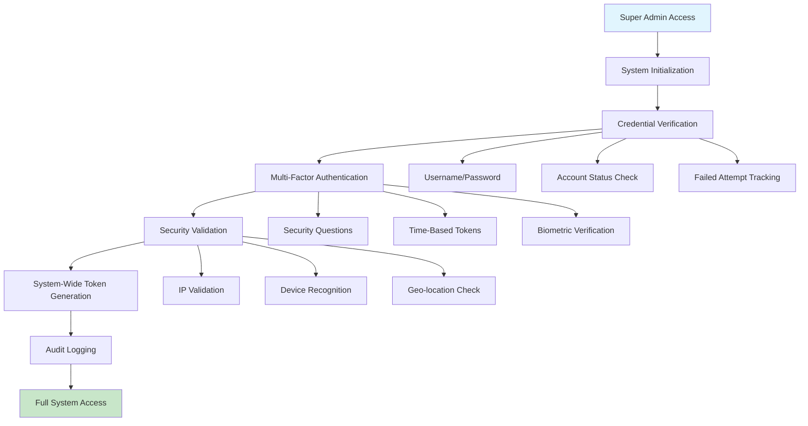

#### Account Security & Management
**Business Value**: Advanced security measures protecting critical system administration functions.

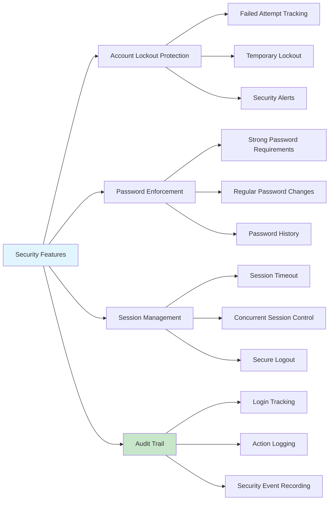

**Key Workflows**:
- One-time system initialization creating first Super Admin account
- Secure login with enhanced authentication and security checks
- Account lockout protection after multiple failed attempts
- Comprehensive audit logging of all Super Admin activities
- System health monitoring and status reporting

### 2. Tenant Management System

#### Complete Tenant Lifecycle Management
**Business Value**: Streamlined tenant onboarding and management enabling platform scalability and growth.

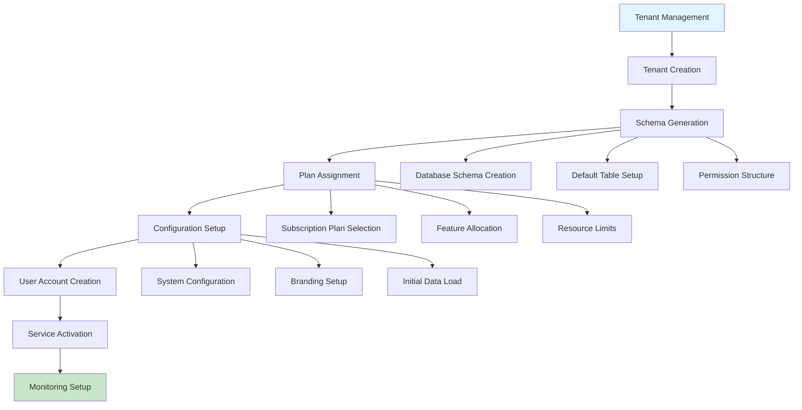

#### Tenant Operations & Status Management
**Business Value**: Comprehensive tenant administration with status control and performance monitoring.

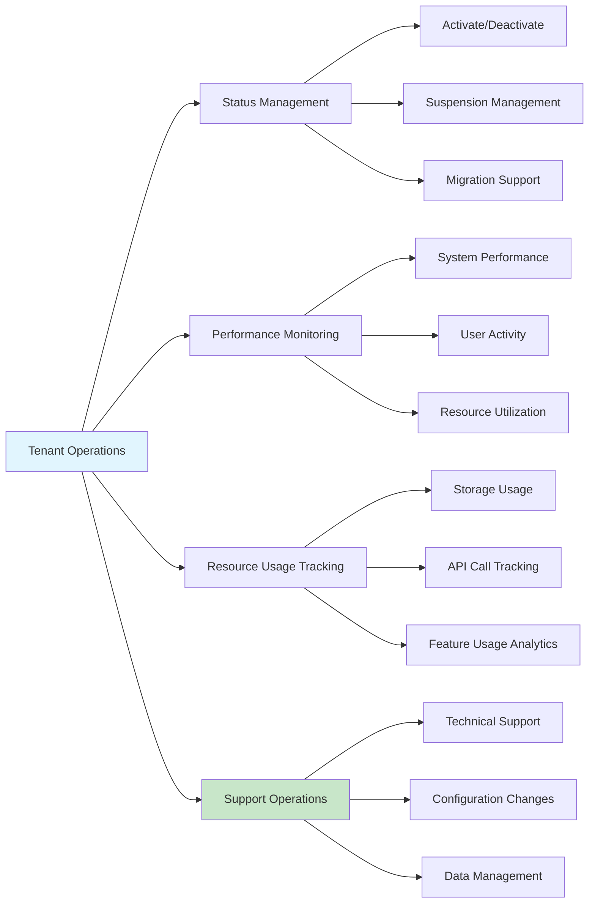

**Key Workflows**:
- Create new tenant with automated schema generation
- Assign subscription plans and configure feature access
- Monitor tenant health and performance metrics
- Manage tenant status (active, suspended, maintenance)
- Provide technical support and configuration assistance

### 3. Subscription Plan & Permission Management

#### Plan Configuration & Resource Control
**Business Value**: Flexible subscription management enabling different service tiers and revenue models.

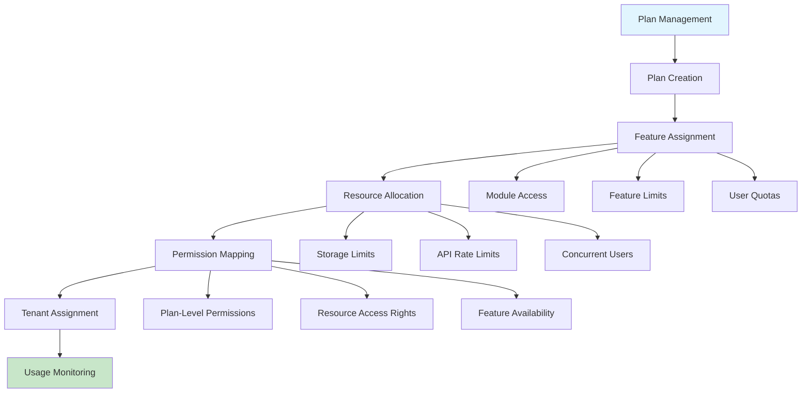

#### Permission System Architecture
**Business Value**: Sophisticated permission management supporting complex organizational structures and business requirements.

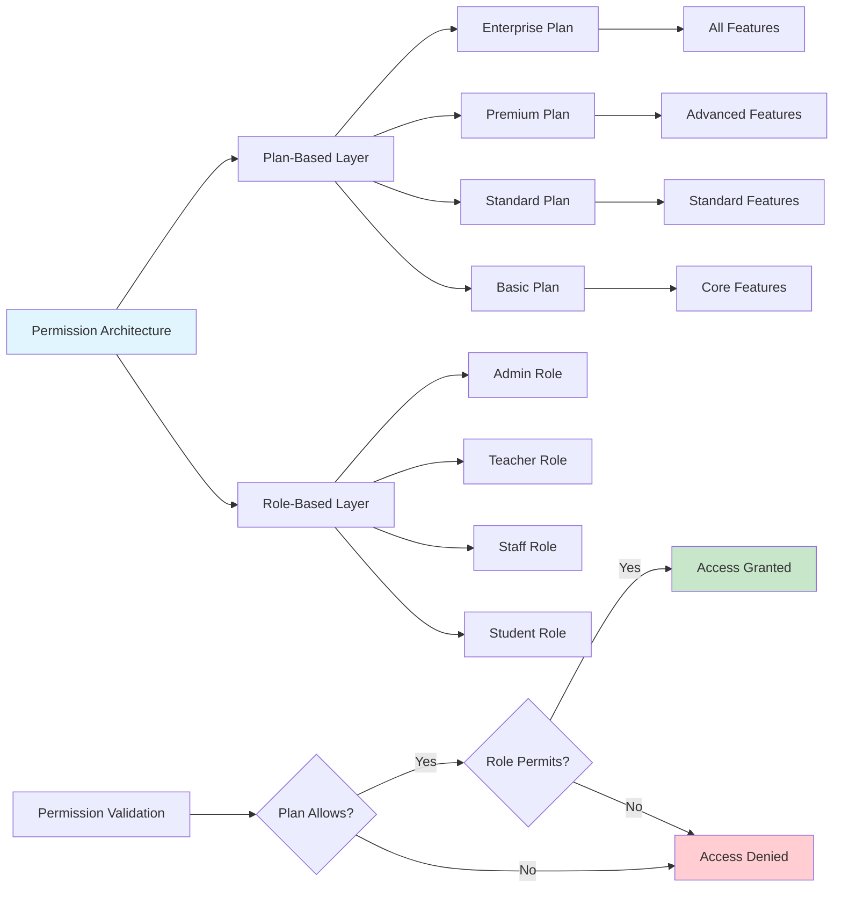

**Key Workflows**:
- Design and configure subscription plans with feature sets
- Manage plan-resource relationships and permissions
- Assign plans to tenants and handle plan changes
- Monitor feature usage and plan compliance
- Update permissions based on plan modifications

### 4. Cross-Tenant Operations & Analytics

#### System-Wide Administration
**Business Value**: Comprehensive system oversight and administration capabilities across all tenants.

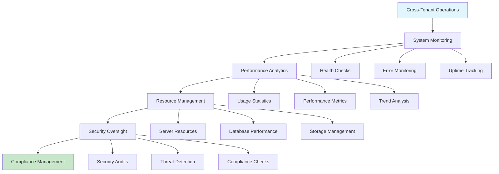

#### Platform Analytics & Reporting
**Business Value**: Strategic insights into platform usage, performance, and growth opportunities.

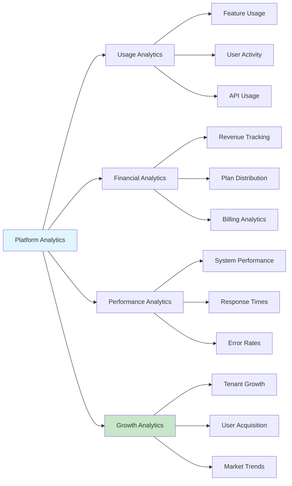

**Key Workflows**:
- Monitor system-wide performance and health
- Generate platform-wide analytics and reports
- Manage system resources and capacity planning
- Conduct security audits across all tenants
- Support strategic platform development decisions

### 5. System Maintenance & Support

#### Platform Maintenance Operations
**Business Value**: Proactive system maintenance and optimization ensuring platform reliability and performance.

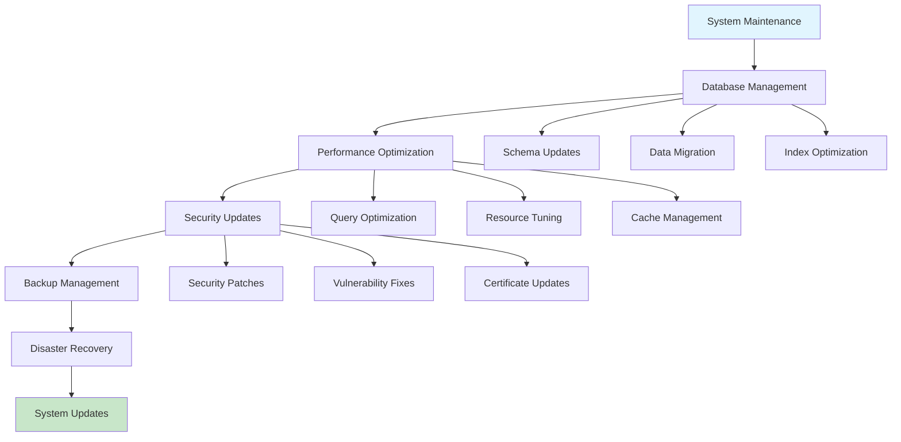

**Key Workflows**:
- Schedule and execute system maintenance activities
- Perform database optimization and cleanup
- Apply security updates and patches
- Manage system backups and disaster recovery
- Coordinate system upgrades and deployments

## 🔄 Integrated Business Workflows

### New Tenant Onboarding Process
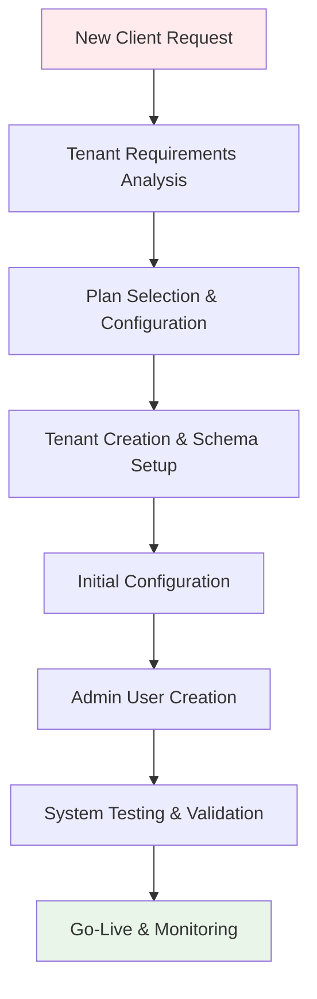

### Daily System Administration
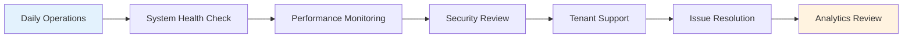

### System Upgrade Process
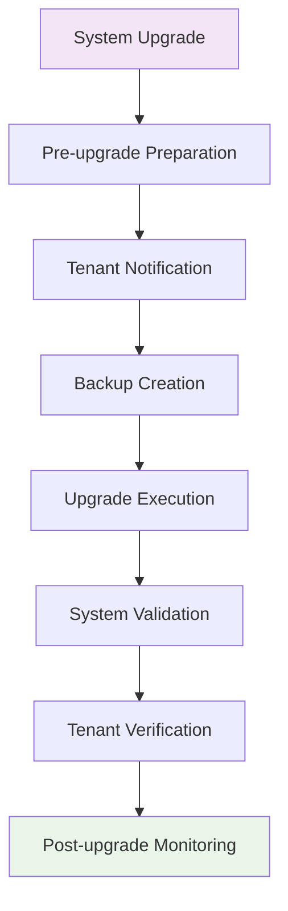

## 📊 Data Relationships

### Super Admin Data Hierarchy
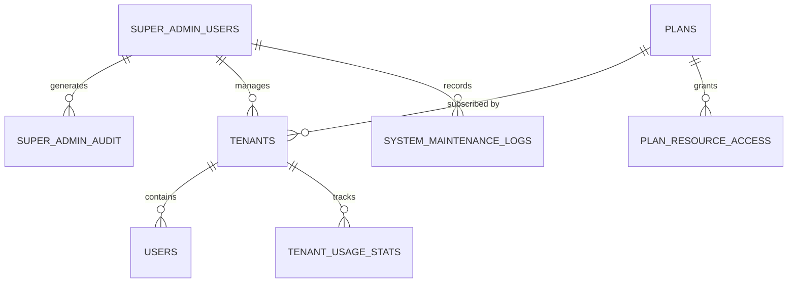

## 💼 Business Benefits

### For Platform Operations
- **Scalability**: Support for unlimited tenant growth and platform expansion
- **Efficiency**: Automated tenant creation and management processes
- **Control**: Complete system oversight and administration capabilities
- **Security**: Enhanced security for critical system operations

### For Business Management
- **Revenue Management**: Subscription plan control and billing oversight
- **Growth Analytics**: Platform usage and growth insights
- **Resource Optimization**: Efficient resource allocation and utilization
- **Strategic Planning**: Data-driven platform development decisions

### For Technical Operations
- **System Reliability**: Proactive monitoring and maintenance capabilities
- **Performance Management**: System optimization and performance tuning
- **Security Management**: Comprehensive security oversight and compliance
- **Support Operations**: Efficient tenant support and issue resolution

### For Compliance & Governance
- **Audit Compliance**: Complete audit trail of all administrative actions
- **Data Governance**: Comprehensive data management and protection
- **Regulatory Compliance**: Support for various regulatory requirements
- **Risk Management**: Proactive risk identification and mitigation

## 🚀 Getting Started

### Initial Setup Checklist
1. **System Initialization** - Complete one-time Super Admin system setup
2. **Super Admin Account Creation** - Create initial Super Admin users
3. **Plan Configuration** - Setup subscription plans and resource allocations
4. **Security Configuration** - Configure advanced security settings
5. **Monitoring Setup** - Enable comprehensive system monitoring
6. **Backup Configuration** - Setup automated backup and recovery systems
7. **Tenant Templates** - Create tenant onboarding templates
8. **Documentation** - Maintain system administration documentation

### Best Practices
- Use strong authentication and security measures for Super Admin access
- Regular system health monitoring and performance optimization
- Maintain comprehensive audit logs for compliance and security
- Implement automated backup and disaster recovery procedures
- Regular security audits and vulnerability assessments
- Proactive tenant support and communication
- Strategic capacity planning and resource management
- Continuous monitoring of platform growth and usage patterns

---

**Next Module**: [Public Tenant Management →](./public-module.md)

**Previous Module**: [← Authentication & Access Control](./auth-module.md)

**Back to**: [Main Documentation](./README.md)