# Transport Management Module

## 📋 Module Overview
The Transport Management module provides comprehensive transportation coordination for educational institutions. It manages routes, vehicles, scheduling, and student assignments while ensuring safety, efficiency, and effective communication with parents and staff.

## 🎯 Business Purpose
- **Student Safety**: Ensure safe and reliable transportation for students
- **Route Optimization**: Efficient route planning and resource utilization
- **Real-time Coordination**: Live tracking and schedule management
- **Parent Communication**: Proactive updates and notifications about transport services
- **Cost Management**: Optimize transportation costs through efficient resource allocation

## 🔧 Core Features

### 1. Route Management System

#### Route Planning & Configuration
**Business Value**: Strategic route design for optimal coverage, efficiency, and cost-effectiveness.

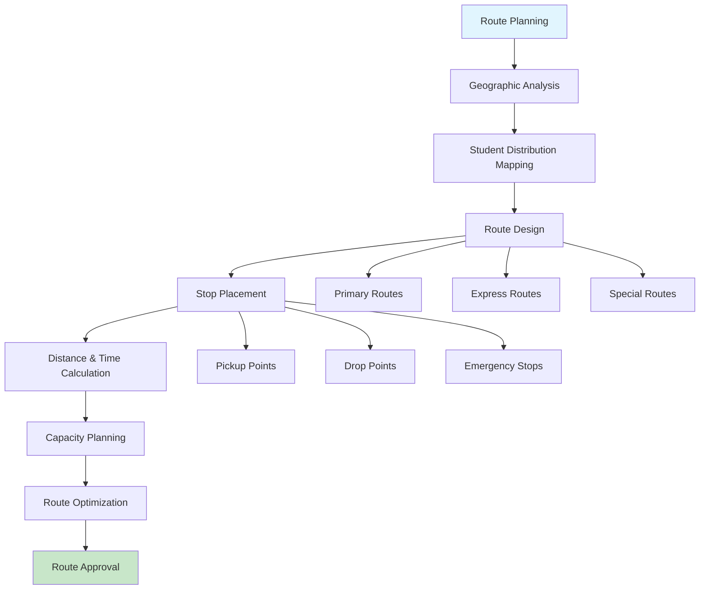

#### Route Stop Management
**Business Value**: Detailed stop management ensuring comprehensive coverage and student accessibility.

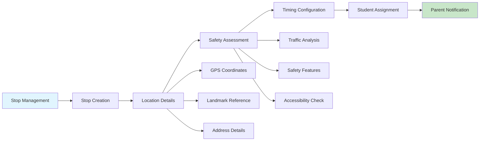

**Key Workflows**:
- Design comprehensive route networks covering service areas
- Create and manage route stops with precise location details
- Calculate optimal distances and estimated travel times
- Plan route capacity based on vehicle availability
- Regular route optimization based on student enrollment changes

### 2. Vehicle Management System

#### Fleet Management & Allocation
**Business Value**: Efficient vehicle utilization and maintenance scheduling ensuring reliable transportation services.

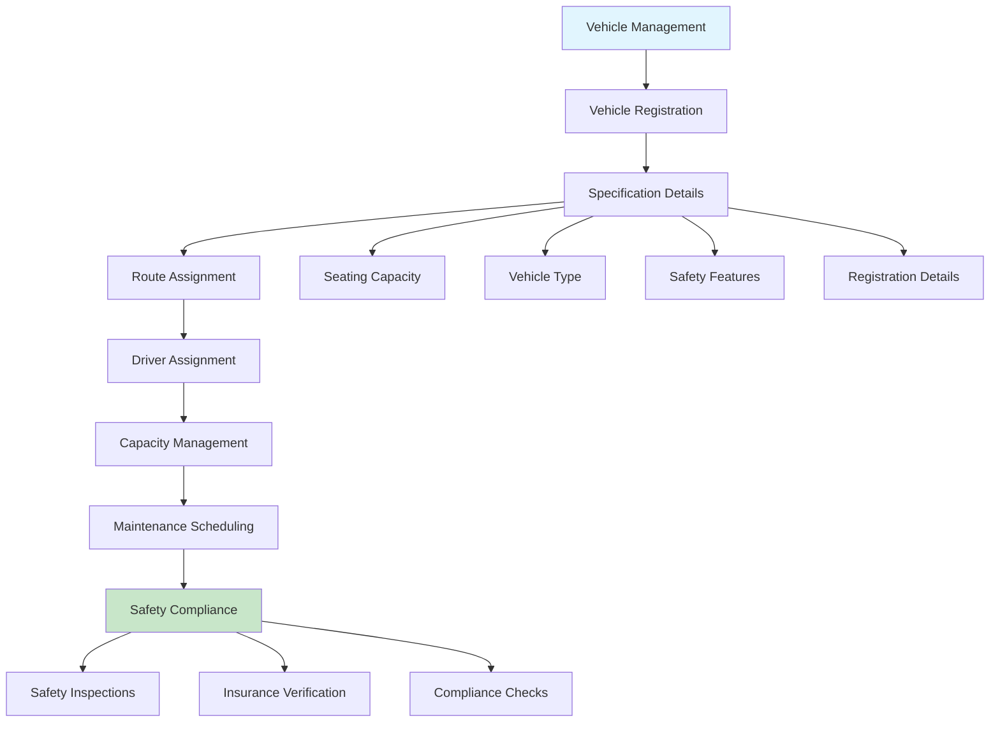

#### Vehicle Status & Tracking
**Business Value**: Real-time vehicle monitoring and proactive maintenance management ensuring service reliability.

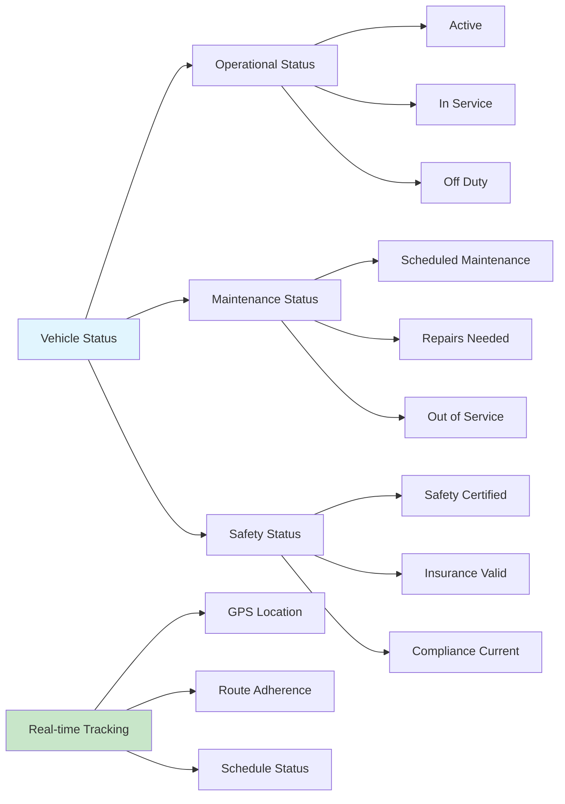

**Key Workflows**:
- Register and maintain comprehensive vehicle database
- Assign vehicles to routes based on capacity and requirements
- Schedule and track vehicle maintenance and inspections
- Monitor vehicle status and availability in real-time
- Ensure compliance with safety and regulatory requirements

### 3. Trip Scheduling & Management

#### Trip Planning & Execution
**Business Value**: Coordinated trip scheduling ensuring timely and efficient transportation services.

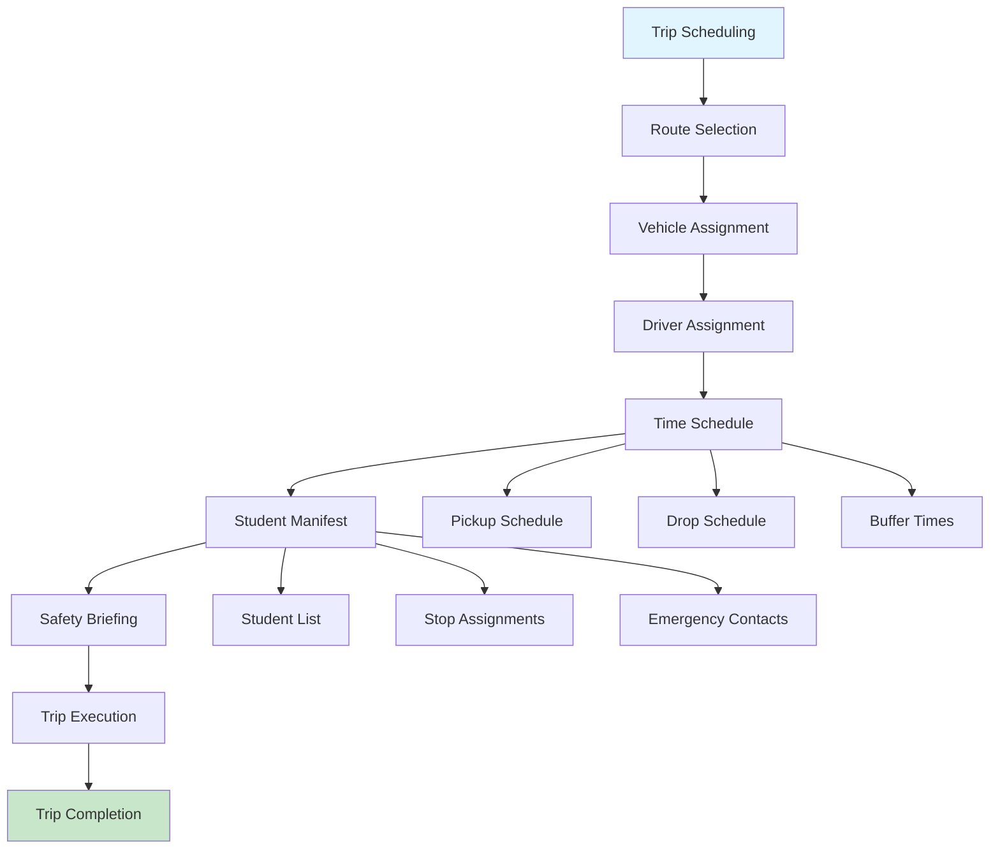

#### Real-time Trip Monitoring
**Business Value**: Live trip tracking and communication ensuring student safety and parent confidence.

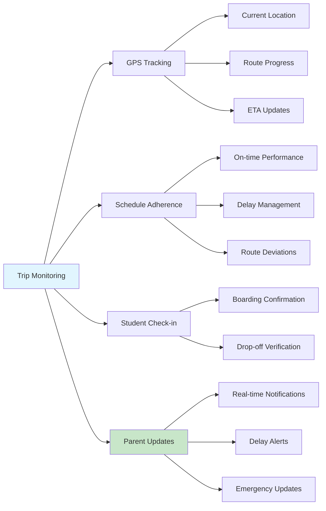

**Key Workflows**:
- Plan and schedule regular transportation trips
- Coordinate vehicle, driver, and route assignments
- Monitor trip progress and adherence to schedules
- Manage student boarding and drop-off procedures
- Provide real-time updates to parents and school administration

### 4. Driver Management Integration

#### Driver Assignment & Coordination
**Business Value**: Effective driver resource management ensuring qualified and reliable transportation staff.

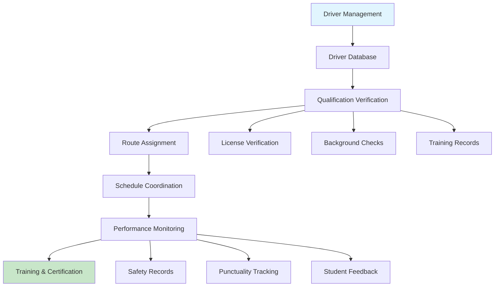

**Key Workflows**:
- Access driver information from staff management system
- Verify driver qualifications and certifications
- Assign drivers to appropriate routes and vehicles
- Monitor driver performance and safety records
- Coordinate driver schedules with transport requirements

### 5. Student Transport Assignment

#### Student-Route Mapping
**Business Value**: Optimal student transport assignments ensuring efficiency and convenience for families.

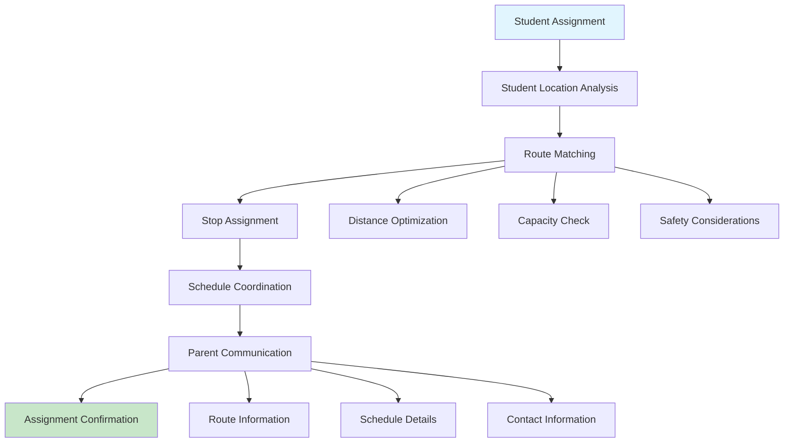

#### Transport Fee Integration
**Business Value**: Seamless integration with fee management for transport-related charges and billing.

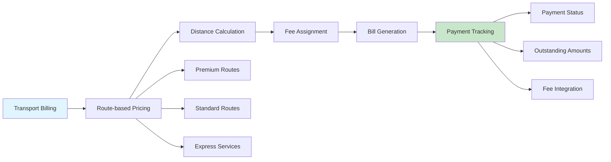

**Key Workflows**:
- Analyze student locations for optimal route assignment
- Match students to appropriate routes and stops
- Coordinate with fee management for transport billing
- Communicate route and schedule information to parents
- Manage changes in student transport requirements

## 🔄 Integrated Business Workflows

### Complete Transport Setup Process
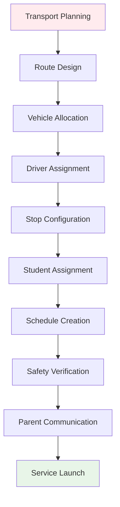

### Daily Transport Operations
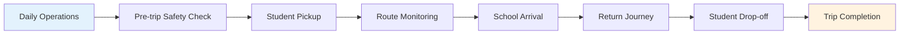

### Emergency Response Workflow
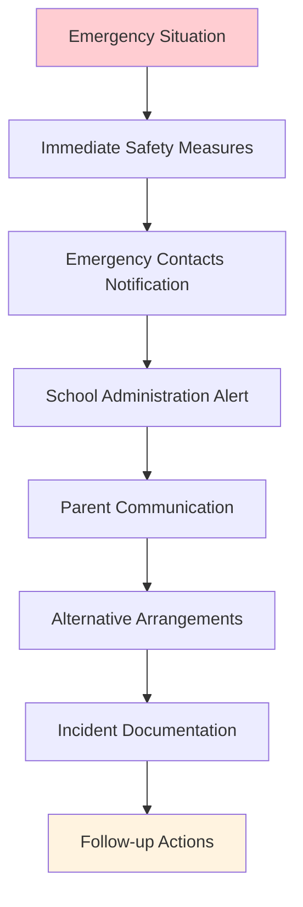

## 📊 Data Relationships

### Transport Data Hierarchy
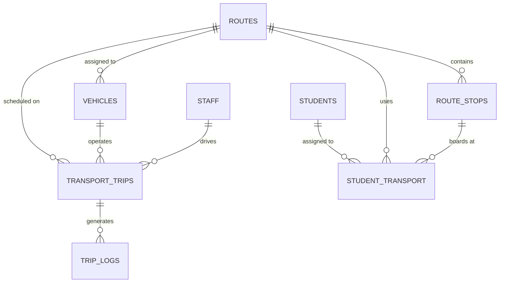

## 💼 Business Benefits

### For Institution Administration
- **Cost Optimization**: Efficient route planning and resource utilization
- **Safety Assurance**: Comprehensive safety monitoring and compliance
- **Operational Efficiency**: Streamlined transport operations and coordination
- **Parent Satisfaction**: Reliable service and proactive communication

### For Transport Coordinators
- **Route Management**: Easy route planning and optimization tools
- **Real-time Monitoring**: Live tracking and schedule management
- **Resource Allocation**: Efficient vehicle and driver assignment
- **Performance Analytics**: Transport service metrics and reporting

### For Parents & Students
- **Reliability**: Consistent and punctual transportation services
- **Safety**: Comprehensive safety measures and monitoring
- **Communication**: Real-time updates and notifications
- **Convenience**: Optimized routes and convenient pickup points

### For Drivers & Transport Staff
- **Clear Instructions**: Detailed route and schedule information
- **Safety Support**: Emergency procedures and communication tools
- **Performance Tracking**: Feedback and improvement opportunities
- **Resource Coordination**: Integrated vehicle and route management

## 🚀 Getting Started

### Initial Setup Checklist
1. **Design Route Network** - Plan comprehensive route coverage for service area
2. **Register Vehicles** - Add fleet vehicles with specifications and capacity
3. **Configure Route Stops** - Create detailed stop locations and safety information
4. **Assign Drivers** - Link qualified drivers to routes and vehicles
5. **Setup Student Assignments** - Map students to appropriate routes and stops
6. **Configure Schedules** - Create trip schedules and timing coordination
7. **Test Communication** - Verify parent notification and tracking systems
8. **Safety Training** - Conduct safety briefings and emergency procedures training

### Best Practices
- Regular route optimization based on student enrollment changes
- Comprehensive safety checks before each trip
- Proactive parent communication for delays and changes
- Regular vehicle maintenance and safety inspections
- Driver training and performance monitoring
- Emergency preparedness and response procedures
- Integration with student management for seamless operations
- Cost monitoring and optimization strategies

---

**Next Module**: [Authentication & Access Control →](./auth-module.md)

**Previous Module**: [← Student Management](./student-module.md)

**Back to**: [Main Documentation](./README.md)