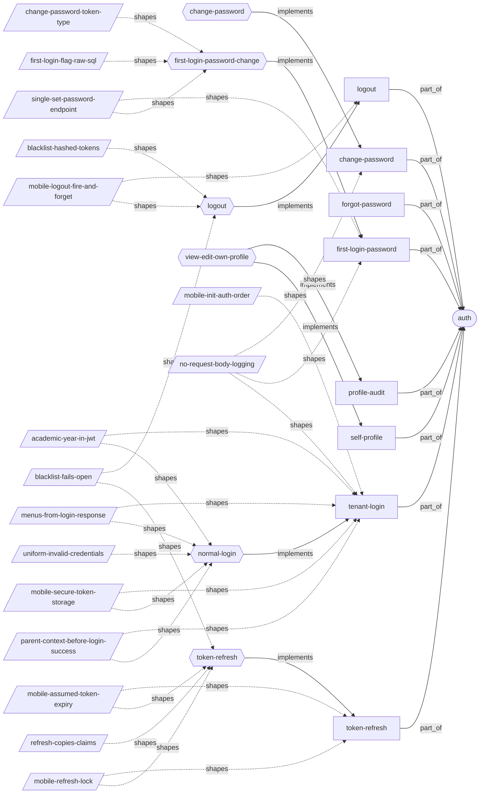
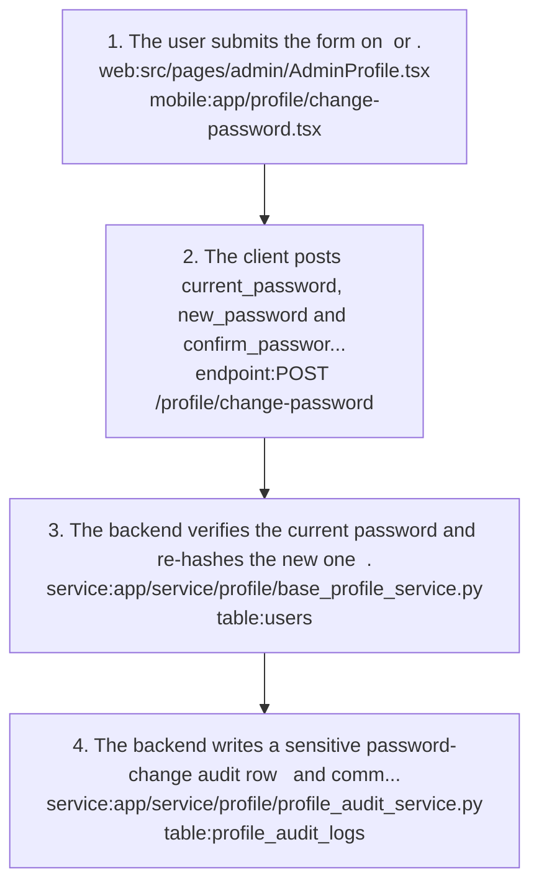
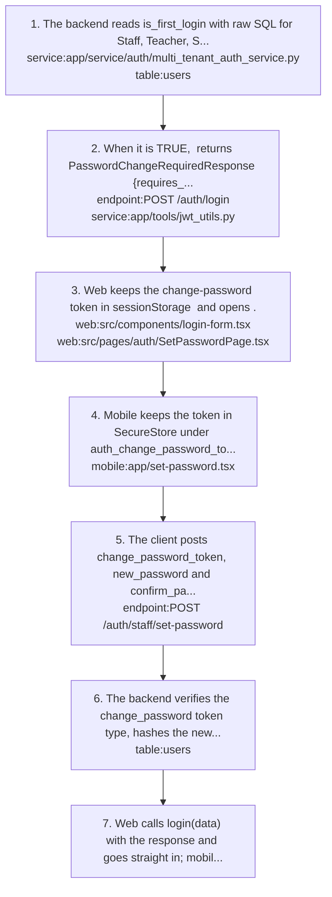
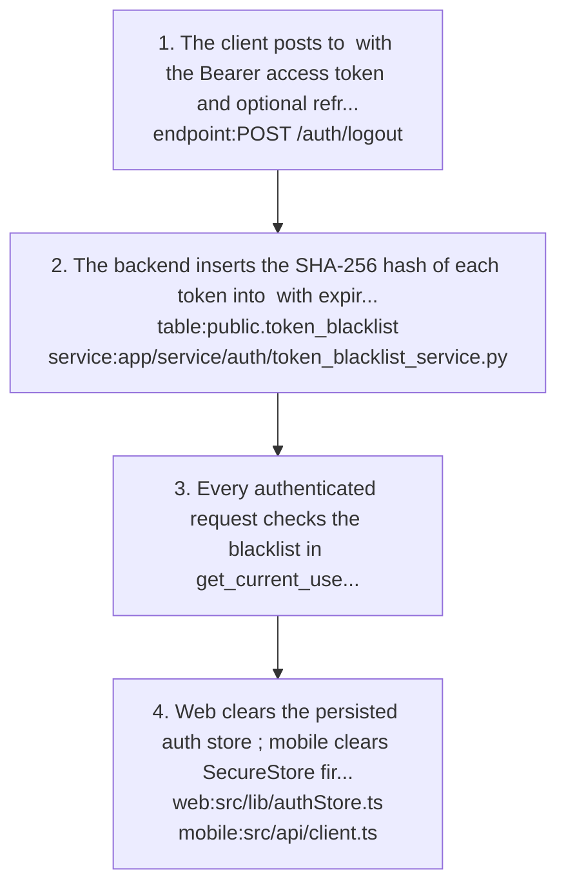
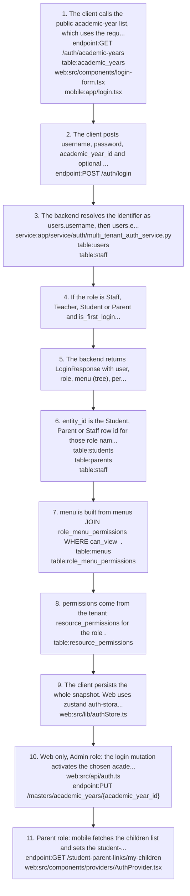
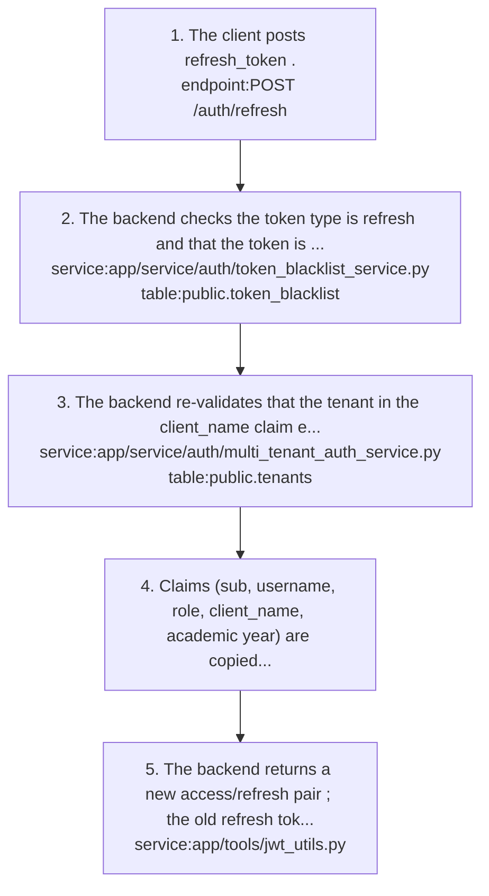
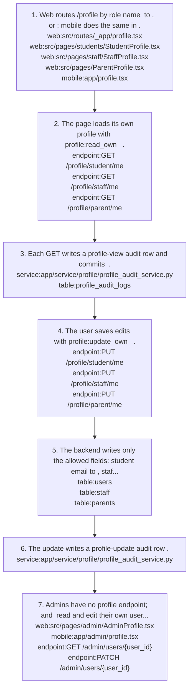

# auth: knowledge graph view

_Generated from `docs/graph/graph.jsonl` by `scripts/graph/kg_render.py`. Do not edit this file; change the graph and re-render._

Tenant-user login for every role with a mandatory academic year, JWT issue/refresh/logout, forced first-login password change, self-service password change, and own-profile view/edit with audit rows.

Module doc: [docs/modules/auth.md](../../../docs/modules/auth.md)

## Features

### auth/change-password

A logged-in user changes their own password by giving the current password and a new one (min 8) with confirmation.
- Roles: Any tenant user with profile:update_own.
- Parity: Web offers it only on Admin Profile (/admin/profile); mobile offers it to all roles.
- Note: Password policy is only min_length=8; there is no complexity rule, no lockout and no login-specific rate limit for tenant users.
- Flows: [auth/change-password](#authchange-password)
- Implemented by: `endpoint:POST /profile/change-password`, `mobile:app/profile/change-password.tsx`, `service:app/service/profile/base_profile_service.py`, `service:app/service/profile/profile_audit_service.py`, `table:profile_audit_logs`, `table:users`, `web:src/pages/admin/AdminProfile.tsx`
- Shaped by: [auth/no-request-body-logging](#authno-request-body-logging)

### auth/first-login-password

Staff, Teacher, Student and Parent accounts with users.is_first_login = TRUE must set a new password before they get a session.
- Roles: Staff, Teacher, Student, Parent. Admin accounts are never forced.
- Parity: Web logs the user straight in with the returned session; mobile discards it and sends the user back to login.
- Note: /auth/staff/set-password does not check that the user is still in first-login state; any valid unexpired change-password token can reset the password.
- Flows: [auth/first-login-password-change](#authfirst-login-password-change)
- Implemented by: `endpoint:POST /auth/login`, `endpoint:POST /auth/staff/set-password`, `mobile:app/login.tsx`, `mobile:app/set-password.tsx`, `service:app/service/auth/multi_tenant_auth_service.py`, `service:app/tools/jwt_utils.py`, `table:users`, `web:src/components/login-form.tsx`, `web:src/pages/auth/SetPasswordPage.tsx`
- Shaped by: [auth/no-request-body-logging](#authno-request-body-logging), [auth/single-set-password-endpoint](#authsingle-set-password-endpoint)

### auth/forgot-password

Forgot-password screens exist on both clients but no backend reset flow exists; recovery means asking the school admin to reset the password.
- Parity: Web shows a fake reset-link-sent message after a setTimeout; mobile tells the user to contact the school admin.
- Implemented by: `mobile:app/forgot-password.tsx`, `web:src/pages/auth/ForgotPasswordPage.tsx`
- Depends on: `feature:tenants-and-admin/user-management`

### auth/logout

Log out by blacklisting the bearer access token and, when sent, the refresh token.
- Parity: Neither client sends refresh_token; mobile also loses the Bearer header, so its logout blacklists nothing.
- Flows: [auth/logout](#authlogout)
- Implemented by: `endpoint:POST /auth/logout`, `mobile:src/api/client.ts`, `service:app/service/auth/token_blacklist_service.py`, `table:public.token_blacklist`, `web:src/lib/authStore.ts`
- Shaped by: [auth/mobile-logout-fire-and-forget](#authmobile-logout-fire-and-forget)

### auth/profile-audit

Every profile view, profile update and password change writes a profile_audit_logs row in the tenant schema; password changes are flagged sensitive.
- Note: No endpoint reads these logs.
- Note: Audit errors are caught and logged, not raised, and every profile GET is a DB write.
- Note: /profile/change-password records Teacher and custom roles with profile_type unknown and fills org_id with the user id as a placeholder.
- Flows: [auth/view-edit-own-profile](#authview-edit-own-profile)
- Implemented by: `service:app/service/profile/profile_audit_service.py`, `table:profile_audit_logs`

### auth/self-profile

Students, staff and parents view their own profile and edit a few contact fields; admins view and edit their own users row.
- Roles: Student, Staff/Teacher, Parent via profile:read_own and profile:update_own; Admin through /admin/users/{id}.
- Parity: Web routes any non Student/Parent role to StaffProfile, which 404s for users without a staff row (typical for Admin); mobile falls back to a basic view on error.
- Note: Editable fields - Student: email (users.email); Staff: email, phone (staff row); Parent: email, phone, occupation (parents row). Everything else is admin-managed.
- Note: Staff and parent email edits change the staff/parents row, not users.email, so the login identifier does not change.
- Flows: [auth/view-edit-own-profile](#authview-edit-own-profile)
- Implemented by: `endpoint:GET /admin/users/{user_id}`, `endpoint:GET /profile/parent/me`, `endpoint:GET /profile/staff/me`, `endpoint:GET /profile/student/me`, `endpoint:PATCH /admin/users/{user_id}`, `endpoint:PUT /profile/parent/me`, `endpoint:PUT /profile/staff/me`, `endpoint:PUT /profile/student/me`, `mobile:app/admin/profile.tsx`, `mobile:app/profile.tsx`, `mobile:src/api/profile.ts`, `service:app/service/profile/parent_profile_service.py`, `service:app/service/profile/staff_profile_service.py`, `service:app/service/profile/student_profile_service.py`, `table:parents`, `table:staff`, `table:users`, `web:src/pages/ParentProfile.tsx`, `web:src/pages/admin/AdminProfile.tsx`, `web:src/pages/staff/StaffProfile.tsx`, `web:src/pages/students/StudentProfile.tsx`, `web:src/routes/_app/profile.tsx`

### auth/tenant-login

One login endpoint for every tenant user type (Admin, Teacher, Staff, Student, Parent, custom roles); the user picks an academic year first and gets tokens plus a menu/permission snapshot.
- Roles: All tenant users. Super admins use a separate login.
- Parity: Web takes the tenant from the subdomain and hardcodes client_name in the body; mobile has an organization picker (hardcoded list plus free text, lowercased).
- Parity: Web admin login also activates the chosen academic year for the whole tenant; mobile does not.
- Note: Identifier lookup order is users.username, then users.email, then staff.phone; inactive users and wrong passwords return the same 401.
- Note: Tokens are HS256 JWTs (app/tools/jwt_utils.py): access 24 h, refresh 7 d; claims sub, username, role (name), client_name, academic_year_id, academic_year_title.
- Note: Use current_user['sub'] for the user id; real tokens have no id claim.
- Note: Teacher entity_id is null on normal login because only role name Staff resolves a staff entity; the set-password path resolves Teacher too.
- Flows: [auth/normal-login](#authnormal-login)
- Implemented by: `endpoint:GET /auth/academic-years`, `endpoint:POST /auth/login`, `mobile:app/login.tsx`, `service:app/service/auth/multi_tenant_auth_service.py`, `service:app/tools/jwt_utils.py`, `table:academic_years`, `table:users`, `web:src/api/auth.ts`, `web:src/components/login-form.tsx`, `web:src/lib/authStore.ts`, `web:src/pages/auth/LoginPage.tsx`
- Shaped by: [auth/academic-year-in-jwt](#authacademic-year-in-jwt), [auth/menus-from-login-response](#authmenus-from-login-response), [auth/mobile-init-auth-order](#authmobile-init-auth-order), [auth/mobile-secure-token-storage](#authmobile-secure-token-storage), [auth/no-request-body-logging](#authno-request-body-logging), [auth/parent-context-before-login-success](#authparent-context-before-login-success)

### auth/token-refresh

Exchange a refresh token for a new access/refresh pair without logging in again.
- Parity: Both clients call /auth/refresh; web refreshes on a 401 with one shared in-flight refresh.
- Parity: Mobile refreshes proactively on an assumed 1 h expiry and clears the session on cold start after about 55 minutes.
- Note: Refresh does not re-check users.is_active, so a deactivated user keeps refreshing for up to 7 days.
- Flows: [auth/token-refresh](#authtoken-refresh)
- Implemented by: `endpoint:POST /auth/refresh`, `mobile:src/api/client.ts`, `service:app/service/auth/token_blacklist_service.py`, `service:app/tools/jwt_utils.py`, `table:public.token_blacklist`, `web:src/api/index.ts`
- Shaped by: [auth/mobile-assumed-token-expiry](#authmobile-assumed-token-expiry), [auth/mobile-refresh-lock](#authmobile-refresh-lock)

## Flows

### auth/change-password

Implements: `feature:auth/change-password`

1. The user submits the form on `web:src/pages/admin/AdminProfile.tsx` or `mobile:app/profile/change-password.tsx`.
2. The client posts current_password, new_password and confirm_password `endpoint:POST /profile/change-password`; permission profile:update_own is required.
3. The backend verifies the current password and re-hashes the new one `service:app/service/profile/base_profile_service.py` `table:users`.
4. The backend writes a sensitive password-change audit row `service:app/service/profile/profile_audit_service.py` `table:profile_audit_logs` and commits.

- Result: Existing access and refresh tokens stay valid.

### auth/first-login-password-change

Implements: `feature:auth/first-login-password`

- Precondition: The account was created by staff enrolment `service:app/service/masters/staff_service.py` or student admission for the student, father, mother or guardian `service:app/service/student/admission_service.py`, which set users.is_first_login = TRUE.

1. The backend reads is_first_login with raw SQL for Staff, Teacher, Student and Parent roles `service:app/service/auth/multi_tenant_auth_service.py` `table:users`.
2. When it is TRUE, `endpoint:POST /auth/login` returns PasswordChangeRequiredResponse {requires_password_change, change_password_token, academic_year_id/title} and no session tokens; the change-password token lives 15 minutes `service:app/tools/jwt_utils.py`.
3. Web keeps the change-password token in sessionStorage `web:src/components/login-form.tsx` and opens `web:src/pages/auth/SetPasswordPage.tsx`.
4. Mobile keeps the token in SecureStore under auth_change_password_token and opens `mobile:app/set-password.tsx`.
5. The client posts change_password_token, new_password and confirm_password `endpoint:POST /auth/staff/set-password`.
6. The backend verifies the change_password token type, hashes the new password, clears is_first_login through raw SQL `table:users` and returns a full login payload (SetPasswordResponse).
7. Web calls login(data) with the response and goes straight in; mobile setStaffPassword returns void, so the user lands on login and signs in with the new password.

- Failure: If the tenant schema lacks the is_first_login column, the check silently passes and the user logs in normally.

Shaped by: [auth/change-password-token-type](#authchange-password-token-type), [auth/first-login-flag-raw-sql](#authfirst-login-flag-raw-sql), [auth/single-set-password-endpoint](#authsingle-set-password-endpoint)

### auth/logout

Implements: `feature:auth/logout`

1. The client posts to `endpoint:POST /auth/logout` with the Bearer access token and optional refresh_token in the body.
2. The backend inserts the SHA-256 hash of each token into `table:public.token_blacklist` with expires_at set to the token exp `service:app/service/auth/token_blacklist_service.py`.
3. Every authenticated request checks the blacklist in get_current_user_token (app/tools/permission_decorators.py).
4. Web clears the persisted auth store `web:src/lib/authStore.ts`; mobile clears SecureStore first and fires the API call without awaiting it `mobile:src/api/client.ts`.

- Failure: Neither client sends refresh_token, so the refresh token stays valid for 7 days; mobile sends no Bearer header, gets 401, and blacklists nothing.

- Note: The blacklist fails open on DB errors, and cleanup_expired() exists but nothing schedules it.

Shaped by: [auth/blacklist-fails-open](#authblacklist-fails-open), [auth/blacklist-hashed-tokens](#authblacklist-hashed-tokens), [auth/mobile-logout-fire-and-forget](#authmobile-logout-fire-and-forget)

### auth/normal-login

Implements: `feature:auth/tenant-login`

- Trigger: A tenant user submits the login form on web or mobile.

1. The client calls the public academic-year list, which uses the request tenant `endpoint:GET /auth/academic-years` `table:academic_years`, from `web:src/components/login-form.tsx` or `mobile:app/login.tsx`.
2. The client posts username, password, academic_year_id and optional client_name `endpoint:POST /auth/login`. A missing or unknown year returns 400; an empty string returns 422.
3. The backend resolves the identifier as users.username, then users.email, then staff.phone, and verifies the password `service:app/service/auth/multi_tenant_auth_service.py` `table:users` `table:staff`. Inactive users and wrong passwords get the same 401.
4. If the role is Staff, Teacher, Student or Parent and is_first_login is TRUE, the flow switches to flow:auth/first-login-password-change.
5. The backend returns LoginResponse with user, role, menu (tree), permissions ({resource: [actions]}), entity_id, academic_year_id/title, access_token and refresh_token.
6. entity_id is the Student, Parent or Staff row id for those role names, otherwise null `table:students` `table:parents` `table:staff`.
7. menu is built from menus JOIN role_menu_permissions WHERE can_view `table:menus` `table:role_menu_permissions`.
8. permissions come from the tenant resource_permissions for the role `table:resource_permissions`.
9. The client persists the whole snapshot. Web uses zustand auth-storage in localStorage `web:src/lib/authStore.ts`; mobile keeps tokens in SecureStore and the rest in AsyncStorage (services/authUtils.ts).
10. Web only, Admin role: the login mutation activates the chosen academic year for the whole tenant `web:src/api/auth.ts` `endpoint:PUT /masters/academic_years/{academic_year_id}`; the backend deactivates all other years.
11. Parent role: mobile fetches the children list and sets the student-scoped interceptor headers before dispatching LOGIN_SUCCESS `endpoint:GET /student-parent-links/my-children`; web sets isAuthenticated first and re-fetches children in `web:src/components/providers/AuthProvider.tsx`.

- Result: The client renders the menu from the response and sends the access token on every request; the snapshot is fixed until the next login.

- Note: client_name in the body only validates the tenant and fills the JWT claim; the DB session always uses the request tenant resolved by the tenant middleware.
- Note: Mobile stores @auth/client_schema = response.client_name or test_tenant after login, but the response has no client_name, so the next launch pre-selects test_tenant.

Shaped by: [auth/academic-year-in-jwt](#authacademic-year-in-jwt), [auth/menus-from-login-response](#authmenus-from-login-response), [auth/mobile-secure-token-storage](#authmobile-secure-token-storage), [auth/parent-context-before-login-success](#authparent-context-before-login-success), [auth/uniform-invalid-credentials](#authuniform-invalid-credentials), [platform/menus-separate-from-permissions](#platformmenus-separate-from-permissions)

### auth/token-refresh

Implements: `feature:auth/token-refresh`

- Trigger: A request gets 401 after the access token expires; mobile also refreshes proactively `mobile:src/api/client.ts`.

1. The client posts refresh_token `endpoint:POST /auth/refresh`.
2. The backend checks the token type is refresh and that the token is not blacklisted `service:app/service/auth/token_blacklist_service.py` `table:public.token_blacklist`.
3. The backend re-validates that the tenant in the client_name claim exists `service:app/service/auth/multi_tenant_auth_service.py` `table:public.tenants`.
4. Claims (sub, username, role, client_name, academic year) are copied from the old refresh token; the user row is not re-read.
5. The backend returns a new access/refresh pair `service:app/tools/jwt_utils.py`; the old refresh token is not revoked.

- Failure: On web a failed refresh logs the store out and redirects to /login `web:src/api/index.ts`.
- Failure: On mobile a failed refresh calls onSessionExpired so the app dispatches LOGOUT.

Shaped by: [auth/blacklist-fails-open](#authblacklist-fails-open), [auth/mobile-assumed-token-expiry](#authmobile-assumed-token-expiry), [auth/mobile-refresh-lock](#authmobile-refresh-lock), [auth/refresh-copies-claims](#authrefresh-copies-claims)

### auth/view-edit-own-profile

Implements: `feature:auth/profile-audit`, `feature:auth/self-profile`

1. Web routes /profile by role name `web:src/routes/_app/profile.tsx` to `web:src/pages/students/StudentProfile.tsx`, `web:src/pages/staff/StaffProfile.tsx` or `web:src/pages/ParentProfile.tsx`; mobile does the same in `mobile:app/profile.tsx`.
2. The page loads its own profile with profile:read_own `endpoint:GET /profile/student/me` `endpoint:GET /profile/staff/me` `endpoint:GET /profile/parent/me`.
3. Each GET writes a profile-view audit row and commits `service:app/service/profile/profile_audit_service.py` `table:profile_audit_logs`.
4. The user saves edits with profile:update_own `endpoint:PUT /profile/student/me` `endpoint:PUT /profile/staff/me` `endpoint:PUT /profile/parent/me`.
5. The backend writes only the allowed fields: student email to `table:users`, staff email and phone to `table:staff`, parent email, phone and occupation to `table:parents`; other fields are silently dropped.
6. The update writes a profile-update audit row `service:app/service/profile/profile_audit_service.py`.
7. Admins have no profile endpoint; `web:src/pages/admin/AdminProfile.tsx` and `mobile:app/admin/profile.tsx` read and edit their own users row through `endpoint:GET /admin/users/{user_id}` and `endpoint:PATCH /admin/users/{user_id}`.

## Decisions

### auth/academic-year-in-jwt

- **Decision**: The academic year is chosen at login and its id and title are embedded in the JWT.
- **Why**: Every request is year-scoped without an extra header.
- **Tradeoff**: The year is fixed for the session; refresh copies it, so switching years means logging in again.
- Shapes: `concept:auth/login-academic-year`, `endpoint:GET /auth/academic-years`, `endpoint:POST /auth/login`, `feature:auth/tenant-login`, `flow:auth/normal-login`

### auth/blacklist-fails-open

- **Decision**: is_blacklisted returns false (fails open) when the blacklist query errors.
- **Why**: A DB hiccup must not lock out every user.
- **Tradeoff**: During DB errors a logged-out token is accepted.
- Shapes: `flow:auth/logout`, `flow:auth/token-refresh`, `service:app/service/auth/token_blacklist_service.py`

### auth/blacklist-hashed-tokens

- **Decision**: The logout blacklist stores SHA-256 hashes of tokens with expires_at taken from the token exp.
- **Why**: No raw tokens are stored, and rows become irrelevant once the token would have expired anyway.
- **Tradeoff**: cleanup_expired() exists but nothing schedules it, so rows accumulate.
- Shapes: `flow:auth/logout`, `service:app/service/auth/token_blacklist_service.py`, `table:public.token_blacklist`

### auth/change-password-token-type

- **Decision**: First login issues a separate token_type change_password JWT that lives 15 minutes.
- **Why**: The first-login token can never be used as an access token.
- Shapes: `concept:auth/change-password-token`, `endpoint:POST /auth/login`, `endpoint:POST /auth/staff/set-password`, `flow:auth/first-login-password-change`, `service:app/tools/jwt_utils.py`

### auth/first-login-flag-raw-sql

- **Decision**: users.is_first_login is not in the SQLAlchemy User model; it is read and written only with raw SQL inside try/except.
- **Why**: Tenant schemas without the column (it was added by hand and no Alembic revision creates it) keep working instead of failing login.
- **Tradeoff**: If a schema lacks the column the first-login check silently passes.
- Shapes: `concept:auth/first-login`, `flow:auth/first-login-password-change`, `service:app/service/auth/multi_tenant_auth_service.py`, `table:users`

### auth/menus-from-login-response

- **Decision**: Clients render menus from the login response and never hardcode them per role.
- **Why**: Menu visibility per role stays controlled by tenant data (role_menu_permissions) rather than client code.
- Shapes: `concept:auth/login-snapshot`, `feature:auth/tenant-login`, `flow:auth/normal-login`, `mobile:app/login.tsx`, `web:src/lib/authStore.ts`

### auth/mobile-assumed-token-expiry

- **Decision**: Mobile assumes a 3600 s access-token lifetime when storing tokens.
- **Why**: The backend returns no expires_in.
- **Tradeoff**: While running it only causes extra proactive refreshes, but on cold start after about 55 minutes isAuthenticated() clears the session instead of refreshing.
- Shapes: `feature:auth/token-refresh`, `flow:auth/token-refresh`, `mobile:src/api/client.ts`

### auth/mobile-init-auth-order

- **Decision**: Mobile initializeAuth runs isAuthenticated() before reading stored user data.
- **Why**: Avoids a race where stale user data was returned while tokens were being cleared.
- Shapes: `feature:auth/tenant-login`, `mobile:app/login.tsx`

### auth/mobile-logout-fire-and-forget

- **Decision**: Mobile logout clears local state first and calls POST /auth/logout fire-and-forget.
- **Why**: Awaiting the API used to hang when the call triggered a token refresh.
- **Tradeoff**: The request goes out without a Bearer header, gets 401, and the access token is never blacklisted.
- Shapes: `feature:auth/logout`, `flow:auth/logout`, `mobile:src/api/client.ts`

### auth/mobile-refresh-lock

- **Decision**: Mobile uses a shared refreshPromise lock so concurrent 401s share one refresh call, and a failed refresh calls onSessionExpired.
- **Why**: Avoids parallel refresh calls, and the app dispatches LOGOUT instead of failing silently when refresh fails.
- Shapes: `feature:auth/token-refresh`, `flow:auth/token-refresh`, `mobile:src/api/client.ts`

### auth/mobile-secure-token-storage

- **Decision**: Mobile keeps tokens in expo-secure-store (Keychain/Keystore) and non-sensitive user, role, permission and menu data in AsyncStorage; the web build swaps SecureStore for prefixed AsyncStorage.
- **Why**: Tokens are sensitive and get OS-protected storage, while the larger non-sensitive snapshot stays in plain AsyncStorage.
- Shapes: `feature:auth/tenant-login`, `flow:auth/normal-login`, `mobile:app/login.tsx`, `mobile:src/api/client.ts`

### auth/no-request-body-logging

- **Decision**: Never log request bodies; on mobile all auth console.log calls are behind __DEV__ while console.error stays on.
- **Why**: Login and password payloads are plaintext.
- Shapes: `feature:auth/change-password`, `feature:auth/first-login-password`, `feature:auth/tenant-login`, `mobile:app/login.tsx`

### auth/parent-context-before-login-success

- **Decision**: Mobile fetches the parent's children and sets the student-scoped interceptor headers before dispatching LOGIN_SUCCESS, which carries selectedStudent and availableStudents.
- **Why**: Auth and student context commit in one render; otherwise navigation fires on isAuthenticated while selectedStudent is still null and the first dashboard queries lack X-Student-ID, X-Academic-Year-ID and X-Class-ID.
- Note: Web sets isAuthenticated first; components should use useParentChildren or useMyChildren rather than the persisted availableStudents.
- Shapes: `endpoint:GET /student-parent-links/my-children`, `feature:auth/tenant-login`, `flow:auth/normal-login`, `mobile:app/login.tsx`, `web:src/components/providers/AuthProvider.tsx`

### auth/refresh-copies-claims (unintended)

- **Decision**: /auth/refresh copies claims, including role, from the old refresh token instead of re-reading the user row, and does not revoke the old refresh token.
- **Why**: Not a deliberate choice. Refresh should re-read the user (role, is_active) and revoke or rotate the old refresh token.
- **Tradeoff**: Role changes, deactivation and permission edits need logout and login; a demoted or deactivated user keeps old rights for up to 7 days by refreshing.
- Shapes: `concept:auth/login-snapshot`, `endpoint:POST /auth/refresh`, `flow:auth/token-refresh`

### auth/single-set-password-endpoint

- **Decision**: One set-password endpoint (/auth/staff/set-password) serves first login for every role.
- **Why**: Reusing it avoided a second endpoint when first-login was extended from staff to students and parents; the staff name is historical.
- Shapes: `endpoint:POST /auth/staff/set-password`, `feature:auth/first-login-password`, `flow:auth/first-login-password-change`

### auth/uniform-invalid-credentials

- **Decision**: Unknown identifiers, inactive users and wrong passwords all return the same 401 Invalid Credentials.
- **Why**: Avoids leaking which accounts exist.
- Shapes: `endpoint:POST /auth/login`, `flow:auth/normal-login`, `service:app/service/auth/multi_tenant_auth_service.py`

## Concepts

### auth/change-password-token

A JWT with token_type change_password and a 15-minute life, returned instead of session tokens on first login and accepted only by /auth/staff/set-password.
- Related: `endpoint:POST /auth/staff/set-password`, `feature:auth/first-login-password`, `service:app/tools/jwt_utils.py`

### auth/entity-id

The id of the Student, Parent or Staff row linked to the logged-in user, returned at login; null for other roles, and null for Teacher on normal login.
- Related: `feature:auth/tenant-login`, `table:parents`, `table:staff`, `table:students`

### auth/first-login

The state of a Staff, Teacher, Student or Parent account whose users.is_first_login is TRUE; login returns a change-password token instead of a session until a new password is set.
- Note: Admin password reset does not set the flag.
- Related: `feature:auth/first-login-password`, `flow:auth/first-login-password-change`, `table:users`

### auth/login-academic-year

The academic year the user picks on the login screen; its id and title are carried in the JWT and scope every request of the session.
- Related: `endpoint:GET /auth/academic-years`, `feature:auth/tenant-login`, `table:academic_years`

### auth/login-identifier

What a user types as username. It is set at account creation: Staff/Teacher use email or phone; Student uses the admission number; Parent uses email or {admission_no}.father / .mother; Guardian uses email.
- Note: Login looks it up as users.username, then users.email, then staff.phone.
- Related: `feature:auth/tenant-login`, `service:app/service/masters/staff_service.py`, `service:app/service/student/admission_service.py`, `table:users`

### auth/login-snapshot

The role, menu tree and permission map returned at login and persisted by the client. Role or permission edits, menu seeding and role reassignment take effect only after logout and login.
- Related: `feature:auth/tenant-login`, `flow:auth/normal-login`, `table:resource_permissions`, `table:role_menu_permissions`

### auth/profile-audit-log

A tenant-schema row recording a profile view, profile update or password change (password changes flagged sensitive).
- Related: `feature:auth/profile-audit`, `table:profile_audit_logs`

### auth/token-blacklist

The public-schema list of revoked token hashes written at logout and checked on every authenticated request and on refresh.
- Related: `feature:auth/logout`, `feature:auth/token-refresh`, `table:public.token_blacklist`

### auth/user-type

The role name of a tenant user - Admin, Teacher, Staff, Student, Parent, or a custom role. Login, first-login rules and entity_id resolution branch on this literal name.
- Related: `concept:platform/role`, `concept:tenants-and-admin/system-role`, `feature:auth/tenant-login`, `table:roles`, `table:users`
