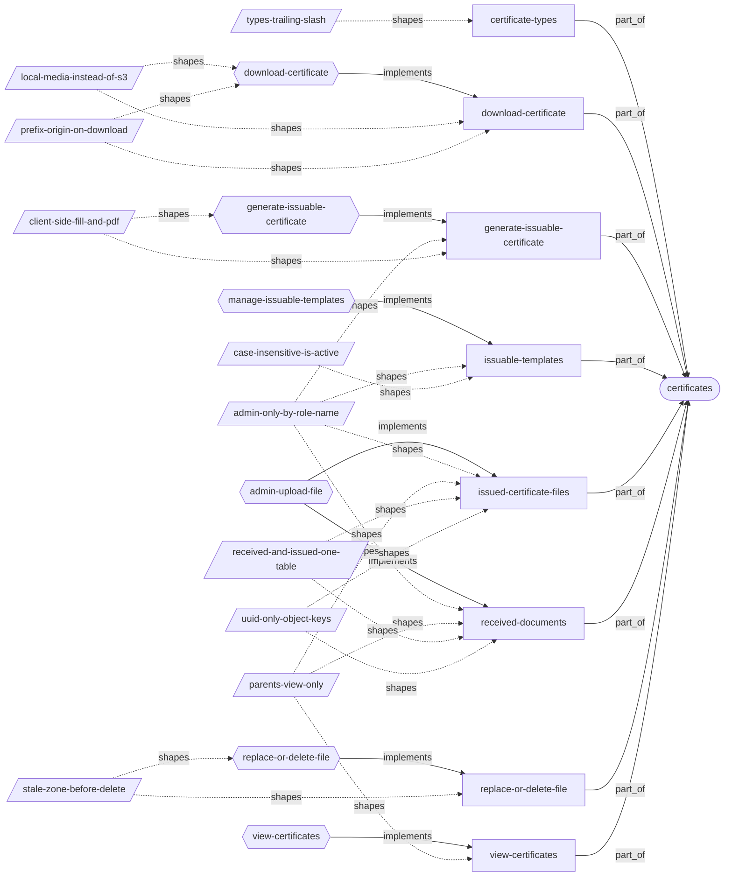
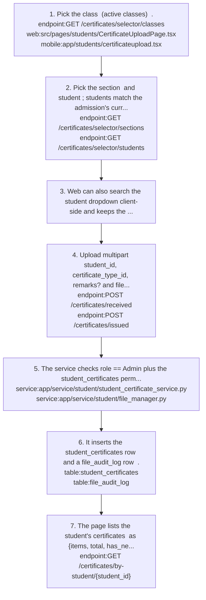
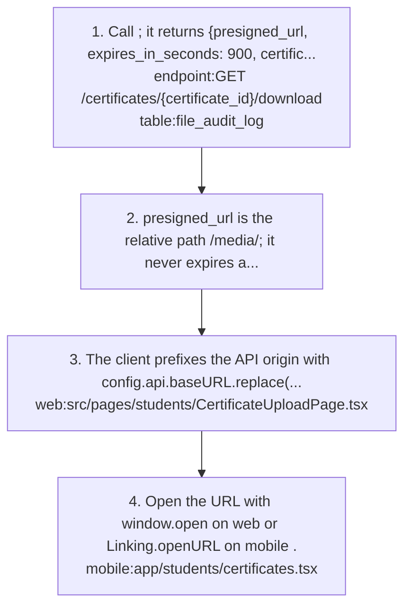
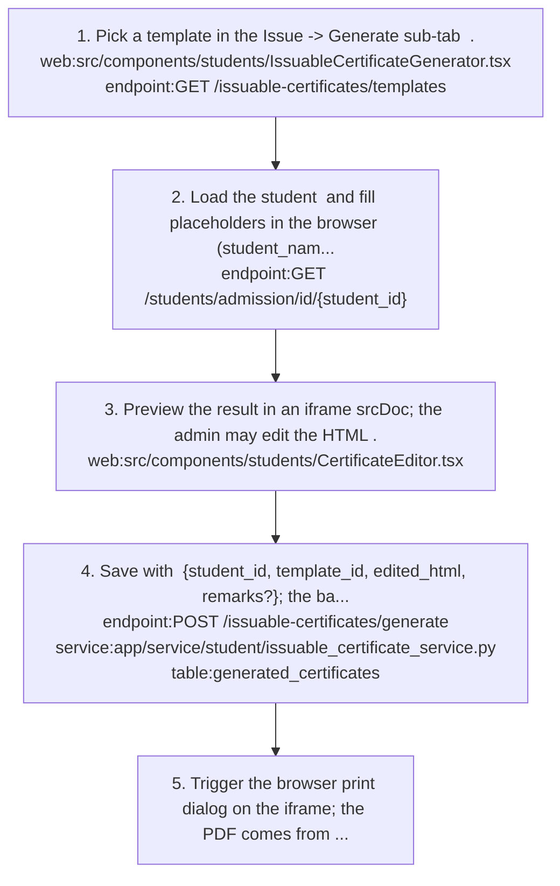
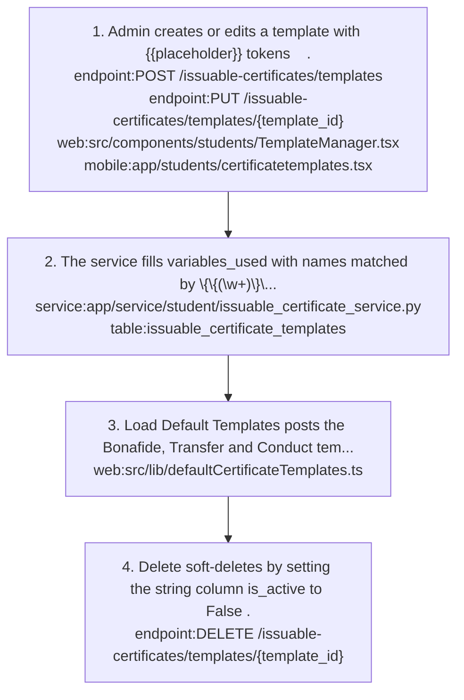
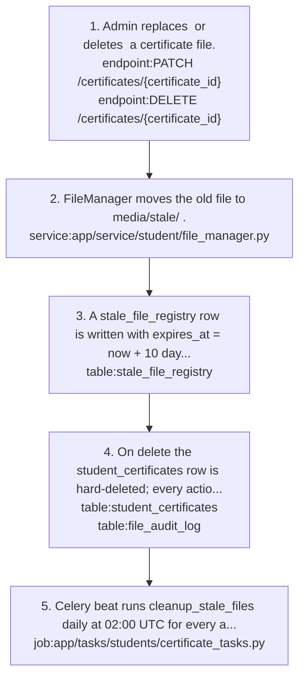
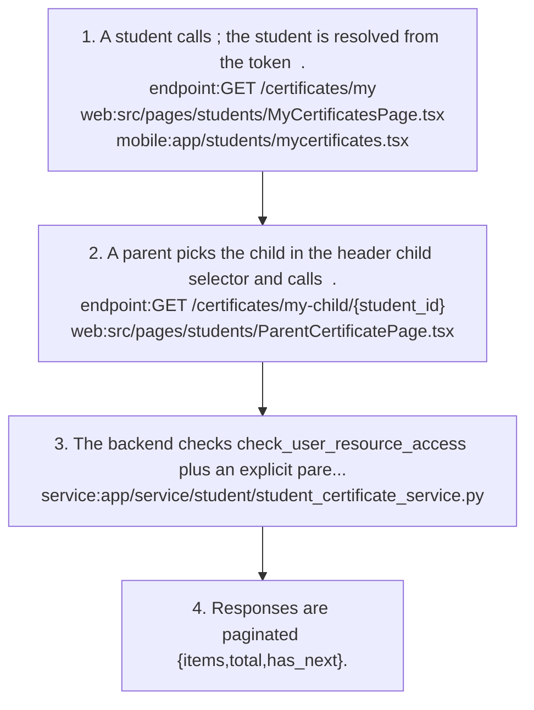

# certificates: knowledge graph view

_Generated from `docs/graph/graph.jsonl` by `scripts/graph/kg_render.py`. Do not edit this file; change the graph and re-render._

Student certificate files (documents the school receives and certificates it issues), certificate types, and HTML certificates generated from templates (issuable certificates).

Module doc: [docs/modules/certificates.md](../../../docs/modules/certificates.md)

## Features

### certificates/certificate-types

Certificate type master with unique names; delete is blocked while any certificate uses the type.
- Roles: certificate_types permissions; search needs student_certificates:list
- Implemented by: `endpoint:DELETE /certificates/types/{certificate_type_id}`, `endpoint:GET /certificates/types`, `endpoint:GET /certificates/types/dropdown`, `endpoint:GET /certificates/types/search`, `endpoint:POST /certificates/types`, `endpoint:PUT /certificates/types/{certificate_type_id}`, `mobile:app/students/certificatetypes.tsx`, `service:app/service/student/certificate_type_service.py`, `table:certificate_types`, `web:src/components/students/CertificateTypeManager.tsx`, `web:src/pages/students/CertificateTypesPage.tsx`
- Shaped by: [certificates/types-trailing-slash](#certificatestypes-trailing-slash)

### certificates/download-certificate

Download a certificate file via a /media/ URL returned by the download endpoint; each download is audited.
- Roles: Admin, Staff, Teacher any; Student own; Parent intended for linked children but always 403.
- Parity: Only the web admin page prefixes the API origin; other web roles and mobile use the relative URL and break unless web and API share an origin.
- Flows: [certificates/download-certificate](#certificatesdownload-certificate)
- Implemented by: `endpoint:GET /certificates/{certificate_id}/download`, `mobile:app/students/certificates.tsx`, `service:app/service/student/student_certificate_service.py`, `table:file_audit_log`, `web:src/pages/students/CertificateUploadPage.tsx`, `web:src/pages/students/MyCertificatesPage.tsx`, `web:src/pages/students/ParentCertificatePage.tsx`, `web:src/pages/students/StudentCertificatesPage.tsx`
- Shaped by: [certificates/local-media-instead-of-s3](#certificateslocal-media-instead-of-s3), [certificates/prefix-origin-on-download](#certificatesprefix-origin-on-download)

### certificates/generate-issuable-certificate

Generate a certificate from a template: the client fills placeholders, previews and prints, and the backend stores the exact HTML in generated_certificates.
- Roles: Admin by role name to generate; issuable_certificates:read/delete for records
- Parity: Mobile sends the raw template as edited_html, so placeholders are stored unfilled, with no preview or print.
- Note: Generated certificates are visible only to the admin generator, not in student/parent views or /students/documents/all.
- Flows: [certificates/generate-issuable-certificate](#certificatesgenerate-issuable-certificate)
- Implemented by: `endpoint:DELETE /issuable-certificates/issued/{certificate_id}`, `endpoint:GET /issuable-certificates/issued`, `endpoint:GET /issuable-certificates/issued/{certificate_id}`, `endpoint:GET /students/admission/id/{student_id}`, `endpoint:POST /issuable-certificates/generate`, `mobile:app/students/studentcertificates.tsx`, `service:app/service/student/issuable_certificate_service.py`, `table:generated_certificates`, `web:src/api/hooks/students/useIssuableCertificates.ts`, `web:src/components/students/CertificateEditor.tsx`, `web:src/components/students/IssuableCertificateGenerator.tsx`
- Shaped by: [certificates/admin-only-by-role-name](#certificatesadmin-only-by-role-name), [certificates/client-side-fill-and-pdf](#certificatesclient-side-fill-and-pdf)

### certificates/issuable-templates

Manage HTML certificate templates with {{placeholder}} tokens; variables_used is extracted on save, and three default templates (Bonafide, Transfer, Conduct) can be loaded.
- Roles: Admin by role name for writes; issuable_certificates:read to list
- Parity: Web has TemplateManager plus Load Default Templates; mobile has CRUD with a plain-text preview.
- Flows: [certificates/manage-issuable-templates](#certificatesmanage-issuable-templates)
- Implemented by: `endpoint:DELETE /issuable-certificates/templates/{template_id}`, `endpoint:GET /issuable-certificates/templates`, `endpoint:POST /issuable-certificates/templates`, `endpoint:PUT /issuable-certificates/templates/{template_id}`, `mobile:app/students/certificatetemplates.tsx`, `service:app/service/student/issuable_certificate_service.py`, `table:issuable_certificate_templates`, `web:src/components/students/TemplateManager.tsx`, `web:src/lib/defaultCertificateTemplates.ts`, `web:src/pages/students/CertificateTemplatesPage.tsx`
- Shaped by: [certificates/admin-only-by-role-name](#certificatesadmin-only-by-role-name), [certificates/case-insensitive-is-active](#certificatescase-insensitive-is-active)

### certificates/issued-certificate-files

Admin uploads certificate files the school issues as category issued, with a required issue_date.
- Roles: Admin only
- Flows: [certificates/admin-upload-file](#certificatesadmin-upload-file)
- Implemented by: `endpoint:GET /certificates/by-student/{student_id}`, `endpoint:GET /certificates/issued`, `endpoint:POST /certificates/issued`, `mobile:app/students/certificateupload.tsx`, `mobile:app/students/studentcertificates.tsx`, `service:app/service/student/file_manager.py`, `service:app/service/student/student_certificate_service.py`, `table:student_certificates`, `web:src/pages/students/CertificateUploadPage.tsx`
- Shaped by: [certificates/admin-only-by-role-name](#certificatesadmin-only-by-role-name), [certificates/parents-view-only](#certificatesparents-view-only), [certificates/received-and-issued-one-table](#certificatesreceived-and-issued-one-table), [certificates/uuid-only-object-keys](#certificatesuuid-only-object-keys)

### certificates/received-documents

Admin uploads documents the school receives from the family (for example a previous TC or birth certificate) as category received, with no issue date.
- Roles: Admin only (role name check plus student_certificates permission)
- Parity: Web adds a client-side name/admission-number search and remembers the selection in sessionStorage; mobile has the cascade only.
- Flows: [certificates/admin-upload-file](#certificatesadmin-upload-file)
- Implemented by: `endpoint:GET /certificates/by-student/{student_id}`, `endpoint:GET /certificates/received`, `endpoint:GET /certificates/selector/classes`, `endpoint:GET /certificates/selector/sections`, `endpoint:GET /certificates/selector/students`, `endpoint:POST /certificates/received`, `mobile:app/students/certificateupload.tsx`, `service:app/service/student/file_manager.py`, `service:app/service/student/student_certificate_service.py`, `table:student_certificates`, `web:src/pages/students/CertificateUploadPage.tsx`
- Shaped by: [certificates/admin-only-by-role-name](#certificatesadmin-only-by-role-name), [certificates/parents-view-only](#certificatesparents-view-only), [certificates/received-and-issued-one-table](#certificatesreceived-and-issued-one-table), [certificates/uuid-only-object-keys](#certificatesuuid-only-object-keys)

### certificates/replace-or-delete-file

Admin replaces or deletes an uploaded certificate file; the old file moves to a stale zone for 10 days before a daily job removes it.
- Roles: Admin
- Flows: [certificates/replace-or-delete-file](#certificatesreplace-or-delete-file)
- Implemented by: `endpoint:DELETE /certificates/{certificate_id}`, `endpoint:PATCH /certificates/{certificate_id}`, `job:app/tasks/students/certificate_tasks.py`, `service:app/service/student/file_manager.py`, `service:app/service/student/student_certificate_service.py`, `table:file_audit_log`, `table:stale_file_registry`, `table:student_certificates`
- Shaped by: [certificates/stale-zone-before-delete](#certificatesstale-zone-before-delete)

### certificates/view-certificates

Students view their own certificates, parents a linked child's, and teachers a read-only list; lists are paginated {items,total,has_next}.
- Roles: Student (list_own), Parent (linked children), Teacher (read-only web page)
- Parity: Mobile sends Teachers to the admin screen, where Admin-only endpoints return 403.
- Note: List endpoints ignore category, so received and issued variants both return both kinds.
- Note: GET /certificates/{certificate_id} never checks ownership, so a Student with read_own can read any certificate's metadata by id.
- Flows: [certificates/view-certificates](#certificatesview-certificates)
- Implemented by: `endpoint:GET /certificates/my`, `endpoint:GET /certificates/my-child/{student_id}`, `endpoint:GET /certificates/my-child/{student_id}/issued`, `endpoint:GET /certificates/my-child/{student_id}/received`, `endpoint:GET /certificates/{certificate_id}`, `mobile:app/students/certificates.tsx`, `mobile:app/students/mycertificates.tsx`, `service:app/service/student/student_certificate_service.py`, `table:student_certificates`, `web:src/pages/students/CertificatePage.tsx`, `web:src/pages/students/MyCertificatesPage.tsx`, `web:src/pages/students/ParentCertificatePage.tsx`, `web:src/pages/students/StudentCertificatesPage.tsx`
- Shaped by: [certificates/parents-view-only](#certificatesparents-view-only)

## Flows

### certificates/admin-upload-file

Implements: `feature:certificates/issued-certificate-files`, `feature:certificates/received-documents`

1. Pick the class `endpoint:GET /certificates/selector/classes` (active classes) `web:src/pages/students/CertificateUploadPage.tsx` `mobile:app/students/certificateupload.tsx`.
2. Pick the section `endpoint:GET /certificates/selector/sections` and student `endpoint:GET /certificates/selector/students`; students match the admission's current class and section, and inactive students are included.
3. Web can also search the student dropdown client-side and keeps the selection in sessionStorage (cert_page_selection).
4. Upload multipart student_id, certificate_type_id, remarks? and file: Received tab `endpoint:POST /certificates/received`, Issue -> Upload tab `endpoint:POST /certificates/issued` with issue_date.
5. The service checks role == Admin plus the student_certificates permission, and FileManager writes media/{cschema}/{module}/{student_id}/{uuid}.{ext} after size, extension, %PDF and filename checks `service:app/service/student/student_certificate_service.py` `service:app/service/student/file_manager.py`.
6. It inserts the student_certificates row and a file_audit_log row `table:student_certificates` `table:file_audit_log`.
7. The page lists the student's certificates `endpoint:GET /certificates/by-student/{student_id}` as {items, total, has_next}.

### certificates/download-certificate

Implements: `feature:certificates/download-certificate`

1. Call `endpoint:GET /certificates/{certificate_id}/download`; it returns {presigned_url, expires_in_seconds: 900, certificate_id} and writes an audit row `table:file_audit_log`.
2. presigned_url is the relative path /media/<key>; it never expires and is publicly readable.
3. The client prefixes the API origin with config.api.baseURL.replace(/\/api\/v\d+$/, '') as the admin page does `web:src/pages/students/CertificateUploadPage.tsx`.
4. Open the URL with window.open on web or Linking.openURL on mobile `mobile:app/students/certificates.tsx`.

- Failure: a Parent always gets 403 because download_certificate compares StudentParentLink.parent_id with the user id instead of the parents.id.

Shaped by: [certificates/local-media-instead-of-s3](#certificateslocal-media-instead-of-s3), [certificates/prefix-origin-on-download](#certificatesprefix-origin-on-download)

### certificates/generate-issuable-certificate

Implements: `feature:certificates/generate-issuable-certificate`

1. Pick a template in the Issue -> Generate sub-tab `web:src/components/students/IssuableCertificateGenerator.tsx` `endpoint:GET /issuable-certificates/templates`.
2. Load the student `endpoint:GET /students/admission/id/{student_id}` and fill placeholders in the browser (student_name, admission_number, dob, class_name, section, academic_year, father_name, mother_name, guardian_*, issue_date, gender_he_she, gender_his_her, school_logo, school_name and others).
3. Preview the result in an iframe srcDoc; the admin may edit the HTML `web:src/components/students/CertificateEditor.tsx`.
4. Save with `endpoint:POST /issuable-certificates/generate` {student_id, template_id, edited_html, remarks?}; the backend stores the HTML exactly as sent `service:app/service/student/issuable_certificate_service.py` `table:generated_certificates`.
5. Trigger the browser print dialog on the iframe; the PDF comes from Save as PDF.

- Note: generate_certificate uses commit() -> refresh(), which breaks the repo DB rule; switch to flush() -> select() -> commit() when touching it.

Shaped by: [certificates/client-side-fill-and-pdf](#certificatesclient-side-fill-and-pdf)

### certificates/manage-issuable-templates

Implements: `feature:certificates/issuable-templates`

1. Admin creates or edits a template with {{placeholder}} tokens `endpoint:POST /issuable-certificates/templates` `endpoint:PUT /issuable-certificates/templates/{template_id}` `web:src/components/students/TemplateManager.tsx` `mobile:app/students/certificatetemplates.tsx`.
2. The service fills variables_used with names matched by \{\{(\w+)\}\} `service:app/service/student/issuable_certificate_service.py` `table:issuable_certificate_templates`.
3. Load Default Templates posts the Bonafide, Transfer and Conduct templates from `web:src/lib/defaultCertificateTemplates.ts`.
4. Delete soft-deletes by setting the string column is_active to False `endpoint:DELETE /issuable-certificates/templates/{template_id}`.

### certificates/replace-or-delete-file

Implements: `feature:certificates/replace-or-delete-file`

1. Admin replaces `endpoint:PATCH /certificates/{certificate_id}` or deletes `endpoint:DELETE /certificates/{certificate_id}` a certificate file.
2. FileManager moves the old file to media/stale/<key> `service:app/service/student/file_manager.py`.
3. A stale_file_registry row is written with expires_at = now + 10 days (STALE_FILE_TTL_DAYS) `table:stale_file_registry`.
4. On delete the student_certificates row is hard-deleted; every action writes a file_audit_log row `table:student_certificates` `table:file_audit_log`.
5. Celery beat runs cleanup_stale_files daily at 02:00 UTC for every active tenant and removes expired stale files `job:app/tasks/students/certificate_tasks.py`.

Shaped by: [certificates/stale-zone-before-delete](#certificatesstale-zone-before-delete)

### certificates/view-certificates

Implements: `feature:certificates/view-certificates`

1. A student calls `endpoint:GET /certificates/my`; the student is resolved from the token `web:src/pages/students/MyCertificatesPage.tsx` `mobile:app/students/mycertificates.tsx`.
2. A parent picks the child in the header child selector and calls `endpoint:GET /certificates/my-child/{student_id}` `web:src/pages/students/ParentCertificatePage.tsx`.
3. The backend checks check_user_resource_access plus an explicit parent-child link and returns 403 if the child is not linked `service:app/service/student/student_certificate_service.py`.
4. Responses are paginated {items,total,has_next}.

## Decisions

### certificates/admin-only-by-role-name (unintended)

- **Decision**: Certificate upload, admin lists, the selector, template writes and generate check role == Admin by role name in addition to the permission check.
- **Why**: Not a deliberate choice. Access should come from the student_certificates permissions alone, not a hard-coded role name.
- **Tradeoff**: A tenant Staff user holding every student_certificates permission still gets 403.
- Shapes: `endpoint:POST /certificates/received`, `feature:certificates/generate-issuable-certificate`, `feature:certificates/issuable-templates`, `feature:certificates/issued-certificate-files`, `feature:certificates/received-documents`

### certificates/case-insensitive-is-active (active)

- **Decision**: is_active on issuable certificate tables is compared case-insensitively (func.lower(is_active) == true) until the column becomes Boolean.
- **Why**: Create writes True while update with a boolean stores true or false, so exact matches miss rows.
- Shapes: `feature:certificates/issuable-templates`, `table:generated_certificates`, `table:issuable_certificate_templates`, `web:src/components/students/TemplateManager.tsx`

### certificates/client-side-fill-and-pdf (active)

- **Decision**: Template placeholder filling and PDF output happen on the client; the backend stores the final HTML exactly as sent.
- **Why**: Avoids a server-side HTML-to-PDF dependency (wkhtmltopdf/WeasyPrint), lets the admin correct any field in the preview before saving, and the stored html_content is the exact printed version.
- **Alternatives**: Server-side placeholder filling and PDF rendering.
- **Tradeoff**: A client that skips filling (mobile) stores unfilled placeholders; there is no server PDF.
- Shapes: `feature:certificates/generate-issuable-certificate`, `flow:certificates/generate-issuable-certificate`, `table:generated_certificates`, `web:src/components/students/IssuableCertificateGenerator.tsx`

### certificates/local-media-instead-of-s3 (temporary)

- **Decision**: Certificate files are stored on local media/ and served as /media/ paths, not S3 pre-signed URLs as the spec (DD-001) chose.
- **Why**: A stopgap until the AWS deployment, when certificate files are meant to move to S3 (same as decision:platform/local-media-storage).
- **Alternatives**: S3 pre-signed URLs (the original spec).
- **Tradeoff**: URLs never expire and are public; method names generate_presigned_url and delete_from_s3 are leftovers from the spec.
- Shapes: `feature:certificates/download-certificate`, `flow:certificates/download-certificate`, `service:app/service/student/file_manager.py`

### certificates/parents-view-only (active)

- **Decision**: Only Admin uploads certificate files; parents and students can only view.
- **Why**: Every document on record is then entered by the school.
- Shapes: `feature:certificates/issued-certificate-files`, `feature:certificates/received-documents`, `feature:certificates/view-certificates`

### certificates/prefix-origin-on-download (active)

- **Decision**: Clients must prefix the API origin to the /media/ path returned by the download endpoint.
- **Why**: The returned presigned_url is relative and only resolves when web and API share an origin.
- Shapes: `feature:certificates/download-certificate`, `flow:certificates/download-certificate`

### certificates/received-and-issued-one-table (active)

- **Decision**: Received and issued certificates are two values of certificate_category on one table (student_certificates).
- **Why**: They share the student, type, file and stale lifecycle, but differ in meaning (inbound vs outbound) and in issue_date, and the UI shows them in separate tabs.
- **Alternatives**: Separate tables for received and issued documents.
- Shapes: `concept:certificates/certificate-category`, `feature:certificates/issued-certificate-files`, `feature:certificates/received-documents`, `table:student_certificates`

### certificates/stale-zone-before-delete (active)

- **Decision**: Replaced or deleted files move to media/stale/ with a 10-day expiry before a daily job removes them.
- **Why**: Safety net for admin mistakes: a replaced or deleted file can be recovered by hand until the cleanup runs.
- **Alternatives**: Delete files immediately.
- Shapes: `feature:certificates/replace-or-delete-file`, `flow:certificates/replace-or-delete-file`, `job:app/tasks/students/certificate_tasks.py`, `table:stale_file_registry`

### certificates/types-trailing-slash (active)

- **Decision**: Certificate type routes are always called with the trailing slash (/certificates/types/).
- **Why**: The /certificates router is mounted first, so /certificates/types without a slash matches /certificates/{certificate_id} and fails with a UUID 422.
- Shapes: `endpoint:GET /certificates/types`, `feature:certificates/certificate-types`

### certificates/uuid-only-object-keys (active)

- **Decision**: Stored certificate files are named {uuid}.{ext}; the original filename is discarded.
- **Why**: Original filenames may contain PII or path-traversal characters, so they are never stored.
- Shapes: `feature:certificates/issued-certificate-files`, `feature:certificates/received-documents`, `service:app/service/student/file_manager.py`

## Concepts

### certificates/certificate-category

certificate_category on student_certificates: received or issued. List endpoints do not filter by it and list items omit it.
- Related: `feature:certificates/issued-certificate-files`, `feature:certificates/received-documents`, `table:student_certificates`

### certificates/certificate-type

A named kind of certificate (unique name, optional description) referenced by each uploaded certificate file.
- Related: `feature:certificates/certificate-types`, `table:certificate_types`

### certificates/file-audit-log

A file_audit_log row written for every certificate upload, update, delete and download (actor, role, student, certificate, action, key, tenant); no endpoint reads it.
- Related: `feature:certificates/download-certificate`, `feature:certificates/replace-or-delete-file`, `table:file_audit_log`

### certificates/issuable-certificate

An HTML certificate generated from a template and stored in generated_certificates; separate subsystem from uploaded files, sharing no tables.
- Related: `feature:certificates/generate-issuable-certificate`, `table:generated_certificates`, `table:issuable_certificate_templates`

### certificates/issued-certificate

A certificate file the school issues and uploads; category issued, issue_date required. Different from a generated issuable certificate.
- Related: `feature:certificates/issued-certificate-files`, `table:student_certificates`

### certificates/received-certificate

A document the school collects from the family (for example a previous TC or birth certificate); category received, no issue date.
- Related: `feature:certificates/received-documents`, `table:student_certificates`

### certificates/stale-file

A replaced or deleted certificate file moved to media/stale/<key> and tracked in stale_file_registry until expires_at, then removed by cleanup_stale_files.
- Related: `feature:certificates/replace-or-delete-file`, `job:app/tasks/students/certificate_tasks.py`, `table:stale_file_registry`

### certificates/template-placeholder

A {{name}} token in an issuable template, listed in variables_used and filled in the browser from student admission data before saving.
- Related: `feature:certificates/generate-issuable-certificate`, `feature:certificates/issuable-templates`, `table:issuable_certificate_templates`
