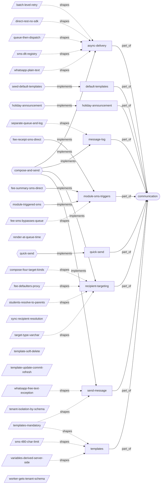
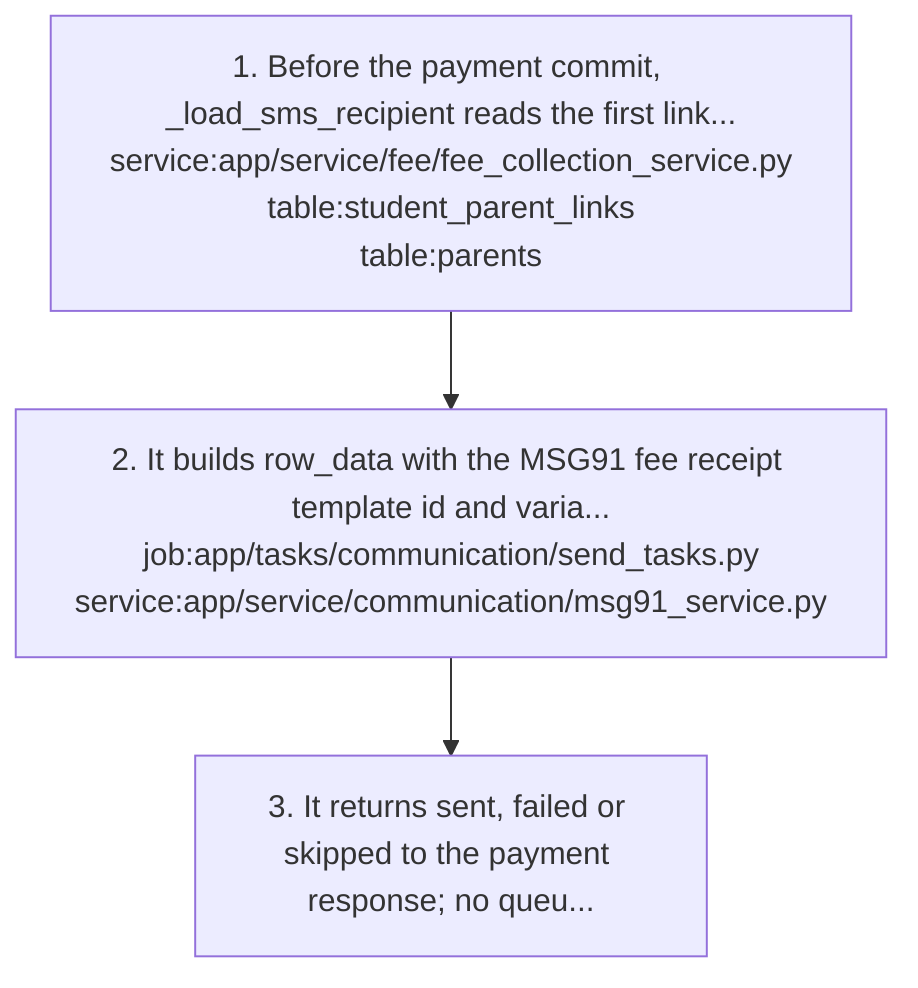
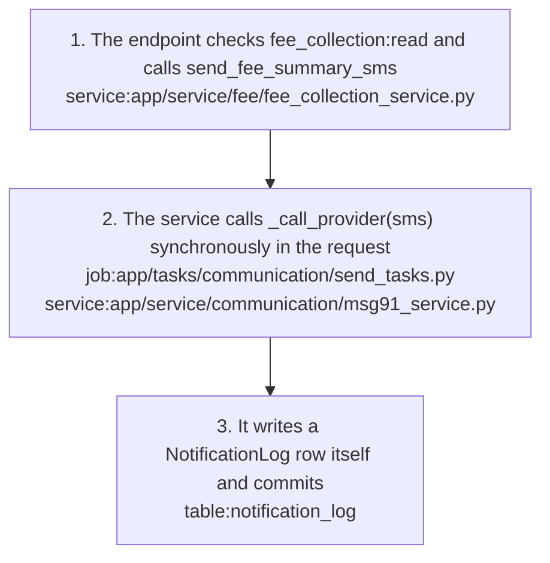
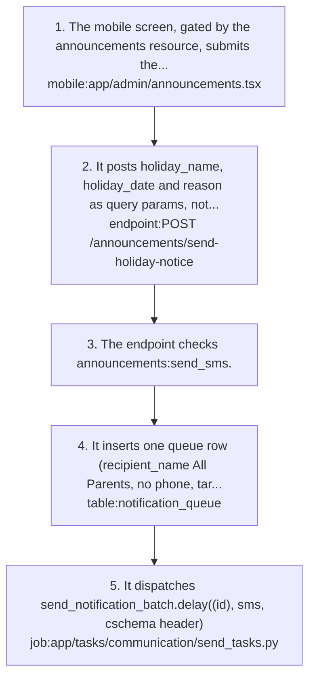
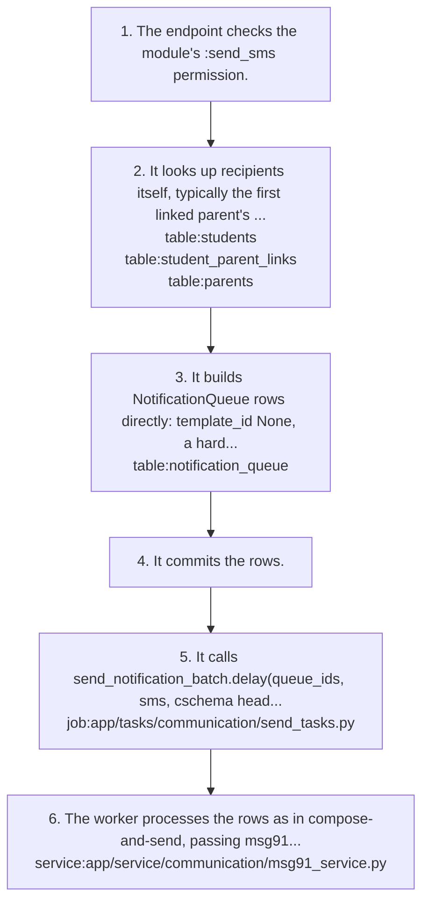
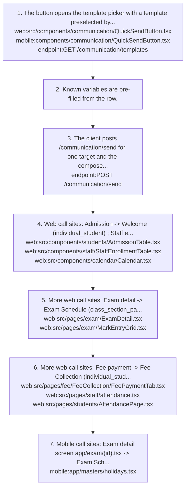
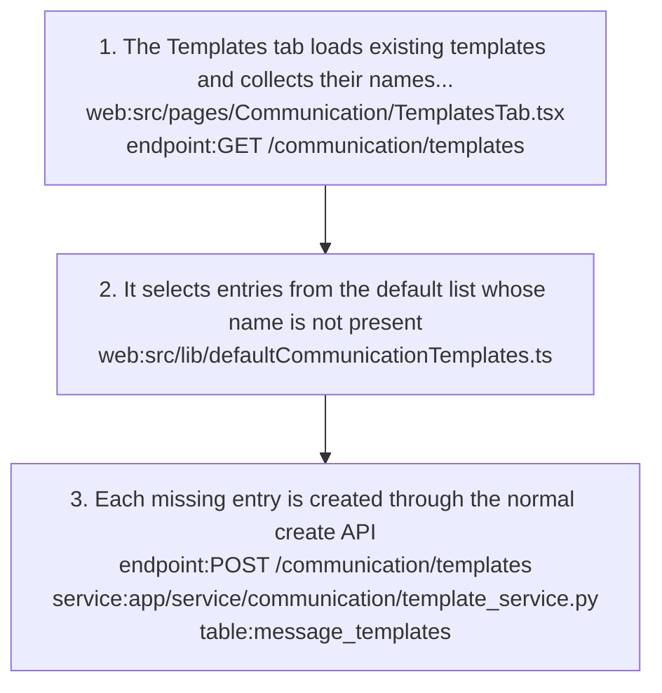

# communication: knowledge graph view

_Generated from `docs/graph/graph.jsonl` by `scripts/graph/kg_render.py`. Do not edit this file; change the graph and re-render._

Outbound SMS (MSG91), WhatsApp (Meta Cloud API) and Email (SendGrid) to parents and staff: reusable templates, recipient targeting, async delivery via a Celery worker, and a per-message audit log. Also the holiday announcement and module-specific send-SMS triggers that share the same queue.

Module doc: [docs/modules/communication.md](../../../docs/modules/communication.md)

## Features

### communication/async-delivery

Celery worker send_notification_batch delivers queued rows via MSG91 (sms), Meta Cloud API text messages (whatsapp) or SendGrid (email), writes notification_log, and retries the batch up to 3 times with a 60 s delay.
- Note: The worker is not in docker-compose; without a separately run worker plus Redis, queue rows stay queued.
- Note: No provider webhooks, so log status delivered is never set.
- Flows: [communication/compose-and-send](#communicationcompose-and-send)
- Implemented by: `job:app/tasks/communication/send_tasks.py`, `service:app/service/communication/msg91_service.py`, `service:app/service/communication/sms_templates.py`, `table:notification_log`, `table:notification_queue`
- Shaped by: [communication/batch-level-retry](#communicationbatch-level-retry), [communication/direct-rest-no-sdk](#communicationdirect-rest-no-sdk), [communication/queue-then-dispatch](#communicationqueue-then-dispatch), [communication/sms-dlt-registry](#communicationsms-dlt-registry), [communication/whatsapp-plain-text](#communicationwhatsapp-plain-text)

### communication/default-templates

Web-only seed button on the Templates tab that creates any missing default templates through the normal create API, matching existing ones by name (case-insensitive).
- Parity: Web only; mobile has no seed.
- Flows: [communication/seed-default-templates](#communicationseed-default-templates)
- Implemented by: `endpoint:POST /communication/templates`, `web:src/lib/defaultCommunicationTemplates.ts`, `web:src/pages/Communication/TemplatesTab.tsx`
- Depends on: `feature:communication/templates`

### communication/holiday-announcement

Admin sends a holiday SMS to all parents from the mobile announcements screen; the endpoint queues a single SMS row and dispatches the Celery task.
- Roles: announcements:send_sms (nothing in the repo seeds this permission).
- Parity: Mobile only (announcements resource gate); no web UI.
- Flows: [communication/holiday-announcement](#communicationholiday-announcement)
- Implemented by: `endpoint:POST /announcements/send-holiday-notice`, `job:app/tasks/communication/send_tasks.py`, `mobile:app/admin/announcements.tsx`, `table:notification_queue`

### communication/message-log

Per-recipient audit log of every send attempt, paginated (page, page_size up to 100) with channel, status, target_type, date_from and date_to filters, newest first; plus a detail view.
- Roles: communications:list for the list; communications:read for the detail.
- Parity: Web and mobile both show logs list + detail.
- Flows: [communication/compose-and-send](#communicationcompose-and-send)
- Implemented by: `endpoint:GET /communication/logs`, `endpoint:GET /communication/logs/{log_id}`, `mobile:app/(tabs)/communication.tsx`, `table:notification_log`, `web:src/pages/Communication/LogsTab.tsx`
- Shaped by: [communication/separate-queue-and-log](#communicationseparate-queue-and-log)

### communication/module-sms-triggers

Module endpoints (homework reminders, attendance absence, admission confirmation, exam results, hall tickets, exam schedule, fee receipt, staff attendance summary, staff interview calls) build SMS queue rows directly and enqueue the shared Celery task.
- Roles: <module resource>:send_sms, e.g. student_attendance, exams, fee_collection, staff_attendance, staff_enrollment, student_admissions, student_homework. Nothing in the repo seeds these.
- Parity: No web or mobile client calls these endpoints; the clients use QuickSend with templates instead.
- Note: Fee receipt SMS after payment and the fee summary SMS bypass the queue and call the provider synchronously in the request.
- Flows: [communication/fee-receipt-sms-direct](#communicationfee-receipt-sms-direct), [communication/fee-summary-sms-direct](#communicationfee-summary-sms-direct), [communication/module-triggered-sms](#communicationmodule-triggered-sms)
- Implemented by: `endpoint:POST /exams/{exam_id}/dates/send-schedule`, `endpoint:POST /exams/{exam_id}/send-hall-ticket-notification`, `endpoint:POST /exams/{exam_id}/send-results-notification`, `endpoint:POST /fee/collection/pay`, `endpoint:POST /fee/collection/send-receipt-sms`, `endpoint:POST /fee/collection/summary/{student_id}/send-sms`, `endpoint:POST /staff/send-attendance-summary`, `endpoint:POST /staff/send-interview-calls`, `endpoint:POST /student/attendance/send-absence-alerts`, `endpoint:POST /students/admission/send-confirmation`, `endpoint:POST /students/homework/send-reminders`, `job:app/tasks/communication/send_tasks.py`, `service:app/service/communication/msg91_service.py`, `service:app/service/fee/fee_collection_service.py`, `table:notification_queue`
- Depends on: `feature:communication/async-delivery`
- Shaped by: [communication/fee-sms-bypasses-queue](#communicationfee-sms-bypasses-queue)

### communication/quick-send

QuickSendButton on module pages opens the template picker with a template preselected by name, pre-fills known variables and sends to one target via the normal send endpoint.
- Parity: Web on admission, staff enrollment, calendar holidays, exam detail, mark entry, fee payment, staff attendance and student attendance; mobile on exam detail and holidays.
- Flows: [communication/quick-send](#communicationquick-send)
- Implemented by: `endpoint:GET /communication/templates`, `endpoint:POST /communication/send`, `mobile:components/communication/QuickSendButton.tsx`, `web:src/components/communication/QuickSendButton.tsx`
- Depends on: `feature:communication/send-message`

### communication/recipient-targeting

Resolves target_type + target_ref to recipients: individual/multiple parents, students and staff; class_section_parents/students; all_parents, all_students, all_staff; all_users; fee_defaulters; role_based. Plus a preview count.
- Roles: communications:list for the preview count.
- Parity: Web and mobile Compose expose only Parents, Students, Staff and Entire School; other target types are reachable via API and QuickSend.
- Note: Student targets always resolve to the student's linked parents (one row per parent x student); students are never contacted directly.
- Note: all_users is parents plus active staff, deduped by phone and email; role_based matches active staff whose users.role_id has the given role name.
- Flows: [communication/compose-and-send](#communicationcompose-and-send)
- Implemented by: `endpoint:GET /communication/send/preview-count`, `mobile:app/(tabs)/communication.tsx`, `service:app/service/communication/recipient_resolver.py`, `table:fee_student_mappings`, `table:parents`, `table:roles`, `table:staff`, `table:student_admissions`, `table:student_parent_links`, `table:students`, `table:users`, `web:src/pages/Communication/MultiTargetPicker.tsx`, `web:src/pages/Communication/SendMessagePanel.tsx`
- Shaped by: [communication/compose-four-target-kinds](#communicationcompose-four-target-kinds), [communication/fee-defaulters-proxy](#communicationfee-defaulters-proxy), [communication/students-resolve-to-parents](#communicationstudents-resolve-to-parents), [communication/target-type-varchar](#communicationtarget-type-varchar)

### communication/send-message

Compose and send a templated message over sms, whatsapp or email to a resolved audience; returns {queued_count} immediately and delivers asynchronously.
- Roles: communications:create. Parents and students have no access; both clients hide the module for them.
- Parity: Web /communication/compose and the mobile Compose tab; only mobile shows a send confirmation modal.
- Note: WhatsApp alone can send without a template (template_id omitted plus message), limited to plain parent/student/staff target types; neither client exposes it.
- Note: /send is rate limited by the shared rate_limit_api() (per IP), not per user.
- Flows: [communication/compose-and-send](#communicationcompose-and-send)
- Implemented by: `endpoint:POST /communication/send`, `job:app/tasks/communication/send_tasks.py`, `mobile:app/(tabs)/communication.tsx`, `service:app/service/communication/dispatch_service.py`, `service:app/service/communication/recipient_resolver.py`, `table:notification_queue`, `web:src/pages/Communication/SendMessagePanel.tsx`, `web:src/routes/_app/communication/compose.tsx`
- Depends on: `feature:communication/recipient-targeting`, `feature:communication/templates`
- Shaped by: [communication/templates-mandatory](#communicationtemplates-mandatory), [communication/whatsapp-free-text-exception](#communicationwhatsapp-free-text-exception)

### communication/templates

Reusable message templates per channel with {{var}} placeholders; create, list, get, update and soft-deactivate. Inactive templates cannot be sent (400).
- Roles: communications:create to create; communications:list to list/get; communications:update to update/deactivate.
- Parity: Web and mobile both have templates CRUD + deactivate gated by create/update.
- Note: variables is re-derived from the body on the server; anything the client sends is ignored. (name, channel) is unique (400 on create).
- Note: GET /communication/templates returns a plain array and ignores page/page_size; both clients normalise it to {items,total,page,page_size}.
- Implemented by: `endpoint:DELETE /communication/templates/{template_id}`, `endpoint:GET /communication/templates`, `endpoint:GET /communication/templates/{template_id}`, `endpoint:POST /communication/templates`, `endpoint:PUT /communication/templates/{template_id}`, `mobile:app/(tabs)/communication.tsx`, `service:app/service/communication/template_service.py`, `table:message_templates`, `web:src/pages/Communication/TemplatesTab.tsx`
- Shaped by: [communication/sms-480-char-limit](#communicationsms-480-char-limit), [communication/templates-mandatory](#communicationtemplates-mandatory), [communication/variables-derived-server-side](#communicationvariables-derived-server-side)

## Flows

### communication/compose-and-send

Implements: `feature:communication/async-delivery`, `feature:communication/message-log`, `feature:communication/recipient-targeting`, `feature:communication/send-message`

- Trigger: A staff user with communications:create opens Compose on web or the Compose tab on mobile.

1. User picks a target kind (Parents, Students, Staff or Entire School); the client maps it to multiple_parents, multiple_students, multiple_staff or all_users `web:src/pages/Communication/SendMessagePanel.tsx` `mobile:app/(tabs)/communication.tsx`
2. Parents and Students are picked from a class+section student checklist; parent ids come from the student's father/mother/guardian/parent_links `web:src/pages/Communication/MultiTargetPicker.tsx`
3. Client fetches {estimated_count} `endpoint:GET /communication/send/preview-count`; it uses _resolve_raw and does not filter by channel, so recipients without a phone or email are still counted `service:app/service/communication/recipient_resolver.py`
4. User picks a channel, then an active template for it `endpoint:GET /communication/templates`; web also narrows templates by a context keyword match on the template name.
5. User fills in any non-system variables.
6. Client posts {template_id, channel, target_type, target_ref, variables} `endpoint:POST /communication/send`; the endpoint checks communications:create and resolves the tenant schema via TenantService.get_tenant_schema(client_name), falling back to cos360_masters.
7. queue_and_dispatch loads the template and rejects an inactive one with 400 `service:app/service/communication/dispatch_service.py` `service:app/service/communication/template_service.py` `table:message_templates`
8. Recipients are resolved and those missing the contact for the channel are dropped silently (not logged, not counted) `service:app/service/communication/recipient_resolver.py` `table:parents` `table:staff` `table:student_parent_links`
9. Non-system template variables must all be present in variables, otherwise 400 before anything is queued.
10. Body is rendered with Jinja2 per recipient (system vars first, user vars override); a render error writes a failed log (message empty) for that recipient only `table:notification_log`
11. One queue row per recipient is inserted with status queued and the rendered text, then committed `table:notification_queue`
12. send_notification_batch.delay(queue_ids, channel, tenant_schema) is called `job:app/tasks/communication/send_tasks.py`; a .delay failure is swallowed and the endpoint returns {queued_count}.
13. The Celery worker opens its own engine and runs SET search_path TO <tenant_schema>, public `job:app/tasks/communication/send_tasks.py`
14. For each row it marks status processing and calls the provider: sms via MSG91 Flow API `service:app/service/communication/msg91_service.py`, whatsapp via Meta Cloud API text message, email via SendGrid.
15. On success the queue row becomes done and a notification_log row is written with status sent and provider_message_id `table:notification_queue` `table:notification_log`
16. On a provider error it writes a failed log and re-raises; the task retries up to 3 times with a 60 s delay.
17. After a successful send the web client redirects to /communication/logs `web:src/routes/_app/communication/compose.tsx`
18. Logs are paginated (page, page_size up to 100), filtered by channel, status, target_type, date_from and date_to, sorted created_at DESC `endpoint:GET /communication/logs` `web:src/pages/Communication/LogsTab.tsx`

- Result: queued_count can be lower than the preview count because recipients without contact details are skipped.

- Failure: A provider error rolls back the whole batch transaction, so the failed log is lost and rows sent earlier in the batch are re-sent on retry; after 3 retries rows stay queued.

```mermaid
flowchart TD
  s1["1. User picks a target kind (Parents, Students, Staff or Entire School...<br/>web:src/pages/Communication/SendMessagePanel.tsx<br/>mobile:app/(tabs)/communication.tsx"]
  s2["2. Parents and Students are picked from a class+section student checkl...<br/>web:src/pages/Communication/MultiTargetPicker.tsx"]
  s1 --> s2
  s3["3. Client fetches {estimated_count} ; it uses _resolve_raw and does no...<br/>endpoint:GET /communication/send/preview-count<br/>service:app/service/communication/recipient_resolver.py"]
  s2 --> s3
  s4["4. User picks a channel, then an active template for it ; web also nar...<br/>endpoint:GET /communication/templates"]
  s3 --> s4
  s5["5. User fills in any non-system variables."]
  s4 --> s5
  s6["6. Client posts {template_id, channel, target_type, target_ref, variab...<br/>endpoint:POST /communication/send"]
  s5 --> s6
  s7["7. queue_and_dispatch loads the template and rejects an inactive one w...<br/>service:app/service/communication/dispatch_service.py<br/>service:app/service/communication/template_service.py<br/>table:message_templates"]
  s6 --> s7
  s8["8. Recipients are resolved and those missing the contact for the chann...<br/>service:app/service/communication/recipient_resolver.py<br/>table:parents<br/>table:staff<br/>table:student_parent_links"]
  s7 --> s8
  s9["9. Non-system template variables must all be present in variables, oth..."]
  s8 --> s9
  s10["10. Body is rendered with Jinja2 per recipient (system vars first, user...<br/>table:notification_log"]
  s9 --> s10
  s11["11. One queue row per recipient is inserted with status queued and the ...<br/>table:notification_queue"]
  s10 --> s11
  s12["12. send_notification_batch.delay(queue_ids, channel, tenant_schema) is...<br/>job:app/tasks/communication/send_tasks.py"]
  s11 --> s12
  s13["13. The Celery worker opens its own engine and runs SET search_path TO ...<br/>job:app/tasks/communication/send_tasks.py"]
  s12 --> s13
  s14["14. For each row it marks status processing and calls the provider: sms...<br/>service:app/service/communication/msg91_service.py"]
  s13 --> s14
  s15["15. On success the queue row becomes done and a notification_log row is...<br/>table:notification_queue<br/>table:notification_log"]
  s14 --> s15
  s16["16. On a provider error it writes a failed log and re-raises; the task ..."]
  s15 --> s16
  s17["17. After a successful send the web client redirects to /communication/...<br/>web:src/routes/_app/communication/compose.tsx"]
  s16 --> s17
  s18["18. Logs are paginated (page, page_size up to 100), filtered by channel...<br/>endpoint:GET /communication/logs<br/>web:src/pages/Communication/LogsTab.tsx"]
  s17 --> s18
```

### communication/fee-receipt-sms-direct

Implements: `feature:communication/module-sms-triggers`

- Trigger: A fee payment is posted with send_sms true (the default) `endpoint:POST /fee/collection/pay`

1. Before the payment commit, _load_sms_recipient reads the first linked parent's name and phone and the student name `service:app/service/fee/fee_collection_service.py` `table:student_parent_links` `table:parents`; after the commit _dispatch_sms_receipt sends without touching the database.
2. It builds row_data with the MSG91 fee receipt template id and variables var1..3 and calls _call_provider(sms) synchronously via run_in_executor `job:app/tasks/communication/send_tasks.py` `service:app/service/communication/msg91_service.py`
3. It returns sent, failed or skipped to the payment response; no queue row and no log row are written.

- Note: Provider errors are caught and logged, so the payment itself is not affected.

### communication/fee-summary-sms-direct

Implements: `feature:communication/module-sms-triggers`

- Trigger: Staff sends a student's fee summary by SMS `endpoint:POST /fee/collection/summary/{student_id}/send-sms`

1. The endpoint checks fee_collection:read and calls send_fee_summary_sms `service:app/service/fee/fee_collection_service.py`
2. The service calls _call_provider(sms) synchronously in the request `job:app/tasks/communication/send_tasks.py` `service:app/service/communication/msg91_service.py`
3. It writes a NotificationLog row itself and commits `table:notification_log`

### communication/holiday-announcement

Implements: `feature:communication/holiday-announcement`

- Trigger: Admin fills holiday name, date and reason on the mobile announcements screen.

1. The mobile screen, gated by the announcements resource, submits the form `mobile:app/admin/announcements.tsx`
2. It posts holiday_name, holiday_date and reason as query params, not a JSON body; that is the backend contract `endpoint:POST /announcements/send-holiday-notice`
3. The endpoint checks announcements:send_sms.
4. It inserts one queue row (recipient_name All Parents, no phone, target_type holiday_announcement) with target_ref {msg91_template_id, variables var1..3} and commits `table:notification_queue`
5. It dispatches send_notification_batch.delay([id], sms, cschema header) `job:app/tasks/communication/send_tasks.py`

- Failure: The row has no dlt_te_id and no phone, and the cschema header is a client name, so the SMS cannot currently succeed.

### communication/module-triggered-sms

Implements: `feature:communication/module-sms-triggers`

- Trigger: Student module endpoints `endpoint:POST /students/homework/send-reminders` `endpoint:POST /student/attendance/send-absence-alerts` `endpoint:POST /students/admission/send-confirmation`
- Trigger: Exam module endpoints `endpoint:POST /exams/{exam_id}/send-results-notification` `endpoint:POST /exams/{exam_id}/send-hall-ticket-notification` `endpoint:POST /exams/{exam_id}/dates/send-schedule`
- Trigger: Fee and staff endpoints `endpoint:POST /fee/collection/send-receipt-sms` `endpoint:POST /staff/send-attendance-summary` `endpoint:POST /staff/send-interview-calls`

1. The endpoint checks the module's <resource>:send_sms permission.
2. It looks up recipients itself, typically the first linked parent's phone per student, skipping those without one `table:students` `table:student_parent_links` `table:parents`
3. It builds NotificationQueue rows directly: template_id None, a hard-coded rendered_message, target_ref {msg91_template_id from env, variables var1..N} `table:notification_queue`
4. It commits the rows.
5. It calls send_notification_batch.delay(queue_ids, sms, cschema header) `job:app/tasks/communication/send_tasks.py`; a .delay failure returns 500 after the rows are committed.
6. The worker processes the rows as in compose-and-send, passing msg91_template_id and variables to MSG91 `service:app/service/communication/msg91_service.py`

- Failure: Rows omit dlt_te_id and their variable order does not match the sms_templates registry, so MSG91 rejects them.

- Note: No web or mobile client calls these endpoints.

### communication/quick-send

Implements: `feature:communication/quick-send`

- Trigger: User clicks the QuickSendButton on a module page row.

1. The button opens the template picker with a template preselected by name `web:src/components/communication/QuickSendButton.tsx` `mobile:components/communication/QuickSendButton.tsx` `endpoint:GET /communication/templates`
2. Known variables are pre-filled from the row.
3. The client posts /communication/send for one target and the compose-and-send pipeline takes over `endpoint:POST /communication/send`
4. Web call sites: Admission -> Welcome (individual_student) `web:src/components/students/AdmissionTable.tsx`; Staff enrollment -> Staff Recruiting (individual_staff) `web:src/components/staff/StaffEnrollmentTable.tsx`; Calendar holiday -> Holiday (all_parents) `web:src/components/calendar/Calendar.tsx`
5. More web call sites: Exam detail -> Exam Schedule (class_section_parents) `web:src/pages/exam/ExamDetail.tsx`; Mark entry -> Mark Entry (class_section_parents) `web:src/pages/exam/MarkEntryGrid.tsx`
6. More web call sites: Fee payment -> Fee Collection (individual_student) `web:src/pages/fee/FeeCollection/FeePaymentTab.tsx`; Staff attendance -> Staff Attendance (individual_staff) `web:src/pages/staff/attendance.tsx`; Student attendance -> Student Absentees (individual_student) `web:src/pages/students/AttendancePage.tsx`
7. Mobile call sites: Exam detail screen app/exam/[id].tsx -> Exam Schedule (class_section_parents); Holidays -> Holiday (all_parents) `mobile:app/masters/holidays.tsx`

- Failure: Both QuickSend buttons send extra_variables, which the backend ignores, so templates with non-system variables fail with 400.

### communication/seed-default-templates

Implements: `feature:communication/default-templates`

- Trigger: User clicks the seed button on the web Templates tab.

1. The Templates tab loads existing templates and collects their names (trimmed, lowercased) `web:src/pages/Communication/TemplatesTab.tsx` `endpoint:GET /communication/templates`
2. It selects entries from the default list whose name is not present `web:src/lib/defaultCommunicationTemplates.ts`
3. Each missing entry is created through the normal create API `endpoint:POST /communication/templates` `service:app/service/communication/template_service.py` `table:message_templates`

- Result: Existing templates with the same name are left untouched.

## Decisions

### communication/batch-level-retry (unintended)

- **Decision**: _process_single re-raises on a provider error so Celery retries the whole batch (max 3 retries, 60 s delay, acks_late).
- **Why**: Not a deliberate choice. The spec wanted per-message handling so one failure does not block or re-send the others.
- **Alternatives**: The spec wanted per-row processing where one failure does not block others.
- **Tradeoff**: The batch transaction rolls back, the failed log is lost, earlier rows in the batch are re-sent, and nothing checks status done before sending.
- Shapes: `feature:communication/async-delivery`, `job:app/tasks/communication/send_tasks.py`

### communication/compose-four-target-kinds (unintended)

- **Decision**: The Compose UI exposes only four target kinds (Parents, Students, Staff, Entire School); the backend keeps all target types for API callers and QuickSend.
- **Why**: Not a deliberate choice; the Compose UI simply exposes fewer target types than the backend supports.
- Shapes: `feature:communication/recipient-targeting`, `mobile:app/(tabs)/communication.tsx`, `web:src/pages/Communication/SendMessagePanel.tsx`

### communication/direct-rest-no-sdk

- **Decision**: Call providers (MSG91, Meta Cloud API, SendGrid) with direct REST via httpx, configured only by env vars; no provider SDKs.
- **Why**: No extra package is needed since httpx is already a dependency, and the gateway is swappable via env vars without code changes.
- Note: Celery code uses sync httpx.Client because Celery tasks are not async.
- Shapes: `feature:communication/async-delivery`, `job:app/tasks/communication/send_tasks.py`, `service:app/service/communication/msg91_service.py`

### communication/fee-defaulters-proxy

- **Decision**: fee_defaulters targets parents of every student with a fee mapping where total_fee > 0, paid or not.
- **Why**: fee_student_mappings has no balance column to identify real defaulters.
- **Tradeoff**: Parents who have paid in full are also messaged.
- Shapes: `feature:communication/recipient-targeting`, `service:app/service/communication/recipient_resolver.py`, `table:fee_student_mappings`

### communication/fee-sms-bypasses-queue

- **Decision**: The fee receipt SMS after payment and the fee summary SMS call _call_provider synchronously in the request instead of queueing.
- **Why**: Not recorded.
- **Tradeoff**: The payment receipt SMS writes no queue or log row, so it has no audit trail.
- Shapes: `endpoint:POST /fee/collection/pay`, `endpoint:POST /fee/collection/summary/{student_id}/send-sms`, `feature:communication/module-sms-triggers`, `service:app/service/fee/fee_collection_service.py`

### communication/queue-then-dispatch

- **Decision**: Insert all queue rows first and commit, then dispatch one Celery task carrying all queue ids per send.
- **Why**: The API answers immediately regardless of recipient count, and the committed rows stay as evidence for reprocessing if the broker is down.
- **Alternatives**: One Celery task per recipient - rejected as too many tasks for large groups.
- Note: /communication/send swallows a .delay() failure for this reason; module triggers and the holiday endpoint do not.
- Shapes: `endpoint:POST /communication/send`, `feature:communication/async-delivery`, `job:app/tasks/communication/send_tasks.py`, `service:app/service/communication/dispatch_service.py`, `table:notification_queue`

### communication/render-at-queue-time

- **Decision**: Render the Jinja2 body per recipient before inserting the queue row; notification_queue.rendered_message is the immutable text.
- **Why**: The DB keeps the final rendered message as an audit record, template edits between queue and send do not change queued messages, and the worker needs no template lookups.
- Note: A render error fails only that recipient (failed log, empty message); the rest of the batch is still queued.
- Shapes: `service:app/service/communication/dispatch_service.py`, `table:notification_queue`

### communication/separate-queue-and-log

- **Decision**: Keep notification_queue (transient processing state) separate from notification_log (permanent audit record: who, whom, rendered text, provider id).
- **Why**: Queue status is transient while log status is final, so the two need different retention and indexing; the queue can be pruned while logs are kept.
- **Tradeoff**: No queue pruning job exists, so queue rows accumulate.
- Shapes: `feature:communication/message-log`, `table:notification_log`, `table:notification_queue`

### communication/sms-480-char-limit

- **Decision**: Reject SMS template bodies longer than 480 characters on create.
- **Why**: 480 characters is 3 SMS credits; longer bodies cost more per recipient.
- Note: PUT does not re-check the limit.
- Shapes: `feature:communication/templates`, `table:message_templates`

### communication/sms-dlt-registry

- **Decision**: SMS goes through the MSG91 Flow API with a flow template id, a DLT TE id and positional var1..N; sms_templates.py is the single registry, one entry per registered wording, used via build_target_ref.
- **Why**: Per TRAI DLT rules each distinct SMS wording is its own registered template, and the DLT TE id is mandatory on Indian routes; positional variables must match the registered order.
- **Tradeoff**: The DB template body for SMS is only a human-readable audit copy; MSG91 renders the registered text, so editing it changes the log but not what parents receive.
- Shapes: `feature:communication/async-delivery`, `service:app/service/communication/msg91_service.py`, `service:app/service/communication/sms_templates.py`

### communication/students-resolve-to-parents

- **Decision**: Student and class targets always resolve to the linked parents' contacts, one row per (parent, student); students are never contacted directly.
- **Why**: Students are minors and usually have no phone of their own, so the parent's contact is the reliable one; sending per child keeps the child's name in each message.
- **Tradeoff**: A parent of two children gets two personalized messages; only all_users dedupes.
- Shapes: `feature:communication/recipient-targeting`, `service:app/service/communication/recipient_resolver.py`

### communication/sync-recipient-resolution

- **Decision**: Resolve recipients synchronously inside the API request, not in the Celery worker.
- **Why**: The API must return queued_count in its response.
- **Tradeoff**: Very large schools make the request slower; the spec deferred moving resolution to async.
- Shapes: `endpoint:POST /communication/send`, `service:app/service/communication/dispatch_service.py`, `service:app/service/communication/recipient_resolver.py`

### communication/target-type-varchar

- **Decision**: target_type is a plain VARCHAR(50) and target_ref is JSON, not a PostgreSQL enum.
- **Why**: New target types need no DDL; migration b7c8d9e0f1a2 is an empty marker that only records adding the multiple_* types.
- **Alternatives**: A target_type_enum PostgreSQL type, as in the original DB spec.
- Shapes: `feature:communication/recipient-targeting`, `table:notification_log`, `table:notification_queue`

### communication/template-soft-delete

- **Decision**: Template DELETE is a soft deactivate (is_active=false); inactive templates cannot be sent.
- **Why**: Queue and log rows reference the template by foreign key, so it must stay to keep the audit trail of messages already sent.
- Note: Queue and log rows reference message_templates.id by foreign key.
- Shapes: `endpoint:DELETE /communication/templates/{template_id}`, `table:message_templates`

### communication/template-update-commit-refresh

- **Decision**: Template update and deactivate use commit() then refresh().
- **Why**: Workaround for a MissingGreenlet error.
- **Tradeoff**: Breaks the repo rule flush() -> select() -> commit(); new code should follow the rule in backend/CLAUDE.md.
- Shapes: `endpoint:DELETE /communication/templates/{template_id}`, `endpoint:PUT /communication/templates/{template_id}`, `service:app/service/communication/template_service.py`

### communication/templates-mandatory

- **Decision**: Every send must use a saved template (except WhatsApp free-text).
- **Why**: DLT compliance for SMS and a consistent school voice.
- Shapes: `feature:communication/send-message`, `feature:communication/templates`, `service:app/service/communication/dispatch_service.py`, `table:message_templates`

### communication/tenant-isolation-by-schema

- **Decision**: Templates, queue and logs are tenant tables (BaseOrg), and the worker opens its own engine and sets search_path to the tenant schema.
- **Why**: Tenant isolation comes from the schema-per-tenant model; the worker runs outside the request, so it must set the schema context itself.
- Shapes: `job:app/tasks/communication/send_tasks.py`, `table:message_templates`, `table:notification_log`, `table:notification_queue`

### communication/variables-derived-server-side (unintended)

- **Decision**: The template variables list is always re-derived from the body on the server; any client-sent value is ignored.
- **Why**: Not a deliberate choice; it is how the endpoint was first written.
- Shapes: `feature:communication/templates`, `table:message_templates`

### communication/whatsapp-free-text-exception

- **Decision**: WhatsApp may send a free-text message without a template, limited to plain parent/student/staff target types (WHATSAPP_TEMPLATE_LESS_TARGET_TYPES); SMS and email still need a template.
- **Why**: Schools wanted to send one-off notes without creating a template first. SMS cannot do this because DLT rules require registered templates.
- Note: Migration d9e0f1a2b3c4 made notification_queue.template_id nullable for this.
- Shapes: `feature:communication/send-message`, `service:app/service/communication/dispatch_service.py`, `table:notification_queue`

### communication/whatsapp-plain-text (unintended)

- **Decision**: WhatsApp sends a free-form text message via the Meta Cloud API; approved Meta message templates are not implemented.
- **Why**: Not a deliberate choice: Meta's 24-hour customer-service window for free-form text was not known when this was built. School-initiated WhatsApp messages need approved Meta templates.
- **Tradeoff**: Meta delivers free-form text only inside the 24-hour customer-service window, so business-initiated messages may not arrive.
- Shapes: `feature:communication/async-delivery`, `job:app/tasks/communication/send_tasks.py`

### communication/worker-gets-tenant-schema

- **Decision**: Pass the resolved tenant schema name to the worker, not the cschema header (the client name).
- **Why**: The worker sets search_path from it, and the client name differs from the schema name for some tenants, in which case the worker cannot find the rows and skips them.
- Note: Only /communication/send follows this; the holiday endpoint and every module trigger pass the raw cschema header.
- Shapes: `endpoint:POST /announcements/send-holiday-notice`, `endpoint:POST /communication/send`, `job:app/tasks/communication/send_tasks.py`

## Concepts

### communication/channel

Delivery medium of a message: sms (MSG91), whatsapp (Meta Cloud API) or email (SendGrid). Each template belongs to one channel.
- Related: `job:app/tasks/communication/send_tasks.py`, `table:message_templates`

### communication/custom-variable

Any {{var}} in a template body that is not a system variable; it must be supplied in SendRequest.variables or the send fails with 400.
- Note: Both clients send extra_variables, which Pydantic ignores, so templates with custom variables currently fail.
- Related: `endpoint:POST /communication/send`, `service:app/service/communication/dispatch_service.py`

### communication/dlt-template

An SMS template registered on India's TRAI DLT portal; its wording is fixed and only positional {#var#} values vary. Sending needs the MSG91 flow template id and the DLT TE id.
- Note: Env names follow MSG91_TEMPLATE_ID_* and MSG91_DLT_TE_ID_*; ids stay blank until each template clears DLT approval.
- Related: `service:app/service/communication/msg91_service.py`, `service:app/service/communication/sms_templates.py`

### communication/fan-out

Expansion of a target into recipient rows; student and class targets yield one row per (parent, student), so a parent of two children gets two messages.
- Related: `service:app/service/communication/recipient_resolver.py`

### communication/fee-defaulter

In communication targeting, a parent of any student with a fee_student_mappings row where total_fee > 0, regardless of payment status.
- Related: `service:app/service/communication/recipient_resolver.py`, `table:fee_student_mappings`

### communication/log-entry

One notification_log row per delivery attempt outcome (sent or failed), with the rendered text, provider_message_id or error_message; the permanent audit record.
- Related: `table:notification_log`

### communication/queue-row

One notification_queue row per recipient holding the rendered message and contact; status moves queued -> processing -> done or failed as the worker handles it.
- Related: `job:app/tasks/communication/send_tasks.py`, `table:notification_queue`

### communication/system-variable

A template variable the server resolves per recipient: name, student_name, class_name, section_name (SYSTEM_VARS in communication_schema.py).
- Note: The clients also treat parent_name and staff_name as system variables, but the backend does not resolve them.
- Related: `concept:communication/custom-variable`, `service:app/service/communication/dispatch_service.py`

### communication/target-type

The audience selector of a send: target_type names the kind (e.g. multiple_parents, class_section_parents, all_users, fee_defaulters, role_based) and target_ref carries its parameters (ids, class_id/section_id, role name).
- Note: Module triggers store their own target_type values (e.g. student_absence, holiday_announcement) and put msg91_template_id + variables in target_ref.
- Related: `service:app/service/communication/recipient_resolver.py`, `table:notification_log`, `table:notification_queue`
