# exam: knowledge graph view

_Generated from `docs/graph/graph.jsonl` by `scripts/graph/kg_render.py`. Do not edit this file; change the graph and re-render._

Exam setup (grade schemes, remark sets, board patterns, settings, templates), exam creation per class-section, component-wise mark entry, result computation and publishing, hall tickets, and the exam audit trail.

Module doc: [docs/modules/exam.md](../../../docs/modules/exam.md)

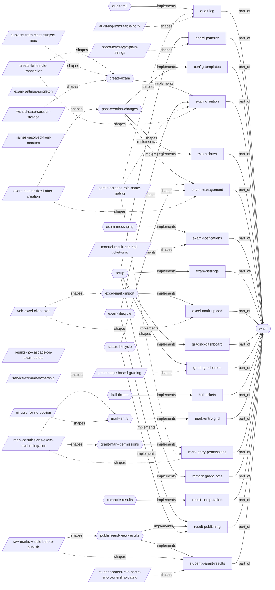

## Features

### exam/audit-log

Append-only per-exam audit trail of compute, publish, unlock, hall-ticket and notification actions, viewable per exam.
- Roles: Admin, Teacher, Staff (exams:read); Student and Parent get 403 by role name; screens gated by role name.
- Parity: Web and mobile both show action, old and new value, reason and performed_at; neither shows an actor name because the API returns only the performed_by UUID.
- Flows: [exam/audit-trail](#examaudit-trail)
- Implemented by: `endpoint:GET /exams/{exam_id}/audit`, `mobile:app/exam/audit-log.tsx`, `mobile:app/exam/audit.tsx`, `service:app/service/exam/audit_service.py`, `table:exam_audit_log`, `web:src/pages/exam/AuditLog.tsx`, `web:src/pages/exam/AuditLogExamList.tsx`
- Shaped by: [exam/admin-screens-role-name-gating](#examadmin-screens-role-name-gating), [exam/audit-log-immutable-no-fk](#examaudit-log-immutable-no-fk)

### exam/board-patterns

Board patterns: board + level mapped to the list of exam types that board uses.
- Roles: Admin.
- Flows: [exam/setup](#examsetup)
- Implemented by: `endpoint:DELETE /board-patterns/{pattern_id}`, `endpoint:POST /board-patterns`, `endpoint:PUT /board-patterns/{pattern_id}`, `mobile:app/exam/board-patterns.tsx`, `service:app/service/exam/board_pattern_service.py`, `table:board_exam_patterns`, `table:board_pattern_exam_types`, `web:src/pages/exam/BoardPatternSetup.tsx`
- Shaped by: [exam/board-level-type-plain-strings](#examboard-level-type-plain-strings)

### exam/config-templates

Reusable subject-config templates plus copy, apply-template, compare and auto-detect to fill an empty class-section of an exam from another one.
- Roles: Admin (templates list uses exams:list).
- Parity: API and web hooks only; no screen on web or mobile.
- Flows: [exam/post-creation-changes](#exampost-creation-changes)
- Implemented by: `endpoint:GET /exam-patterns/templates`, `endpoint:GET /exam-patterns/{exam_id}/auto-detect`, `endpoint:GET /exam-patterns/{exam_id}/compare`, `endpoint:POST /exam-patterns/templates`, `endpoint:POST /exam-patterns/templates/from-exam`, `endpoint:POST /exam-patterns/{exam_id}/apply-template`, `endpoint:POST /exam-patterns/{exam_id}/copy`, `endpoint:POST /exams/{exam_id}/class-sections`, `service:app/service/exam/exam_pattern_service.py`, `table:exam_config_template_items`, `table:exam_config_templates`, `web:src/api/exam/index.ts`, `web:src/api/hooks/exam/useExam.ts`
- Depends on: `feature:exam/exam-creation`

### exam/exam-creation

Create an exam with its class-sections, per-subject configs with components, and exam dates in one request and one transaction.
- Roles: Admin (exams:create); screen shown only to admin, superadmin, principal.
- Parity: Web wizard with sessionStorage state auto-sets exam_type to the exam name and has term; mobile takes free-text exam_type and no term.
- Flows: [exam/create-exam](#examcreate-exam), [exam/exam-lifecycle](#examexam-lifecycle)
- Implemented by: `endpoint:POST /exams`, `mobile:app/exam/create.tsx`, `service:app/service/exam/exam_service.py`, `table:exam_class_sections`, `table:exam_dates`, `table:exam_subject_components`, `table:exam_subject_config`, `table:exams`, `web:src/components/exam/ClassSectionSelector.tsx`, `web:src/components/exam/SubjectConfigAccordion.tsx`, `web:src/lib/examStore.ts`, `web:src/pages/exam/CreateExam.tsx`, `web:src/schemas/examSchemas.ts`
- Depends on: `feature:exam/grading-schemes`, `feature:exam/remark-grade-sets`
- Shaped by: [exam/admin-screens-role-name-gating](#examadmin-screens-role-name-gating), [exam/create-full-single-transaction](#examcreate-full-single-transaction)

### exam/exam-dates

Exam dates per class, section and subject: single, bulk and multi-section create, update and delete.
- Roles: Admin (exams:create/update/delete).
- Parity: Web sends exam_id in the body of date creates; mobile omits it, so adding a date on mobile after creation gets 422.
- Flows: [exam/post-creation-changes](#exampost-creation-changes)
- Implemented by: `endpoint:DELETE /exams/{exam_id}/dates/{date_id}`, `endpoint:GET /exams/{exam_id}/dates`, `endpoint:POST /exams/{exam_id}/dates`, `endpoint:POST /exams/{exam_id}/dates/bulk`, `endpoint:POST /exams/{exam_id}/dates/multi-section`, `endpoint:PUT /exams/{exam_id}/dates/{date_id}`, `mobile:app/exam/dates.tsx`, `service:app/service/exam/exam_date_service.py`, `table:exam_dates`, `web:src/pages/exam/ExamDates.tsx`
- Depends on: `feature:exam/exam-creation`

### exam/exam-management

List, edit header fields, activate, deactivate, clone, delete, unlock and add class-sections to an existing exam; edit subject-config scalars.
- Roles: Admin (exams:update/delete); screens gated by role name.
- Parity: Mobile has unlock with required reason; web has no unlock UI.
- Flows: [exam/post-creation-changes](#exampost-creation-changes), [exam/status-lifecycle](#examstatus-lifecycle)
- Implemented by: `endpoint:DELETE /exams/{exam_id}`, `endpoint:GET /exams`, `endpoint:GET /exams/{exam_id}`, `endpoint:POST /exams/{exam_id}/activate`, `endpoint:POST /exams/{exam_id}/clone`, `endpoint:POST /exams/{exam_id}/deactivate`, `endpoint:POST /exams/{exam_id}/unlock`, `endpoint:PUT /exams/{exam_id}`, `endpoint:PUT /exams/{exam_id}/subject-configs/{config_id}`, `mobile:app/exam/[id].tsx`, `mobile:app/exam/list.tsx`, `mobile:src/api/exam.ts`, `mobile:src/lib/roles.ts`, `mobile:src/types/exam.ts`, `service:app/service/exam/exam_service.py`, `service:app/service/exam/exam_subject_config_service.py`, `table:exams`, `web:src/api/exam/index.ts`, `web:src/api/hooks/exam/useExam.ts`, `web:src/lib/roleUtils.ts`, `web:src/pages/exam/ExamDashboard.tsx`, `web:src/pages/exam/ExamDetail.tsx`, `web:src/pages/exam/ExamList.tsx`, `web:src/types/exam.ts`
- Shaped by: [exam/admin-screens-role-name-gating](#examadmin-screens-role-name-gating), [exam/exam-header-fixed-after-creation](#examexam-header-fixed-after-creation)

### exam/exam-notifications

Exam messaging: QuickSend messages from the mark grid and exam detail, the notify stub, and manual results, hall-ticket and schedule SMS endpoints.
- Roles: Admin (exams:send_sms for the send-* endpoints).
- Parity: Web mark grid has Send Marks QuickSend; mobile exam detail has Exam Schedule QuickSend; both have a notify screen.
- Flows: [exam/exam-messaging](#examexam-messaging)
- Implemented by: `endpoint:POST /exams/{exam_id}/dates/send-schedule`, `endpoint:POST /exams/{exam_id}/notify`, `endpoint:POST /exams/{exam_id}/send-hall-ticket-notification`, `endpoint:POST /exams/{exam_id}/send-results-notification`, `mobile:app/exam/notify.tsx`, `mobile:components/communication/QuickSendButton.tsx`, `service:app/service/exam/notification_service.py`, `web:src/components/communication/QuickSendButton.tsx`, `web:src/pages/exam/ExamNotification.tsx`
- Shaped by: [exam/manual-result-and-hall-ticket-sms](#exammanual-result-and-hall-ticket-sms)

### exam/exam-settings

Singleton tenant exam settings, including hall-ticket minimum attendance and optional minimum fee-paid percentage.
- Roles: Admin.
- Flows: [exam/setup](#examsetup)
- Implemented by: `endpoint:GET /exam-settings`, `endpoint:PUT /exam-settings`, `mobile:app/exam/settings.tsx`, `service:app/service/exam/exam_settings_service.py`, `table:exam_settings`, `web:src/pages/exam/ExamSettings.tsx`

### exam/excel-mark-upload

Bulk mark entry through Excel: server-side template download and synchronous upload, or client-side export and import in the web grid.
- Roles: Teacher, Admin (exam_marks:read for template, exam_marks:create for upload).
- Parity: Mobile uses the backend template and upload; web does Excel client-side with the xlsx library.
- Flows: [exam/excel-mark-import](#examexcel-mark-import)
- Implemented by: `endpoint:GET /exams/{exam_id}/marks/template`, `endpoint:POST /exams/{exam_id}/marks/upload`, `mobile:app/exam/marks.tsx`, `service:app/service/exam/excel_service.py`, `table:student_marks`, `web:src/pages/exam/MarkEntryGrid.tsx`
- Depends on: `feature:exam/mark-entry-grid`
- Shaped by: [exam/web-excel-client-side](#examweb-excel-client-side)

### exam/grading-dashboard

Grading setup hub listing exam grade schemes, subject grade schemes and remark grade sets.
- Roles: Admin.
- Flows: [exam/setup](#examsetup)
- Implemented by: `endpoint:GET /grade-schemes/exam`, `endpoint:GET /grade-schemes/subject`, `endpoint:GET /remark-grades`, `mobile:app/exam/grading.tsx`, `web:src/pages/exam/GradingDashboard.tsx`
- Depends on: `feature:exam/grading-schemes`

### exam/grading-schemes

Exam grade schemes (grand total) and subject grade schemes (per subject), each a list of percentage bands with grade, GPA and pass flag.
- Roles: Admin (exams:create/update/delete); admin screens gated by role name.
- Parity: Web and mobile both have exam and subject scheme screens.
- Flows: [exam/setup](#examsetup)
- Implemented by: `endpoint:POST /grade-schemes/exam`, `endpoint:POST /grade-schemes/subject`, `endpoint:PUT /grade-schemes/exam/{scheme_id}`, `endpoint:PUT /grade-schemes/subject/{scheme_id}`, `mobile:app/exam/grade-schemes.tsx`, `mobile:app/exam/subject-grade-schemes.tsx`, `service:app/service/exam/grading_service.py`, `table:exam_grade_bands`, `table:exam_grade_schemes`, `table:subject_grade_bands`, `table:subject_grade_schemes`, `web:src/components/exam/GradeBandEditor.tsx`, `web:src/pages/exam/ExamGradeSchemes.tsx`, `web:src/pages/exam/SubjectGradeSchemes.tsx`
- Shaped by: [exam/percentage-based-grading](#exampercentage-based-grading)

### exam/hall-tickets

Hall-ticket eligibility per enrolled student from attendance % and fee-paid %, admin overrides, publish flag, and PDF or ZIP download.
- Roles: Admin (exams:*); Teacher and Staff read lists and download; Student and Parent may download only their own or a linked child's ticket.
- Parity: Web and mobile both have admin compute, override, publish and download; neither has a student self-download screen; web saves the download-all ZIP under a .pdf name.
- Flows: [exam/hall-tickets](#examhall-tickets)
- Implemented by: `endpoint:GET /exams/{exam_id}/hall-tickets/download`, `endpoint:GET /exams/{exam_id}/hall-tickets/download-all`, `endpoint:GET /exams/{exam_id}/hall-tickets/eligible`, `endpoint:GET /exams/{exam_id}/hall-tickets/enrolled-students`, `endpoint:GET /exams/{exam_id}/hall-tickets/ineligible`, `endpoint:POST /exams/{exam_id}/hall-tickets/compute`, `endpoint:POST /exams/{exam_id}/hall-tickets/publish`, `endpoint:PUT /exams/{exam_id}/hall-tickets/{student_id}/override`, `job:app/tasks/exam/hall_ticket_pdf.py`, `mobile:app/exam/hall-ticket-download.tsx`, `mobile:app/exam/hall-tickets.tsx`, `mobile:app/exam/hall-tickets/[examId].tsx`, `service:app/service/exam/hall_ticket_service.py`, `table:hall_ticket_eligibility`, `web:src/components/exam/EligibilityPanel.tsx`, `web:src/components/exam/HallTicketCard.tsx`, `web:src/pages/exam/HallTicketDownload.tsx`, `web:src/pages/exam/HallTicketEligibility.tsx`, `web:src/pages/exam/HallTicketsExamList.tsx`
- Depends on: `feature:exam/exam-creation`, `feature:exam/exam-settings`

### exam/mark-entry-grid

Per student x component mark entry for a class-section: roster grid with saved marks, absent flag and remark grade, saved by upsert.
- Roles: Teacher, Admin (exam_marks:read/create).
- Parity: Web shows a combined all-subjects grid per class-section (page_size 1000, absent read-only); mobile shows a per-subject list (20 per page) with an absent toggle.
- Flows: [exam/mark-entry](#exammark-entry)
- Implemented by: `endpoint:GET /exams/{exam_id}/marks`, `endpoint:POST /exams/{exam_id}/marks`, `mobile:app/exam/marks-summary.tsx`, `mobile:app/exam/marks.tsx`, `service:app/service/exam/mark_entry_service.py`, `table:student_admissions`, `table:student_marks`, `web:src/pages/exam/MarkEntryExamList.tsx`, `web:src/pages/exam/MarkEntryGrid.tsx`, `web:src/pages/exam/MarkEntrySummary.tsx`
- Depends on: `feature:exam/exam-creation`, `feature:exam/mark-entry-permissions`

### exam/mark-entry-permissions

Exam-level delegation of mark entry to named users; when an exam has any active row only those users may enter marks.
- Roles: Admin grants (exams:update); screens gated by role name.
- Flows: [exam/grant-mark-permissions](#examgrant-mark-permissions)
- Implemented by: `endpoint:DELETE /exams/{exam_id}/mark-permissions/{permission_id}`, `endpoint:GET /exams/{exam_id}/mark-permissions`, `endpoint:POST /exams/{exam_id}/mark-permissions`, `endpoint:PUT /exams/{exam_id}/mark-permissions/{permission_id}`, `mobile:app/exam/permissions.tsx`, `service:app/service/exam/mark_permission_service.py`, `table:exam_mark_entry_permissions`, `web:src/pages/exam/MarkPermissions.tsx`
- Shaped by: [exam/admin-screens-role-name-gating](#examadmin-screens-role-name-gating), [exam/mark-permissions-exam-level-delegation](#exammark-permissions-exam-level-delegation)

### exam/remark-grade-sets

Remark grade sets: named lists of letter + label options used by remarks-type (non-numeric) components.
- Roles: Admin.
- Parity: Neither client has a remark grade picker in mark entry; remark components take numeric input only.
- Flows: [exam/setup](#examsetup)
- Implemented by: `endpoint:POST /remark-grades`, `endpoint:PUT /remark-grades/{set_id}`, `mobile:app/exam/remark-sets.tsx`, `service:app/service/exam/remark_grade_service.py`, `table:remark_grade_options`, `table:remark_grade_sets`, `web:src/pages/exam/RemarkGradeSets.tsx`

### exam/result-computation

Compute per-subject and overall results from entered marks: totals, percentage, grade, GPA, pass/fail and per-class-section rank.
- Roles: Admin (exams:update).
- Parity: Web always computes with force=true; mobile computes without force and gets 409 on recompute.
- Flows: [exam/compute-results](#examcompute-results)
- Implemented by: `endpoint:GET /exams/{exam_id}/results`, `endpoint:GET /exams/{exam_id}/results/{student_id}`, `endpoint:POST /exams/{exam_id}/compute`, `mobile:app/exam/results.tsx`, `service:app/service/exam/aggregate_service.py`, `service:app/service/exam/grading_service.py`, `table:student_exam_results`, `table:student_subject_results`, `web:src/components/exam/ResultsTable.tsx`, `web:src/pages/exam/ResultsExamList.tsx`, `web:src/pages/exam/ResultsPublish.tsx`
- Depends on: `feature:exam/grading-schemes`, `feature:exam/mark-entry-grid`

### exam/result-publishing

Publish an exam so computed results become visible to students and parents.
- Roles: Admin (exams:update).
- Parity: Web enables publish only when status is locked, which is unreachable; mobile gates publish on exams:update.
- Flows: [exam/exam-lifecycle](#examexam-lifecycle), [exam/publish-and-view-results](#exampublish-and-view-results), [exam/status-lifecycle](#examstatus-lifecycle)
- Implemented by: `endpoint:POST /exams/{exam_id}/publish`, `mobile:app/exam/results.tsx`, `service:app/service/exam/result_service.py`, `table:exams`, `web:src/pages/exam/ResultsPublish.tsx`
- Depends on: `feature:exam/result-computation`

### exam/student-parent-results

Students and parents view published computed results and raw marks for an exam (own, or linked child).
- Roles: Student (exam_results:read_own/list_own, which seeding does not grant, plus exams:read), Parent (exams:read plus student_parent_links check).
- Parity: Web uses a role switch in results/$id and my-marks/$examId; mobile has results/[examId] and my-marks/[examId].
- Flows: [exam/publish-and-view-results](#exampublish-and-view-results)
- Implemented by: `endpoint:GET /exams/my-results`, `endpoint:GET /exams/{exam_id}/child-marks/{student_id}`, `endpoint:GET /exams/{exam_id}/child-result/{student_id}`, `endpoint:GET /exams/{exam_id}/my-marks`, `endpoint:GET /exams/{exam_id}/my-result`, `mobile:app/exam/my-marks/[examId].tsx`, `mobile:app/exam/my-marks/index.tsx`, `mobile:app/exam/results/[examId].tsx`, `service:app/service/exam/result_service.py`, `table:student_exam_results`, `table:student_marks`, `table:student_parent_links`, `web:src/pages/exam/MyMarksPage.tsx`, `web:src/pages/exam/StudentResults.tsx`
- Depends on: `feature:exam/result-publishing`
- Shaped by: [exam/raw-marks-visible-before-publish](#examraw-marks-visible-before-publish), [exam/student-parent-role-name-and-ownership-gating](#examstudent-parent-role-name-and-ownership-gating)

## Flows

### exam/audit-trail

Implements: `feature:exam/audit-log`

1. log_action writes rows for results_computed, results_published, exam_unlocked, hall_tickets_computed, eligibility_overridden, hall_tickets_published, notification_queued and exam_deleted `service:app/service/exam/audit_service.py` `table:exam_audit_log`
2. Mark saves are not audited.
3. The audit endpoint pages rows and returns raw columns performed_by (user UUID), performed_at, reason and metadata_ `endpoint:GET /exams/{exam_id}/audit` `web:src/pages/exam/AuditLog.tsx` `mobile:app/exam/audit-log.tsx`

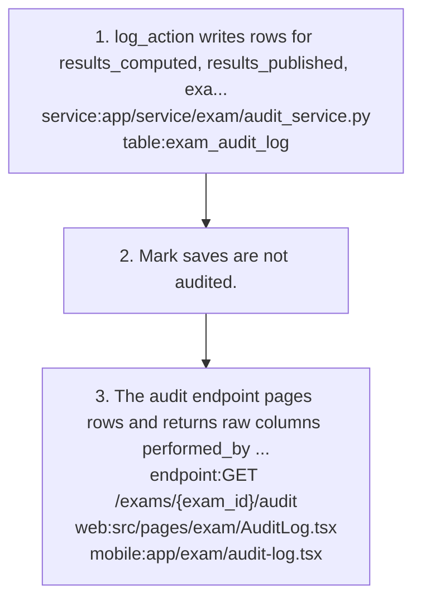

### exam/compute-results

Implements: `feature:exam/result-computation`

- Precondition: Marks have been entered.

1. Admin triggers compute with optional force `endpoint:POST /exams/{exam_id}/compute` `web:src/pages/exam/ResultsPublish.tsx` `mobile:app/exam/results.tsx`
2. The student set is everyone with at least one mark row `service:app/service/exam/aggregate_service.py` `table:student_marks`
3. For each student and every subject config of the exam, it sums marks of entered include_in_total components; sub_max sums the max of those same entered components only `table:exam_subject_config` `table:exam_subject_components`
4. Any absent component makes the whole subject ABS (0 marks, fail).
5. Subject grade comes from the subject scheme bands, falling back to exam scheme bands; no bands or sub_max=0 gives ABS `service:app/service/exam/grading_service.py` `table:subject_grade_bands` `table:exam_grade_bands`
6. Overall grade comes from exam bands only; is_passed means every subject passed.
7. Rank is by percentage within the student's current class-section; ties get distinct ranks `table:student_admissions`
8. Results are written to subject and exam result tables and a results_computed audit row is logged `table:student_subject_results` `table:student_exam_results` `service:app/service/exam/audit_service.py`
9. Existing results return 409 unless force=true, which deletes and recomputes `endpoint:POST /exams/{exam_id}/compute`
10. Admin views results filtered by class, section or student (class filter uses current admission), with subject_results[], student_name and subject_name joined in `endpoint:GET /exams/{exam_id}/results` `endpoint:GET /exams/{exam_id}/results/{student_id}` `service:app/service/exam/result_service.py`

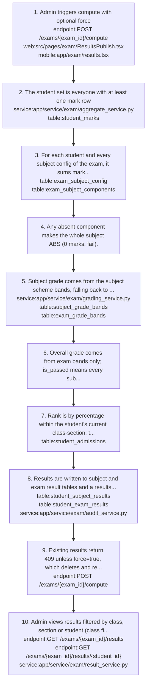

### exam/create-exam

Implements: `feature:exam/exam-creation`

- Precondition: At least one exam grade scheme exists.

1. Admin fills the create wizard; web keeps wizard state in sessionStorage and filters configs to the selected class|section keys, dropping blank configs `web:src/pages/exam/CreateExam.tsx` `web:src/lib/examStore.ts` `mobile:app/exam/create.tsx`
2. Client posts ExamCreateFull = {exam, class_sections[], subject_configs[], exam_dates[]} `endpoint:POST /exams`
3. exam_service.create_full_exam inserts the exam with status active (not draft) `service:app/service/exam/exam_service.py` `table:exams`
4. It inserts the class-sections, then each subject config with its components (at least one each), then the dates; the caller commits `table:exam_class_sections` `table:exam_subject_config` `table:exam_subject_components` `table:exam_dates`
5. Each config's subject must be in ClassSubjectMap for that (class, section) or class-wide with section NULL, with exclude_marks=false; otherwise the whole request gets 422 `table:class_subject_mappings`
6. A Pydantic validator requires each config's class_id to appear in class_sections.
7. Component rules: marks needs max_marks and remarks needs remark_grade_set_id `table:exam_subject_components`
8. A duplicate exam name in the same academic year returns 409 `endpoint:POST /exams`

- Result: An active exam with class-sections, subject configs, components and dates, created atomically.

- Failure: 422 for unmapped or exclude_marks subjects or invalid components; 409 for a duplicate name in the academic year.

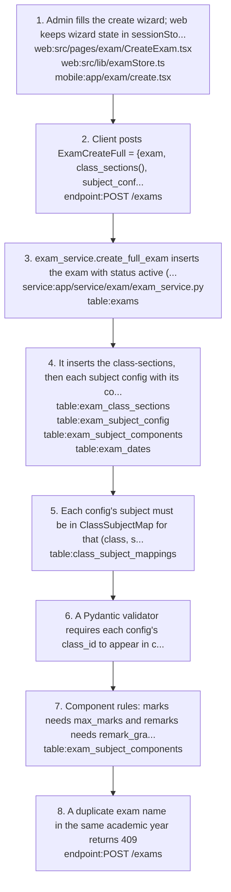

Shaped by: [exam/create-full-single-transaction](#examcreate-full-single-transaction), [exam/subjects-from-class-subject-map](#examsubjects-from-class-subject-map), [exam/wizard-state-session-storage](#examwizard-state-session-storage)

### exam/exam-lifecycle

Implements: `feature:exam/exam-creation`, `feature:exam/result-publishing`

- Trigger: A school schedules a new exam for one or more class-sections.

1. Admin completes one-time setup: grade schemes, remark sets, board patterns and exam settings `flow:exam/setup`
2. Admin creates the exam with class-sections, subject configs and dates in one call; it starts active `flow:exam/create-exam`
3. Admin adjusts exam dates, editable header fields and class-sections `flow:exam/post-creation-changes`
4. Admin optionally restricts mark entry to named users `flow:exam/grant-mark-permissions`
5. Teachers enter marks in the grid or through Excel `flow:exam/mark-entry` `flow:exam/excel-mark-import`
6. Admin computes results `flow:exam/compute-results`
7. Lock: the lifecycle defines locked, but no endpoint sets it; publish is allowed straight from active `flow:exam/status-lifecycle`
8. Admin publishes; students and parents can then see computed results `flow:exam/publish-and-view-results`
9. Admin computes hall-ticket eligibility, overrides, publishes and downloads hall tickets `flow:exam/hall-tickets`
10. Key actions along the way are recorded in the exam audit log `flow:exam/audit-trail`

- Result: Published results visible to students and parents and hall tickets available for eligible students.

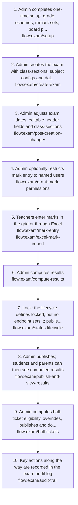

### exam/exam-messaging

Implements: `feature:exam/exam-notifications`

1. Web mark grid has a Send Marks QuickSend (template Mark Entry, target class_section_parents) `web:src/pages/exam/MarkEntryGrid.tsx` `web:src/components/communication/QuickSendButton.tsx`
2. Mobile exam detail has an Exam Schedule QuickSend; both QuickSends go through the communication module `mobile:components/communication/QuickSendButton.tsx`
3. The notify endpoint (web ExamNotification, mobile notify screen) only counts recipients and sends nothing `endpoint:POST /exams/{exam_id}/notify` `service:app/service/exam/notification_service.py` `web:src/pages/exam/ExamNotification.tsx` `mobile:app/exam/notify.tsx`

- Note: The manual send-results-notification, send-hall-ticket-notification and dates/send-schedule endpoints queue NotificationQueue rows and enqueue send_notification_batch, but need exams:send_sms, which no seeded role holds, so they return 403 by default.

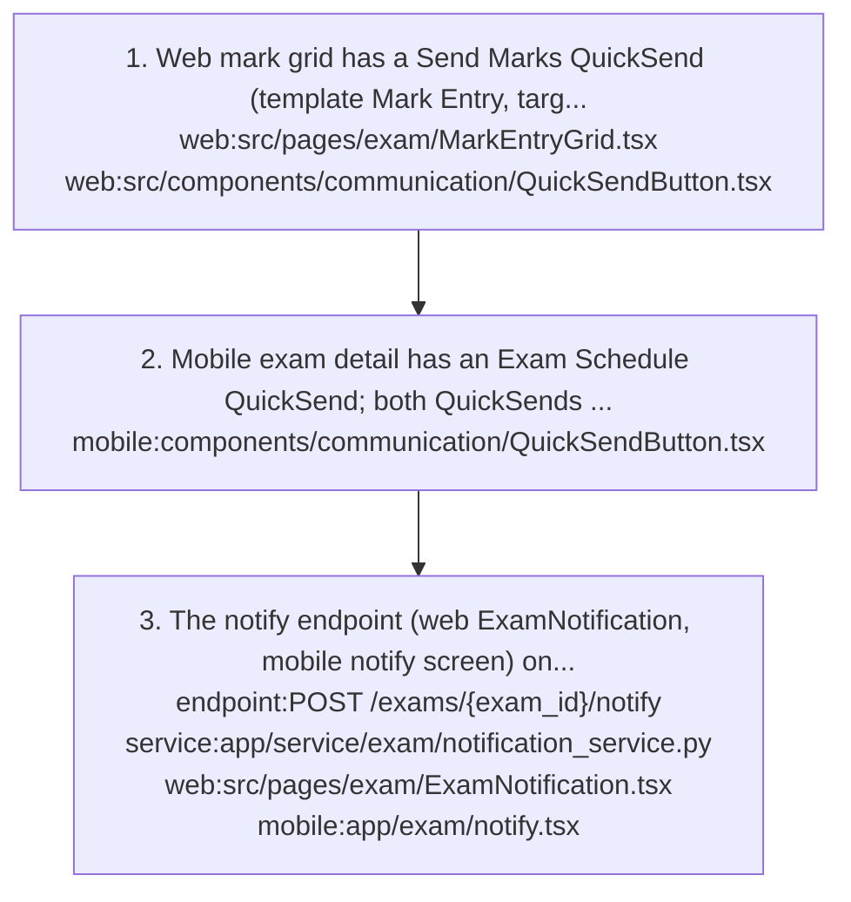

### exam/excel-mark-import

Implements: `feature:exam/excel-mark-upload`

1. Backend template download returns xlsx columns student_id | Roll No | Student Name | <Component> (Max: <max>) ... | Remarks, prefilled with saved marks or ABS `endpoint:GET /exams/{exam_id}/marks/template` `service:app/service/exam/excel_service.py`
2. Backend upload takes class_id, section_id, subject_config_id and a multipart file, runs synchronously and returns {status, written, errors, total_rows} `endpoint:POST /exams/{exam_id}/marks/upload` `table:student_marks`
3. Mobile uses the backend template and upload `mobile:app/exam/marks.tsx`
4. Web does Excel client-side with the xlsx library; export mirrors the combined grid (Adm#, Student Name, <Subject> <Component>[max], totals) `web:src/pages/exam/MarkEntryGrid.tsx`
5. Web import matches columns by header text (ignoring [max]) and rows by Adm#, and loads values as unsaved edits for the user to save.

- Failure: Backend upload matches headers exactly, skips empty and non-numeric cells including ABS, and does not call authorize_mark_entry.

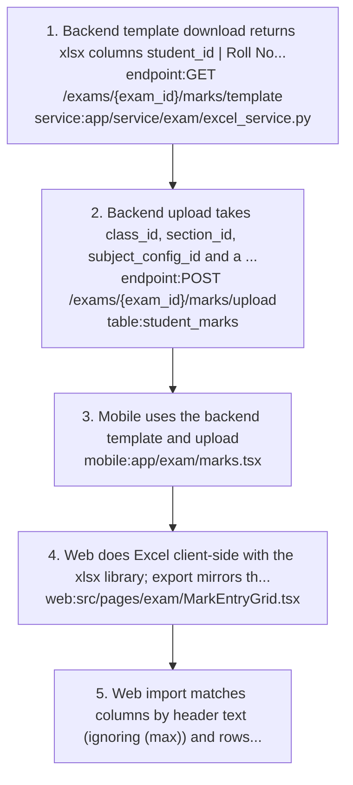

Shaped by: [exam/web-excel-client-side](#examweb-excel-client-side)

### exam/grant-mark-permissions

Implements: `feature:exam/mark-entry-permissions`

1. Admin opens the mark permissions screen for an exam `web:src/pages/exam/MarkPermissions.tsx` `mobile:app/exam/permissions.tsx`
2. Client posts {exam_id, user_id, scope_note}; exam_id is required in the body even though the path has it `endpoint:POST /exams/{exam_id}/mark-permissions`
3. grant_permission returns 409 if an active row exists for (exam, user), reactivates an inactive row, or inserts a new active row `service:app/service/exam/mark_permission_service.py` `table:exam_mark_entry_permissions`
4. Admin can list, deactivate via PUT, or revoke permissions `endpoint:GET /exams/{exam_id}/mark-permissions` `endpoint:PUT /exams/{exam_id}/mark-permissions/{permission_id}` `endpoint:DELETE /exams/{exam_id}/mark-permissions/{permission_id}`

- Result: Once any active row exists for an exam, only those users pass authorize_mark_entry.

- Note: Grants also lock out Admin, and the Excel template download and upload do not call authorize_mark_entry.

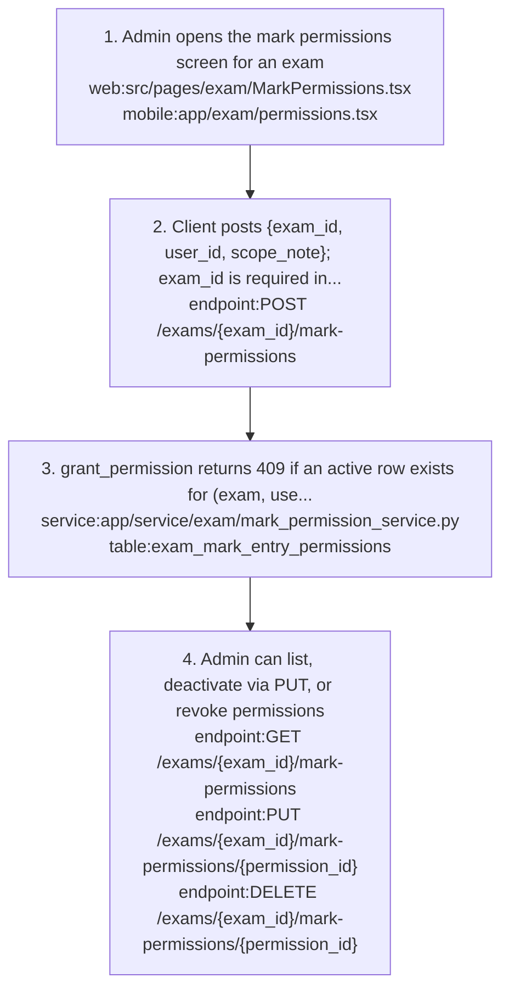

Shaped by: [exam/mark-permissions-exam-level-delegation](#exammark-permissions-exam-level-delegation)

### exam/hall-tickets

Implements: `feature:exam/hall-tickets`

1. Admin lists enrolled students for the exam `endpoint:GET /exams/{exam_id}/hall-tickets/enrolled-students` `web:src/pages/exam/HallTicketEligibility.tsx` (mobile hall-tickets/[examId] screen)
2. Compute upserts one eligibility row per enrolled student via hall_ticket_service.compute_eligibility `endpoint:POST /exams/{exam_id}/hall-tickets/compute` `service:app/service/exam/hall_ticket_service.py` `table:hall_ticket_eligibility`
3. Attendance passes if the exam has no attendance date range; otherwise % of status=present rows in range must be >= exam_settings.hall_ticket_min_attendance (default 75) `table:student_attendance` `table:exam_settings`
4. Fee check is skipped unless exam_settings.hall_ticket_min_fee_paid_pct is set; then completed fee_transactions / fee_student_mappings.total_fee for the exam's year must be >= that % `table:fee_transactions` `table:fee_student_mappings`
5. Existing attendance_override and fee_override flags are kept and respected.
6. Reason is LOW_ATTENDANCE, FEE_PENDING or BOTH; eligible rows get HT-2025-NNNN.
7. Admin reviews eligible and ineligible lists and overrides a student `endpoint:GET /exams/{exam_id}/hall-tickets/eligible` `endpoint:GET /exams/{exam_id}/hall-tickets/ineligible` `endpoint:PUT /exams/{exam_id}/hall-tickets/{student_id}/override` `web:src/components/exam/EligibilityPanel.tsx`
8. Publish sets hall_ticket_published and its timestamp only `endpoint:POST /exams/{exam_id}/hall-tickets/publish` `table:exams`
9. Download returns a PDF (404 if not computed, 403 if ineligible); download-all returns a ZIP of eligible students `endpoint:GET /exams/{exam_id}/hall-tickets/download` `endpoint:GET /exams/{exam_id}/hall-tickets/download-all` `job:app/tasks/exam/hall_ticket_pdf.py` `web:src/pages/exam/HallTicketDownload.tsx`

- Note: Compute, override and publish write hall_tickets_computed, eligibility_overridden and hall_tickets_published audit rows.
- Note: A Student or Parent downloading a single ticket passes ensure_student_access (app/tools/ownership.py); another student id gets 403.

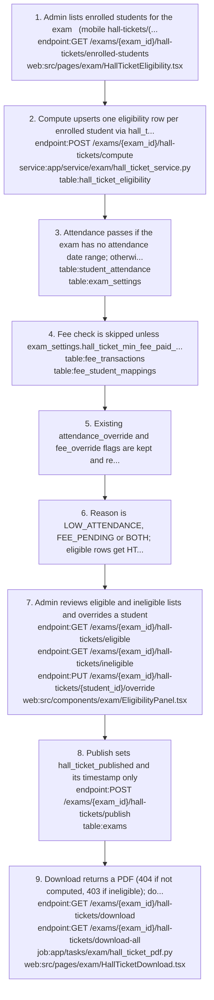

### exam/mark-entry

Implements: `feature:exam/mark-entry-grid`

- Precondition: The exam has class-sections and subject configs with components.

1. Client requests the grid with class_id, section_id, subject_config_id, page and page_size `endpoint:GET /exams/{exam_id}/marks` `web:src/pages/exam/MarkEntryGrid.tsx` `mobile:app/exam/marks.tsx`
2. The backend returns the whole roster: current student_admissions in that class/section, deduped per student, ordered by admission number `service:app/service/exam/mark_entry_service.py` `table:student_admissions`
3. Each row is {student_id, student_name, admission_number, marks: {<component_id>: {mark_id, marks_obtained, is_absent, remark_grade, updated_at}}} with every component key present `table:student_marks`
4. Client posts {exam_id, subject_config_id, attempt_number: 1, marks: [{student_id, component_id, marks_obtained|null, is_absent, remark_grade|null}]} `endpoint:POST /exams/{exam_id}/marks`
5. The service upserts on (exam, student, component, attempt) and returns all marks rows for that subject config `service:app/service/exam/mark_entry_service.py` `table:student_marks`
6. Any value above the component's max_marks returns 422.
7. Authorization is exam_marks:* plus authorize_mark_entry: if the exam has any active permission row only those users may enter marks, otherwise every exam_marks:create holder may `table:exam_mark_entry_permissions`

- Failure: Section-less class-sections must send the nil UUID as section_id; web disables the grid queries and mobile omits section_id (422).

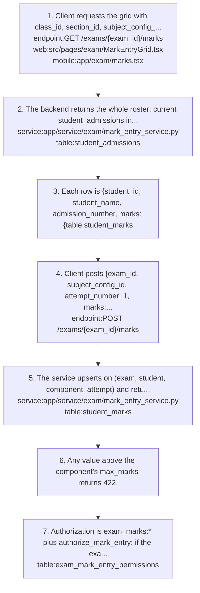

Shaped by: [exam/mark-permissions-exam-level-delegation](#exammark-permissions-exam-level-delegation), [exam/nil-uuid-for-no-section](#examnil-uuid-for-no-section)

### exam/post-creation-changes

Implements: `feature:exam/config-templates`, `feature:exam/exam-dates`, `feature:exam/exam-management`

1. PUT /exams/{id} edits only exam_name, mark_entry_deadline, hall_ticket_min_attendance, attendance_from/to_date, publish_rank and term; extra keys are silently dropped `endpoint:PUT /exams/{exam_id}` `service:app/service/exam/exam_service.py`
2. Board, level, type, nature, academic year and grade scheme are fixed after creation.
3. Subject-config PUT updates scalar fields only; components cannot be edited after creation `endpoint:PUT /exams/{exam_id}/subject-configs/{config_id}` `service:app/service/exam/exam_subject_config_service.py`
4. Dates are managed one at a time through create, list, update and delete `endpoint:POST /exams/{exam_id}/dates` `endpoint:GET /exams/{exam_id}/dates` `endpoint:PUT /exams/{exam_id}/dates/{date_id}` `endpoint:DELETE /exams/{exam_id}/dates/{date_id}` `service:app/service/exam/exam_date_service.py` `web:src/pages/exam/ExamDates.tsx`
5. Dates can also be created in bulk or for several sections at once `endpoint:POST /exams/{exam_id}/dates/bulk` `endpoint:POST /exams/{exam_id}/dates/multi-section`
6. Adding a class-section (draft or active exams only) returns auto_detect suggestions of other class-sections whose configs could be copied `endpoint:POST /exams/{exam_id}/class-sections` `service:app/service/exam/exam_pattern_service.py`
7. Copy or apply-template then fills an empty target class-section `endpoint:POST /exam-patterns/{exam_id}/copy` `endpoint:POST /exam-patterns/{exam_id}/apply-template`
8. Subjects not mapped to the target class-section raise 422 unless skip_missing_subjects=true.

- Failure: Date creates without exam_id in the body get 422; mobile omits it.
- Failure: A subject-config PUT that changes a column returns 500 (MissingGreenlet) after the change is committed.

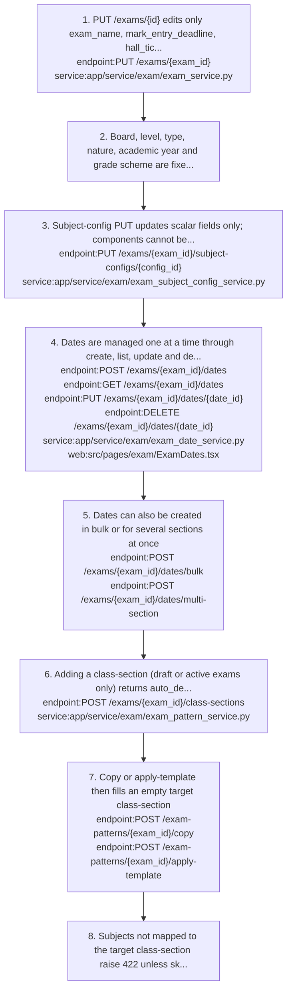

Shaped by: [exam/exam-header-fixed-after-creation](#examexam-header-fixed-after-creation)

### exam/publish-and-view-results

Implements: `feature:exam/result-publishing`, `feature:exam/student-parent-results`

1. Admin publishes the exam, which sets status published and logs results_published `endpoint:POST /exams/{exam_id}/publish` `service:app/service/exam/result_service.py` `table:exams`
2. Students and parents request computed results; my-result and child-result return 403 until the exam is published or finalized `endpoint:GET /exams/{exam_id}/my-result` `endpoint:GET /exams/{exam_id}/child-result/{student_id}` `web:src/pages/exam/StudentResults.tsx` (mobile results/[examId] screen)
3. my-marks and child-marks return raw marks at any time `endpoint:GET /exams/{exam_id}/my-marks` `endpoint:GET /exams/{exam_id}/child-marks/{student_id}` `web:src/pages/exam/MyMarksPage.tsx` (mobile my-marks/[examId] screen)
4. Parent routes verify the student_parent_links row and return 403 otherwise `table:student_parent_links`

- Failure: Students get 403 on my-result and my-results because the tenant plans omit the exam_results resource, so plan-limited role seeding never grants exam_results:read_own/list_own.

- Note: GET /exams/{exam_id}/results/{student_id} lets a Student or Parent read their own or linked child's result through ensure_student_access, without a publish check `endpoint:GET /exams/{exam_id}/results/{student_id}`

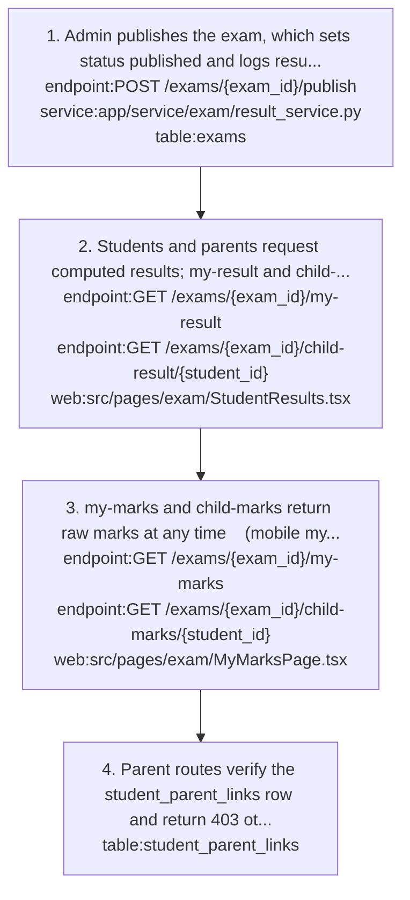

Shaped by: [exam/raw-marks-visible-before-publish](#examraw-marks-visible-before-publish)

### exam/setup

Implements: `feature:exam/board-patterns`, `feature:exam/exam-settings`, `feature:exam/grading-dashboard`, `feature:exam/grading-schemes`, `feature:exam/remark-grade-sets`

- Trigger: One-time tenant setup before the first exam.

1. Admin creates exam grade schemes and subject grade schemes with percentage bands `endpoint:POST /grade-schemes/exam` `endpoint:POST /grade-schemes/subject` `service:app/service/exam/grading_service.py` `web:src/pages/exam/ExamGradeSchemes.tsx` `web:src/pages/exam/SubjectGradeSchemes.tsx`
2. Admin creates remark grade sets, board patterns and saves the singleton exam settings `endpoint:POST /remark-grades` `endpoint:POST /board-patterns` `endpoint:PUT /exam-settings`
3. Web disables Create Exam until at least one exam grade scheme exists `web:src/pages/exam/ExamList.tsx` `endpoint:GET /grade-schemes/exam`
4. PUT on a grade scheme always replaces its bands (delete all, re-insert); bands defaults to [], so omitting it wipes them `endpoint:PUT /grade-schemes/exam/{scheme_id}` `endpoint:PUT /grade-schemes/subject/{scheme_id}` `table:exam_grade_bands` `table:subject_grade_bands`
5. PUT on a remark set or board pattern replaces options[] or exam_types[] only when the list is sent; always send the full list `endpoint:PUT /remark-grades/{set_id}` `endpoint:PUT /board-patterns/{pattern_id}`

- Result: Grade schemes, remark sets, board patterns and exam settings exist for exam creation.

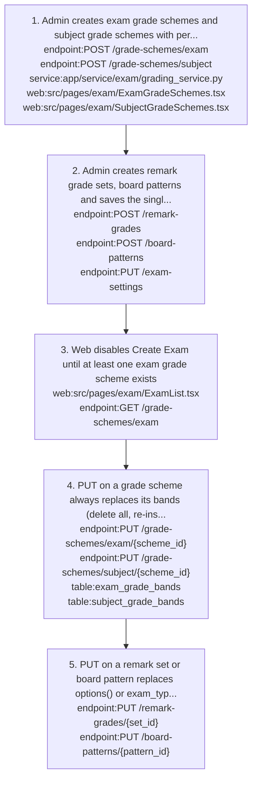

### exam/status-lifecycle

Implements: `feature:exam/exam-management`, `feature:exam/result-publishing`

1. Statuses are draft, active, locked, published and finalized (schemas/exam/enums.py); create-full sets active `endpoint:POST /exams` `table:exams`
2. Deactivate moves active -> draft; activate moves draft -> active `endpoint:POST /exams/{exam_id}/deactivate` `endpoint:POST /exams/{exam_id}/activate` `service:app/service/exam/exam_service.py`
3. Publish moves active, locked or finalized -> published `endpoint:POST /exams/{exam_id}/publish` `service:app/service/exam/result_service.py`
4. Unlock with a reason moves locked, published or finalized -> active and writes an exam_unlocked audit row `endpoint:POST /exams/{exam_id}/unlock` `table:exam_audit_log`; only the mobile exam detail screen offers unlock
5. DELETE is allowed only on draft exams `endpoint:DELETE /exams/{exam_id}`
6. Clone creates a new draft header named Copy of <name> `endpoint:POST /exams/{exam_id}/clone`
7. No endpoint ever sets locked or finalized.

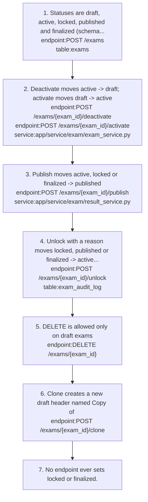

## Decisions

### exam/admin-screens-role-name-gating (unintended)

- **Decision**: Exam admin screens (create, edit, delete, dates, permissions, audit) are gated by role name (admin, superadmin, principal, case-insensitive) in both clients rather than by resource permissions.
- **Why**: Not a deliberate choice. The exam admin screens should be gated by exam permissions, not a hard-coded role-name allowlist.
- **Tradeoff**: The UI gate is independent of the permission system; the backend still enforces exams:* permissions.
- Note: The allowlist is kept in one helper per app (web roleUtils.ts, mobile roles.ts) so the two stay in sync.
- Note: Mark entry and result viewing stay permission-based so teachers keep them.
- Shapes: `feature:exam/audit-log`, `feature:exam/exam-creation`, `feature:exam/exam-management`, `feature:exam/mark-entry-permissions`, `mobile:src/lib/roles.ts`, `web:src/lib/roleUtils.ts`

### exam/audit-log-immutable-no-fk

- **Decision**: The exam audit log is append-only and exam_audit_log.exam_id has no FK to exams; never UPDATE or DELETE its rows.
- **Why**: So audit history survives exam deletion.
- Shapes: `feature:exam/audit-log`, `service:app/service/exam/audit_service.py`, `table:exam_audit_log`

### exam/board-level-type-plain-strings

- **Decision**: exams.board, level and exam_type are plain strings with no foreign key to board patterns.
- **Why**: Flexibility: an exam can exist without a configured board pattern, and later pattern edits do not cascade into existing exams.
- **Tradeoff**: Board pattern delete checks in-use by matching board+level strings on exams (409).
- Shapes: `feature:exam/board-patterns`, `table:board_exam_patterns`, `table:exams`

### exam/create-full-single-transaction

- **Decision**: Exam creation is one screen, one call and one transaction (ExamCreateFull); later changes go through the granular endpoints.
- **Why**: A partially configured exam would break mark entry and results, so creation is all-or-nothing.
- Note: The exam is inserted with status active, skipping draft.
- Shapes: `endpoint:POST /exams`, `feature:exam/exam-creation`, `flow:exam/create-exam`, `service:app/service/exam/exam_service.py`

### exam/exam-header-fixed-after-creation (unintended)

- **Decision**: After creation only exam_name, mark_entry_deadline, hall_ticket_min_attendance, attendance dates, publish_rank and term are editable; board, level, type, nature, year, grade scheme and subject-config components are fixed.
- **Why**: Not a deliberate product rule; it is how the edit endpoint was first written.
- Shapes: `endpoint:PUT /exams/{exam_id}`, `endpoint:PUT /exams/{exam_id}/subject-configs/{config_id}`, `feature:exam/exam-management`, `flow:exam/post-creation-changes`

### exam/exam-settings-singleton

- **Decision**: Exam settings are a single row per tenant; GET returns 404 until the first PUT, and PUT overwrites every field (omitted fields reset to defaults).
- **Why**: Exam settings are school-wide policy, so one row per tenant is enough; the full-overwrite PUT kept the endpoint simple.
- Shapes: `endpoint:GET /exam-settings`, `endpoint:PUT /exam-settings`, `service:app/service/exam/exam_settings_service.py`, `table:exam_settings`

### exam/manual-result-and-hall-ticket-sms

- **Decision**: Results SMS and hall-ticket SMS are manual, sent through the dedicated send-* endpoints, not automatically on publish.
- **Why**: Not recorded.
- Shapes: `endpoint:POST /exams/{exam_id}/send-hall-ticket-notification`, `endpoint:POST /exams/{exam_id}/send-results-notification`, `feature:exam/exam-notifications`, `service:app/service/exam/result_service.py`

### exam/mark-permissions-exam-level-delegation

- **Decision**: Mark permissions are exam-level delegation, not role grants; exam_mark_entry_permissions is the only scoping and an exam with no rows is open to every exam_marks:create holder.
- **Why**: No teacher to class/subject assignment table exists (blocked on the Staff module, OQ-01).
- **Alternatives**: Teacher-class-section-subject assignment checks (_is_teacher_assigned stub) once the Staff module provides the table.
- Shapes: `feature:exam/mark-entry-permissions`, `flow:exam/grant-mark-permissions`, `flow:exam/mark-entry`, `service:app/service/exam/mark_entry_service.py`, `table:exam_mark_entry_permissions`

### exam/names-resolved-from-masters (unintended)

- **Decision**: Exam class-sections and subject-configs responses carry no names; clients resolve class, section and subject names from masters dropdowns.
- **Why**: Not a deliberate choice; the responses were simply built without joined names.
- Shapes: `endpoint:GET /exams/{exam_id}/class-sections`, `endpoint:GET /exams/{exam_id}/subject-configs`, `web:src/pages/exam/ExamDetail.tsx`, `web:src/pages/exam/MarkEntryGrid.tsx`

### exam/nil-uuid-for-no-section (unintended)

- **Decision**: Mark grid, template and upload endpoints declare section_id as a required UUID; the nil UUID means no section and the backend maps it to NULL.
- **Why**: Not a deliberate choice; a workaround for classes without sections.
- Shapes: `endpoint:GET /exams/{exam_id}/marks`, `endpoint:GET /exams/{exam_id}/marks/template`, `endpoint:POST /exams/{exam_id}/marks/upload`, `flow:exam/mark-entry`

### exam/percentage-based-grading

- **Decision**: Grading is percentage-based, with bands defined by from_percent and to_percent; absent gives ABS (GPA 0, fail), kept distinct from F.
- **Why**: One scheme works for any max_marks.
- **Tradeoff**: Lookup is inclusive with no gap handling, so bands must be contiguous (for example to_percent 89.99).
- Note: Why ABS is kept distinct from F is not recorded.
- Shapes: `feature:exam/grading-schemes`, `service:app/service/exam/aggregate_service.py`, `service:app/service/exam/grading_service.py`, `table:exam_grade_bands`, `table:subject_grade_bands`

### exam/raw-marks-visible-before-publish (unintended)

- **Decision**: Raw marks are visible to students and parents before publish (my-marks, child-marks); computed results, grades and ranks are gated on published or finalized.
- **Why**: Not a deliberate choice. Raw marks should also stay hidden from students and parents until the exam is published.
- Shapes: `endpoint:GET /exams/{exam_id}/child-marks/{student_id}`, `endpoint:GET /exams/{exam_id}/child-result/{student_id}`, `endpoint:GET /exams/{exam_id}/my-marks`, `endpoint:GET /exams/{exam_id}/my-result`, `feature:exam/student-parent-results`, `flow:exam/publish-and-view-results`

### exam/results-no-cascade-on-exam-delete

- **Decision**: student_marks, student_subject_results and student_exam_results reference exams without ON DELETE CASCADE, while config, date, permission and eligibility tables cascade; delete_exam removes marks and results explicitly and refuses published exams with 409.
- **Why**: Marks and results must never disappear by accident through a DB cascade; deleting them is an explicit, audited step in the service.
- **Tradeoff**: Deleting any non-published exam destroys its entered marks and results; the exam_deleted audit row records the deleted counts.
- Shapes: `endpoint:DELETE /exams/{exam_id}`, `table:student_exam_results`, `table:student_marks`, `table:student_subject_results`

### exam/service-commit-ownership (unintended)

- **Decision**: grading_service, remark_grade_service and board_pattern_service commit internally, so their endpoints must not commit or refresh again; the other exam services only flush and the endpoint commits.
- **Why**: Not a deliberate choice: these services were written earlier in a different style and never aligned with the flush-in-service, commit-in-endpoint rule.
- Shapes: `service:app/service/exam/board_pattern_service.py`, `service:app/service/exam/exam_service.py`, `service:app/service/exam/grading_service.py`, `service:app/service/exam/remark_grade_service.py`

### exam/student-parent-role-name-and-ownership-gating (active)

- **Decision**: Student and Parent are blocked by exact role name from the bulk results, eligibility lists, download-all and audit endpoints, and single-student results and hall-ticket download call ensure_student_access (own record or linked child).
- **Why**: Students and parents hold exams:read, which alone guarded those endpoints and exposed every student's results and hall tickets.
- **Alternatives**: Enforce the seeded exam_results and exam_hall_tickets *_own/_related permissions per endpoint.
- **Tradeoff**: Custom roles holding exams:read are not blocked, and the single-student result endpoint has no publish check.
- **Since**: 2026-10
- Shapes: `endpoint:GET /exams/{exam_id}/audit`, `endpoint:GET /exams/{exam_id}/hall-tickets/download`, `endpoint:GET /exams/{exam_id}/hall-tickets/download-all`, `endpoint:GET /exams/{exam_id}/hall-tickets/eligible`, `endpoint:GET /exams/{exam_id}/results`, `endpoint:GET /exams/{exam_id}/results/{student_id}`, `feature:exam/student-parent-results`

### exam/subjects-from-class-subject-map

- **Decision**: An exam's subjects come from ClassSubjectMap for the class-section; subjects with exclude_marks=true are ineligible.
- **Why**: Keeps the exam's subject list in sync with the masters mapping, so there is no second subject list to maintain.
- Shapes: `flow:exam/create-exam`, `service:app/service/exam/exam_service.py`, `table:class_subject_mappings`, `table:exam_subject_config`

### exam/web-excel-client-side

- **Decision**: Web handles Excel export and import client-side with the xlsx library and loads imported values as unsaved edits; mobile uses the backend template and upload endpoints.
- **Why**: Not recorded.
- Shapes: `feature:exam/excel-mark-upload`, `flow:exam/excel-mark-import`, `web:src/pages/exam/MarkEntryGrid.tsx`

### exam/wizard-state-session-storage

- **Decision**: The web exam-create wizard state persists in sessionStorage (exam-store), and CreateExam.tsx filters configs to the currently selected class|section keys before submit.
- **Why**: A multi-step wizard should not lose the teacher's input on a page refresh, but it should not persist across browser sessions either.
- **Tradeoff**: Configs for deselected class-sections linger in the store and would cause a 422 if not filtered.
- Shapes: `flow:exam/create-exam`, `web:src/lib/examStore.ts`, `web:src/pages/exam/CreateExam.tsx`

## Concepts

### exam/absent-grade

ABS is the grade for a subject with any absent component, no bands, or sub_max 0; it means 0 marks, GPA 0 and fail, distinct from F.
- Related: `service:app/service/exam/aggregate_service.py`, `table:student_subject_results`

### exam/audit-action

Exam audit actions are results_computed, results_published, exam_unlocked, hall_tickets_computed, eligibility_overridden, hall_tickets_published, notification_queued and exam_deleted.
- Related: `service:app/service/exam/audit_service.py`, `table:exam_audit_log`

### exam/board-pattern

A board pattern maps a board + level (unique pair) to the list of exam types used under it.
- Note: Boards come from ExamBoard (CBSE, ICSE, State, BTech, Custom) and levels from ExamLevel (pre_primary to others).
- Related: `feature:exam/board-patterns`, `table:board_exam_patterns`, `table:board_pattern_exam_types`

### exam/class-section-rank

Rank is by percentage within the student's current class-section; ties get distinct ranks.
- Note: publish_rank is stored but ranks are always returned.
- Related: `service:app/service/exam/aggregate_service.py`, `table:student_exam_results`

### exam/component

A component (for example Written, Oral, Practical) is a part of a subject config; it is either marks-type with max_marks or remarks-type with a remark_grade_set_id, and include_in_total controls aggregation.
- Related: `table:exam_subject_components`, `table:remark_grade_sets`

### exam/config-template

A config template is a reusable named set of subject configs with components (components_json) that can be applied to an empty class-section of an exam.
- Related: `feature:exam/config-templates`, `table:exam_config_template_items`, `table:exam_config_templates`

### exam/exam

An exam is a name + board + level + exam_type + nature + academic year, attached to one or more class-sections, each with its own subject configs and dates.
- Related: `concept:exam/exam-status-lifecycle`, `concept:exam/subject-config`, `feature:exam/exam-creation`, `table:exam_class_sections`, `table:exams`

### exam/exam-nature

Exam nature is one of formative, summative, cumulative or custom (ExamNature in schemas/exam/enums.py), stored on the exam header and not editable after creation.
- Note: No aggregation logic reads nature; formative/summative weighted aggregation is not built.
- Related: `table:exams`

### exam/exam-settings

Exam settings is a tenant-wide singleton row holding exam defaults such as hall_ticket_min_attendance (default 75) and the optional hall_ticket_min_fee_paid_pct.
- Related: `feature:exam/exam-settings`, `table:exam_settings`

### exam/exam-status-lifecycle

Exam status is one of draft, active, locked, published, finalized; create-full starts active, publish sets published, unlock returns to active, and locked and finalized are never set by any endpoint.
- Related: `flow:exam/status-lifecycle`, `table:exams`

### exam/exam-stream

Exam streams exist only as a table; there are no endpoints and exam_class_sections.stream_id is unused.
- Related: `table:exam_class_sections`, `table:exam_streams`

### exam/grade-band

A grade band is a percentage range (from_percent to to_percent, inclusive) with a grade label, GPA and pass flag; lookup takes the first band by from_percent desc that contains the percentage.
- Note: A percentage in a gap between bands falls to the lowest band.
- Related: `service:app/service/exam/grading_service.py`, `table:exam_grade_bands`, `table:subject_grade_bands`

### exam/grade-scheme

An exam grade scheme grades the grand total and is chosen on the exam at creation; a subject grade scheme grades one subject config and falls back to the exam scheme bands when absent.
- Related: `concept:exam/grade-band`, `feature:exam/grading-schemes`, `table:exam_grade_schemes`, `table:subject_grade_schemes`

### exam/hall-ticket-eligibility

Hall-ticket eligibility is per exam and student: attendance_ok from present-status attendance %, fee_paid from completed fee transactions %, each overridable by an admin.
- Related: `concept:exam/hall-ticket-number`, `concept:exam/ineligibility-reason`, `feature:exam/hall-tickets`, `table:hall_ticket_eligibility`

### exam/hall-ticket-number

The hall-ticket number is HT-2025- plus the student's position in an unordered enrolled-student query, assigned only to eligible rows.
- Note: The year is hard-coded and numbers change on every recompute, so they are not stable identifiers.
- Related: `service:app/service/exam/hall_ticket_service.py`, `table:hall_ticket_eligibility`

### exam/ineligibility-reason

ineligibility_reason is LOW_ATTENDANCE, FEE_PENDING or BOTH for a student failing the hall-ticket checks.
- Related: `table:hall_ticket_eligibility`

### exam/mark-entry-delegation

Mark-entry delegation: when an exam has any active exam_mark_entry_permissions row only those users may enter marks; with none, every exam_marks:create holder may.
- Related: `service:app/service/exam/mark_entry_service.py`, `table:exam_mark_entry_permissions`

### exam/mark-not-entered

A student_marks row with NULL marks_obtained means not entered yet; is_absent is a separate flag.
- Related: `table:student_marks`

### exam/remark-grade-set

A remark grade set is a named list of letter + label options used to grade remarks-type components.
- Related: `table:remark_grade_options`, `table:remark_grade_sets`

### exam/subject-config

A subject config is one subject of an exam for one (class, section); it holds an optional subject grade scheme and one or more components.
- Related: `concept:exam/component`, `table:exam_subject_components`, `table:exam_subject_config`
