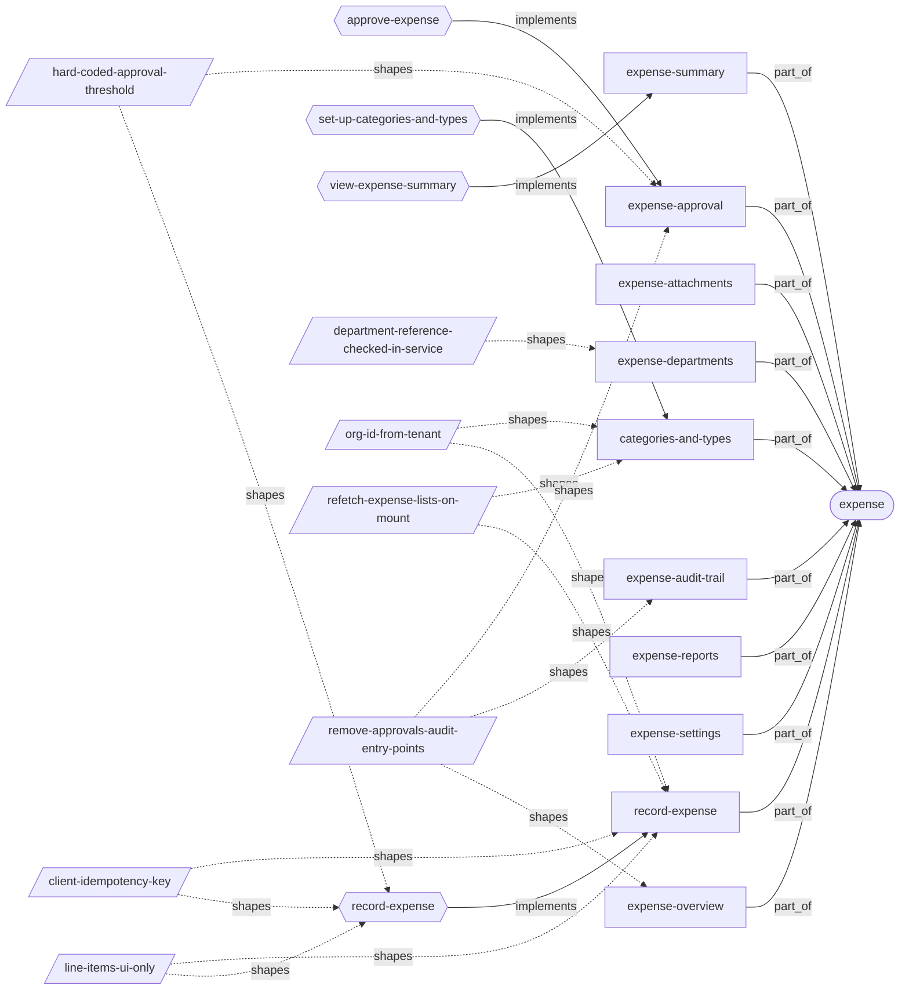
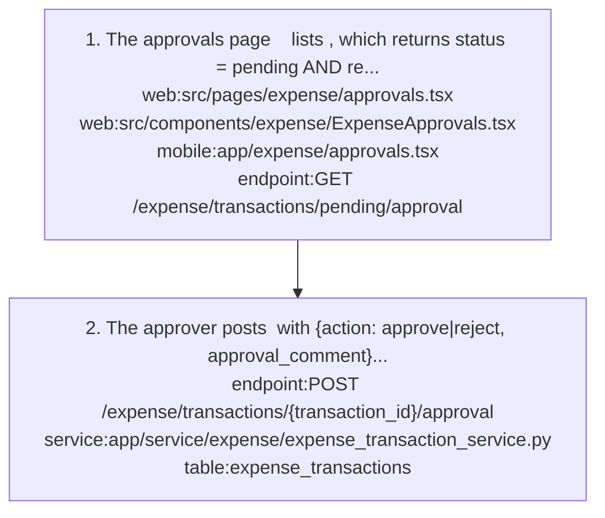
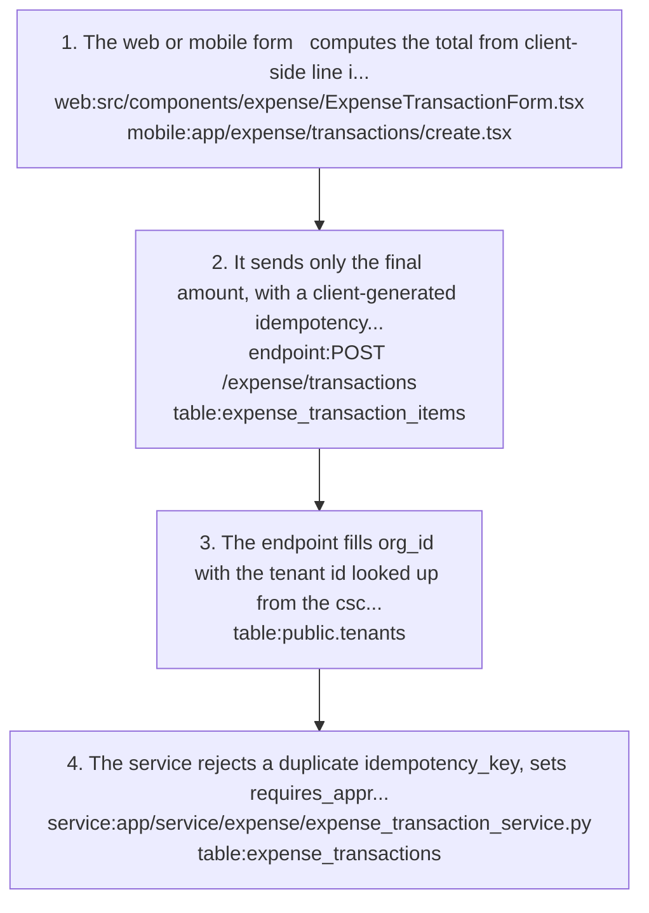
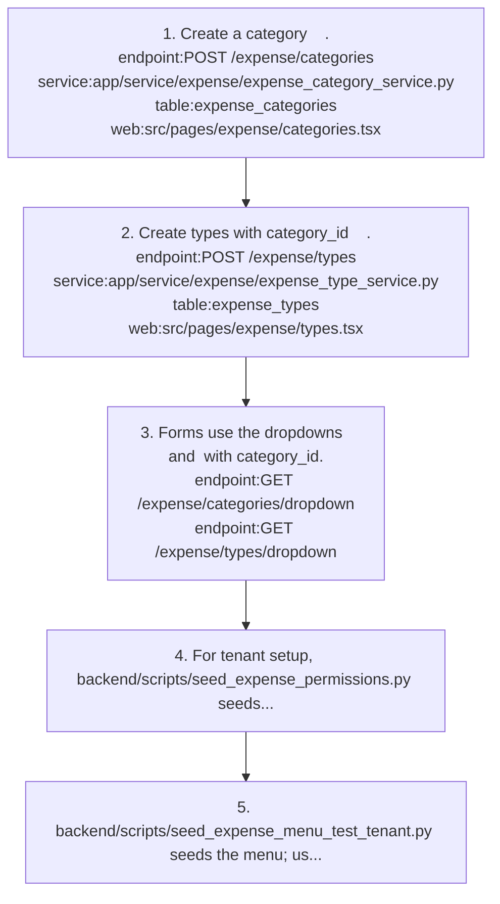
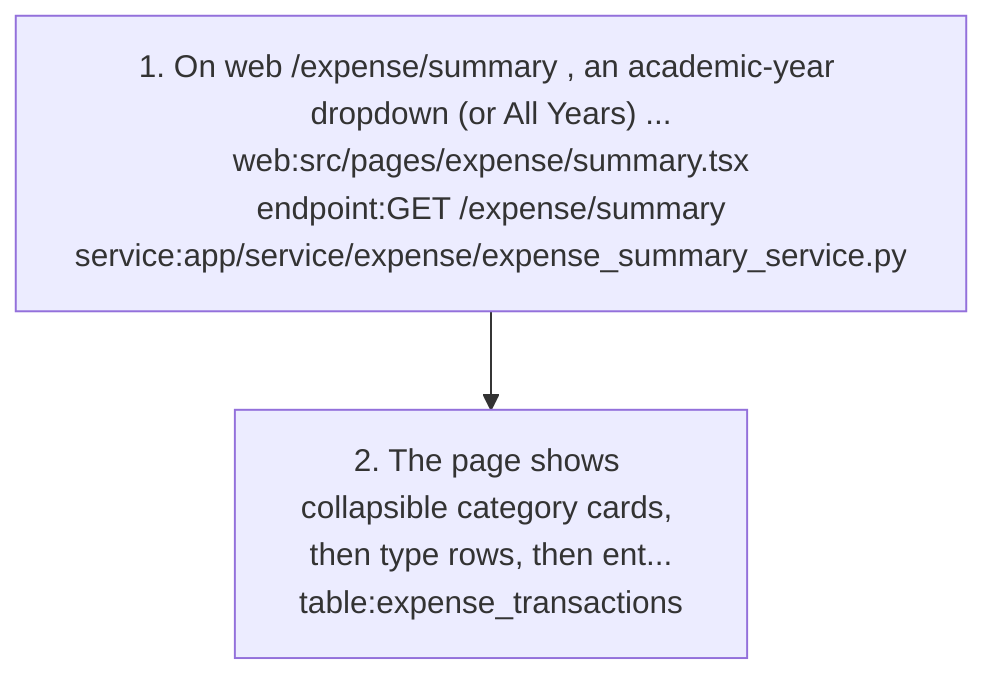

# expense: knowledge graph view

_Generated from `docs/graph/graph.jsonl` by `scripts/graph/kg_render.py`. Do not edit this file; change the graph and re-render._

School spending: expense categories and types, expense transactions with a single approval step, attachments, settings, a hierarchical summary, reports and an audit trail.

Module doc: [docs/modules/expense.md](../../../docs/modules/expense.md)

## Features

### expense/categories-and-types

Maintain expense categories (unique names) and their types (unique within a category); both are soft-deleted.
- Roles: expense_categories and expense_types permissions.
- Parity: Both clients.
- Note: A type cannot be created in or moved to an inactive category, and cannot be deleted if it has transactions; a category can be deleted even with types.
- Flows: [expense/set-up-categories-and-types](#expenseset-up-categories-and-types)
- Implemented by: `endpoint:GET /expense/categories/dropdown`, `endpoint:GET /expense/types/dropdown`, `endpoint:POST /expense/categories`, `endpoint:POST /expense/types`, `mobile:app/expense/categories.tsx`, `mobile:app/expense/types.tsx`, `service:app/service/expense/expense_category_service.py`, `service:app/service/expense/expense_type_service.py`, `table:expense_categories`, `table:expense_types`, `web:src/pages/expense/categories.tsx`, `web:src/pages/expense/types.tsx`
- Shaped by: [expense/org-id-from-tenant](#expenseorg-id-from-tenant), [expense/refetch-expense-lists-on-mount](#expenserefetch-expense-lists-on-mount)

### expense/expense-approval

Single-step approve or reject, with a required 1-500 character comment, for transactions that are pending and require approval; approved transactions cannot be edited.
- Roles: expense_transactions with the approve extra action.
- Parity: Both clients have an approvals screen with stats, search and approve/reject.
- Flows: [expense/approve-expense](#expenseapprove-expense)
- Implemented by: `endpoint:GET /expense/transactions/pending/approval`, `endpoint:POST /expense/transactions/{transaction_id}/approval`, `mobile:app/expense/approvals.tsx`, `service:app/service/expense/expense_transaction_service.py`, `table:expense_transactions`, `web:src/components/expense/ExpenseApprovals.tsx`, `web:src/pages/expense/approvals.tsx`
- Shaped by: [expense/hard-coded-approval-threshold](#expensehard-coded-approval-threshold), [expense/remove-approvals-audit-entry-points](#expenseremove-approvals-audit-entry-points)

### expense/expense-attachments

Upload, list and download files attached to an expense transaction (max 10 MB).
- Roles: expense_attachments permission.
- Parity: Web accepts multiple files; mobile single-file upload.
- Note: Metadata only: file_path is a placeholder, download returns a mock body and delete removes no file.
- Implemented by: `endpoint:GET /expense/attachments/transactions/{transaction_id}/list`, `endpoint:GET /expense/attachments/{attachment_id}/download`, `endpoint:POST /expense/attachments/transactions/{transaction_id}/upload`, `service:app/service/expense/expense_attachment_service.py`, `table:expense_attachments`, `web:src/pages/expense/transactions.tsx`

### expense/expense-audit-trail

Read audit logs overall and per transaction.
- Roles: expense_audit_logs permission.
- Parity: Both clients have an audit screen.
- Note: The trail is empty because every create_audit_log call in the category, type and transaction services is commented out.
- Implemented by: `endpoint:GET /expense/audit/logs`, `endpoint:GET /expense/audit/transactions/{transaction_id}/logs`, `mobile:app/expense/audit.tsx`, `service:app/service/expense/expense_audit_service.py`, `table:expense_audit_logs`, `web:src/pages/expense/audit.tsx`
- Shaped by: [expense/remove-approvals-audit-entry-points](#expenseremove-approvals-audit-entry-points)

### expense/expense-departments

Maintain expense departments (unique active names, case-insensitive) and assign them to transactions; delete deactivates.
- Roles: expense_departments permission (Admin all actions; Staff and Teacher read and list in the default seeds).
- Parity: Both clients: web /expense/departments page and department filter on the audit page; mobile app/expense/departments.tsx.
- Note: The expenditure report shows the department name, falling back to the raw id.
- Implemented by: `endpoint:DELETE /expense/departments/{department_id}`, `endpoint:GET /expense/departments`, `endpoint:GET /expense/departments/dropdown`, `endpoint:POST /expense/departments`, `endpoint:PUT /expense/departments/{department_id}`, `mobile:app/expense/departments.tsx`, `service:app/service/expense/expense_department_service.py`, `table:expense_departments`, `web:src/pages/expense/departments.tsx`
- Shaped by: [expense/department-reference-checked-in-service](#expensedepartment-reference-checked-in-service)

### expense/expense-overview

Web expense landing page with 3 stat cards (Categories, Types, Transactions) and 5 navigation cards (Categories, Types, Transactions, Departments, Summary).
- Parity: Web only; the mobile Expense tab hub lists the same sections.
- Implemented by: `web:src/components/expense/dashboard/ExpenseNavigation.tsx`, `web:src/components/expense/dashboard/ExpenseOverviewCards.tsx`, `web:src/pages/expense/index.tsx`
- Shaped by: [expense/remove-approvals-audit-entry-points](#expenseremove-approvals-audit-entry-points)

### expense/expense-reports

Reports by category, by type, trend and period summary, plus an export.
- Roles: expense_reports with the export extra action.
- Parity: Both clients; mobile posts export to /expense/reports instead of /expense/reports/export.
- Note: Export is mocked: a fixed export_id and a status that always says completed.
- Implemented by: `endpoint:GET /expense/reports/by-category`, `endpoint:GET /expense/reports/by-type`, `endpoint:GET /expense/reports/summary`, `endpoint:GET /expense/reports/trend`, `endpoint:POST /expense/reports/export`, `mobile:app/expense/reports.tsx`, `service:app/service/expense/expense_reporting_service.py`, `web:src/pages/expense/reports.tsx`

### expense/expense-settings

Key/value settings rows with CRUD, value lookup by key, UI common settings and reset.
- Roles: expense_settings permission.
- Parity: Both clients.
- Note: Nothing in the transaction flow reads the settings.
- Implemented by: `endpoint:GET /expense/settings`, `endpoint:GET /expense/settings/key/{setting_key}/value`, `endpoint:GET /expense/settings/ui/common`, `endpoint:POST /expense/settings`, `mobile:app/expense/settings.tsx`, `service:app/service/expense/expense_settings_service.py`, `table:expense_settings`, `web:src/pages/expense/settings.tsx`

### expense/expense-summary

Hierarchical totals Category -> Type -> Entries with a grand total, filtered by academic year, dates and status.
- Roles: expense_transactions:list.
- Parity: Both clients.
- Flows: [expense/view-expense-summary](#expenseview-expense-summary)
- Implemented by: `endpoint:GET /expense/summary`, `mobile:app/expense/summary.tsx`, `service:app/service/expense/expense_summary_service.py`, `web:src/pages/expense/summary.tsx`

### expense/record-expense

Record one expense per transaction (type, amount, date, description, payment method, vendor, reference, optional department and year) with a client-generated idempotency key; every new transaction starts pending.
- Roles: expense_transactions permission.
- Parity: Both clients create, edit and view. Both offer delete via DELETE /expense/transactions/{id}, which is not routed and fails.
- Flows: [expense/record-expense](#expenserecord-expense)
- Implemented by: `endpoint:GET /expense/transactions`, `endpoint:POST /expense/transactions`, `endpoint:PUT /expense/transactions/{transaction_id}`, `mobile:app/expense/transactions.tsx`, `mobile:app/expense/transactions/[id].tsx`, `mobile:app/expense/transactions/create.tsx`, `service:app/service/expense/expense_transaction_service.py`, `table:expense_transactions`, `web:src/components/expense/ExpenseTransactionForm.tsx`, `web:src/pages/expense/transactions.tsx`
- Shaped by: [expense/client-idempotency-key](#expenseclient-idempotency-key), [expense/line-items-ui-only](#expenseline-items-ui-only), [expense/org-id-from-tenant](#expenseorg-id-from-tenant), [expense/refetch-expense-lists-on-mount](#expenserefetch-expense-lists-on-mount)

## Flows

### expense/approve-expense

Implements: `feature:expense/expense-approval`

1. The approvals page `web:src/pages/expense/approvals.tsx` `web:src/components/expense/ExpenseApprovals.tsx` `mobile:app/expense/approvals.tsx` lists `endpoint:GET /expense/transactions/pending/approval`, which returns status = pending AND requires_approval.
2. The approver posts `endpoint:POST /expense/transactions/{transaction_id}/approval` with {action: approve|reject, approval_comment}; the service sets status approved or rejected and stamps approved_by_user_id, approved_by_role, approved_at and approval_comment `service:app/service/expense/expense_transaction_service.py` `table:expense_transactions`.

- Failure: Transactions that do not require approval stay pending forever and cannot be approved; nothing sets paid or cancelled.

### expense/record-expense

Implements: `feature:expense/record-expense`

1. The web or mobile form `web:src/components/expense/ExpenseTransactionForm.tsx` `mobile:app/expense/transactions/create.tsx` computes the total from client-side line items (unit price x quantity, with tax and discount).
2. It sends only the final amount, with a client-generated idempotency_key, to `endpoint:POST /expense/transactions`; line items are not sent and `table:expense_transaction_items` is never written.
3. The endpoint fills org_id with the tenant id looked up from the cschema client name `table:public.tenants`.
4. The service rejects a duplicate idempotency_key, sets requires_approval (override, or amount > 1000.00, or payment_method in check/wire_transfer) and saves the transaction as pending `service:app/service/expense/expense_transaction_service.py` `table:expense_transactions`.

- Note: Clients never send academic_year_id and the backend sets no default, so year-filtered summaries omit UI-created transactions.
- Note: requires_approval is never recalculated on update.

Shaped by: [expense/client-idempotency-key](#expenseclient-idempotency-key), [expense/hard-coded-approval-threshold](#expensehard-coded-approval-threshold), [expense/line-items-ui-only](#expenseline-items-ui-only)

### expense/set-up-categories-and-types

Implements: `feature:expense/categories-and-types`

1. Create a category `endpoint:POST /expense/categories` `service:app/service/expense/expense_category_service.py` `table:expense_categories` `web:src/pages/expense/categories.tsx`.
2. Create types with category_id `endpoint:POST /expense/types` `service:app/service/expense/expense_type_service.py` `table:expense_types` `web:src/pages/expense/types.tsx`.
3. Forms use the dropdowns `endpoint:GET /expense/categories/dropdown` and `endpoint:GET /expense/types/dropdown` with category_id.
4. For tenant setup, backend/scripts/seed_expense_permissions.py seeds both permission layers: Admin full access; Staff create, read, list and update; Teacher read and list.
5. backend/scripts/seed_expense_menu_test_tenant.py seeds the menu; users must log in again afterwards.

- Note: Seeds cover categories, types, transactions and reports only; attachments, audit logs and settings permissions must be seeded separately or those endpoints return 403.

### expense/view-expense-summary

Implements: `feature:expense/expense-summary`

1. On web /expense/summary `web:src/pages/expense/summary.tsx`, an academic-year dropdown (or All Years) feeds `endpoint:GET /expense/summary` with academic_year_id `service:app/service/expense/expense_summary_service.py`.
2. The page shows collapsible category cards, then type rows, then entry tables `table:expense_transactions`.

- Note: The default status filter excludes only cancelled, so pending and rejected expenses are included.

## Decisions

### expense/client-idempotency-key

- **Decision**: The client generates a unique idempotency_key per expense transaction, and the backend rejects duplicates.
- **Why**: Stops a double-submit from creating two transactions.
- Shapes: `feature:expense/record-expense`, `flow:expense/record-expense`, `service:app/service/expense/expense_transaction_service.py`

### expense/department-reference-checked-in-service (active)

- **Decision**: ExpenseTransactionService checks on create and update that a department_id exists and is active, instead of relying on a foreign key.
- **Why**: Tenant schemas are cloned without FK constraints, so the database cannot reject an unknown or inactive department.
- **Alternatives**: Adding an FK in the migration, which cloned schemas would not carry and which would block deactivated departments on old rows.
- **Since**: 2026-09
- Shapes: `feature:expense/expense-departments`, `service:app/service/expense/expense_transaction_service.py`

### expense/hard-coded-approval-threshold (unintended)

- **Decision**: requires_approval is computed once at create in ExpenseTransactionService.create_transaction: override, or amount > 1000.00, or payment method check/wire_transfer.
- **Why**: Not a deliberate choice. Approval rules are meant to come from ExpenseSettings and be re-evaluated when the amount changes.
- **Tradeoff**: ExpenseSettings is ignored; clients send cheque and bank_transfer, so only the amount rule and override trigger; editing the amount later skips approval.
- Shapes: `feature:expense/expense-approval`, `flow:expense/record-expense`, `service:app/service/expense/expense_transaction_service.py`

### expense/line-items-ui-only

- **Decision**: Expense line items are only a calculator in the UI; the backend stores just the total amount.
- **Why**: Keeps the API to a single amount.
- **Tradeoff**: expense_transaction_items exists but is never written.
- Shapes: `feature:expense/record-expense`, `flow:expense/record-expense`, `table:expense_transaction_items`

### expense/org-id-from-tenant

- **Decision**: Every expense table keeps org_id NOT NULL, filled on create with public.tenants.id looked up from the cschema client name; tenant isolation itself comes from the schema.
- **Why**: org_id is a leftover from the earlier single-schema design.
- Shapes: `feature:expense/categories-and-types`, `feature:expense/record-expense`, `table:expense_transactions`, `table:public.tenants`

### expense/refetch-expense-lists-on-mount

- **Decision**: Web expense list hooks set refetchOnMount: true (staleTime 0 on dropdowns), overriding the global refetchOnMount: false.
- **Why**: The Zustand permission store rehydrates asynchronously; the permission-gated query first registers as disabled and otherwise never refetches.
- Shapes: `feature:expense/categories-and-types`, `feature:expense/record-expense`

### expense/remove-approvals-audit-entry-points (unintended)

- **Decision**: The web expense overview shows only Categories, Types, Transactions and Summary; the Pending Approvals and Audit Trail cards and sidebar icon keys were removed, while the /expense/approvals and /expense/audit routes and backend APIs remain.
- **Why**: Not a deliberate product decision; the entry points were removed while the features stayed.
- **Tradeoff**: The menu seed still inserts Pending Approvals and Audit Trail rows; re-running it brings them back with a fallback icon unless removed from the seed.
- Shapes: `feature:expense/expense-approval`, `feature:expense/expense-audit-trail`, `feature:expense/expense-overview`

## Concepts

### expense/approval-threshold

The rule deciding requires_approval at create: override, amount above 1000.00, or payment method check/wire_transfer; transactions that do not require approval can never be approved.
- Related: `decision:expense/hard-coded-approval-threshold`, `feature:expense/expense-approval`

### expense/expense-category

A top-level spending group such as Infrastructure or Utilities; unique name, soft-deleted.
- Related: `concept:expense/expense-type`, `table:expense_categories`

### expense/expense-department

A per-tenant department (expense_departments row) that an expense may be assigned to and filtered by; deactivated rather than deleted.
- Related: `feature:expense/expense-departments`, `mobile:app/expense/departments.tsx`, `table:expense_departments`, `web:src/pages/expense/departments.tsx`

### expense/expense-line-items

Client-side rows (unit price x quantity with tax and discount) used only to compute the transaction amount; never persisted.
- Related: `decision:expense/line-items-ui-only`, `table:expense_transaction_items`

### expense/expense-status

Expense transaction status: starts pending; approval moves it to approved or rejected. No endpoint sets paid or cancelled.
- Related: `feature:expense/expense-approval`, `table:expense_transactions`

### expense/expense-summary-hierarchy

The summary shape: category totals containing type totals containing entries, plus a grand total.
- Related: `feature:expense/expense-summary`

### expense/expense-type

A spending type inside a category such as Electricity or Water; name unique within its category.
- Related: `table:expense_types`

### expense/idempotency-key

A unique key generated by the client per expense submission so a double-submit is rejected instead of duplicated.
- Related: `decision:expense/client-idempotency-key`, `table:expense_transactions`
