# fee: knowledge graph view

_Generated from `docs/graph/graph.jsonl` by `scripts/graph/kg_render.py`. Do not edit this file; change the graph and re-render._

Fee structure per academic year (categories, types, terms, class and student mappings), collection with receipts and optional SMS, concessions, old fees, refunds and fee reports.

Module doc: [docs/modules/fee.md](../../../docs/modules/fee.md)

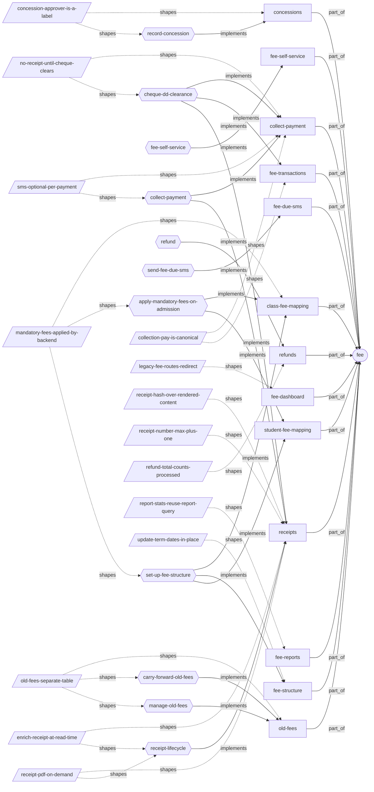

## Features

### fee/class-fee-mapping

Set the fee for a class per fee type and year, optionally mark it mandatory (all_by_default) so every admitted student gets a student mapping automatically; class-mapping term amounts are a display template only.
- Roles: Admin (fee_class_mappings, fee_class_mapping_term_amounts permissions).
- Parity: Web handles class mappings and their term amounts as tabs in /fee/mappings; mobile has a separate class-mappings screen whose edit sends UUID class_id/academic_year_id and fails with 422.
- Note: Unique per (class, fee type, year). fee_class_mappings has no section_id.
- Flows: [fee/apply-mandatory-fees-on-admission](#feeapply-mandatory-fees-on-admission), [fee/set-up-fee-structure](#feeset-up-fee-structure)
- Implemented by: `endpoint:PATCH /fee/class-mappings/{mapping_id}/toggle-mandatory`, `endpoint:POST /fee/class-mapping-term-amounts`, `endpoint:POST /fee/class-mappings`, `endpoint:POST /fee/class-mappings/bulk`, `endpoint:PUT /fee/class-mappings/{mapping_id}`, `mobile:app/fees/class-mappings.tsx`, `mobile:app/fees/mappings.tsx`, `service:app/service/fee/fee_class_map_term_amount_service.py`, `service:app/service/fee/fee_class_mapping_service.py`, `table:fee_class_map_term_amounts`, `table:fee_class_mappings`, `web:src/pages/fee/FeeMappings.tsx`
- Shaped by: [fee/mandatory-fees-applied-by-backend](#feemandatory-fees-applied-by-backend)

### fee/collect-payment

Staff search a student, see an as-of-date summary (assigned, after concession, paid, due) and take a payment by cash, UPI, bank transfer, cheque, DD or card; a receipt is created automatically and a parent SMS is optional.
- Roles: Admin and staff (fee_collection permission; send_sms extra action).
- Parity: Both clients have the collection detail page with 5 tabs (Summary, Payment, Concessions, Old Fees, Fee History) and always send fee_items.
- Flows: [fee/cheque-dd-clearance](#feecheque-dd-clearance), [fee/collect-payment](#feecollect-payment)
- Implemented by: `endpoint:GET /fee/collection/history/{student_id}`, `endpoint:GET /fee/collection/search-student`, `endpoint:GET /fee/collection/summary/{student_id}`, `endpoint:POST /fee/collection/pay`, `mobile:app/fees/collection.tsx`, `mobile:app/fees/collection/[studentId].tsx`, `service:app/service/fee/fee_collection_service.py`, `table:fee_receipts`, `table:fee_transaction_items`, `table:fee_transactions`, `web:src/pages/fee/FeeCollection/FeeHistoryTab.tsx`, `web:src/pages/fee/FeeCollection/FeePaymentTab.tsx`, `web:src/pages/fee/FeeCollection/FeeSummaryTab.tsx`, `web:src/pages/fee/FeeCollection/StudentFeeDetailPage.tsx`, `web:src/pages/fee/FeeCollection/StudentSearch.tsx`, `web:src/pages/fee/FeeCollection/index.tsx`
- Shaped by: [fee/collection-pay-is-canonical](#feecollection-pay-is-canonical), [fee/no-receipt-until-cheque-clears](#feeno-receipt-until-cheque-clears), [fee/sms-optional-per-payment](#feesms-optional-per-payment)

### fee/concessions

Reduce what a student owes for one fee type in a year; the cumulative concession is capped at the mapping total_fee and needs a 5-500 character reason and an approver label.
- Roles: fee_concessions permission.
- Parity: Both clients, as the Concessions tab of the collection detail page.
- Flows: [fee/record-concession](#feerecord-concession)
- Implemented by: `endpoint:DELETE /fee/concessions/{concession_id}`, `endpoint:GET /fee/concessions/student/{student_id}`, `endpoint:POST /fee/concessions/bulk`, `endpoint:PUT /fee/concessions/{concession_id}`, `mobile:app/fees/collection/[studentId].tsx`, `service:app/service/fee/fee_concession_service.py`, `table:fee_concessions`, `web:src/pages/fee/FeeCollection/ConcessionTab.tsx`
- Shaped by: [fee/concession-approver-is-a-label](#feeconcession-approver-is-a-label)

### fee/fee-dashboard

Web fee landing page (/fee) with a dashboard of fee figures and links to the fee sections.
- Parity: Web only.
- Implemented by: `web:src/pages/fee/FeeDashboard.tsx`
- Shaped by: [fee/legacy-fee-routes-redirect](#feelegacy-fee-routes-redirect)

### fee/fee-due-sms

From the Summary tab, preview and send a fee-due summary SMS to the parent; a receipt SMS can also be re-sent for a transaction.
- Roles: fee_collection permission with the send_sms extra action.
- Parity: Web only (FeeSummaryTab); mobile API wraps the endpoints.
- Flows: [fee/send-fee-due-sms](#feesend-fee-due-sms)
- Implemented by: `endpoint:GET /fee/collection/summary/{student_id}/sms-preview`, `endpoint:POST /fee/collection/send-receipt-sms`, `endpoint:POST /fee/collection/summary/{student_id}/send-sms`, `job:app/tasks/communication/send_tasks.py`, `service:app/service/fee/fee_collection_service.py`, `web:src/pages/fee/FeeCollection/FeeSummaryTab.tsx`

### fee/fee-reports

Fee reports under /reports/fees: collection summary, pending fees and fee structure, each with stats and an export.
- Roles: fee_reports permission with the export extra action.
- Parity: Web exports xlsx and pdf. Mobile exports CSV only.
- Note: The pending-fees report ignores concessions, and export only includes the first 100 rows.
- Implemented by: `endpoint:GET /reports/fees/collection-summary`, `endpoint:GET /reports/fees/fee-structure`, `endpoint:GET /reports/fees/pending-fees`, `endpoint:POST /reports/fees/export`, `mobile:app/fees/reports.tsx`, `service:app/service/reports/fee_report_service.py`, `web:src/pages/fee/FeeReports.tsx`
- Shaped by: [fee/report-stats-reuse-report-query](#feereport-stats-reuse-report-query)

### fee/fee-self-service

Students and parents read their own or their children's fee summary, receipts, transactions and receipt PDFs through scoped /my-* and /child-* endpoints.
- Roles: Student (own scope), Parent (related scope).
- Parity: Both clients have my-fees, my-receipts and my-transactions. Mobile collection.tsx calls the summaries without the required academic_year_id query parameter.
- Flows: [fee/fee-self-service](#feefee-self-service)
- Implemented by: `endpoint:GET /fee/collection/child-summary/{student_id}`, `endpoint:GET /fee/collection/my-summary`, `endpoint:GET /fee/collection/receipts/{receipt_id}/pdf`, `endpoint:GET /fee/receipts/my-children-receipts`, `endpoint:GET /fee/receipts/my-receipts`, `endpoint:GET /fee/transactions/my-children-fees`, `endpoint:GET /fee/transactions/my-fees`, `mobile:app/fees/my-fees.tsx`, `mobile:app/fees/my-receipts.tsx`, `mobile:app/fees/my-transactions.tsx`, `service:app/service/fee/fee_collection_service.py`, `web:src/pages/fee/FeeCollection/ParentFeeSummaryPage.tsx`, `web:src/pages/fee/FeeCollection/StudentFeeSummaryPage.tsx`, `web:src/pages/fee/MyReceiptsPage.tsx`, `web:src/pages/fee/MyTransactionsPage.tsx`

### fee/fee-structure

Per academic year, define fee terms (schedules with number_of_terms due dates), fee categories and fee types; each fee type is bound to one fee term.
- Roles: Admin (fee_terms, fee_categories, fee_types permissions).
- Parity: Both clients. Web uses separate Terms, Categories and Types pages; mobile has terms, categories and types screens.
- Note: Unique per DB constraint and service 400: category name per year, type name per category.
- Flows: [fee/set-up-fee-structure](#feeset-up-fee-structure)
- Implemented by: `endpoint:POST /fee/categories`, `endpoint:POST /fee/terms`, `endpoint:POST /fee/types`, `endpoint:PUT /fee/terms/{fee_term_id}`, `mobile:app/fees/categories.tsx`, `mobile:app/fees/terms.tsx`, `mobile:app/fees/types.tsx`, `service:app/service/fee/fee_category_service.py`, `service:app/service/fee/fee_term_service.py`, `service:app/service/fee/fee_type_service.py`, `table:fee_categories`, `table:fee_term_dates`, `table:fee_terms`, `table:fee_types`, `web:src/pages/fee/FeeCategories.tsx`, `web:src/pages/fee/FeeTerms.tsx`, `web:src/pages/fee/FeeTypes.tsx`
- Shaped by: [fee/update-term-dates-in-place](#feeupdate-term-dates-in-place)

### fee/fee-transactions

List fee transactions, update transaction and cheque status (cheque/DD clearance), and the legacy explicit create that takes items per type and term and ignores concessions.
- Roles: Admin and staff (fee_transactions permission).
- Parity: Both clients list and update transactions; the legacy Transactions create page is web only.
- Flows: [fee/cheque-dd-clearance](#feecheque-dd-clearance)
- Implemented by: `endpoint:GET /fee/transactions`, `endpoint:POST /fee/transactions`, `endpoint:PUT /fee/transactions/{transaction_id}`, `mobile:app/fees/transactions.tsx`, `service:app/service/fee/fee_transaction_service.py`, `table:fee_transaction_items`, `table:fee_transactions`, `web:src/pages/fee/FeeTransactions.tsx`
- Shaped by: [fee/collection-pay-is-canonical](#feecollection-pay-is-canonical)

### fee/old-fees

Dues from earlier years, carried forward from COS360 data or entered by hand, shown on their own tab and never mixed into this year's dues.
- Roles: fee_old permission (settle is gated on fee_old:delete).
- Parity: Both clients have an Old Fees tab, but mobile calls /fee/old/... (404) and sends the wrong carry-forward payload (422).
- Flows: [fee/carry-forward-old-fees](#feecarry-forward-old-fees), [fee/manage-old-fees](#feemanage-old-fees)
- Implemented by: `endpoint:DELETE /fee/old-fees/{old_fee_id}`, `endpoint:GET /fee/old-fees/student/{student_id}`, `endpoint:PATCH /fee/old-fees/{old_fee_id}/settle`, `endpoint:POST /fee/old-fees`, `endpoint:POST /fee/old-fees/carry-forward`, `endpoint:PUT /fee/old-fees/{old_fee_id}`, `mobile:app/fees/collection/[studentId].tsx`, `service:app/service/fee/fee_old_service.py`, `table:fee_old`, `web:src/pages/fee/FeeCollection/OldFeeTab.tsx`
- Shaped by: [fee/old-fees-separate-table](#feeold-fees-separate-table)

### fee/receipts

Receipts with sequential REC-YYMM-NNNN numbers, a SHA-256 integrity hash, verify, reprint tracking, manual renumbering and a PDF generated on demand.
- Roles: Admin and staff (fee_receipts permission); students and parents via own/related scopes.
- Parity: Both clients list receipts and support verify and PDF.
- Flows: [fee/cheque-dd-clearance](#feecheque-dd-clearance), [fee/collect-payment](#feecollect-payment), [fee/receipt-lifecycle](#feereceipt-lifecycle)
- Implemented by: `endpoint:GET /fee/collection/receipts/{receipt_id}/pdf`, `endpoint:GET /fee/receipts/{receipt_id}`, `endpoint:GET /fee/receipts/{receipt_id}/verify`, `endpoint:PATCH /fee/receipts/{receipt_id}/number`, `endpoint:POST /fee/receipts/generate/{transaction_id}`, `endpoint:POST /fee/receipts/{receipt_id}/reprint`, `mobile:app/fees/receipts.tsx`, `service:app/service/fee/fee_receipt_service.py`, `table:fee_receipts`, `web:src/pages/fee/Receipts.tsx`
- Shaped by: [fee/enrich-receipt-at-read-time](#feeenrich-receipt-at-read-time), [fee/receipt-hash-over-rendered-content](#feereceipt-hash-over-rendered-content), [fee/receipt-number-max-plus-one](#feereceipt-number-max-plus-one), [fee/receipt-pdf-on-demand](#feereceipt-pdf-on-demand)

### fee/refunds

Refund requests against completed transactions with an approval flow: pending -> approved -> processed, or pending -> rejected.
- Roles: fee_refunds permission with extra actions approve and process.
- Parity: Both clients. Mobile approve omits approved_by_user_id and process sends reference_number without refund_method (422). Both call PUT/DELETE /fee/refunds/{id} and POST /{id}/cancel, which do not exist.
- Flows: [fee/refund](#feerefund)
- Implemented by: `endpoint:GET /fee/refunds/approved/processing`, `endpoint:GET /fee/refunds/pending/approval`, `endpoint:GET /fee/refunds/statistics`, `endpoint:POST /fee/refunds`, `endpoint:POST /fee/refunds/approve`, `endpoint:POST /fee/refunds/process`, `mobile:app/fees/refunds.tsx`, `service:app/service/fee/fee_refund_service.py`, `table:fee_refunds`, `web:src/pages/fee/FeeRefunds.tsx`
- Shaped by: [fee/refund-total-counts-processed](#feerefund-total-counts-processed)

### fee/student-fee-mapping

Assign a fee type to a student for a year (what the student actually owes), with one term amount per due date created by an equal split of total_fee.
- Roles: Admin (fee_student_mappings permission).
- Parity: Web uses a tab in /fee/mappings; mobile has student-mappings and assign-student-fees screens.
- Note: Unique per (student, fee type, year). Summary and payment read only student mappings and their term amounts, never class mappings.
- Flows: [fee/apply-mandatory-fees-on-admission](#feeapply-mandatory-fees-on-admission), [fee/set-up-fee-structure](#feeset-up-fee-structure)
- Implemented by: `endpoint:DELETE /fee/student-mappings/{mapping_id}`, `endpoint:POST /fee/student-mappings`, `endpoint:POST /fee/student-mappings/bulk`, `mobile:app/fees/assign-student-fees.tsx`, `mobile:app/fees/student-mappings.tsx`, `service:app/service/fee/fee_student_mapping_service.py`, `table:fee_student_map_term_amounts`, `table:fee_student_mappings`, `web:src/pages/fee/FeeMappings.tsx`
- Shaped by: [transport/no-backend-link-to-fee-module](#transportno-backend-link-to-fee-module)

## Flows

### fee/apply-mandatory-fees-on-admission

Implements: `feature:fee/class-fee-mapping`, `feature:fee/student-fee-mapping`

- Trigger: New admission created.

1. A student is admitted to a class and year `service:app/service/student/admission_service.py` `table:student_admissions`.
2. The admission service calls auto_apply_mandatory_fees_to_admission `service:app/service/fee/fee_class_mapping_service.py`, which finds every class mapping with all_by_default=true for that class and year `table:fee_class_mappings`.
3. For each one it creates a student mapping and equal-split term amounts `table:fee_student_mappings` `table:fee_student_map_term_amounts`.

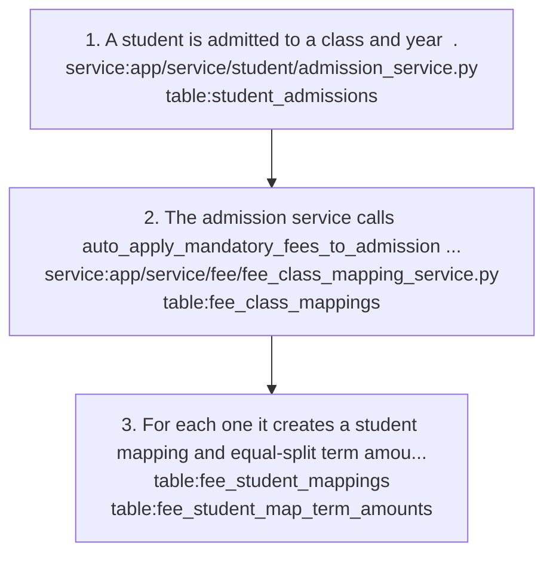

Shaped by: [fee/mandatory-fees-applied-by-backend](#feemandatory-fees-applied-by-backend)

### fee/carry-forward-old-fees

Implements: `feature:fee/old-fees`

1. On the Old Fees tab `web:src/pages/fee/FeeCollection/OldFeeTab.tsx`, staff pick a source year and post `endpoint:POST /fee/old-fees/carry-forward` with {student_id, source_academic_year_id, target_academic_year_id}.
2. The service computes total_fee minus paid per fee type for the source year `service:app/service/fee/fee_old_service.py` `table:fee_student_mappings` `table:fee_transaction_items` and writes old-fee rows `table:fee_old`.
3. It runs once per student and source year.

- Failure: Mobile sends {previous_year_id, current_year_id, student_ids} and gets 422.

- Note: Carry-forward ignores concessions.

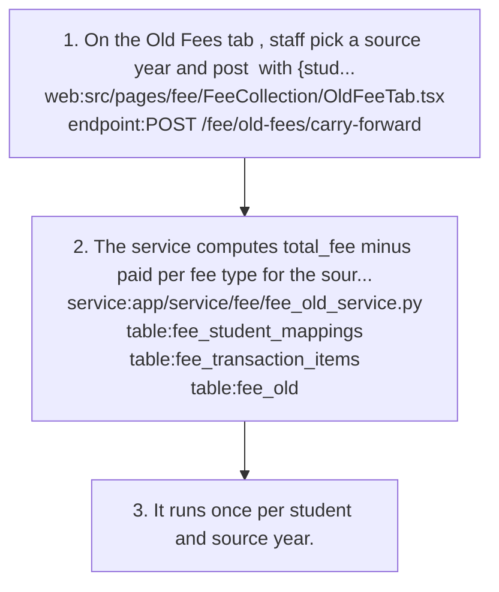

Shaped by: [fee/old-fees-separate-table](#feeold-fees-separate-table)

### fee/cheque-dd-clearance

Implements: `feature:fee/collect-payment`, `feature:fee/fee-transactions`, `feature:fee/receipts`

- Precondition: Cheque/DD need cheque_number, cheque_bank and cheque_date, at most 90 days in the future.

1. A cheque or DD payment through `endpoint:POST /fee/collection/pay` is saved as status=pending with cheque_status=pending, and no receipt is created `table:fee_transactions`.
2. Once the cheque clears, staff update the transaction with {status: completed, cheque_status: cleared} `endpoint:PUT /fee/transactions/{transaction_id}` `service:app/service/fee/fee_transaction_service.py` `web:src/pages/fee/FeeTransactions.tsx` `mobile:app/fees/transactions.tsx`.
3. Staff then generate the receipt explicitly `endpoint:POST /fee/receipts/generate/{transaction_id}` `service:app/service/fee/fee_receipt_service.py` `table:fee_receipts`; nothing generates it automatically on status change.

- Failure: The status update has no transition check (for example cancelled -> completed is accepted), so clients must restrict the choices.

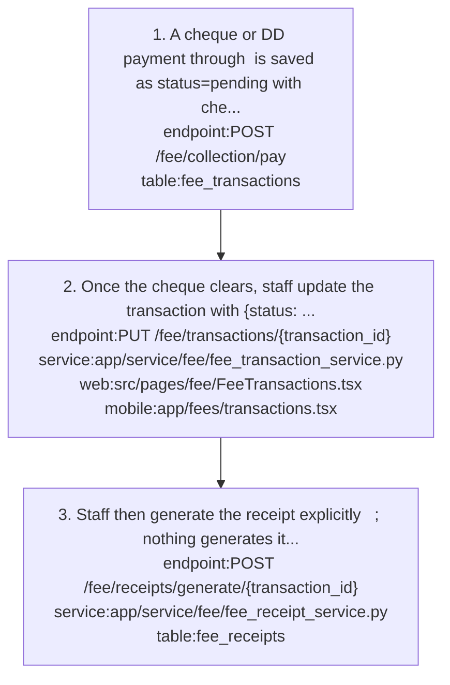

Shaped by: [fee/no-receipt-until-cheque-clears](#feeno-receipt-until-cheque-clears)

### fee/collect-payment

Implements: `feature:fee/collect-payment`, `feature:fee/receipts`

- Precondition: The student has fee_student_mappings for the year; a class mapping alone shows nothing due.

1. The web page /fee/collection searches students `endpoint:GET /fee/collection/search-student` `web:src/pages/fee/FeeCollection/index.tsx` `web:src/pages/fee/FeeCollection/StudentSearch.tsx`; q needs at least 2 characters, class_id and section_id are optional.
2. Selecting a student navigates to /fee/collection/$studentId `web:src/pages/fee/FeeCollection/StudentFeeDetailPage.tsx` (mobile: the collection/[studentId] screen), which has five tabs: Summary, Payment, Concessions, Old Fees and Fee History.
3. Summary loads `endpoint:GET /fee/collection/summary/{student_id}` with academic_year_id and as_of_date `web:src/pages/fee/FeeCollection/FeeSummaryTab.tsx`; Fee History lazily loads `endpoint:GET /fee/collection/history/{student_id}` when its tab opens `web:src/pages/fee/FeeCollection/FeeHistoryTab.tsx`.
4. The Payment tab posts `endpoint:POST /fee/collection/pay` `web:src/pages/fee/FeeCollection/FeePaymentTab.tsx` with student_id, academic_year_id, amount_to_pay, fee_items[{fee_type_id, amount}], payment_method and method references, plus send_sms and print_duplicate.
5. The backend checks amount_to_pay is no more than the total due: this year's dues after concessions plus unsettled old fees `service:app/service/fee/fee_collection_service.py` `table:fee_student_mappings` `table:fee_concessions` `table:fee_old`.
6. It splits each fee type's amount across that type's term amounts, oldest outstanding first `table:fee_student_map_term_amounts`.
7. It writes the transaction and its items `table:fee_transactions` `table:fee_transaction_items`; if status is completed it also writes the receipt in the same commit `table:fee_receipts` `service:app/service/fee/fee_receipt_service.py`.
8. It sends the parent SMS last via the communication provider call `job:app/tasks/communication/send_tasks.py` `table:student_parent_links`; the SMS result never affects the payment.

- Result: Response returns transaction_number, receipt_number and sms_status (sent, failed or skipped).

- Failure: fee_items must sum exactly to amount_to_pay, have no duplicate fee types, not be an empty list, and each item must not exceed that type's outstanding.
- Failure: Non-divisible totals leave term shares summing 0.01 short, so paying the full amount via fee_items fails with 'exceeds the scheduled term amounts by 0.01'.

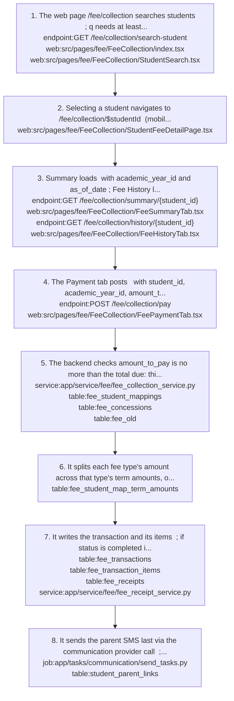

Shaped by: [fee/sms-optional-per-payment](#feesms-optional-per-payment)

### fee/fee-self-service

Implements: `feature:fee/fee-self-service`

1. Student summary: `endpoint:GET /fee/collection/my-summary` with academic_year_id; the student is taken from the token `web:src/pages/fee/FeeCollection/StudentFeeSummaryPage.tsx` `mobile:app/fees/my-fees.tsx`.
2. Student receipts and transactions: `endpoint:GET /fee/receipts/my-receipts` (list_own) and `endpoint:GET /fee/transactions/my-fees` `web:src/pages/fee/MyReceiptsPage.tsx` `web:src/pages/fee/MyTransactionsPage.tsx`.
3. Parent summary: `endpoint:GET /fee/collection/child-summary/{student_id}` with academic_year_id; the parent-child link is checked `table:student_parent_links`.
4. Parent receipts and transactions: `endpoint:GET /fee/receipts/my-children-receipts` (read_related) and `endpoint:GET /fee/transactions/my-children-fees`.
5. PDF for everyone: `endpoint:GET /fee/collection/receipts/{receipt_id}/pdf`; for own/related scopes the backend checks the transaction's student and returns 404, not 403, on a mismatch.

- Note: These endpoints use check_user_resource_access (own/related scopes); a student with only *_own grants gets 403 on the exact-action endpoints.

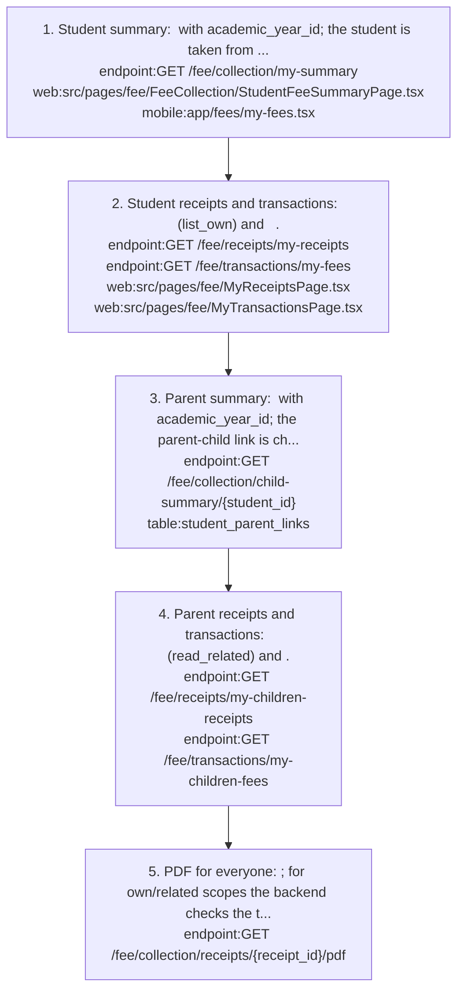

### fee/manage-old-fees

Implements: `feature:fee/old-fees`

1. Schools new to COS360 enter dues by hand with `endpoint:POST /fee/old-fees` (source manual_entry) `service:app/service/fee/fee_old_service.py` `table:fee_old`; rejected if one already exists for the same student, year label and fee type name.
2. Old fees are listed per student with `endpoint:GET /fee/old-fees/student/{student_id}` on the Old Fees tab `web:src/pages/fee/FeeCollection/OldFeeTab.tsx`.
3. Payments on old fees are recorded by editing paid_amount with `endpoint:PUT /fee/old-fees/{old_fee_id}`, because clients never pay old fees through /pay.
4. `endpoint:PATCH /fee/old-fees/{old_fee_id}/settle` writes the fee off.
5. `endpoint:DELETE /fee/old-fees/{old_fee_id}` only works for manual_entry rows.

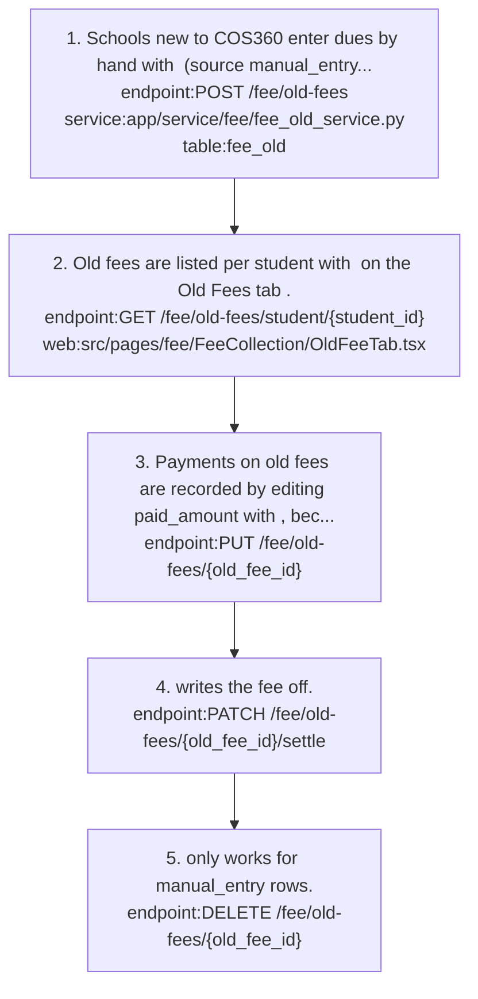

Shaped by: [fee/old-fees-separate-table](#feeold-fees-separate-table)

### fee/receipt-lifecycle

Implements: `feature:fee/receipts`

1. A receipt is created by /pay for completed payments or by `endpoint:POST /fee/receipts/generate/{transaction_id}`; the number is REC-YYMM-NNNN, current max plus one per tenant per month `service:app/service/fee/fee_receipt_service.py` `table:fee_receipts`.
2. The content hash is SHA-256 of the sorted-key JSON of the rendered ReceiptContent and is stored on the receipt and the transaction `table:fee_transactions`.
3. Reads `endpoint:GET /fee/receipts/{receipt_id}` fill class_section and academic_year at read time via _enrich_receipt_fields into a new FeeReceiptRead `web:src/pages/fee/Receipts.tsx` `mobile:app/fees/receipts.tsx`.
4. The PDF is regenerated from data on every download `endpoint:GET /fee/collection/receipts/{receipt_id}/pdf`.
5. Reprints are tracked with `endpoint:POST /fee/receipts/{receipt_id}/reprint`; manual renumbering uses `endpoint:PATCH /fee/receipts/{receipt_id}/number`.
6. `endpoint:GET /fee/receipts/{receipt_id}/verify` re-renders content from live data and returns a flat {receipt_id, receipt_number, is_valid, stored_hash, current_hash, verification_date}.

- Failure: Renaming the student, promoting them, or renumbering the receipt makes is_valid=false without tampering.
- Failure: Two payments at the same moment can collide on the receipt number unique constraint and return 500.

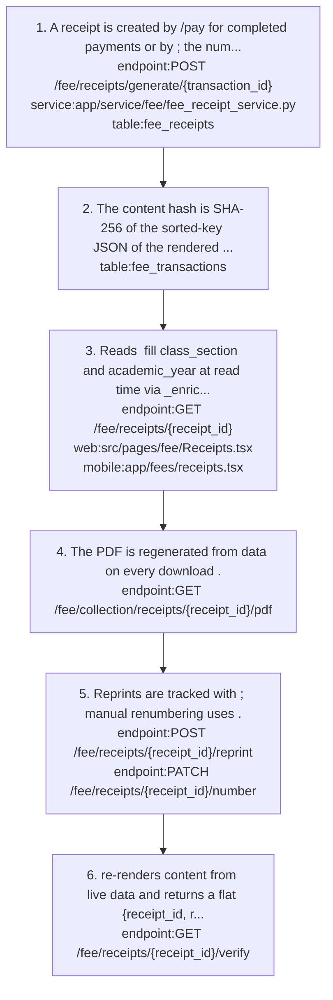

Shaped by: [fee/enrich-receipt-at-read-time](#feeenrich-receipt-at-read-time), [fee/receipt-pdf-on-demand](#feereceipt-pdf-on-demand)

### fee/record-concession

Implements: `feature:fee/concessions`

1. On the Concessions tab `web:src/pages/fee/FeeCollection/ConcessionTab.tsx`, staff post `endpoint:POST /fee/concessions/bulk` with fee type, amount, reason (5-500 chars) and approver label `service:app/service/fee/fee_concession_service.py`.
2. The service requires an existing student mapping `table:fee_student_mappings` and adds the amount to the running total for (student, fee_type, year) rather than replacing it `table:fee_concessions`.
3. The cumulative amount is capped at the mapping total_fee.
4. To set the value outright, use `endpoint:PUT /fee/concessions/{concession_id}`.
5. To revoke, `endpoint:DELETE /fee/concessions/{concession_id}` soft-revokes (is_active=false).

- Failure: Re-adding after a revoke for the same student, type and year hits the unique constraint (the inactive row still counts) and returns 500.

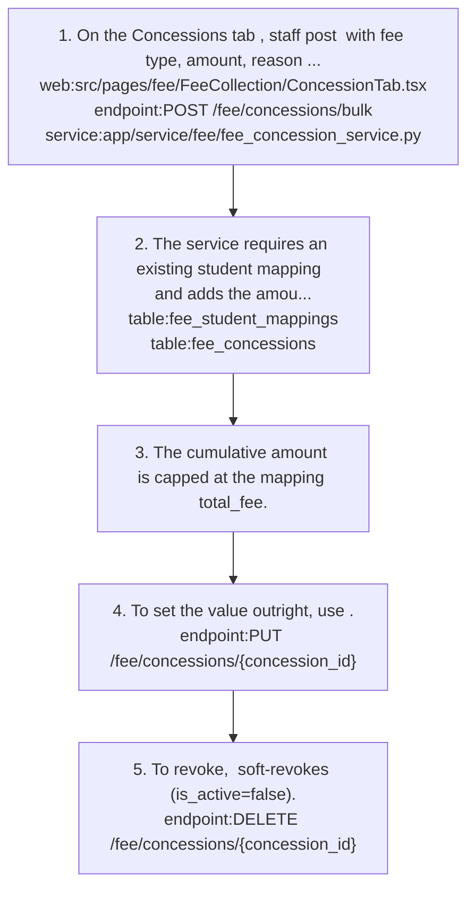

Shaped by: [fee/concession-approver-is-a-label](#feeconcession-approver-is-a-label)

### fee/refund

Implements: `feature:fee/refunds`

1. Request a refund `endpoint:POST /fee/refunds` `service:app/service/fee/fee_refund_service.py` `web:src/pages/fee/FeeRefunds.tsx` `mobile:app/fees/refunds.tsx`; only for completed transactions, amount at most total_amount minus refunds already approved or processed `table:fee_refunds` `table:fee_transactions`.
2. The refund gets a number RFD{YYYYMMDD}{6 hex} and status pending.
3. An approver lists `endpoint:GET /fee/refunds/pending/approval` and posts `endpoint:POST /fee/refunds/approve` with {refund_id, action: approve|reject, approval_remarks, approved_by_user_id}; only works while pending.
4. A processor lists `endpoint:GET /fee/refunds/approved/processing` and posts `endpoint:POST /fee/refunds/process` with {refund_id, refund_method: cash|bank_transfer|cheque, refund_reference?, processing_remarks?, processed_by_user_id}; only works once approved.
5. Per-transaction totals are available from `endpoint:GET /fee/refunds/transaction/{transaction_id}/summary`.

- Failure: The user-id fields are required in the body (422 if missing) even though the endpoint overwrites them from the token.

- Note: Pending refunds are not counted against the limit and approval does not re-check it, so several pending refunds can exceed the transaction.
- Note: Refunds are not subtracted from paid in the fee summary.

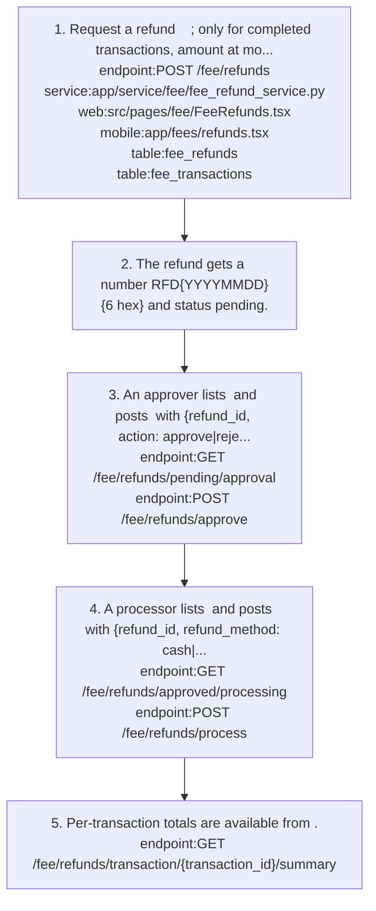

### fee/send-fee-due-sms

Implements: `feature:fee/fee-due-sms`

1. On the Summary tab `web:src/pages/fee/FeeCollection/FeeSummaryTab.tsx`, staff preview the message with `endpoint:GET /fee/collection/summary/{student_id}/sms-preview` and academic_year_id.
2. Staff send it with `endpoint:POST /fee/collection/summary/{student_id}/send-sms` `service:app/service/fee/fee_collection_service.py`, which looks up the parent phone `table:student_parent_links` and calls the SMS provider `job:app/tasks/communication/send_tasks.py`.

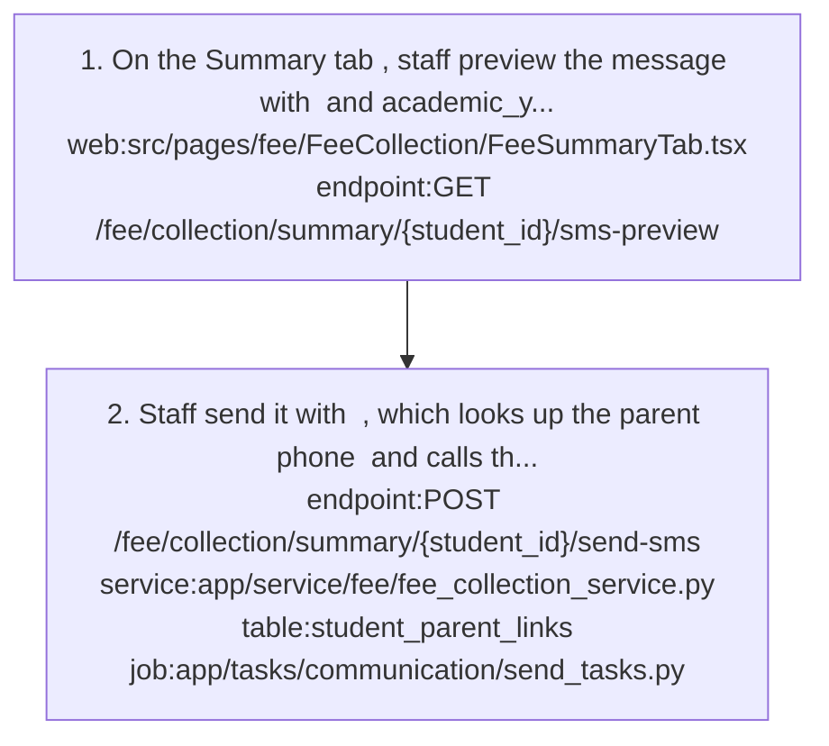

### fee/set-up-fee-structure

Implements: `feature:fee/class-fee-mapping`, `feature:fee/fee-structure`, `feature:fee/student-fee-mapping`

- Precondition: An academic year is selected; web API wrappers fill a missing academic_year_id from the header year selector.

1. Build the structure in this order: fee_terms -> fee_term_dates -> fee_categories -> fee_types -> fee_class_mappings -> (fee_class_map_term_amounts) -> fee_student_mappings -> fee_student_map_term_amounts.
2. Create the fee term with its dates `endpoint:POST /fee/terms` `service:app/service/fee/fee_term_service.py` `table:fee_terms` `table:fee_term_dates` `web:src/pages/fee/FeeTerms.tsx`. fee_term_dates[] count must equal number_of_terms, with no duplicates.
3. Create a fee category for the year `endpoint:POST /fee/categories` `table:fee_categories` `web:src/pages/fee/FeeCategories.tsx`. Category names are unique per year.
4. Create fee types in the category, each bound to one fee term `endpoint:POST /fee/types` `table:fee_types` `web:src/pages/fee/FeeTypes.tsx`. Type names are unique per category.
5. Create class mappings (fee per class, fee type and year) `endpoint:POST /fee/class-mappings` or `endpoint:POST /fee/class-mappings/bulk` `service:app/service/fee/fee_class_mapping_service.py` `table:fee_class_mappings` `web:src/pages/fee/FeeMappings.tsx`.
6. Optionally add class-mapping term amounts as a display template `endpoint:POST /fee/class-mapping-term-amounts` `table:fee_class_map_term_amounts`; the backend never reads them for dues.
7. If all_by_default=true (the mandatory flag, toggled with `endpoint:PATCH /fee/class-mappings/{mapping_id}/toggle-mandatory`), auto_map_students_for_class_mapping creates a student mapping and its term amounts for every student admitted to that class and year `table:student_admissions` `table:fee_student_mappings` `table:fee_student_map_term_amounts`.
8. New admissions pick up mandatory class fees through auto_apply_mandatory_fees_to_admission, called from the admission service `service:app/service/student/admission_service.py`.
9. Assign optional fees with `endpoint:POST /fee/student-mappings` or `endpoint:POST /fee/student-mappings/bulk` `service:app/service/fee/fee_student_mapping_service.py` `mobile:app/fees/assign-student-fees.tsx`; create_term_amounts splits total_fee equally across the term dates.

- Result: The student is visible in collection with dues, because summary and payment only read fee_student_mappings and fee_student_map_term_amounts.

- Failure: Duplicate category, type, class mapping or student mapping returns 400.

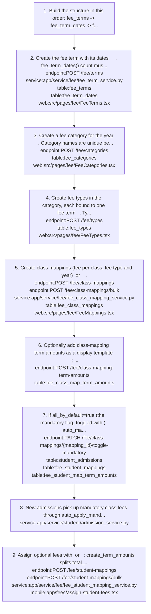

Shaped by: [fee/mandatory-fees-applied-by-backend](#feemandatory-fees-applied-by-backend)

## Decisions

### fee/collection-pay-is-canonical

- **Decision**: New UI takes payments through /fee/collection/pay with explicit fee_items; POST /fee/transactions remains only for the legacy web Transactions page.
- **Why**: /pay is aware of concessions and old fees; /fee/transactions takes explicit items per type and term and ignores concessions.
- **Alternatives**: Omitting fee_items triggers the older top-down auto-distribution, ordered by fee_type_id (UUID order, not display order), with any remainder going to old fees.
- Shapes: `endpoint:POST /fee/collection/pay`, `endpoint:POST /fee/transactions`, `feature:fee/collect-payment`, `feature:fee/fee-transactions`

### fee/concession-approver-is-a-label

- **Decision**: The concession approved_by field is an audit label (owner, principal, management or correspondent), not an in-app approval workflow.
- **Why**: Schools approve concessions verbally or in a register, offline; the audit record is enough.
- **Alternatives**: An in-app approval step.
- Shapes: `feature:fee/concessions`, `flow:fee/record-concession`, `table:fee_concessions`

### fee/enrich-receipt-at-read-time

- **Decision**: Receipts written by /pay store class_section and academic_year as empty strings; _enrich_receipt_fields fills them into a new FeeReceiptRead at read time.
- **Why**: Assigning looked-up values onto the ORM object marks it dirty, and autoflush would write to the DB on the next query.
- Note: The admission lookup must not require Admission.academic_year_id to equal the transaction year, or receipts break for students whose admission year differs.
- Shapes: `feature:fee/receipts`, `flow:fee/receipt-lifecycle`, `service:app/service/fee/fee_receipt_service.py`

### fee/legacy-fee-routes-redirect

- **Decision**: Old /fees/* web routes redirect to /fee, and /fee/term-amounts redirects to /fee/mappings#class-mappings-term-amounts.
- **Why**: The fee pages were consolidated under /fee; redirects keep bookmarks and old menu links working.
- Shapes: `feature:fee/fee-dashboard`, `web:src/pages/fee/FeeMappings.tsx`

### fee/mandatory-fees-applied-by-backend (unintended)

- **Decision**: Mandatory class fees (all_by_default) are applied on the backend when the mapping is created or toggled on, and again at admission; the clients do not do it.
- **Why**: Not a deliberate choice; it is where the logic was first written.
- Note: Toggling mandatory off does not remove existing student mappings.
- Shapes: `feature:fee/class-fee-mapping`, `flow:fee/apply-mandatory-fees-on-admission`, `flow:fee/set-up-fee-structure`, `service:app/service/fee/fee_class_mapping_service.py`

### fee/no-receipt-until-cheque-clears (unintended)

- **Decision**: Cheque and DD payments are saved as pending with no receipt; the receipt is generated by an explicit call after clearance, not on status change.
- **Why**: Not a deliberate choice. The receipt should be generated automatically when a cheque or DD is marked cleared, not by a separate call.
- Shapes: `endpoint:POST /fee/receipts/generate/{transaction_id}`, `feature:fee/collect-payment`, `flow:fee/cheque-dd-clearance`

### fee/old-fees-separate-table

- **Decision**: Old fees get their own table (fee_old) and their own tab instead of being mixed into this year's dues.
- **Why**: Keeps this year's due clean; fee types may differ between years, and manual entries have no structure rows.
- **Tradeoff**: Clients never pay old fees through /pay; the Old Fees tab records payments by editing paid_amount.
- Shapes: `feature:fee/old-fees`, `flow:fee/carry-forward-old-fees`, `flow:fee/manage-old-fees`, `table:fee_old`

### fee/receipt-hash-over-rendered-content (unintended)

- **Decision**: The receipt integrity hash is SHA-256 over the rendered ReceiptContent (number, student name, class-section, year, collector, items), and verify re-renders from live data.
- **Why**: Not a deliberate choice. The hash should cover a stored snapshot of the receipt, so later renames or promotions do not invalidate old receipts.
- **Tradeoff**: Legitimate changes (student rename, promotion, receipt renumber) make is_valid=false.
- Shapes: `endpoint:GET /fee/receipts/{receipt_id}/verify`, `feature:fee/receipts`, `service:app/service/fee/fee_receipt_service.py`

### fee/receipt-number-max-plus-one (unintended)

- **Decision**: Receipt numbers are REC-YYMM-NNNN, computed as current max plus one per tenant per month and protected by a unique constraint, not a sequence or lock.
- **Why**: Not a deliberate choice. Receipt numbers should come from a sequence or a lock so concurrent payments cannot collide.
- **Tradeoff**: Concurrent payments can collide and return 500.
- Shapes: `feature:fee/receipts`, `service:app/service/fee/fee_receipt_service.py`, `table:fee_receipts`

### fee/receipt-pdf-on-demand

- **Decision**: Receipt PDFs are regenerated from data on every download rather than stored; pdf_file_path is unused.
- **Why**: No files to manage per tenant.
- **Tradeoff**: The PDF prints placeholder school name and address; it does not read school settings.
- Shapes: `endpoint:GET /fee/collection/receipts/{receipt_id}/pdf`, `feature:fee/receipts`, `flow:fee/receipt-lifecycle`

### fee/refund-total-counts-processed (active)

- **Decision**: The refund dashboard's Total Refund Amount sums only refunds with status processed; pending, approved and rejected refunds are counted but not added to the amount.
- **Why**: The card should show money actually paid back, matching how the financial reports count only money that moved.
- **Alternatives**: Summing every requested refund, which would include rejected and not-yet-paid amounts.
- **Since**: 2026-09
- Shapes: `endpoint:GET /fee/refunds/statistics`, `feature:fee/refunds`

### fee/report-stats-reuse-report-query (active)

- **Decision**: Each fee report /stats endpoint aggregates the same filtered query as its table: collection and structure stats wrap the report query as a subquery, and pending stats sum the same computed pending rows.
- **Why**: The stats cards must agree with the table under any filter; separate aggregation queries had drifted into placeholders returning zeros.
- **Alternatives**: Separate SQL aggregates per stat, which duplicate the join and filter logic.
- **Tradeoff**: Pending fees are computed in Python from one mapping query and one grouped payment query, so the report and its stats load every pending instalment for the filter before paginating.
- **Since**: 2026-09
- Shapes: `feature:fee/fee-reports`, `service:app/service/reports/fee_report_service.py`

### fee/sms-optional-per-payment

- **Decision**: The parent SMS is chosen per payment (send_sms, default on) and is sent last; an SMS failure never rolls back the payment.
- **Why**: The parent may be present at the counter, or the SMS quota may be limited.
- Shapes: `feature:fee/collect-payment`, `flow:fee/collect-payment`, `service:app/service/fee/fee_collection_service.py`

### fee/update-term-dates-in-place

- **Decision**: update_fee_term_with_dates zips existing fee_term_dates rows with the new dates and updates them in place instead of delete and re-insert.
- **Why**: term_date_id is an FK from both term-amount tables and from fee_transaction_items; deleting and re-inserting would break those links or orphan payments.
- **Tradeoff**: Reducing the count still deletes rows (fails if referenced), and changing number_of_terms does not rebuild existing student term amounts.
- Shapes: `endpoint:PUT /fee/terms/{fee_term_id}`, `feature:fee/fee-structure`, `service:app/service/fee/fee_term_service.py`, `table:fee_term_dates`

## Concepts

### fee/cheque-status

Tracks a cheque or DD payment: the transaction stays pending with cheque_status=pending until marked cleared, and only then gets a receipt.
- Related: `flow:fee/cheque-dd-clearance`, `table:fee_transactions`

### fee/class-mapping

The fee set for a class, fee type and year (fee_class_mappings). It does not by itself make a student owe anything.
- Related: `concept:fee/mandatory-fee`, `concept:fee/student-mapping`, `table:fee_class_mappings`

### fee/concession

A reduction of what a student owes for one fee type in a year; cumulative, capped at the mapping total_fee, soft-revoked with is_active=false.
- Related: `concept:fee/student-mapping`, `feature:fee/concessions`, `table:fee_concessions`

### fee/fee-category

A named group of fee types for one academic year, such as Tuition or Transport; the name is unique per year.
- Related: `concept:fee/fee-type`, `table:fee_categories`

### fee/fee-summary

The per-student as-of-date view: assigned, after concession, paid and due. as_of_date filters payments by transaction_date only; assigned amounts and concessions are never date-filtered.
- Note: old_fee_pending_amount covers all unsettled old fees in any year; refunds are not subtracted from paid.
- Related: `endpoint:GET /fee/collection/summary/{student_id}`, `feature:fee/collect-payment`

### fee/fee-term

A payment schedule with number_of_terms due dates (fee_term_dates); every fee type using it is due on those dates.
- Related: `concept:fee/term-amount`, `table:fee_term_dates`, `table:fee_terms`

### fee/fee-type

A specific fee inside a category, bound to exactly one fee term that decides its due dates; the name is unique within its category.
- Related: `concept:fee/fee-term`, `table:fee_types`

### fee/mandatory-fee

A class mapping with all_by_default=true; the backend auto-creates student mappings for every admitted student in that class and year, and for later admissions.
- Related: `feature:fee/class-fee-mapping`, `flow:fee/apply-mandatory-fees-on-admission`

### fee/old-fees

Dues from earlier academic years, either carried forward from COS360 data or entered by hand (manual_entry), kept in fee_old and shown on their own tab.
- Related: `feature:fee/old-fees`, `table:fee_old`

### fee/payment-method

How a fee is paid: cash, upi (needs upi_reference), bank_transfer (bank_reference), cheque or dd (cheque_number, cheque_bank, cheque_date) or card; there is no online gateway.
- Related: `feature:fee/collect-payment`, `table:fee_transactions`

### fee/receipt-integrity-hash

SHA-256 of the sorted-key JSON of the rendered receipt content, stored on the receipt; verify recomputes it from live data and reports is_valid.
- Related: `feature:fee/receipts`, `table:fee_receipts`

### fee/receipt-number

Receipt identifier REC-YYMM-NNNN, sequential per tenant and restarting each month; numbers shown in the UI before submit are provisional and client-sent numbers are ignored.
- Related: `feature:fee/receipts`, `table:fee_receipts`

### fee/refund-status

Refund lifecycle: pending -> approved -> processed, or pending -> rejected; refund numbers look like RFD{YYYYMMDD}{6 hex}.
- Related: `feature:fee/refunds`, `table:fee_refunds`

### fee/student-mapping

What a student actually owes for a fee type in a year (fee_student_mappings plus its term amounts). Summary and payment read only this layer.
- Related: `feature:fee/student-fee-mapping`, `table:fee_student_mappings`

### fee/term-amount

The amount due on one term date for one mapping. Student term amounts are an equal split of total_fee, rounded to 2 decimals per share; class-mapping term amounts are a display template only.
- Note: Term-amount rows need both term_id and term_date_id (both NOT NULL).
- Related: `concept:fee/student-mapping`, `table:fee_class_map_term_amounts`, `table:fee_student_map_term_amounts`

### fee/total-due

The payment ceiling for /pay: this year's dues after concessions plus unsettled old fees.
- Related: `concept:fee/concession`, `concept:fee/old-fees`, `flow:fee/collect-payment`
