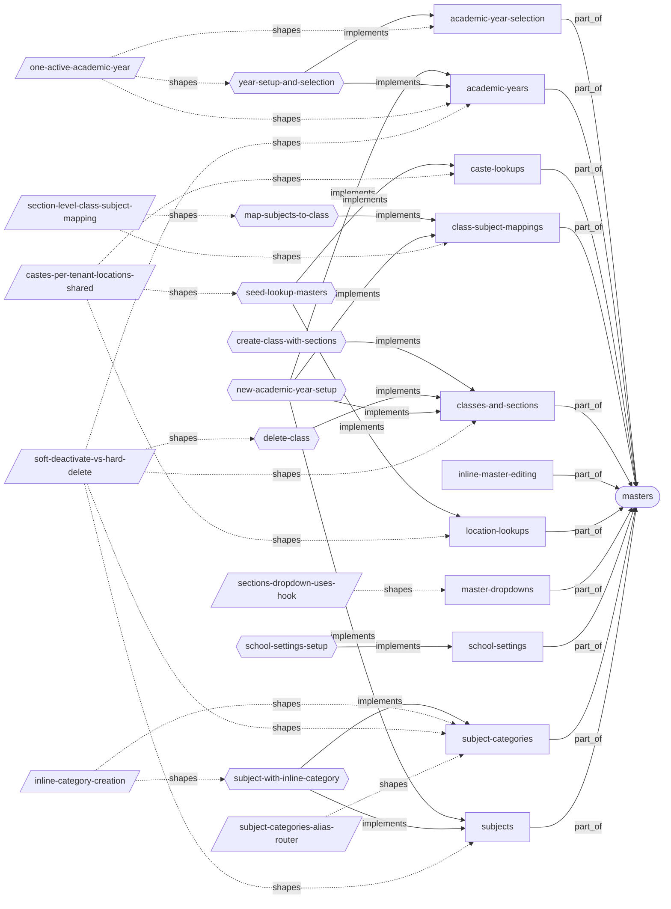
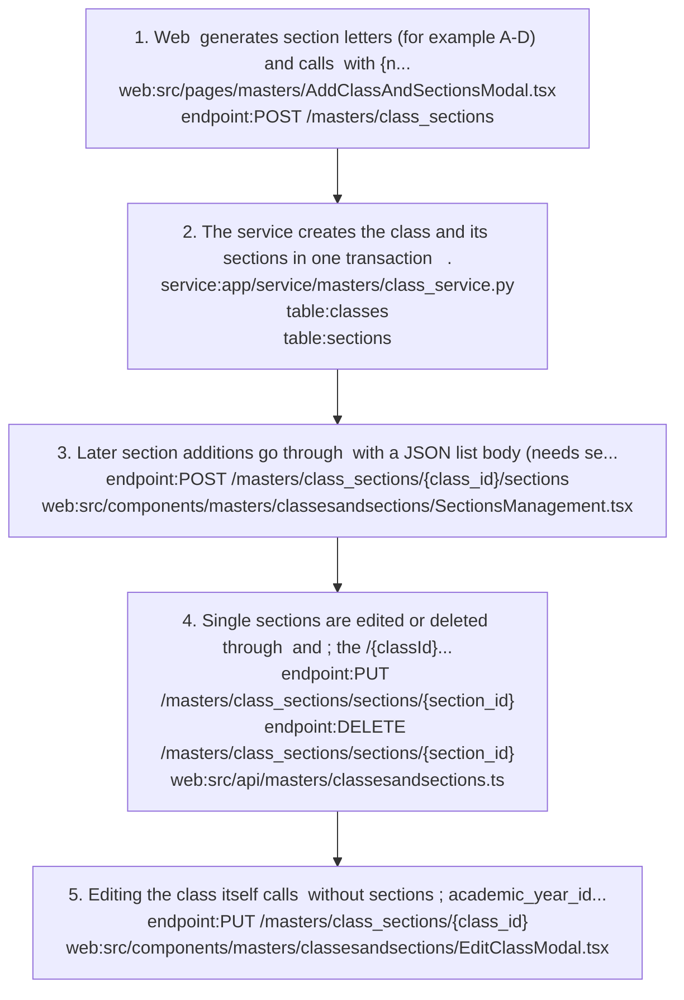
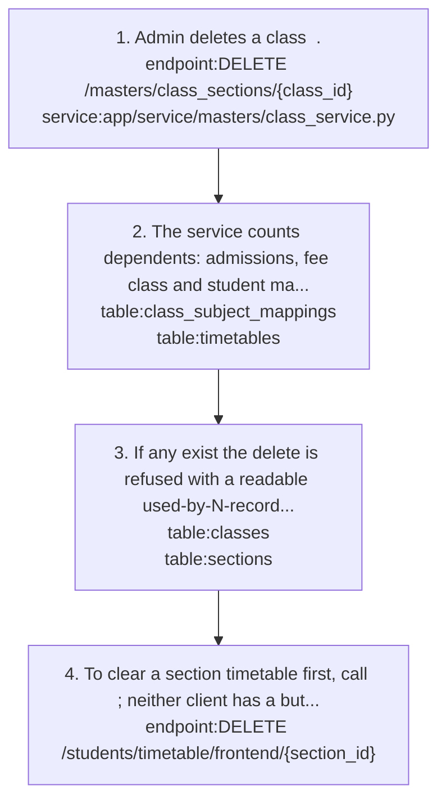
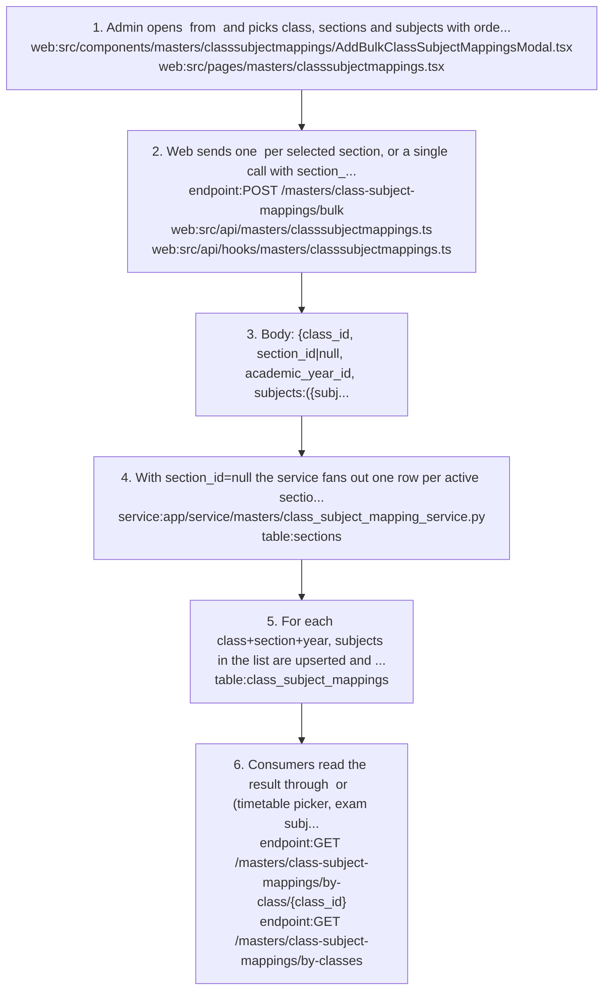
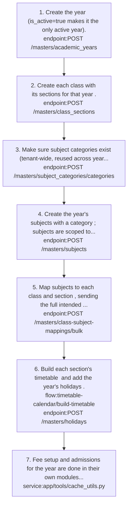
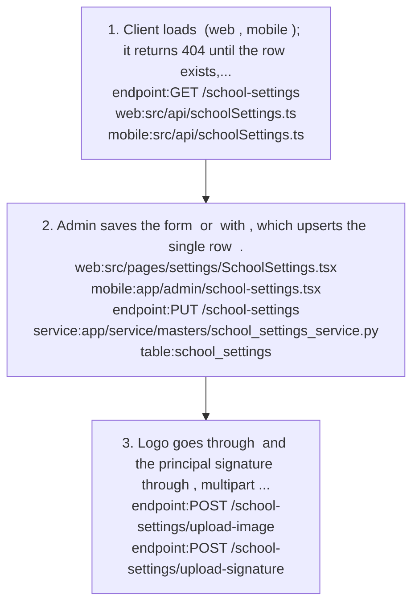
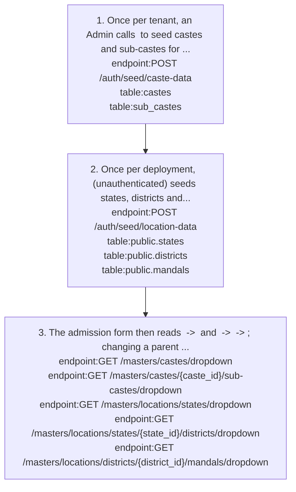
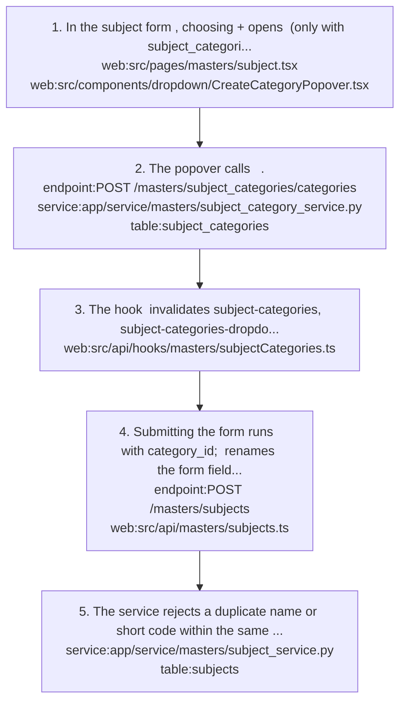
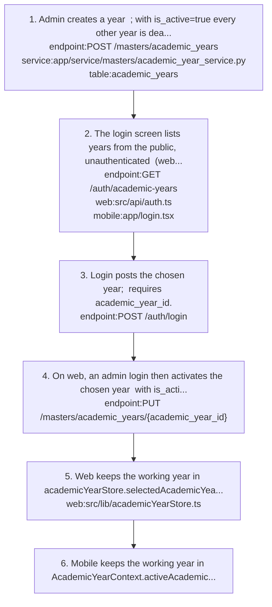

# masters: knowledge graph view

_Generated from `docs/graph/graph.jsonl` by `scripts/graph/kg_render.py`. Do not edit this file; change the graph and re-render._

Tenant reference data every other module hangs off: academic years, classes and sections, subject categories, subjects, class-subject mappings, caste and location lookups, school settings, and the dropdowns that consume them.

Module doc: [docs/modules/masters.md](../../../docs/modules/masters.md)

## Features

### masters/academic-year-selection

The user picks an academic year at login; the client keeps it as the working year that scopes year-bound screens.
- Roles: All roles pick a year at login; only admin login on web changes the backend active year.
- Parity: Web admin login also activates the chosen year on the backend; mobile only scopes the session (mobile/contexts/AcademicYearContext.tsx activeAcademicYearId).
- Flows: [masters/year-setup-and-selection](#mastersyear-setup-and-selection)
- Implemented by: `endpoint:GET /auth/academic-years`, `endpoint:POST /auth/login`, `endpoint:PUT /masters/academic_years/{academic_year_id}`, `mobile:app/login.tsx`, `web:src/api/auth.ts`, `web:src/lib/academicYearStore.ts`
- Shaped by: [masters/one-active-academic-year](#mastersone-active-academic-year)

### masters/academic-years

Create, edit, deactivate and permanently delete academic years (title, start/end date, is_active); activating one deactivates all others.
- Roles: Admin has full CRUD on academic_years; other roles read/list.
- Parity: Both clients have a management screen; both must pass active_only=false or only the active year is listed.
- Note: DELETE only deactivates; DELETE /{id}/permanent hard-deletes and is blocked while admissions, fee mappings, fee types or CSMs reference the year.
- Flows: [masters/new-academic-year-setup](#mastersnew-academic-year-setup), [masters/year-setup-and-selection](#mastersyear-setup-and-selection)
- Implemented by: `endpoint:DELETE /masters/academic_years/{academic_year_id}`, `endpoint:DELETE /masters/academic_years/{academic_year_id}/permanent`, `endpoint:GET /masters/academic_years`, `endpoint:POST /masters/academic_years`, `endpoint:PUT /masters/academic_years/{academic_year_id}`, `mobile:app/masters/academicyears.tsx`, `service:app/service/masters/academic_year_service.py`, `table:academic_years`, `web:src/pages/masters/academicyears.tsx`
- Shaped by: [masters/one-active-academic-year](#mastersone-active-academic-year), [masters/soft-deactivate-vs-hard-delete](#masterssoft-deactivate-vs-hard-delete)

### masters/caste-lookups

Castes with sub-castes, stored per tenant and seeded once by an admin; they feed the admission form's cascading caste -> sub-caste dropdown.
- Parity: No management UI on web or mobile; data is seeded or entered through the API.
- Note: An empty caste dropdown means the tenant seed was never run. Caste delete is blocked while students or sub-castes reference it.
- Flows: [masters/seed-lookup-masters](#mastersseed-lookup-masters)
- Implemented by: `endpoint:GET /masters/castes/dropdown`, `endpoint:GET /masters/castes/{caste_id}/sub-castes/dropdown`, `endpoint:POST /auth/seed/caste-data`, `service:app/service/masters/caste_service.py`, `table:castes`, `table:sub_castes`
- Shaped by: [masters/castes-per-tenant-locations-shared](#masterscastes-per-tenant-locations-shared)

### masters/class-subject-mappings

Say which subjects a class and section study in a year, with display order and an exclude_marks flag; set in bulk per section or for all sections.
- Roles: Admin via class_subject_mappings:create/update/delete; other roles read/list.
- Note: Consumed by the timetable subject picker and by exam subject configuration through GET /masters/class-subject-mappings/by-classes.
- Note: Web has a duplicate createBulkClassSubjectMappings in src/api/masters/subjects.ts posting to a path missing /masters; only the classsubjectmappings.ts pair is correct.
- Flows: [masters/map-subjects-to-class](#mastersmap-subjects-to-class), [masters/new-academic-year-setup](#mastersnew-academic-year-setup)
- Implemented by: `endpoint:GET /masters/class-subject-mappings/by-class/{class_id}`, `endpoint:GET /masters/class-subject-mappings/by-classes`, `endpoint:GET /masters/class-subject-mappings/dropdown`, `endpoint:POST /masters/class-subject-mappings`, `endpoint:POST /masters/class-subject-mappings/bulk`, `mobile:app/masters/classsubjectmappings.tsx`, `service:app/service/masters/class_subject_mapping_service.py`, `table:class_subject_mappings`, `web:src/api/hooks/masters/classsubjectmappings.ts`, `web:src/api/masters/classsubjectmappings.ts`, `web:src/components/masters/classsubjectmappings/AddBulkClassSubjectMappingsModal.tsx`, `web:src/pages/masters/classsubjectmappings.tsx`
- Shaped by: [masters/section-level-class-subject-mapping](#masterssection-level-class-subject-mapping)

### masters/classes-and-sections

Create a class together with its sections in one call, then add, edit or delete sections one at a time; delete a class with its sections.
- Roles: Admin via classes:create/update/delete; adding sections to an existing class needs sections:create.
- Parity: Web shows a Class -> Sections tree; mobile shows a flattened list and its add-section call sends an object instead of the expected list.
- Note: Class delete is blocked by admissions, fee class or student mappings, CSMs, or section-level admissions, fee mappings or timetables.
- Note: Section delete is a hard delete; a foreign-key violation returns 400 telling the user to deactivate instead.
- Flows: [masters/create-class-with-sections](#masterscreate-class-with-sections), [masters/delete-class](#mastersdelete-class), [masters/new-academic-year-setup](#mastersnew-academic-year-setup)
- Implemented by: `endpoint:DELETE /masters/class_sections/sections/{section_id}`, `endpoint:DELETE /masters/class_sections/{class_id}`, `endpoint:GET /masters/class_sections/read_all`, `endpoint:POST /masters/class_sections`, `endpoint:POST /masters/class_sections/{class_id}/sections`, `endpoint:PUT /masters/class_sections/sections/{section_id}`, `endpoint:PUT /masters/class_sections/{class_id}`, `mobile:app/masters/classesandsections.tsx`, `service:app/service/masters/class_service.py`, `table:classes`, `table:sections`, `web:src/api/masters/classesandsections.ts`, `web:src/components/masters/classesandsections/EditClassModal.tsx`, `web:src/components/masters/classesandsections/SectionsManagement.tsx`, `web:src/pages/masters/AddClassAndSectionsModal.tsx`, `web:src/pages/masters/classesandsections.tsx`
- Shaped by: [masters/soft-deactivate-vs-hard-delete](#masterssoft-deactivate-vs-hard-delete)

### masters/inline-master-editing

Web master pages (academic years, subject categories) render through a generic MasterPage with inline table editing.
- Parity: Web only; mobile uses form screens.
- Implemented by: `web:src/pages/masters/academicyears.tsx`, `web:src/pages/masters/common/MasterPage.tsx`, `web:src/pages/masters/subjectcategories.tsx`

### masters/location-lookups

States -> districts -> mandals shared by all tenants in the public schema, seeded once, feeding cascading address dropdowns where changing a parent clears its children.
- Parity: No working management UI; the mobile Locations screen calls a flat /masters/locations/ route that does not exist.
- Note: POST /auth/seed/location-data is unauthenticated. State and district deletes are blocked while children exist.
- Flows: [masters/seed-lookup-masters](#mastersseed-lookup-masters)
- Implemented by: `endpoint:GET /masters/locations/districts/{district_id}/mandals/dropdown`, `endpoint:GET /masters/locations/states/dropdown`, `endpoint:GET /masters/locations/states/{state_id}/districts/dropdown`, `endpoint:POST /auth/seed/location-data`, `mobile:app/masters/locations.tsx`, `service:app/service/masters/location_service.py`, `table:public.districts`, `table:public.mandals`, `table:public.states`
- Shaped by: [masters/castes-per-tenant-locations-shared](#masterscastes-per-tenant-locations-shared)

### masters/master-dropdowns

Dropdown endpoints for years, classes, sections, subjects, categories, CSMs and lookups, cached per tenant, consumed by shared dropdown components on web and mobile.
- Note: Backend dropdowns and the academic-year list are cached in memory for 5 minutes (TTLCache keyed by the tenant id), per process; expect stale dropdowns after edits.
- Note: Items are {id, name} (years use {id, title}); salary ranges and admission types return {value, label} instead.
- Note: Only ClassesDropdown and SectionsByClassDropdown from the web dropdown-system are in use; several entries in constants/dropdown/endpoints.ts are stale.
- Note: Mobile CustomDropdown crashes on search if any label is undefined; map with label: x.name || ''.
- Implemented by: `endpoint:GET /masters/academic_years/dropdown`, `endpoint:GET /masters/class-subject-mappings/dropdown`, `endpoint:GET /masters/class_sections/by_class_id/{class_id}/sections`, `endpoint:GET /masters/class_sections/dropdown`, `endpoint:GET /masters/subject_categories/categories/dropdown`, `mobile:components/ui/dropdown.tsx`, `service:app/tools/cache_utils.py`, `web:src/components/dropdown-system/components/ClassesDropdown.tsx`, `web:src/components/dropdown-system/components/SectionsByClassDropdown.tsx`, `web:src/constants/dropdown/endpoints.ts`, `web:src/hooks/masters/useClassesAndSections.ts`
- Shaped by: [masters/sections-dropdown-uses-hook](#masterssections-dropdown-uses-hook)

### masters/school-settings

Single per-tenant row with school name, contacts, address, board, academic-year label, logo and principal signature (web menu label: School Registration).
- Roles: school_settings:read and update; the menu item is hidden for teacher and student roles on web and mobile.
- Note: PUT is a full replace of the text fields (omitted fields become null); logo and signature change only through the upload endpoints.
- Note: Uploaded files go to media/school/{images,signatures}/ with a fixed name that is not tenant-scoped, so tenants overwrite each other.
- Flows: [masters/school-settings-setup](#mastersschool-settings-setup)
- Implemented by: `endpoint:GET /school-settings`, `endpoint:POST /school-settings/upload-image`, `endpoint:POST /school-settings/upload-signature`, `endpoint:PUT /school-settings`, `mobile:app/admin/school-settings.tsx`, `mobile:src/api/schoolSettings.ts`, `service:app/service/masters/school_settings_service.py`, `table:school_settings`, `web:src/api/schoolSettings.ts`, `web:src/lib/menuUtils.ts`, `web:src/pages/settings/SchoolSettings.tsx`

### masters/subject-categories

Tenant-wide flat list of subject category names (no academic year), managed on its own page or created inline from the subject form.
- Roles: Admin via subject_categories:create/update/delete; the inline popover is shown only with subject_categories:create.
- Parity: Inline category popover is web only.
- Note: Category delete is a hard delete, blocked while any subject uses it.
- Flows: [masters/subject-with-inline-category](#masterssubject-with-inline-category)
- Implemented by: `endpoint:DELETE /masters/subject_categories/categories/{category_id}`, `endpoint:GET /masters/subject_categories/categories`, `endpoint:GET /masters/subject_categories/categories/dropdown`, `endpoint:POST /masters/subject_categories/categories`, `endpoint:POST /subject-categories`, `mobile:app/masters/subjectcategories.tsx`, `service:app/service/masters/subject_category_service.py`, `table:subject_categories`, `web:src/api/hooks/masters/subjectCategories.ts`, `web:src/components/dropdown/CreateCategoryPopover.tsx`, `web:src/pages/masters/subjectcategories.tsx`
- Shaped by: [masters/inline-category-creation](#mastersinline-category-creation), [masters/soft-deactivate-vs-hard-delete](#masterssoft-deactivate-vs-hard-delete), [masters/subject-categories-alias-router](#masterssubject-categories-alias-router)

### masters/subjects

Subjects with name, short_code, category_id and academic_year_id; duplicate name or short code within the same year is rejected; delete is a soft deactivate.
- Roles: Admin via subjects:create/update/delete; other roles read/list.
- Parity: Mobile also sends is_practical and description, which the backend ignores.
- Note: GET /masters/subjects/ returns a plain array of up to 1000; /paginated returns {items,total_count,has_next}. Web fetchSubjects handles both shapes.
- Flows: [masters/new-academic-year-setup](#mastersnew-academic-year-setup), [masters/subject-with-inline-category](#masterssubject-with-inline-category)
- Implemented by: `endpoint:DELETE /masters/subjects/{subject_id}`, `endpoint:GET /masters/subjects`, `endpoint:GET /masters/subjects/paginated`, `endpoint:POST /masters/subjects`, `mobile:app/masters/subjects.tsx`, `service:app/service/masters/subject_service.py`, `table:subjects`, `web:src/api/masters/subjects.ts`, `web:src/pages/masters/subject.tsx`
- Shaped by: [masters/soft-deactivate-vs-hard-delete](#masterssoft-deactivate-vs-hard-delete)

## Flows

### masters/create-class-with-sections

Implements: `feature:masters/classes-and-sections`

1. Web `web:src/pages/masters/AddClassAndSectionsModal.tsx` generates section letters (for example A-D) and calls `endpoint:POST /masters/class_sections` with {name, short_code, academic_year_id, sections:[{name}]}.
2. The service creates the class and its sections in one transaction `service:app/service/masters/class_service.py` `table:classes` `table:sections`.
3. Later section additions go through `endpoint:POST /masters/class_sections/{class_id}/sections` with a JSON list body (needs sections:create) `web:src/components/masters/classesandsections/SectionsManagement.tsx`.
4. Single sections are edited or deleted through `endpoint:PUT /masters/class_sections/sections/{section_id}` and `endpoint:DELETE /masters/class_sections/sections/{section_id}`; the /{classId}/sections/{sectionId} variants in `web:src/api/masters/classesandsections.ts` return 404.
5. Editing the class itself calls `endpoint:PUT /masters/class_sections/{class_id}` without sections `web:src/components/masters/classesandsections/EditClassModal.tsx`; academic_year_id must be sent (may be null).

- Failure: Sending sections in the class PUT deletes every section and re-inserts them with new IDs, breaking admissions, fee mappings and timetables or failing on the foreign key.
- Failure: Mobile add-section `mobile:app/masters/classesandsections.tsx` sends a single object instead of a list and fails validation.

### masters/delete-class

Implements: `feature:masters/classes-and-sections`

1. Admin deletes a class `endpoint:DELETE /masters/class_sections/{class_id}` `service:app/service/masters/class_service.py`.
2. The service counts dependents: admissions, fee class and student mappings, CSMs `table:class_subject_mappings`, and section-level admissions, fee mappings and timetables `table:timetables`.
3. If any exist the delete is refused with a readable used-by-N-records message; otherwise the class and its sections are hard-deleted `table:classes` `table:sections`.
4. To clear a section timetable first, call `endpoint:DELETE /students/timetable/frontend/{section_id}`; neither client has a button for that.

Shaped by: [masters/soft-deactivate-vs-hard-delete](#masterssoft-deactivate-vs-hard-delete)

### masters/map-subjects-to-class

Implements: `feature:masters/class-subject-mappings`

1. Admin opens `web:src/components/masters/classsubjectmappings/AddBulkClassSubjectMappingsModal.tsx` from `web:src/pages/masters/classsubjectmappings.tsx` and picks class, sections and subjects with order and exclude_marks.
2. Web sends one `endpoint:POST /masters/class-subject-mappings/bulk` per selected section, or a single call with section_id=null for All Sections `web:src/api/masters/classsubjectmappings.ts` `web:src/api/hooks/masters/classsubjectmappings.ts`.
3. Body: {class_id, section_id|null, academic_year_id, subjects:[{subject_id, order, exclude_marks, is_active}]}.
4. With section_id=null the service fans out one row per active section of the class `service:app/service/masters/class_subject_mapping_service.py` `table:sections` and returns sections_processed.
5. For each class+section+year, subjects in the list are upserted and any existing mapping missing from subjects[] is set is_active=false `table:class_subject_mappings`; unknown subject_ids are skipped silently.
6. Consumers read the result through `endpoint:GET /masters/class-subject-mappings/by-class/{class_id}` or `endpoint:GET /masters/class-subject-mappings/by-classes` (timetable picker, exam subject configuration); dedupe by subject_id for a class-level list.

- Failure: The web modal does not preload existing mappings, so submitting two new subjects deactivates every other mapping for those sections.

- Note: A single POST without section_id `endpoint:POST /masters/class-subject-mappings` creates a class-level row; NULLs are distinct in the unique constraint so duplicates are possible, and the dropdown endpoint fails on such rows. Prefer bulk.

Shaped by: [masters/section-level-class-subject-mapping](#masterssection-level-class-subject-mapping)

### masters/new-academic-year-setup

Implements: `feature:masters/academic-years`, `feature:masters/class-subject-mappings`, `feature:masters/classes-and-sections`, `feature:masters/subjects`

- Precondition: Admin role with create rights on academic_years, classes, subject_categories, subjects and class_subject_mappings.

1. Create the year `endpoint:POST /masters/academic_years` (is_active=true makes it the only active year).
2. Create each class with its sections for that year `endpoint:POST /masters/class_sections`.
3. Make sure subject categories exist (tenant-wide, reused across years) `endpoint:POST /masters/subject_categories/categories`.
4. Create the year's subjects with a category `endpoint:POST /masters/subjects`; subjects are scoped to academic_year_id.
5. Map subjects to each class and section `endpoint:POST /masters/class-subject-mappings/bulk`, sending the full intended set per section.
6. Build each section's timetable `flow:timetable-calendar/build-timetable` and add the year's holidays `endpoint:POST /masters/holidays`.
7. Fee setup and admissions for the year are done in their own modules; expect up to 5 minutes of stale dropdowns after these edits `service:app/tools/cache_utils.py`.

- Note: There is no copy-from-previous-year; every master except categories and lookups is re-created per year.

### masters/school-settings-setup

Implements: `feature:masters/school-settings`

1. Client loads `endpoint:GET /school-settings` (web `web:src/api/schoolSettings.ts`, mobile `mobile:src/api/schoolSettings.ts`); it returns 404 until the row exists, which both clients treat as not configured (null).
2. Admin saves the form `web:src/pages/settings/SchoolSettings.tsx` or `mobile:app/admin/school-settings.tsx` with `endpoint:PUT /school-settings`, which upserts the single row `service:app/service/masters/school_settings_service.py` `table:school_settings`.
3. Logo goes through `endpoint:POST /school-settings/upload-image` and the principal signature through `endpoint:POST /school-settings/upload-signature`, multipart field photo, jpg/png/webp, max 2 MB.

- Failure: Omitted text fields in PUT become null, because PUT is a full replace.

### masters/seed-lookup-masters

Implements: `feature:masters/caste-lookups`, `feature:masters/location-lookups`

1. Once per tenant, an Admin calls `endpoint:POST /auth/seed/caste-data` to seed castes and sub-castes for the tenant `table:castes` `table:sub_castes`.
2. Once per deployment, `endpoint:POST /auth/seed/location-data` (unauthenticated) seeds states, districts and mandals into the public schema `table:public.states` `table:public.districts` `table:public.mandals`.
3. The admission form then reads `endpoint:GET /masters/castes/dropdown` -> `endpoint:GET /masters/castes/{caste_id}/sub-castes/dropdown` and `endpoint:GET /masters/locations/states/dropdown` -> `endpoint:GET /masters/locations/states/{state_id}/districts/dropdown` -> `endpoint:GET /masters/locations/districts/{district_id}/mandals/dropdown`; changing a parent clears its children.

Shaped by: [masters/castes-per-tenant-locations-shared](#masterscastes-per-tenant-locations-shared)

### masters/subject-with-inline-category

Implements: `feature:masters/subject-categories`, `feature:masters/subjects`

1. In the subject form `web:src/pages/masters/subject.tsx`, choosing + opens `web:src/components/dropdown/CreateCategoryPopover.tsx` (only with subject_categories:create).
2. The popover calls `endpoint:POST /masters/subject_categories/categories` `service:app/service/masters/subject_category_service.py` `table:subject_categories`.
3. The hook `web:src/api/hooks/masters/subjectCategories.ts` invalidates subject-categories, subject-categories-dropdown and subject-categories-infinite, and the new category is auto-selected.
4. Submitting the form runs `endpoint:POST /masters/subjects` with category_id; `web:src/api/masters/subjects.ts` renames the form field subject_category_id to category_id.
5. The service rejects a duplicate name or short code within the same academic year `service:app/service/masters/subject_service.py` `table:subjects`.

- Failure: A subject saved without a category breaks every subject response with a 500, because SubjectRead.category is required. Always set a category.

Shaped by: [masters/inline-category-creation](#mastersinline-category-creation)

### masters/year-setup-and-selection

Implements: `feature:masters/academic-year-selection`, `feature:masters/academic-years`

- Trigger: Admin creates a year, or any user logs in.

1. Admin creates a year `endpoint:POST /masters/academic_years` `service:app/service/masters/academic_year_service.py`; with is_active=true every other year is deactivated `table:academic_years`.
2. The login screen lists years from the public, unauthenticated `endpoint:GET /auth/academic-years` (web `web:src/api/auth.ts`, mobile `mobile:app/login.tsx`).
3. Login posts the chosen year; `endpoint:POST /auth/login` requires academic_year_id.
4. On web, an admin login then activates the chosen year `endpoint:PUT /masters/academic_years/{academic_year_id}` with is_active:true, so the active year is the year the last admin logged into.
5. Web keeps the working year in academicYearStore.selectedAcademicYearId (persisted) `web:src/lib/academicYearStore.ts`; if nothing is stored it falls back to the active year, else the last year in the list.
6. Mobile keeps the working year in AcademicYearContext.activeAcademicYearId (mobile/contexts/AcademicYearContext.tsx) and does not change the backend active year.

Shaped by: [masters/one-active-academic-year](#mastersone-active-academic-year)

## Decisions

### masters/castes-per-tenant-locations-shared

- **Decision**: Castes and sub-castes are tenant tables; states, districts and mandals are shared platform tables with no tenant_id.
- **Why**: Schools can customise caste and sub-caste lists, while states, districts and mandals are the same for everyone.
- Shapes: `feature:masters/caste-lookups`, `feature:masters/location-lookups`, `flow:masters/seed-lookup-masters`, `table:castes`, `table:public.districts`, `table:public.mandals`, `table:public.states`

### masters/inline-category-creation

- **Decision**: Subject categories can be created inline from the subject form through a popover, rather than merging Subjects and Categories into one screen.
- **Why**: Fewest clicks without a new page. The popover uses modal={true} so it works inside the subject Dialog.
- **Alternatives**: A merged Subjects+Categories screen.
- Shapes: `feature:masters/subject-categories`, `flow:masters/subject-with-inline-category`, `web:src/components/dropdown/CreateCategoryPopover.tsx`

### masters/one-active-academic-year

- **Decision**: Only one academic year is active per tenant, and a web admin login activates the year chosen at login.
- **Why**: The login year selector and the rest of the system (fee and exam defaults) share one notion of the current year.
- **Tradeoff**: The active year is effectively whichever year the last admin logged into.
- Shapes: `feature:masters/academic-year-selection`, `feature:masters/academic-years`, `flow:masters/year-setup-and-selection`, `service:app/service/masters/academic_year_service.py`

### masters/section-level-class-subject-mapping

- **Decision**: Class-subject mappings are per section: unique on (class_id, section_id, subject_id, academic_year_id), and section_id=null in the bulk call means all active sections.
- **Why**: Different sections of one class can study different subject sets.
- **Tradeoff**: Class-level rows with a null section can still be created by the single POST; NULLs are distinct in the unique constraint, so duplicates are possible.
- Shapes: `endpoint:POST /masters/class-subject-mappings/bulk`, `feature:masters/class-subject-mappings`, `flow:masters/map-subjects-to-class`, `table:class_subject_mappings`

### masters/sections-dropdown-uses-hook

- **Decision**: SectionsByClassDropdown fetches through the useSectionsByClassId hook instead of the generic dropdown-system endpoint config.
- **Why**: The backend takes the class as a path parameter (by_class_id/{class_id}/sections), which the generic config cannot express.
- Shapes: `feature:masters/master-dropdowns`, `web:src/components/dropdown-system/components/SectionsByClassDropdown.tsx`, `web:src/hooks/masters/useClassesAndSections.ts`

### masters/soft-deactivate-vs-hard-delete

- **Decision**: Academic years, subjects and holidays are soft-deactivated; structural rows (classes, sections, categories, CSMs) are hard-deleted after dependency checks, and refused with a readable used-by-N-records message instead of cascading.
- **Why**: Years and subjects are referenced historically (fees, exams), so their rows must survive; structural rows fail loudly rather than cascade.
- **Alternatives**: Cascading deletes.
- Shapes: `endpoint:DELETE /masters/academic_years/{academic_year_id}`, `endpoint:DELETE /masters/academic_years/{academic_year_id}/permanent`, `endpoint:DELETE /masters/class_sections/{class_id}`, `endpoint:DELETE /masters/subjects/{subject_id}`, `feature:masters/academic-years`, `feature:masters/classes-and-sections`, `feature:masters/subject-categories`, `feature:masters/subjects`, `feature:timetable-calendar/holiday-management`, `flow:masters/delete-class`

### masters/subject-categories-alias-router

- **Decision**: Keep a /subject-categories alias router (GET and POST only) alongside /masters/subject_categories/categories, calling the same service.
- **Why**: The inline-create popover originally targeted that path.
- Shapes: `endpoint:POST /subject-categories`, `feature:masters/subject-categories`

## Concepts

### masters/academic-year

A school year with a unique title, start and end date and is_active. Classes, subjects, class-subject mappings, holidays, fee setup and admissions are scoped to a year.
- Note: The field is title, not name; dropdown items are {id, title}.
- Related: `feature:masters/academic-years`, `table:academic_years`

### masters/active-vs-working-year

The active year is the single backend row with is_active=true (fee and exam defaults). The working year is the one the client selected at login and scopes its requests; they differ on mobile and for non-admin web users.
- Related: `concept:masters/academic-year`, `feature:masters/academic-year-selection`, `web:src/lib/academicYearStore.ts`

### masters/caste-and-sub-caste

Tenant-level social category lookup with child sub-castes, used by the student admission form.
- Related: `feature:masters/caste-lookups`, `table:castes`, `table:sub_castes`

### masters/class

A grade within an academic year (name, short_code, academic_year_id, is_active) that contains sections.
- Related: `feature:masters/classes-and-sections`, `table:classes`

### masters/class-level-mapping

A class-subject mapping with section_id null. The timetable editor treats it as applying to every section; the dropdown endpoint fails on it.
- Related: `concept:masters/class-subject-mapping`, `table:class_subject_mappings`

### masters/class-subject-mapping

CSM: a row saying a class+section studies a subject in a year, with order and exclude_marks. Read by the timetable subject picker and exam subject configuration.
- Related: `concept:masters/section`, `concept:masters/subject`, `feature:masters/class-subject-mappings`, `table:class_subject_mappings`

### masters/deactivation

Soft delete by setting is_active=false. List endpoints default active_only=true, so management screens must pass active_only=false to see deactivated rows.
- Related: `feature:masters/academic-years`, `feature:masters/subjects`, `feature:timetable-calendar/holiday-management`

### masters/exclude-marks

A class-subject mapping flag meaning the subject is taught but left out of marks totals.
- Related: `concept:masters/class-subject-mapping`

### masters/fixed-lookup-lists

Salary ranges and admission types are fixed backend lists returned as {value, label}, not editable masters.
- Related: `feature:masters/master-dropdowns`

### masters/location-hierarchy

State -> district -> mandal address lookup in the public schema shared by all tenants; a mandal is the sub-district administrative unit.
- Related: `feature:masters/location-lookups`, `table:public.districts`, `table:public.mandals`, `table:public.states`

### masters/replace-set-bulk-mapping

The bulk CSM call treats subjects[] as the complete set for a class+section+year: missing subjects are deactivated, not left alone.
- Related: `concept:masters/class-subject-mapping`, `endpoint:POST /masters/class-subject-mappings/bulk`

### masters/school-registration

The single per-tenant school settings row; shown in the web menu as School Registration, injected client-side under Masters.
- Related: `feature:masters/school-settings`, `table:school_settings`, `web:src/lib/menuUtils.ts`

### masters/section

A division of a class (for example A-D). Admissions, timetables, fee mappings and class-subject mappings point at section IDs, so section IDs must stay stable.
- Note: Section names are meant to repeat across classes; the web generates A-D for every class.
- Related: `concept:masters/class`, `feature:masters/classes-and-sections`, `table:sections`

### masters/subject

A taught subject for one academic year with name, short_code and a required category. Backend short_code/category map to web code/subject_category.
- Related: `concept:masters/subject-category`, `feature:masters/subjects`, `table:subjects`

### masters/subject-category

A tenant-wide grouping label for subjects with no academic year; names are compared case-sensitively.
- Related: `feature:masters/subject-categories`, `table:subject_categories`

### masters/tenant-vs-public-lookups

Lookup masters split by scope: castes are tenant data (customisable per school), locations are public data (identical for all tenants). Seeding differs accordingly.
- Related: `concept:masters/caste-and-sub-caste`, `concept:masters/location-hierarchy`, `decision:masters/castes-per-tenant-locations-shared`
