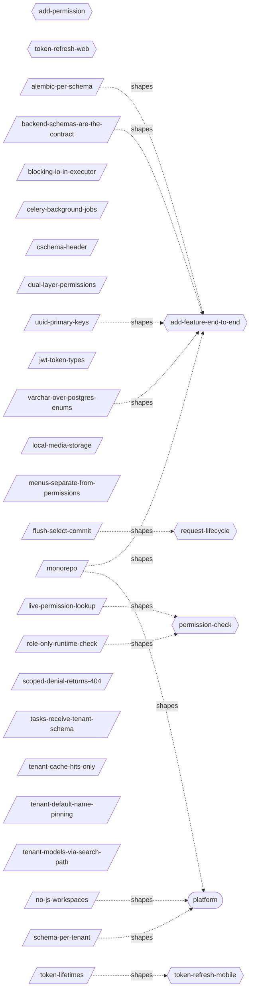
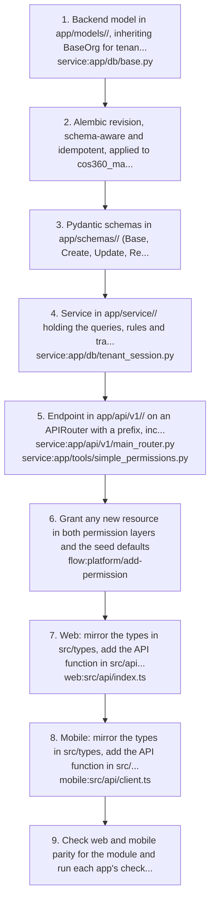
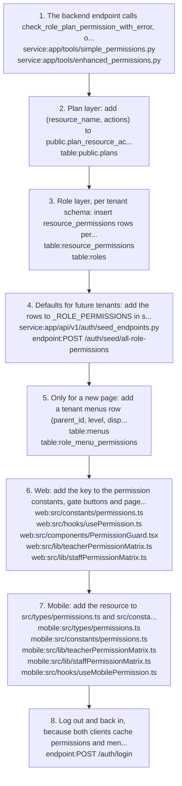
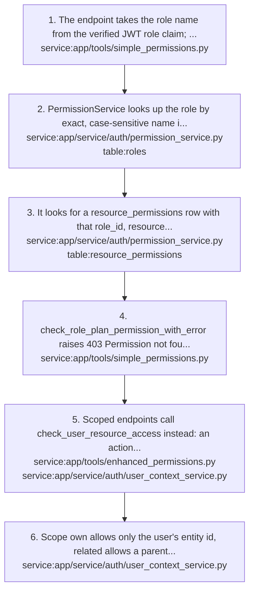
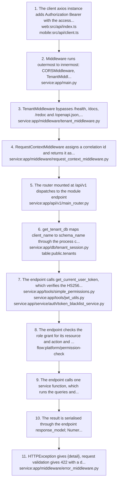
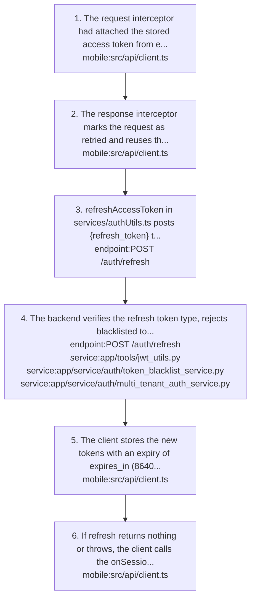
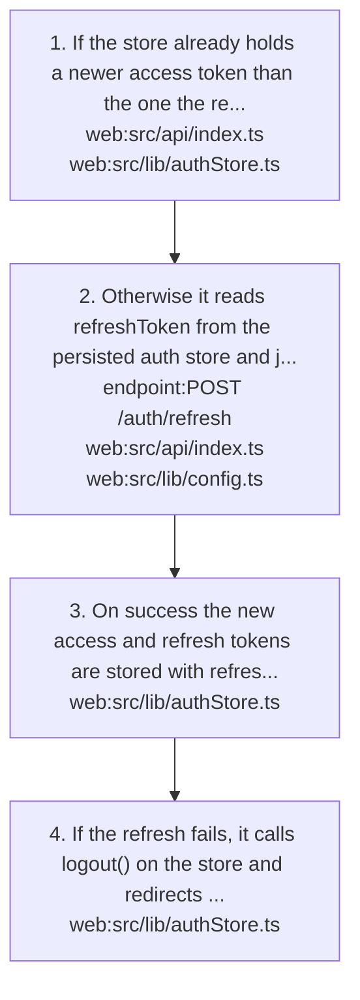

# platform: knowledge graph view

_Generated from `docs/graph/graph.jsonl` by `scripts/graph/kg_render.py`. Do not edit this file; change the graph and re-render._

Cross-cutting plumbing shared by every module: schema-per-tenant PostgreSQL, tenant resolution from the cschema header, JWT auth, the plan and role permission layers, menus, the web and mobile client contract, local file storage and Celery background jobs.

Module doc: [docs/architecture.md](../../../docs/architecture.md)

## Flows

### platform/add-feature-end-to-end

- Trigger: A feature that touches the API, following the root CLAUDE.md typical feature flow.

1. Backend model in app/models/<module>/, inheriting BaseOrg for tenant tables or BasePublic for public tables, registered in the module __init__.py `service:app/db/base.py`
2. Alembic revision, schema-aware and idempotent, applied to cos360_master and then every tenant schema before code that uses the new column is deployed.
3. Pydantic schemas in app/schemas/<module>/ (Base, Create, Update, Read, Dropdown), which are the API contract.
4. Service in app/service/<module>/ holding the queries, rules and transaction with flush -> select -> commit on the tenant session `service:app/db/tenant_session.py`
5. Endpoint in app/api/v1/<module>/ on an APIRouter with a prefix, included in main_router.py, starting with the token and permission check and calling one service function `service:app/api/v1/main_router.py` `service:app/tools/simple_permissions.py`
6. Grant any new resource in both permission layers and the seed defaults `flow:platform/add-permission`
7. Web: mirror the types in src/types, add the API function in src/api on the shared axios instance, a React Query hook in src/api/hooks, then the page or component `web:src/api/index.ts`
8. Mobile: mirror the types in src/types, add the API function in src/api on apiClient, a hook, then a screen under app/ for expo-router `mobile:src/api/client.ts`
9. Check web and mobile parity for the module and run each app's checks (ruff, black, pytest; build:check and lint; tsc, lint and test).

Shaped by: [platform/alembic-per-schema](#platformalembic-per-schema), [platform/backend-schemas-are-the-contract](#platformbackend-schemas-are-the-contract), [platform/monorepo](#platformmonorepo), [platform/uuid-primary-keys](#platformuuid-primary-keys), [platform/varchar-over-postgres-enums](#platformvarchar-over-postgres-enums)

### platform/add-permission

- Trigger: A new resource or action is added to the API.

1. The backend endpoint calls check_role_plan_permission_with_error, or check_user_resource_access when students or parents need _own or _related access, with the same resource string used everywhere `service:app/tools/simple_permissions.py` `service:app/tools/enhanced_permissions.py`
2. Plan layer: add (resource_name, actions) to public.plan_resource_access for every active plan, following backend/scripts/seed_communication_permissions.py; not checked at runtime but keeps the plan catalog and super-admin screens truthful `table:public.plans`
3. Role layer, per tenant schema: insert resource_permissions rows per role (Admin every action, both read and list, Student and Parent the _own or _related variants) with an idempotent script like backend/scripts/seed_expense_permissions.py `table:resource_permissions` `table:roles`
4. Defaults for future tenants: add the rows to _ROLE_PERMISSIONS in seed_endpoints.py `service:app/api/v1/auth/seed_endpoints.py` `endpoint:POST /auth/seed/all-role-permissions`
5. Only for a new page: add a tenant menus row (parent_id, level, display_order) and role_menu_permissions can_view per role, and for Student or Parent add the URL to _STUDENT_PARENT_MENU_URLS `table:menus` `table:role_menu_permissions`
6. Web: add the key to the permission constants, gate buttons and pages with usePermission or PermissionGuard, and update both Teacher and Staff matrices if those roles are capped `web:src/constants/permissions.ts` `web:src/hooks/usePermission.ts` `web:src/components/PermissionGuard.tsx` `web:src/lib/teacherPermissionMatrix.ts` `web:src/lib/staffPermissionMatrix.ts`
7. Mobile: add the resource to src/types/permissions.ts and src/constants/permissions.ts, mirror any matrix change, and gate the tab, tile or screen `mobile:src/types/permissions.ts` `mobile:src/constants/permissions.ts` `mobile:src/lib/teacherPermissionMatrix.ts` `mobile:src/lib/staffPermissionMatrix.ts` `mobile:src/hooks/useMobilePermission.ts`
8. Log out and back in, because both clients cache permissions and menus from the login response, then confirm 403 turns into 200 for the intended roles only `endpoint:POST /auth/login`

- Failure: A resource with no role-layer rows returns 403 for everyone, including Admin.

### platform/permission-check

- Trigger: A tenant endpoint calls check_role_plan_permission_with_error(db, request, role, resource, action) or check_user_resource_access(db, request, resource, action, target_entity_id).

1. The endpoint takes the role name from the verified JWT role claim; permissions are never read from the token `service:app/tools/simple_permissions.py`
2. PermissionService looks up the role by exact, case-sensitive name in the tenant roles table; no role means denied `service:app/service/auth/permission_service.py` `table:roles`
3. It looks for a resource_permissions row with that role_id, resource and action and is_granted true `service:app/service/auth/permission_service.py` `table:resource_permissions`
4. check_role_plan_permission_with_error raises 403 Permission not found in database when no row matches, and 500 if the check itself fails; the plan layer is not consulted `service:app/tools/simple_permissions.py`
5. Scoped endpoints call check_user_resource_access instead: an action ending in _own or _related is checked as is, otherwise <action>_own, then <action>_related, then <action>, and the first match sets the scope `service:app/tools/enhanced_permissions.py` `service:app/service/auth/user_context_service.py`
6. Scope own allows only the user's entity id, related allows a parent's linked children, all allows any id; a targeted id outside the scope returns 404 `service:app/service/auth/user_context_service.py`

- Result: Checks are live queries on every request, so a grant change applies on the backend at once; clients see it only after the next login.

Shaped by: [platform/live-permission-lookup](#platformlive-permission-lookup), [platform/role-only-runtime-check](#platformrole-only-runtime-check)

### platform/request-lifecycle

- Trigger: Any web or mobile call to a tenant endpoint under /api/v1.

1. The client axios instance adds Authorization Bearer with the access token and the cschema header, plus X-Student-ID, X-Academic-Year-ID and X-Class-ID for parents, which the backend ignores `web:src/api/index.ts` `mobile:src/api/client.ts`
2. Middleware runs outermost to innermost: CORSMiddleware, TenantMiddleware, SuperAdminMiddleware, RequestContextMiddleware, GlobalErrorMiddleware, all registered in main.py `service:app/main.py`
3. TenantMiddleware bypasses /health, /docs, /redoc and /openapi.json, sends /api/v1/super_admin/ paths down a super-admin branch that ignores cschema, and otherwise sets request.state.client_name (TENANT_DEFAULT_NAME when a cschema header is present) `service:app/middleware/tenant_middleware.py`
4. RequestContextMiddleware assigns a correlation id and returns it as the X-Correlation-ID response header `service:app/middleware/request_context_middleware.py`
5. The router mounted at /api/v1 dispatches to the module endpoint `service:app/api/v1/main_router.py`
6. get_tenant_db maps client_name to schema_name through the process cache or public.tenants, returns 404 for an unknown or inactive tenant (default falls back to cos360_master), opens a session and runs SET search_path `service:app/db/tenant_session.py` `table:public.tenants`
7. The endpoint calls get_current_user_token, which verifies the HS256 access token and its token_type, then rejects blacklisted tokens with 401 `service:app/tools/simple_permissions.py` `service:app/tools/jwt_utils.py` `service:app/service/auth/token_blacklist_service.py`
8. The endpoint checks the role grant for its resource and action and stops with 403 if it is missing `flow:platform/permission-check`
9. The endpoint calls one service function, which runs the queries and rules on the tenant session and writes with flush -> select -> commit, rolling back on error.
10. The result is serialised through the endpoint response_model; Numeric columns become strings and datetimes are naive UTC.
11. HTTPException gives {detail}, request validation gives 422 with a detail list, and uncaught exceptions become {error_code, message, details, request_id} from GlobalErrorMiddleware `service:app/middleware/error_middleware.py`

- Failure: An HTTPException raised inside a middleware, such as TenantMiddleware in strict mode, is not handled by FastAPI and surfaces as a plain 500.

- Note: The backend never checks that the token's client_name matches the request tenant; a token works in any tenant whose roles table has a role with the same name.

Shaped by: [platform/flush-select-commit](#platformflush-select-commit)

### platform/token-refresh-mobile

- Trigger: A mobile API call through apiClient gets a 401, has not been retried, and is not an auth endpoint (/auth/login, /auth/refresh, /auth/academic-years).

1. The request interceptor had attached the stored access token from expo-secure-store and the cschema header (stored org code, else EXPO_PUBLIC_DEFAULT_TENANT, else test_tenant) `mobile:src/api/client.ts`
2. The response interceptor marks the request as retried and reuses the shared in-flight refreshPromise, so concurrent 401s trigger a single refresh `mobile:src/api/client.ts`
3. refreshAccessToken in services/authUtils.ts posts {refresh_token} through apiClient `endpoint:POST /auth/refresh`
4. The backend verifies the refresh token type, rejects blacklisted tokens, checks the token's tenant is still active, and returns a new access and refresh pair with the current role and expires_in `endpoint:POST /auth/refresh` `service:app/tools/jwt_utils.py` `service:app/service/auth/token_blacklist_service.py` `service:app/service/auth/multi_tenant_auth_service.py`
5. The client stores the new tokens with an expiry of expires_in (86400 s), and retries the original request with the new bearer token `mobile:src/api/client.ts`
6. If refresh returns nothing or throws, the client calls the onSessionExpired callback registered by AuthProvider, which dispatches LOGOUT and returns to the login screen `mobile:src/api/client.ts`

Shaped by: [platform/token-lifetimes](#platformtoken-lifetimes)

### platform/token-refresh-web

- Trigger: A web API call through the shared axios instance gets a 401, has not been retried yet, and is not an /auth/login request.

1. If the store already holds a newer access token than the one the request was sent with, and no refresh is running, the request is retried once with that token `web:src/api/index.ts` `web:src/lib/authStore.ts`
2. Otherwise it reads refreshToken from the persisted auth store and joins the single in-flight refresh, starting one if none is running: POST {refresh_token} to `endpoint:POST /auth/refresh` with the current tenant header `web:src/api/index.ts` `web:src/lib/config.ts`
3. On success the new access and refresh tokens are stored with refreshTokens and every waiting request is retried once with the new bearer token `web:src/lib/authStore.ts`
4. If the refresh fails, it calls logout() on the store and redirects to /login `web:src/lib/authStore.ts`

## Decisions

### platform/alembic-per-schema (active)

- **Decision**: Alembic migrates one schema per run, chosen by the SCHEMA_NAME env var. migrations/env.py sets search_path to that schema plus public, every schema keeps its own alembic_version, and cos360_master is migrated before each tenant.
- **Why**: Tenant models carry no schema, so each schema has to be targeted and versioned on its own; env.py also uses Neon's direct host because the pooler rejects SET search_path (docs/operations/database-migrations.md).
- **Tradeoff**: History cannot be replayed from base and schemas are not uniformly versioned, so revisions must be idempotent (IF NOT EXISTS, guarded DO blocks).
- Shapes: `concept:platform/template-schema`, `flow:platform/add-feature-end-to-end`

### platform/backend-schemas-are-the-contract (active)

- **Decision**: Backend Pydantic schemas in backend/app/schemas are the API contract. Web mirrors them in web/src/types and mobile in mobile/src/types, and API call functions live in web/src/api and mobile/src/api.
- **Why**: Web and mobile are both clients of the same backend, so one definition keeps both clients aligned with the API (root CLAUDE.md).
- Shapes: `flow:platform/add-feature-end-to-end`

### platform/blocking-io-in-executor (active)

- **Decision**: Blocking sync HTTP calls inside async code run through await loop.run_in_executor(None, fn, ...), for example _call_provider in the communication send task and the fee-receipt SMS in fee_collection_service.py.
- **Why**: So a blocking provider call does not stall the event loop that serves every other request on the worker (docs/architecture.md).
- Shapes: `job:app/tasks/communication/send_tasks.py`

### platform/celery-background-jobs (active)

- **Decision**: Slow or external work runs as Celery tasks on a Redis broker (REDIS_HOST, REDIS_PORT, REDIS_DB): SMS, WhatsApp and email sends, report exports, certificate tasks, and the daily stale-file cleanup beat job.
- **Why**: The API answers immediately while delivery happens in the worker, and for sends the queued DB rows remain as evidence for reprocessing if the broker is down (docs/modules/communication.md).
- **Tradeoff**: No compose file runs a worker or Redis, and most .delay() call sites are unguarded, so an unreachable broker fails the request after the DB commit; dispatch_service.py is the exception and logs the error.
- Shapes: `job:app/tasks/communication/send_tasks.py`, `service:app/celery_app.py`

### platform/cschema-header (active)

- **Decision**: Clients name their tenant in a cschema request header whose value is a public.tenants client_name. TenantMiddleware reads it and get_tenant_db maps it to schema_name. Subdomain and default fallbacks apply only when the header is missing and TENANT_STRICT_MODE is off.
- **Why**: Web derives the tenant from its subdomain, but mobile has no hostname and sends the org code chosen on the login screen, so a header gives both clients one way to name the tenant.
- **Alternatives**: Subdomain-only detection, which TenantMiddleware keeps as a fallback, or a tenant claim in the JWT.
- Shapes: `concept:platform/cschema`, `mobile:src/api/client.ts`, `service:app/middleware/tenant_middleware.py`, `web:src/api/index.ts`

### platform/dual-layer-permissions (active)

- **Decision**: A permission is a (resource, action) pair held in two layers: the plan layer (public.plan_resource_access per subscription plan) says which resources a school's plan includes, and the role layer (tenant resource_permissions) says what each role may do. The intended rule is access = plan AND role.
- **Why**: The plan controls which features an organisation has and is managed by super admins; the role controls which of its users can use them and is managed by the tenant admin (backend DB decision notes).
- Shapes: `concept:platform/permission`, `concept:platform/plan`, `concept:platform/role`, `table:public.plans`, `table:resource_permissions`

### platform/flush-select-commit (active)

- **Decision**: Service writes use flush() -> select() with selectinload -> commit(), and commit is the last DB action of the request. Never commit() -> refresh(). Sessions use expire_on_commit=False so returned objects stay readable.
- **Why**: SET search_path is session state on the pooled connection. After commit() the session releases it, so a following refresh or lazy load may run on another pooled connection with no search_path (relation does not exist) or another tenant's search_path (cross-tenant read).
- **Alternatives**: commit() then refresh(), the SQLAlchemy default, which still appears in about 90 legacy calls.
- **Tradeoff**: Every relationship a response reads must be selectinloaded before commit, because async sessions cannot lazy-load; a second commit or refresh in the same request raises MissingGreenlet.
- Shapes: `flow:platform/request-lifecycle`, `service:app/db/tenant_session.py`

### platform/jwt-token-types (active)

- **Decision**: Auth uses stateless HS256 JWTs signed with JWT_SECRET_KEY: login issues an access and a refresh token, first login may issue a 15 minute change_password token, and a token_type claim tells them apart; each verifier rejects the other types.
- **Why**: A distinct token type means a refresh or first-login token can never be used as an access token (docs/modules/auth.md).
- Note: Tenant tokens carry sub, username, role name, client_name, academic_year_id and academic_year_title; no permissions and no schema name, so access is looked up per request.
- Note: Logout stores token hashes in public.token_blacklist and get_current_user_token checks it on every request, one extra query per call.
- Shapes: `endpoint:POST /auth/logout`, `endpoint:POST /auth/refresh`, `service:app/tools/jwt_utils.py`, `service:app/tools/simple_permissions.py`

### platform/live-permission-lookup (active)

- **Decision**: Permission checks are live DB queries on every request with no cache, and permissions are not in the JWT. Clients cache the login response permissions map only to drive the UI.
- **Why**: A grant change takes effect on the backend immediately, without reissuing tokens.
- **Tradeoff**: Extra queries per request, and the UI reflects a grant change only after the user logs in again.
- Shapes: `flow:platform/permission-check`, `service:app/tools/simple_permissions.py`, `web:src/lib/authStore.ts`

### platform/local-media-storage (temporary)

- **Decision**: Uploaded files are stored on local disk under backend/media and served without auth by the /media StaticFiles mount in main.py. Stored paths start with /media/ and clients prefix them with the API origin.
- **Why**: A stopgap until the AWS deployment, when uploaded files are meant to move to S3.
- **Alternatives**: S3 via aiobotocore, which this replaced; S3_* settings and method names such as generate_presigned_url remain but return local /media paths.
- **Tradeoff**: Anyone with a URL can fetch a file, photo paths are not tenant-scoped, uploads are lost on redeploy without a mounted volume, and several app instances would need shared storage.
- Shapes: `service:app/main.py`, `service:app/service/student/file_manager.py`

### platform/menus-separate-from-permissions (active)

- **Decision**: Sidebar menus are a separate grant (tenant menus plus role_menu_permissions.can_view) returned as a tree at login. A menu grant does not imply API access, and a resource grant does not show a menu.
- **Why**: The sidebar comes from role_menu_permissions at login so that menu visibility is per role and controlled by data rather than code (docs/modules/tenants-and-admin.md). Why menus are not derived from resource grants is not recorded.
- **Tradeoff**: A new page needs both a menu row with role grants and resource grants, and plan assignment recreates tenant menus flat from public.plan_menu_access, dropping parent_id.
- Shapes: `concept:platform/menu`, `feature:tenants-and-admin/menu-management`, `flow:auth/normal-login`, `table:menus`, `table:role_menu_permissions`

### platform/monorepo (active)

- **Decision**: backend, web and mobile live in one repository, each in its own folder with its own toolchain, with the history of the three original repositories preserved and CI workflows path-filtered per app.
- **Why**: A feature that touches the API must change backend, web and mobile together, and one repository lets that happen in a single change (root CLAUDE.md, cross-app contract).
- Shapes: `flow:platform/add-feature-end-to-end`, `module:platform`

### platform/no-js-workspaces (active)

- **Decision**: There is no root package manager and no npm or yarn workspaces or hoisting; web and mobile install and run from their own folders with separate lockfiles.
- **Why**: Expo is sensitive to workspace hoisting of dependencies (root CLAUDE.md).
- Shapes: `module:platform`

### platform/role-only-runtime-check (active)

- **Decision**: Only the role layer is checked at runtime. check_role_plan_permission_with_error ignores the plan despite its name; the plan layer applies only when grants are seeded or copied into a tenant.
- **Why**: Each check costs one query, and each tenant can customise its roles.
- **Why**: Plan validation is meant to happen at onboarding, when plan grants are copied into the tenant's resource_permissions, so each runtime check is one tenant-schema query and each tenant can customise its roles (simple_permissions.py docstring, docs/modules/tenants-and-admin.md).
- **Tradeoff**: Nothing enforces the plan later: a tenant admin can grant resources outside the plan, and seeding only plan_resource_access changes nothing for existing tenants.
- Note: Plan-aware checks in MultiTenantPermissionService, PlanService and AccessValidationService exist but live endpoints do not use them.
- Shapes: `concept:platform/plan`, `feature:tenants-and-admin/plan-management`, `feature:tenants-and-admin/resource-rollout`, `flow:platform/permission-check`, `flow:tenants-and-admin/add-resource-for-tenants`, `flow:tenants-and-admin/onboard-tenant`, `service:app/service/auth/permission_service.py`, `service:app/tools/simple_permissions.py`, `table:public.plan_resource_access`, `table:resource_permissions`

### platform/schema-per-tenant (active)

- **Decision**: One PostgreSQL database with one schema per school instead of tenant_id columns. System tables live in public, business tables plus users, roles, permissions and menus live in each tenant schema, and cos360_master is the structure-only template new tenants are cloned from.
- **Why**: Gives each school a separate data store while keeping a single codebase and database.
- **Why**: Hard data isolation between schools, no tenant filter needed in every query, and per-tenant backup and restore (docs/architecture.md).
- **Alternatives**: Shared tables with a tenant_id column on every row.
- **Tradeoff**: Every DDL change must reach cos360_master and then each tenant schema separately, and schemas can drift from Alembic when changes are applied by hand.
- Shapes: `concept:platform/template-schema`, `concept:platform/tenant`, `feature:tenants-and-admin/tenant-management`, `feature:tenants-and-admin/tenant-onboarding`, `module:platform`, `service:app/db/tenant_session.py`, `table:public.tenants`

### platform/scoped-denial-returns-404 (active)

- **Decision**: When a scoped check denies a targeted id outside the user's own or related scope, the backend returns 404, not 403. Clients treat both as not found or no access.
- **Why**: A student or parent cannot probe whether records outside their own scope exist.
- Shapes: `concept:platform/access-scope`, `service:app/tools/enhanced_permissions.py`

### platform/tasks-receive-tenant-schema (active)

- **Decision**: Celery tasks take the tenant as an explicit argument and each run opens its own engine with asyncio.run and sets search_path itself.
- **Why**: Tasks have no request context, so they cannot use TenantMiddleware or get_tenant_db (docs/architecture.md).
- Note: Most call sites pass request.headers.get(cschema), the raw client_name header, not a resolved schema_name; the communication send endpoint resolves the schema through TenantService first.
- Shapes: `concept:platform/cschema`, `job:app/tasks/communication/send_tasks.py`

### platform/tenant-cache-hits-only (active)

- **Decision**: The client_name -> schema_name lookup is cached in process memory and only successful lookups are cached.
- **Why**: Caching avoids a public.tenants query on every request, and never caching a miss means a newly added tenant works immediately (comments in app/db/tenant_session.py).
- **Tradeoff**: Nothing on the request path invalidates the cache, so deactivating a tenant takes effect only after a restart, and each uvicorn worker keeps its own copy.
- Shapes: `service:app/db/tenant_session.py`, `table:public.tenants`

### platform/tenant-default-name-pinning (temporary)

- **Decision**: When a cschema header is present, TenantMiddleware.extract_client_name returns settings.TENANT_DEFAULT_NAME instead of the header value. The header only has to exist, so every tenant request hits the single tenant named by TENANT_DEFAULT_NAME.
- **Why**: Added temporarily while testing and never reverted. Real multi-tenancy, using the sanitised header value, is meant to be restored.
- **Tradeoff**: Real multi-tenancy is off until the middleware returns the sanitised header value again, and test requests sent with cschema test_tenant still hit the TENANT_DEFAULT_NAME tenant.
- Note: Code that reads request.headers[cschema] directly (Celery task arguments, certificate media paths) still sees the raw header value, not the tenant the request session used.
- Note: The code default for TENANT_DEFAULT_NAME is default, which get_tenant_db maps to cos360_master when no tenants row matches.
- Shapes: `concept:platform/cschema`, `service:app/config.py`, `service:app/middleware/tenant_middleware.py`

### platform/tenant-models-via-search-path (active)

- **Decision**: Tenant models inherit BaseOrg, whose MetaData has no schema, and get_tenant_db runs SET search_path TO the tenant schema on each request session. Public models inherit BasePublic with a fixed public schema.
- **Why**: One set of ORM models and queries serves every tenant schema, with no per-tenant classes or schema-qualified SQL.
- **Tradeoff**: search_path is session state on a pooled connection, which is what forces the flush -> select -> commit rule.
- Shapes: `service:app/db/base.py`, `service:app/db/tenant_session.py`

### platform/token-lifetimes (active)

- **Decision**: Access tokens live 24 hours and refresh tokens 7 days, hard-coded in jwt_utils.py. The ACCESS_TOKEN_EXPIRE_MINUTES setting (default 30) is unused; login and refresh responses return expires_in from ACCESS_TOKEN_EXPIRES_IN.
- **Why**: Long sessions so staff are not logged out during the school day; fewer re-logins was preferred over short-lived access tokens.
- **Alternatives**: The configurable ACCESS_TOKEN_EXPIRE_MINUTES lifetime of 30 minutes, which the earlier backend security notes described as the intended short-lived access token.
- **Tradeoff**: A leaked access token stays valid for up to 24 hours unless logout blacklists it.
- Shapes: `flow:platform/token-refresh-mobile`, `service:app/tools/jwt_utils.py`

### platform/uuid-primary-keys (active)

- **Decision**: Every entity uses a UUID primary key (UUID(as_uuid=True), default uuid.uuid4) instead of an auto-increment integer, and FastAPI path ids are typed uuid.UUID.
- **Why**: No ID enumeration, no ID clashes between tenant schemas, globally unique identifiers, and unpredictable resource ids in the API (backend DB decision notes).
- Note: Path params must be uuid.UUID rather than str because asyncpg parameter binding needs the UUID type.
- Shapes: `flow:platform/add-feature-end-to-end`, `service:app/db/base.py`

### platform/varchar-over-postgres-enums (active)

- **Decision**: New enumerations use VARCHAR plus validation (Pydantic Literal or a CHECK) instead of PostgreSQL enum types; an unavoidable enum is created schema-qualified and guarded in its revision.
- **Why**: Enum types are per schema, and CREATE TABLE ... LIKE ... INCLUDING ALL copies column types by OID, so cloned tenant schemas pointed at another schema's enum types and inserts failed with type does not exist (docs/operations/database-migrations.md).
- Shapes: `concept:platform/template-schema`, `flow:platform/add-feature-end-to-end`

## Concepts

### platform/academic-year-context

The academic year chosen at login (academic_year_id is required by POST /auth/login) and embedded in the JWT as academic_year_id and academic_year_title; token refresh carries it over.
- Note: The backend does not use the token's academic_year_id to scope queries.
- Note: An Admin login on web marks the chosen year active for the whole tenant, because web then calls updateAcademicYear and the backend deactivates every other year.
- Related: `endpoint:POST /auth/login`, `table:academic_years`

### platform/access-scope

The scope check_user_resource_access resolves for a request: own (the user's own student record), related (a parent's linked children), all, or denied, from _own, _related and plain grants in that order.
- Note: Related ids are computed only for parents; a _related grant gives a teacher nothing.
- Note: A role holding both read_own and read resolves to own, so admin-type roles must never get _own or _related variants.
- Related: `service:app/service/auth/user_context_service.py`, `service:app/tools/enhanced_permissions.py`

### platform/cschema

The request header that names the tenant. Its value is the tenant's client_name (for example test_tenant), not the schema name.
- Note: Web sends the subdomain of window.location.hostname, else VITE_DEFAULT_TENANT; mobile sends the org code chosen on the login screen, else EXPO_PUBLIC_DEFAULT_TENANT, else test_tenant.
- Note: With a header present the backend currently resolves TENANT_DEFAULT_NAME instead of the header value.
- Related: `mobile:app/login.tsx`, `service:app/middleware/tenant_middleware.py`, `web:src/lib/config.ts`

### platform/menu

A sidebar entry in the tenant menus tree (levels L0 to L3 via parent_id, ordered by display_order); a role sees it when role_menu_permissions grants can_view.
- Note: Master menus live in public.menus; each tenant has its own menus tree.
- Note: Login returns the granted tree from build_hierarchical_menu; a child whose parent is not granted is dropped.
- Note: Web reshapes the backend menu in menuUtils.ts; mobile tabs and hubs are hardcoded, then filtered by permissions and the backend menu.
- Related: `feature:tenants-and-admin/menu-management`, `mobile:app/(tabs)/_layout.tsx`, `service:app/service/auth/multi_tenant_auth_service.py`, `table:menus`, `table:public.menus`, `table:public.plan_menu_access`, `table:role_menu_permissions`, `web:src/lib/menuUtils.ts`

### platform/permission

A (resource, action) pair such as (fee_receipts, list). Resources are snake_case and usually plural; actions are create, read, update, delete, list, special actions such as approve or export, and scoped variants ending in _own or _related.
- Note: read (one record by id) and list (list or search) are independent actions and both must be granted.
- Note: Web and mobile permission constants use resource:action keys that must equal the backend strings exactly.
- Related: `mobile:src/constants/permissions.ts`, `table:resource_permissions`, `web:src/constants/permissions.ts`

### platform/plan

A subscription plan in public.plans. public.plan_resource_access lists the resources and actions it includes, and public.plan_menu_access lists the catalog menus it includes.
- Note: Plans drive seeding, onboarding and super-admin screens; nothing checks them at runtime.
- Related: `feature:tenants-and-admin/plan-management`, `table:public.plan_menu_access`, `table:public.plan_resource_access`, `table:public.plans`, `table:public.tenants`

### platform/role

A named role in the tenant roles table that users belong to and that resource_permissions and role_menu_permissions grant to. The JWT carries the role name, not its id.
- Note: Canonical names are capitalised (Admin, Teacher, Staff, Student, Parent) and backend comparisons are exact and case-sensitive; custom roles are created through /admin/role-mgmt.
- Note: There is no runtime role inheritance; role_inheritance and the public role and permission templates are unused.
- Related: `table:roles`, `table:users`

### platform/template-schema

cos360_master, the structure-only schema that new tenant schemas are cloned from and that migrations reach first. It holds no business data, and its resource_permissions table is empty.
- Note: cos360_master is read-only and must never receive writes.
- Note: cos360_masters (with an s) is a different schema used only as the auth service hard-coded fallback, and test_tenant_schema (client test_tenant) is the dev tenant.
- Note: Cloning with LIKE ... INCLUDING ALL copies no foreign keys and copies enum column types by OID, so scripts/fix_tenant_enum_types.py must run after every clone.
- Note: The client_name default falls back to cos360_master in get_tenant_db.
- Related: `feature:tenants-and-admin/tenant-onboarding`, `flow:tenants-and-admin/onboard-tenant`, `service:app/db/tenant_session.py`

### platform/tenant

A school using COS360: one row in public.tenants (client_name, schema_name, plan_id, is_active) plus its own PostgreSQL schema holding its business tables, users, roles, resource_permissions and menus.
- Note: client_name is unique and is the value clients send; it maps to schema_name.
- Note: client_name matching is exact and case-sensitive and names may contain spaces; mobile lowercases and trims what the user types.
- Note: Only active tenants resolve; an unknown or inactive client_name gets 404 from get_tenant_db.
- Related: `concept:platform/plan`, `feature:tenants-and-admin/tenant-management`, `service:app/db/tenant_session.py`, `table:public.tenants`

### platform/user-type

Super admins live in public.super_admin_users and get tokens with user_type super_admin for /api/v1/super_admin routes only; every other user is a tenant user in the tenant users table with a role claim.
- Note: A super-admin token has no role claim, so tenant permission checks deny it; super-admin routes use Depends(get_current_super_admin) instead.
- Related: `service:app/tools/simple_permissions.py`, `table:public.super_admin_users`, `table:users`
