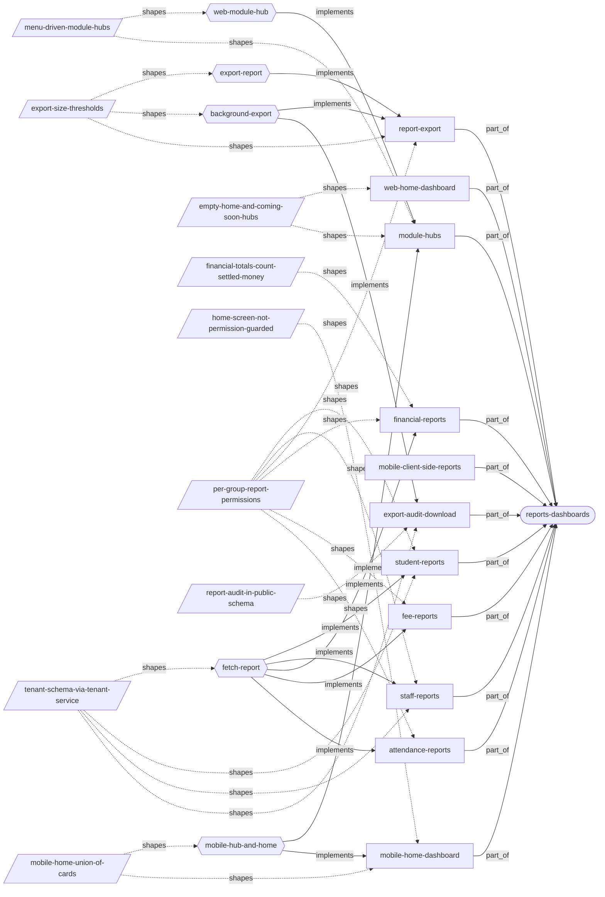
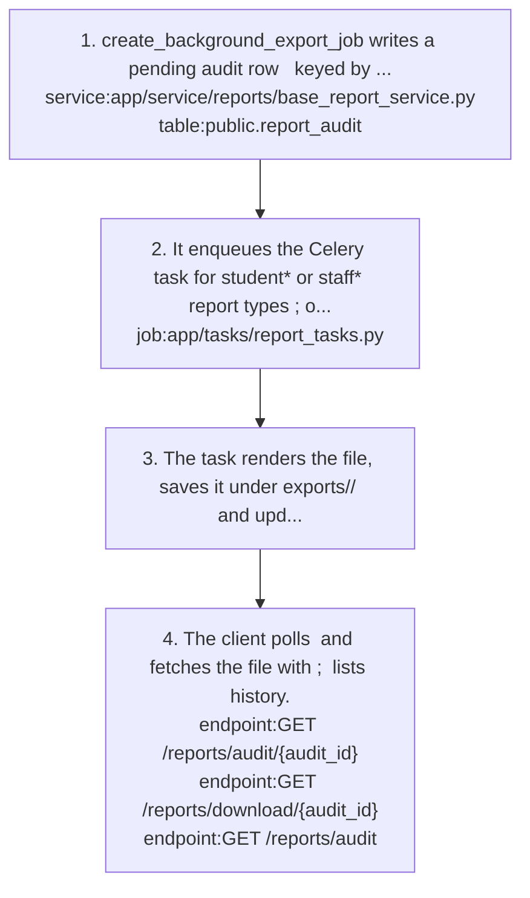
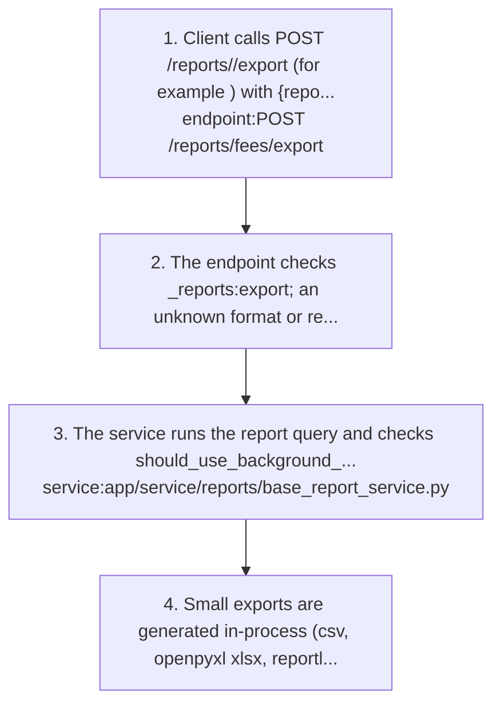
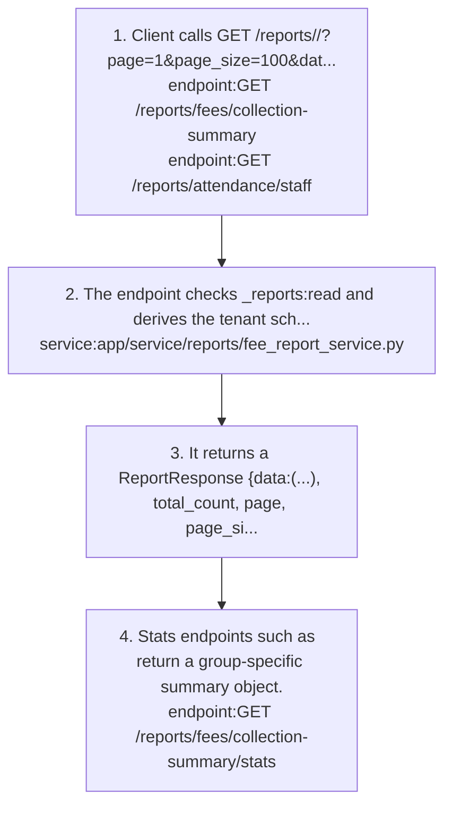
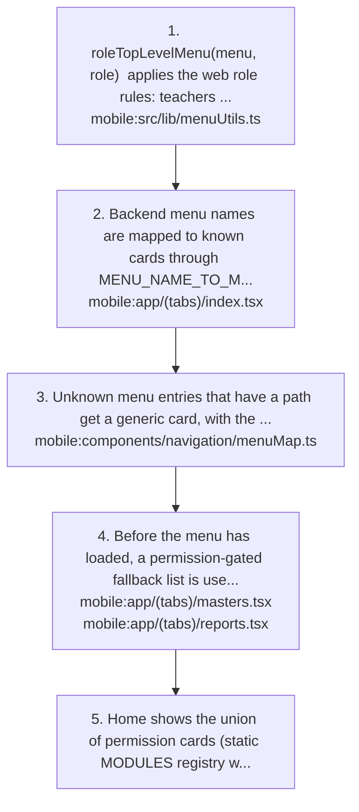
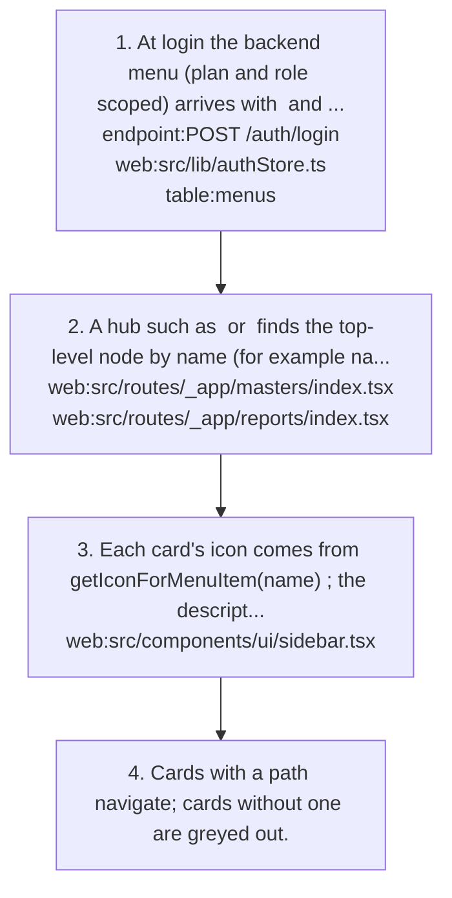

# reports-dashboards: knowledge graph view

_Generated from `docs/graph/graph.jsonl` by `scripts/graph/kg_render.py`. Do not edit this file; change the graph and re-render._

Cross-module reporting endpoints with csv/xlsx/pdf export and an export audit, plus the web home dashboard, the mobile home grid and the menu-driven module hub pages.

Module doc: [docs/modules/reports-dashboards.md](../../../docs/modules/reports-dashboards.md)

## Features

### reports-dashboards/attendance-reports

Student and staff attendance list reports with /stats and export.
- Roles: attendance_reports:read and :export; superadmin tokens skip the check.
- Parity: Web staff attendance page consumes /reports/attendance/staff* with correct parameter names.
- Flows: [reports-dashboards/fetch-report](#reports-dashboardsfetch-report)
- Implemented by: `endpoint:GET /reports/attendance/staff`, `endpoint:GET /reports/attendance/staff/stats`, `endpoint:GET /reports/attendance/students`, `endpoint:POST /reports/attendance/export`, `mobile:src/api/staff.ts`, `service:app/service/reports/attendance_report_service.py`, `web:src/api/staff/attendance.ts`
- Shaped by: [reports-dashboards/per-group-report-permissions](#reports-dashboardsper-group-report-permissions)

### reports-dashboards/export-audit-download

List export audit rows and download files produced by background exports.
- Roles: reports:read.
- Note: There is no file retention or PII masking in code.
- Flows: [reports-dashboards/background-export](#reports-dashboardsbackground-export)
- Implemented by: `endpoint:GET /reports/audit`, `endpoint:GET /reports/audit/{audit_id}`, `endpoint:GET /reports/download/{audit_id}`, `job:app/tasks/report_tasks.py`, `table:public.report_audit`
- Shaped by: [reports-dashboards/report-audit-in-public-schema](#reports-dashboardsreport-audit-in-public-schema), [reports-dashboards/tenant-schema-via-tenant-service](#reports-dashboardstenant-schema-via-tenant-service)

### reports-dashboards/fee-reports

Fee collection summary, pending fees and fee structure reports, each with /stats, plus export.
- Roles: fee_reports:read and :export; superadmin tokens skip the check.
- Parity: Web fee reports live under /fee/reports. Mobile calls /reports/fee/* and /structure, which return 404 (real paths /reports/fees/* and /fee-structure).
- Flows: [reports-dashboards/fetch-report](#reports-dashboardsfetch-report)
- Implemented by: `endpoint:GET /reports/fees/collection-summary`, `endpoint:GET /reports/fees/collection-summary/stats`, `endpoint:GET /reports/fees/fee-structure`, `endpoint:GET /reports/fees/pending-fees`, `endpoint:POST /reports/fees/export`, `mobile:app/reports/fee-reports.tsx`, `mobile:src/api/fees.ts`, `service:app/service/reports/fee_report_service.py`, `web:src/constants/api/fee.ts`, `web:src/pages/fee/FeeReports.tsx`
- Shaped by: [reports-dashboards/per-group-report-permissions](#reports-dashboardsper-group-report-permissions)

### reports-dashboards/financial-reports

Expenditure, ledger and financial summary reports; expenditure and ledger can be exported.
- Roles: financial_reports:read and :export; superadmin tokens skip the check.
- Parity: No client consumer on web or mobile.
- Flows: [reports-dashboards/fetch-report](#reports-dashboardsfetch-report)
- Implemented by: `endpoint:GET /reports/financial/expenditure`, `endpoint:GET /reports/financial/ledger`, `endpoint:GET /reports/financial/summary`, `endpoint:POST /reports/financial/export`, `service:app/service/reports/financial_report_service.py`
- Shaped by: [reports-dashboards/financial-totals-count-settled-money](#reports-dashboardsfinancial-totals-count-settled-money), [reports-dashboards/per-group-report-permissions](#reports-dashboardsper-group-report-permissions)

### reports-dashboards/mobile-client-side-reports

Mobile Academic, Transport and Student report screens aggregate normal list APIs (exams, routes/vehicles/trips, student attendance search) on the client.
- Parity: Mobile only; there is no /reports/academic or /reports/transport backend, so do not build web pages expecting one.
- Implemented by: `mobile:app/reports/academic-reports.tsx`, `mobile:app/reports/student-reports.tsx`, `mobile:app/reports/transport-reports.tsx`

### reports-dashboards/mobile-home-dashboard

Mobile home: greeting hero card and a grid of module cards in web sidebar order, with a lock empty-state when nothing is visible.
- Parity: Mobile only. Tab visibility in (tabs)/_layout.tsx is gated by moduleResources (Masters by academic_years, classes, subjects, holidays or timetables).
- Flows: [reports-dashboards/mobile-hub-and-home](#reports-dashboardsmobile-hub-and-home)
- Implemented by: `mobile:app/(tabs)/_layout.tsx`, `mobile:app/(tabs)/index.tsx`, `mobile:components/navigation/menuMap.ts`, `mobile:src/lib/menuUtils.ts`
- Shaped by: [reports-dashboards/home-screen-not-permission-guarded](#reports-dashboardshome-screen-not-permission-guarded), [reports-dashboards/mobile-home-union-of-cards](#reports-dashboardsmobile-home-union-of-cards)

### reports-dashboards/module-hubs

Hub pages (web /admin, /masters, /reports, /students, /transport; mobile masters and reports tabs) show a Coming Soon banner plus one card per child of the module's backend menu node.
- Parity: Mobile has two report hubs: (tabs)/reports.tsx merges menu and permission list; reports/index.tsx is permission-only. The menu /reports path maps to the tab.
- Note: A card navigates if the menu item has a path and is greyed out otherwise; descriptions come from a hard-coded descriptionMap keyed by menu name.
- Note: Hubs are only as complete as the seeded menu; seed a menu child when adding a report or master screen.
- Flows: [reports-dashboards/mobile-hub-and-home](#reports-dashboardsmobile-hub-and-home), [reports-dashboards/web-module-hub](#reports-dashboardsweb-module-hub)
- Implemented by: `mobile:app/(tabs)/masters.tsx`, `mobile:app/(tabs)/reports.tsx`, `mobile:app/reports/index.tsx`, `table:menus`, `web:src/components/ui/sidebar.tsx`, `web:src/lib/authStore.ts`, `web:src/routes/_app/admin/index.tsx`, `web:src/routes/_app/masters/index.tsx`, `web:src/routes/_app/reports/index.tsx`, `web:src/routes/_app/students/index.tsx`, `web:src/routes/_app/transport/index.tsx`
- Shaped by: [reports-dashboards/empty-home-and-coming-soon-hubs](#reports-dashboardsempty-home-and-coming-soon-hubs), [reports-dashboards/menu-driven-module-hubs](#reports-dashboardsmenu-driven-module-hubs)

### reports-dashboards/report-export

POST /reports/<group>/export returns the report as csv, xlsx (openpyxl) or pdf (reportlab); large exports are meant to go to a background job.
- Note: report_type values: student_summary, staff_summary, fee_collection_summary, pending_fees, fee_structure, student_attendance, staff_attendance, expenditure, ledger.
- Note: Synchronous exports are not audited; only the background path writes report_audit.
- Flows: [reports-dashboards/background-export](#reports-dashboardsbackground-export), [reports-dashboards/export-report](#reports-dashboardsexport-report)
- Implemented by: `endpoint:POST /reports/attendance/export`, `endpoint:POST /reports/fees/export`, `endpoint:POST /reports/financial/export`, `endpoint:POST /reports/staff/export`, `endpoint:POST /reports/students/export`, `job:app/tasks/report_tasks.py`, `service:app/service/reports/base_report_service.py`
- Shaped by: [reports-dashboards/export-size-thresholds](#reports-dashboardsexport-size-thresholds), [reports-dashboards/per-group-report-permissions](#reports-dashboardsper-group-report-permissions)

### reports-dashboards/staff-reports

Staff summary and per-staff detail reports with export.
- Roles: staff_reports:read and :export.
- Parity: No web page. Mobile app/reports/staff-reports.tsx shows the staff attendance report and stats for Today / 7 / 30 / 90 days.
- Flows: [reports-dashboards/fetch-report](#reports-dashboardsfetch-report)
- Implemented by: `endpoint:GET /reports/staff/details/{staff_id}`, `endpoint:GET /reports/staff/summary`, `endpoint:POST /reports/staff/export`, `mobile:app/reports/staff-reports.tsx`, `mobile:src/api/staff.ts`, `service:app/service/reports/staff_report_service.py`
- Shaped by: [reports-dashboards/per-group-report-permissions](#reports-dashboardsper-group-report-permissions), [reports-dashboards/tenant-schema-via-tenant-service](#reports-dashboardstenant-schema-via-tenant-service)

### reports-dashboards/student-reports

Student summary and per-student detail reports with csv/xlsx/pdf export.
- Roles: student_reports:read and :export.
- Parity: No web page; mobile student-reports screen aggregates /student/attendance/search on the client instead.
- Note: A bare except turns permission 403s into 500s on these endpoints.
- Flows: [reports-dashboards/fetch-report](#reports-dashboardsfetch-report)
- Implemented by: `endpoint:GET /reports/students/details/{student_id}`, `endpoint:GET /reports/students/summary`, `endpoint:POST /reports/students/export`, `service:app/service/reports/student_report_service.py`
- Shaped by: [reports-dashboards/per-group-report-permissions](#reports-dashboardsper-group-report-permissions), [reports-dashboards/tenant-schema-via-tenant-service](#reports-dashboardstenant-schema-via-tenant-service)

### reports-dashboards/web-home-dashboard

Web home at /_app/dashboard (/ redirects there); currently just a page header with no widgets.
- Parity: Mobile home has a module card grid; web users navigate through the sidebar and hubs.
- Implemented by: `web:src/routes/_app/dashboard.tsx`
- Shaped by: [reports-dashboards/empty-home-and-coming-soon-hubs](#reports-dashboardsempty-home-and-coming-soon-hubs)

## Flows

### reports-dashboards/background-export

Implements: `feature:reports-dashboards/export-audit-download`, `feature:reports-dashboards/report-export`

1. create_background_export_job writes a pending audit row `service:app/service/reports/base_report_service.py` `table:public.report_audit` keyed by user_id and tenant_id.
2. It enqueues the Celery task for student* or staff* report types `job:app/tasks/report_tasks.py`; other report types raise ValueError.
3. The task renders the file, saves it under exports/<tenant>/ and updates the audit row status.
4. The client polls `endpoint:GET /reports/audit/{audit_id}` and fetches the file with `endpoint:GET /reports/download/{audit_id}`; `endpoint:GET /reports/audit` lists history.

- Failure: create_background_export_job passes filename, user_id and tenant_id to log_export_request, which does not accept them, so the call raises TypeError and the export returns 500.
- Failure: The response advertises /api/v1/reports/export-status/{id}, which does not exist; the real route is /reports/audit/{id}.

Shaped by: [reports-dashboards/export-size-thresholds](#reports-dashboardsexport-size-thresholds)

### reports-dashboards/export-report

Implements: `feature:reports-dashboards/report-export`

1. Client calls POST /reports/<group>/export (for example `endpoint:POST /reports/fees/export`) with {report_type, format: csv|xlsx|pdf, filters:{...}, filename?} and reads the response as a blob.
2. The endpoint checks <group>_reports:export; an unknown format or report_type returns 400.
3. The service runs the report query and checks should_use_background_job `service:app/service/reports/base_report_service.py`: over 1000 rows, xlsx over 500, or pdf over 300 goes to the background path.
4. Small exports are generated in-process (csv, openpyxl xlsx, reportlab pdf) and streamed straight back as a file download; no audit row is written.

- Failure: Exports over the thresholds fail with 500 because the background path is broken `flow:reports-dashboards/background-export`.

Shaped by: [reports-dashboards/export-size-thresholds](#reports-dashboardsexport-size-thresholds)

### reports-dashboards/fetch-report

Implements: `feature:reports-dashboards/attendance-reports`, `feature:reports-dashboards/fee-reports`, `feature:reports-dashboards/financial-reports`, `feature:reports-dashboards/staff-reports`, `feature:reports-dashboards/student-reports`

1. Client calls GET /reports/<group>/<report>?page=1&page_size=100&date_from=...&date_to=...&<filters>, for example `endpoint:GET /reports/fees/collection-summary` or `endpoint:GET /reports/attendance/staff`.
2. The endpoint checks <group>_reports:read and derives the tenant schema from request.state.client_name via TenantService (fee, attendance, financial) `service:app/service/reports/fee_report_service.py`.
3. It returns a ReportResponse {data:[...], total_count, page, page_size, total_pages}; page_size is capped at 1000 (default 100).
4. Stats endpoints such as `endpoint:GET /reports/fees/collection-summary/stats` return a group-specific summary object.

- Note: Web `web:src/api/staff/attendance.ts` and mobile `mobile:src/api/staff.ts` both send date_from/date_to/page_size and read rows from the data key.

Shaped by: [reports-dashboards/tenant-schema-via-tenant-service](#reports-dashboardstenant-schema-via-tenant-service)

### reports-dashboards/mobile-hub-and-home

Implements: `feature:reports-dashboards/mobile-home-dashboard`, `feature:reports-dashboards/module-hubs`

1. roleTopLevelMenu(menu, role) `mobile:src/lib/menuUtils.ts` applies the web role rules: teachers get no Fee module; teachers and students get no school settings; students and parents get no Communication, Reports, Masters or Transport.
2. Backend menu names are mapped to known cards through MENU_NAME_TO_MODULE `mobile:app/(tabs)/index.tsx`, which covers aliases such as Fee and Fee Management.
3. Unknown menu entries that have a path get a generic card, with the route mapped by mapPath `mobile:components/navigation/menuMap.ts`.
4. Before the menu has loaded, a permission-gated fallback list is used `mobile:app/(tabs)/masters.tsx` `mobile:app/(tabs)/reports.tsx`.
5. Home shows the union of permission cards (static MODULES registry with resource(s), alwaysShow, hideForRoles) and top-level menu cards, in web sidebar order; if none is visible it shows a lock empty-state.

Shaped by: [reports-dashboards/mobile-home-union-of-cards](#reports-dashboardsmobile-home-union-of-cards)

### reports-dashboards/web-module-hub

Implements: `feature:reports-dashboards/module-hubs`

1. At login the backend menu (plan and role scoped) arrives with `endpoint:POST /auth/login` and is stored raw as authStore.menuItems `web:src/lib/authStore.ts` `table:menus`.
2. A hub such as `web:src/routes/_app/masters/index.tsx` or `web:src/routes/_app/reports/index.tsx` finds the top-level node by name (for example name.toLowerCase() === 'masters') and renders its children as cards.
3. Each card's icon comes from getIconForMenuItem(name) `web:src/components/ui/sidebar.tsx`; the description from the hub's descriptionMap.
4. Cards with a path navigate; cards without one are greyed out.

- Note: Hubs read the raw menu while the sidebar reads the processed useMenuData() `web:src/lib/menuUtils.ts` (role filter, injected Fee submenu, School Registration, ordering), so hub cards can differ from the sidebar.

Shaped by: [reports-dashboards/menu-driven-module-hubs](#reports-dashboardsmenu-driven-module-hubs)

## Decisions

### reports-dashboards/empty-home-and-coming-soon-hubs

- **Decision**: The web home dashboard is intentionally empty and hubs show a Coming Soon banner.
- **Why**: Module-specific reports live inside each module (fee, expense, exam grading) until a unified reporting hub is built.
- Shapes: `feature:reports-dashboards/module-hubs`, `feature:reports-dashboards/web-home-dashboard`, `web:src/routes/_app/dashboard.tsx`

### reports-dashboards/export-size-thresholds

- **Decision**: Exports over 1000 rows, xlsx over 500 or pdf over 300 are routed to a background Celery job instead of rendering in the request.
- **Why**: Avoids request timeouts on big xlsx/pdf renders.
- Shapes: `feature:reports-dashboards/report-export`, `flow:reports-dashboards/background-export`, `flow:reports-dashboards/export-report`, `job:app/tasks/report_tasks.py`, `service:app/service/reports/base_report_service.py`

### reports-dashboards/financial-totals-count-settled-money (active)

- **Decision**: Financial summary and ledger totals exclude expenses with status rejected, cancelled or deleted, and include only fee transactions with status completed.
- **Why**: Totals should reflect money that actually moved; rejected or cancelled expenses were never spent, and only completed fee transactions are counted everywhere else (fee reports, pending-fees paid amounts).
- **Alternatives**: Counting every row regardless of status, which is what the report code did before it was fixed.
- **Since**: 2026-09
- Shapes: `feature:reports-dashboards/financial-reports`, `service:app/service/reports/financial_report_service.py`

### reports-dashboards/home-screen-not-permission-guarded

- **Decision**: The mobile home screen is never wrapped in a permission guard.
- **Why**: A profile:read_own gate once blanked it for roles without that grant.
- Shapes: `feature:reports-dashboards/mobile-home-dashboard`, `mobile:app/(tabs)/index.tsx`

### reports-dashboards/menu-driven-module-hubs

- **Decision**: Module hubs render cards from the plan+role-scoped backend menu, not a hard-coded list (web; mobile also keeps permission fallbacks). The same applies to the Masters hub.
- **Why**: The same menu drives the sidebar and the hubs, so a user never sees a card for a module their plan or role lacks.
- **Tradeoff**: A screen without a seeded menu child does not appear on web hubs.
- Shapes: `feature:reports-dashboards/module-hubs`, `flow:reports-dashboards/web-module-hub`, `mobile:app/(tabs)/masters.tsx`, `web:src/routes/_app/masters/index.tsx`

### reports-dashboards/mobile-home-union-of-cards

- **Decision**: The mobile home grid is the union of permission-derived cards and backend menu cards, with explicit role hide rules applied on top.
- **Why**: A sparse or differently-named tenant menu must not blank the grid.
- **Alternatives**: Menu-only cards, as on web hubs.
- Shapes: `feature:reports-dashboards/mobile-home-dashboard`, `flow:reports-dashboards/mobile-hub-and-home`, `mobile:app/(tabs)/index.tsx`

### reports-dashboards/per-group-report-permissions

- **Decision**: Each report group has its own <group>_reports resource (student, staff, fee, attendance, financial) with a separate export action; audit and download use reports:read.
- **Why**: Roles such as accountant can get fee reports without student PII reports, and viewing can be allowed without bulk export.
- Shapes: `feature:reports-dashboards/attendance-reports`, `feature:reports-dashboards/fee-reports`, `feature:reports-dashboards/financial-reports`, `feature:reports-dashboards/report-export`, `feature:reports-dashboards/staff-reports`, `feature:reports-dashboards/student-reports`

### reports-dashboards/report-audit-in-public-schema

- **Decision**: The export audit table report_audit lives in the public schema, keyed by user_id + tenant_id.
- **Why**: Export history is cross-tenant infrastructure and does not need a per-tenant migration.
- Shapes: `feature:reports-dashboards/export-audit-download`, `table:public.report_audit`

### reports-dashboards/tenant-schema-via-tenant-service

- **Decision**: Report endpoints should derive the tenant with TenantService.get_tenant_schema(request.state.client_name), not request.state.schema_name.
- **Why**: The only middleware that sets request.state.schema_name (app/middleware/middleware.py) is not registered, so that value is None; student, staff, audit and download endpoints still use it.
- Shapes: `feature:reports-dashboards/export-audit-download`, `feature:reports-dashboards/staff-reports`, `feature:reports-dashboards/student-reports`, `flow:reports-dashboards/fetch-report`

## Concepts

### reports-dashboards/backend-menu

The tenant's menus tree, scoped by plan and role and returned at login, that drives the web sidebar, the module hubs and part of the mobile home grid.
- Related: `feature:reports-dashboards/mobile-home-dashboard`, `feature:reports-dashboards/module-hubs`, `table:menus`

### reports-dashboards/background-export

An export over the size thresholds, meant to be rendered by a Celery task, saved under exports/<tenant>/ and fetched later through the audit and download endpoints.
- Related: `decision:reports-dashboards/export-size-thresholds`, `job:app/tasks/report_tasks.py`

### reports-dashboards/module-hub

A landing page for a module that shows one card per child of that module's backend menu node.
- Related: `feature:reports-dashboards/module-hubs`

### reports-dashboards/report-audit

A public.report_audit row recording a background export: user, tenant, report type, filters, format, file path/size, status and timestamps.
- Related: `feature:reports-dashboards/export-audit-download`, `table:public.report_audit`

### reports-dashboards/report-group

A family of report endpoints under /reports/<group> (students, staff, fees, attendance, financial) sharing one <group>_reports permission resource and one export endpoint.
- Related: `feature:reports-dashboards/attendance-reports`, `feature:reports-dashboards/fee-reports`, `feature:reports-dashboards/financial-reports`, `feature:reports-dashboards/staff-reports`, `feature:reports-dashboards/student-reports`

### reports-dashboards/report-response

Standard report envelope {data, total_count, page, page_size, total_pages}; rows are in data. Paged by page and page_size, date-filtered by date_from and date_to.
- Related: `concept:reports-dashboards/report-group`, `flow:reports-dashboards/fetch-report`

### reports-dashboards/report-type

The report_type field of an export request naming which report to render (student_summary, staff_summary, fee_collection_summary, pending_fees, fee_structure, student_attendance, staff_attendance, expenditure, ledger).
- Related: `feature:reports-dashboards/report-export`
