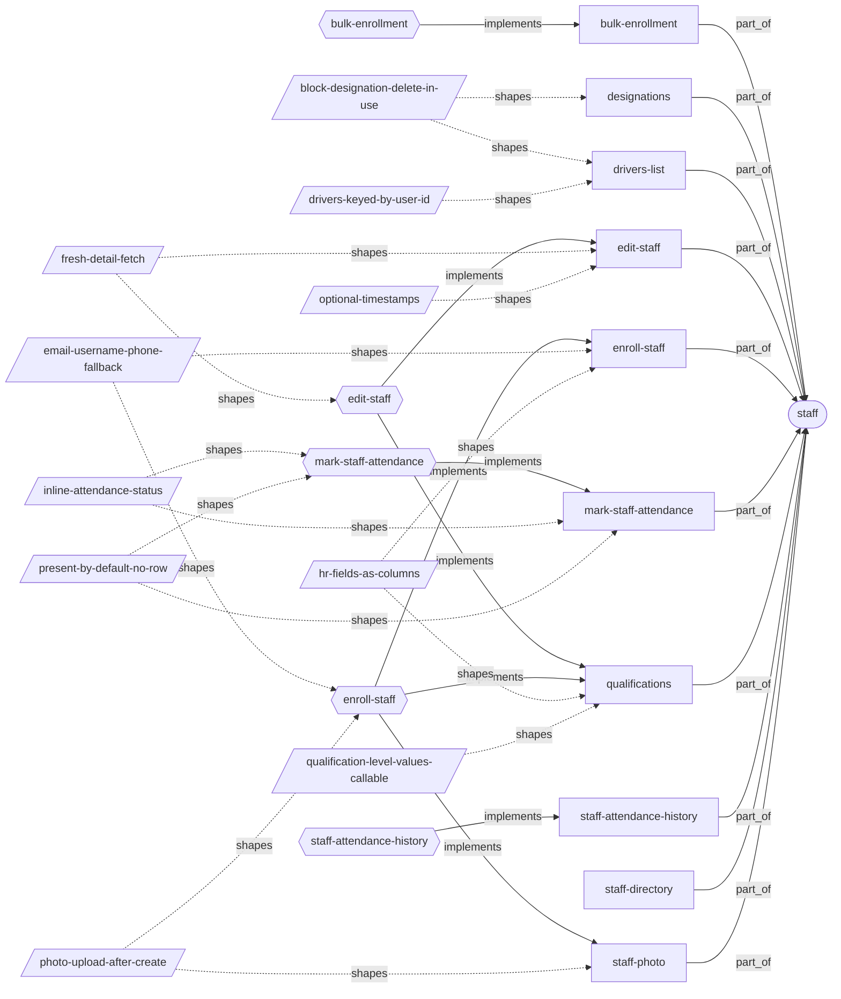
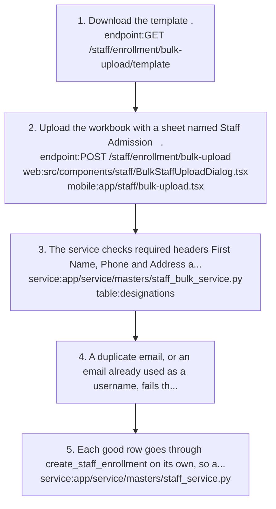
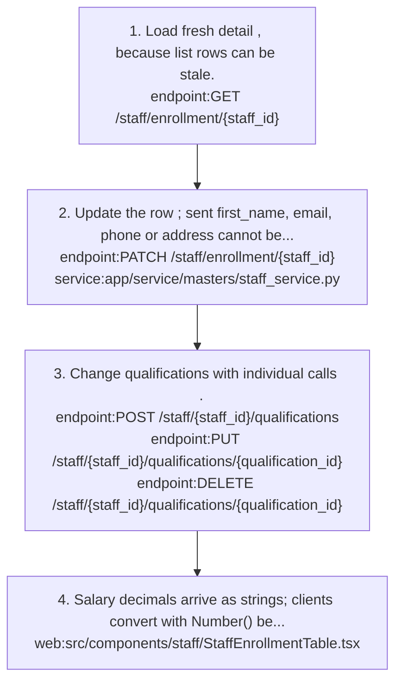
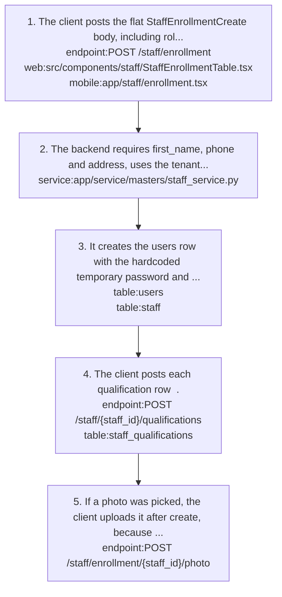
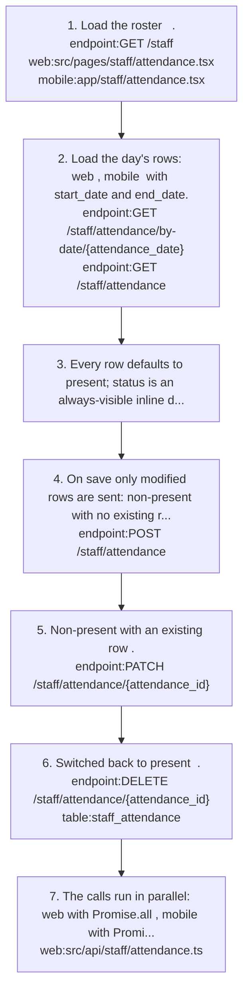
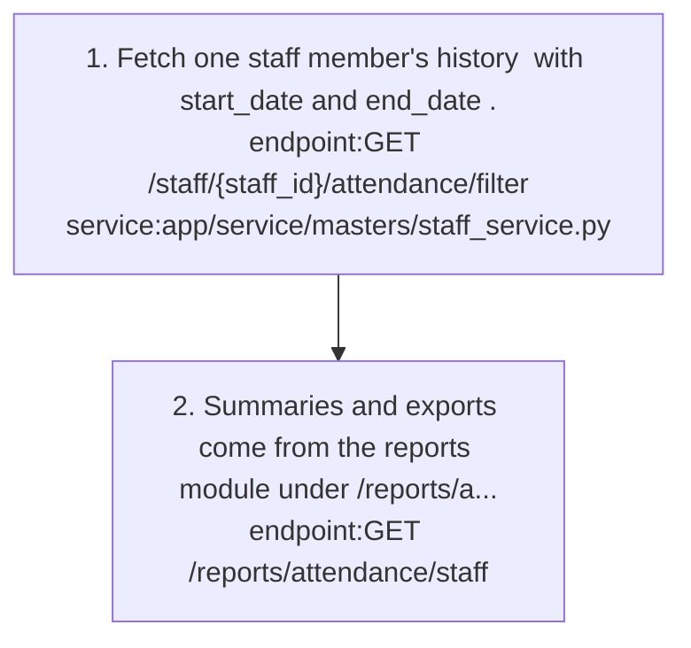

# staff: knowledge graph view

_Generated from `docs/graph/graph.jsonl` by `scripts/graph/kg_render.py`. Do not edit this file; change the graph and re-render._

Staff enrollment (login account plus HR record with extended fields and qualifications), designations, staff attendance, drivers list and staff photos.

Module doc: [docs/modules/staff.md](../../../docs/modules/staff.md)

## Features

### staff/bulk-enrollment

Upload an Excel sheet named Staff Admission; rows are enrolled one by one, with designation and role matched by name.
- Flows: [staff/bulk-enrollment](#staffbulk-enrollment)
- Implemented by: `endpoint:GET /staff/enrollment/bulk-upload/template`, `endpoint:POST /staff/enrollment/bulk-upload`, `mobile:app/staff/bulk-upload.tsx`, `service:app/service/masters/staff_bulk_service.py`, `table:staff`, `web:src/components/staff/BulkStaffUploadDialog.tsx`

### staff/designations

Designation master with unique titles: paginated list with staff_count, dropdown sorted by title, and delete blocked while assigned.
- Roles: Holders of designations permissions
- Implemented by: `endpoint:DELETE /staff/designations/{designation_id}`, `endpoint:GET /staff/designations`, `endpoint:GET /staff/designations/dropdown`, `endpoint:POST /staff/designations`, `endpoint:PUT /staff/designations/{designation_id}`, `mobile:app/staff/designations.tsx`, `service:app/service/masters/designation_service.py`, `table:designations`, `web:src/components/staff/DesignationsTable.tsx`, `web:src/pages/staff/designations.tsx`
- Shaped by: [staff/block-designation-delete-in-use](#staffblock-designation-delete-in-use)

### staff/drivers-list

List staff whose designation title is exactly driver (case-insensitive), returning id = user_id for transport assignment.
- Roles: Holders of transport_trips:read
- Implemented by: `endpoint:GET /staff/drivers`, `service:app/service/masters/staff_service.py`, `table:designations`, `table:staff`
- Shaped by: [staff/block-designation-delete-in-use](#staffblock-designation-delete-in-use), [staff/drivers-keyed-by-user-id](#staffdrivers-keyed-by-user-id)

### staff/edit-staff

Edit a staff record with PATCH and view fresh detail; login identity and role are not changed by edits.
- Parity: Web shows detail in a view dialog in the table; mobile has a staff detail screen.
- Flows: [staff/edit-staff](#staffedit-staff)
- Implemented by: `endpoint:DELETE /staff/enrollment/{staff_id}`, `endpoint:GET /staff/enrollment/{staff_id}`, `endpoint:GET /staff/enrollments`, `endpoint:PATCH /staff/enrollment/{staff_id}`, `mobile:app/staff/[id].tsx`, `service:app/service/masters/staff_service.py`, `table:staff`, `web:src/components/staff/StaffEnrollmentTable.tsx`
- Shaped by: [staff/fresh-detail-fetch](#stafffresh-detail-fetch), [staff/optional-timestamps](#staffoptional-timestamps)

### staff/enroll-staff

Enroll a staff member: one call creates the users row (username = email, else phone) and the staff row with extended HR fields.
- Roles: Holders of staff:create
- Parity: Web has a role picker (any tenant role); mobile always defaults to the Staff role.
- Note: Anyone with staff:create can assign any role, including Admin, via role_id or the bulk Role column.
- Flows: [staff/enroll-staff](#staffenroll-staff)
- Implemented by: `endpoint:POST /staff/enrollment`, `mobile:app/staff/enrollment.tsx`, `service:app/service/masters/staff_service.py`, `table:staff`, `table:users`, `web:src/components/staff/StaffEnrollmentTable.tsx`, `web:src/pages/staff/enrollment.tsx`
- Shaped by: [staff/email-username-phone-fallback](#staffemail-username-phone-fallback), [staff/hr-fields-as-columns](#staffhr-fields-as-columns)

### staff/mark-staff-attendance

Mark daily staff attendance with present as the default; only exceptions are stored, one row per (staff_id, date).
- Roles: Holders of staff_attendance create/update/delete
- Parity: Both offer present/absent/late/half_day (no leave in the UI); web loads the day by-date, mobile by start_date/end_date.
- Note: PATCH /staff/attendance/by-date/{attendance_date} upserts a list of {staff_id,status,remarks} and rejects future dates; the clients use per-row calls instead.
- Flows: [staff/mark-staff-attendance](#staffmark-staff-attendance)
- Implemented by: `endpoint:DELETE /staff/attendance/{attendance_id}`, `endpoint:GET /staff`, `endpoint:GET /staff/attendance`, `endpoint:GET /staff/attendance/by-date/{attendance_date}`, `endpoint:PATCH /staff/attendance/by-date/{attendance_date}`, `endpoint:PATCH /staff/attendance/{attendance_id}`, `endpoint:POST /staff/attendance`, `mobile:app/staff/attendance.tsx`, `service:app/service/masters/staff_service.py`, `table:staff_attendance`, `web:src/api/staff/attendance.ts`, `web:src/pages/staff/attendance.tsx`
- Shaped by: [staff/inline-attendance-status](#staffinline-attendance-status), [staff/present-by-default-no-row](#staffpresent-by-default-no-row)

### staff/qualifications

Manage many qualifications per staff member (level Below Graduation/Graduation/Post Graduation/PhD) in staff_qualifications.
- Flows: [staff/edit-staff](#staffedit-staff), [staff/enroll-staff](#staffenroll-staff)
- Implemented by: `endpoint:DELETE /staff/{staff_id}/qualifications/{qualification_id}`, `endpoint:GET /staff/{staff_id}/qualifications`, `endpoint:POST /staff/{staff_id}/qualifications`, `endpoint:PUT /staff/{staff_id}/qualifications/{qualification_id}`, `mobile:app/staff/enrollment.tsx`, `service:app/service/masters/staff_service.py`, `table:staff_qualifications`, `web:src/components/staff/StaffEnrollmentTable.tsx`
- Shaped by: [staff/hr-fields-as-columns](#staffhr-fields-as-columns), [staff/qualification-level-values-callable](#staffqualification-level-values-callable)

### staff/staff-attendance-history

View one staff member's attendance over a date range; summaries and exports live in the reports module.
- Note: There is no my-attendance endpoint for staff; a staff member sees attendance only with staff_attendance:list.
- Flows: [staff/staff-attendance-history](#staffstaff-attendance-history)
- Implemented by: `endpoint:GET /staff/{staff_id}/attendance/filter`, `service:app/service/masters/staff_service.py`, `table:staff_attendance`, `web:src/pages/staff/StaffProfile.tsx`

### staff/staff-directory

List staff (StaffOut with designation_obj) filtered by gender, or grouped by designation.
- Note: GET /staff/ ignores is_active, skip and limit; it filters only by gender.
- Implemented by: `endpoint:GET /staff`, `endpoint:GET /staff/by-designation`, `mobile:app/staff/index.tsx`, `service:app/service/masters/staff_service.py`, `table:staff`, `web:src/pages/staff/staff.tsx`

### staff/staff-photo

Upload or remove a staff photo (jpg/jpeg/png/webp, max 2 MB) stored at media/{tenant_id}/staff/photos/{staff_id}.{ext} and returned as photo_url.
- Flows: [staff/enroll-staff](#staffenroll-staff)
- Implemented by: `endpoint:DELETE /staff/enrollment/{staff_id}/photo`, `endpoint:POST /staff/enrollment/{staff_id}/photo`, `service:app/service/masters/staff_service.py`, `table:staff`, `web:src/api/staff/staff.ts`
- Shaped by: [staff/photo-upload-after-create](#staffphoto-upload-after-create)

## Flows

### staff/bulk-enrollment

Implements: `feature:staff/bulk-enrollment`

1. Download the template `endpoint:GET /staff/enrollment/bulk-upload/template`.
2. Upload the workbook with a sheet named Staff Admission `endpoint:POST /staff/enrollment/bulk-upload` `web:src/components/staff/BulkStaffUploadDialog.tsx` `mobile:app/staff/bulk-upload.tsx`.
3. The service checks required headers First Name, Phone and Address and matches Designation and Role by name, case-insensitive `service:app/service/masters/staff_bulk_service.py` `table:designations`.
4. A duplicate email, or an email already used as a username, fails that row.
5. Each good row goes through create_staff_enrollment on its own, so a bad row does not stop the others `service:app/service/masters/staff_service.py`.

### staff/edit-staff

Implements: `feature:staff/edit-staff`, `feature:staff/qualifications`

1. Load fresh detail `endpoint:GET /staff/enrollment/{staff_id}`, because list rows can be stale.
2. Update the row `endpoint:PATCH /staff/enrollment/{staff_id}`; sent first_name, email, phone or address cannot be blank, and role_id is silently dropped `service:app/service/masters/staff_service.py`.
3. Change qualifications with individual calls `endpoint:POST /staff/{staff_id}/qualifications` `endpoint:PUT /staff/{staff_id}/qualifications/{qualification_id}` `endpoint:DELETE /staff/{staff_id}/qualifications/{qualification_id}`.
4. Salary decimals arrive as strings; clients convert with Number() before sending them back `web:src/components/staff/StaffEnrollmentTable.tsx`.

- Note: PATCH changes staff.email and staff.phone but never users.username or users.email, so the old login identifier keeps working.

Shaped by: [staff/fresh-detail-fetch](#stafffresh-detail-fetch)

### staff/enroll-staff

Implements: `feature:staff/enroll-staff`, `feature:staff/qualifications`, `feature:staff/staff-photo`

1. The client posts the flat StaffEnrollmentCreate body, including role_id from the role picker on web only `endpoint:POST /staff/enrollment` `web:src/components/staff/StaffEnrollmentTable.tsx` `mobile:app/staff/enrollment.tsx`.
2. The backend requires first_name, phone and address, uses the tenant role named Staff when role_id is missing, and sets username = email or phone `service:app/service/masters/staff_service.py`.
3. It creates the users row with the hardcoded temporary password and is_first_login = TRUE, then the staff row, and returns StaffEnrollmentOut `table:users` `table:staff`.
4. The client posts each qualification row `endpoint:POST /staff/{staff_id}/qualifications` `table:staff_qualifications`.
5. If a photo was picked, the client uploads it after create, because the id did not exist before `endpoint:POST /staff/enrollment/{staff_id}/photo`.

- Failure: an email or phone still held by an orphaned user (after a staff delete) fails with a 500 IntegrityError; single create has no duplicate pre-check.

Shaped by: [staff/email-username-phone-fallback](#staffemail-username-phone-fallback), [staff/photo-upload-after-create](#staffphoto-upload-after-create)

### staff/mark-staff-attendance

Implements: `feature:staff/mark-staff-attendance`

1. Load the roster `endpoint:GET /staff` `web:src/pages/staff/attendance.tsx` `mobile:app/staff/attendance.tsx`.
2. Load the day's rows: web `endpoint:GET /staff/attendance/by-date/{attendance_date}`, mobile `endpoint:GET /staff/attendance` with start_date and end_date.
3. Every row defaults to present; status is an always-visible inline dropdown and changed rows show a Modified badge.
4. On save only modified rows are sent: non-present with no existing row `endpoint:POST /staff/attendance`.
5. Non-present with an existing row `endpoint:PATCH /staff/attendance/{attendance_id}`.
6. Switched back to present `endpoint:DELETE /staff/attendance/{attendance_id}` `table:staff_attendance`.
7. The calls run in parallel: web with Promise.all `web:src/api/staff/attendance.ts`, mobile with Promise.allSettled.

- Failure: status must be lowercase (no before-validator, Present gives 422); a duplicate single create hits uq_staff_date and returns 500.
- Failure: without staff_attendance:delete the save partially fails; web Promise.all hides which calls failed, mobile uses Promise.allSettled and keeps the failed rows pending.

Shaped by: [staff/inline-attendance-status](#staffinline-attendance-status), [staff/present-by-default-no-row](#staffpresent-by-default-no-row)

### staff/staff-attendance-history

Implements: `feature:staff/staff-attendance-history`

1. Fetch one staff member's history `endpoint:GET /staff/{staff_id}/attendance/filter` with start_date and end_date `service:app/service/masters/staff_service.py`.
2. Summaries and exports come from the reports module under /reports/attendance/staff `endpoint:GET /reports/attendance/staff`.

## Decisions

### staff/block-designation-delete-in-use (active)

- **Decision**: Deleting a designation still assigned to staff is rejected with 400 and the count, instead of nulling staff.designation_id.
- **Why**: Nulling would silently orphan staff from reports and the drivers list.
- **Alternatives**: Set staff.designation_id to NULL on delete.
- Shapes: `feature:staff/designations`, `feature:staff/drivers-list`, `service:app/service/masters/designation_service.py`

### staff/drivers-keyed-by-user-id (active)

- **Decision**: GET /staff/drivers returns id = user_id rather than the staff id.
- **Why**: Transport assigns drivers by user id.
- Shapes: `endpoint:GET /staff/drivers`, `feature:staff/drivers-list`

### staff/email-username-phone-fallback (active)

- **Decision**: The staff login username is the email, with phone as the fallback; at least one is required.
- **Why**: Many support staff have no email, and the auth lookup also supports login by phone.
- Shapes: `feature:staff/enroll-staff`, `flow:staff/enroll-staff`, `table:users`

### staff/fresh-detail-fetch (active)

- **Decision**: Edit and view use GET /staff/enrollment/{staff_id} for detail instead of the list row.
- **Why**: List rows can be stale and do not carry qualifications and new fields.
- Shapes: `feature:staff/edit-staff`, `flow:staff/edit-staff`

### staff/hr-fields-as-columns (active)

- **Decision**: Work experience, bank, salary and PF fields are columns on staff; only qualifications get their own table (staff_qualifications).
- **Why**: There is one of each per person (current bank, current salary, last employer), while a person can have many qualifications.
- **Alternatives**: Sub-tables for bank, salary and work history.
- Shapes: `feature:staff/enroll-staff`, `feature:staff/qualifications`, `table:staff`, `table:staff_qualifications`

### staff/inline-attendance-status (active)

- **Decision**: Staff attendance status is edited inline as an always-visible dropdown with no per-row Edit/Save, and a Modified badge marks unsaved rows.
- **Why**: One click per person instead of three.
- Shapes: `feature:staff/mark-staff-attendance`, `flow:staff/mark-staff-attendance`, `web:src/pages/staff/attendance.tsx`

### staff/optional-timestamps (active)

- **Decision**: StaffEnrollmentOut keeps created_at and updated_at as optional (None).
- **Why**: The staff table has no timestamp columns; making them required causes a 500 on every staff response.
- Shapes: `feature:staff/edit-staff`, `table:staff`

### staff/photo-upload-after-create (active)

- **Decision**: For a new staff member the photo is uploaded in a separate call after enrollment succeeds.
- **Why**: The staff id used in the photo route and filename does not exist until create returns.
- Shapes: `feature:staff/staff-photo`, `flow:staff/enroll-staff`

### staff/present-by-default-no-row (active)

- **Decision**: Staff attendance stores only exceptions: present is the default with no row, and save touches only modified rows.
- **Why**: Most staff are present on most days.
- **Tradeoff**: Switching back to present deletes the row, so markers need staff_attendance:delete (student attendance PATCHes to present instead).
- Shapes: `feature:staff/mark-staff-attendance`, `flow:staff/mark-staff-attendance`, `table:staff_attendance`

### staff/qualification-level-values-callable (active)

- **Decision**: StaffQualification.level maps the enum with values_callable so DB labels are the enum values.
- **Why**: Python member names (post_graduation) differ from the DB labels (Post Graduation); without it inserts fail.
- Shapes: `concept:staff/qualification-level`, `feature:staff/qualifications`, `table:staff_qualifications`

## Concepts

### staff/designation

A job title from the designations master (unique title); staff.designation_id points to it and it drives the drivers list.
- Related: `feature:staff/designations`, `table:designations`

### staff/driver

A staff member whose designation title is exactly driver (case-insensitive); transport references drivers by user id.
- Related: `feature:staff/drivers-list`, `table:designations`

### staff/qualification-level

Qualification level enum with DB values Below Graduation, Graduation, Post Graduation and PhD; staff.qualification is a separate free-text legacy summary.
- Related: `feature:staff/qualifications`, `table:staff_qualifications`

### staff/staff-active-flag

staff.is_active is an HR flag that does not block login; login checks users.is_active, and the two are not kept in sync.
- Related: `table:staff`, `table:users`

### staff/staff-enrollment

A staff member is a users row (login) plus a staff row (HR record) created together; deleting staff removes the staff row, attendance and qualifications but not the user.
- Related: `feature:staff/enroll-staff`, `table:staff`, `table:users`
