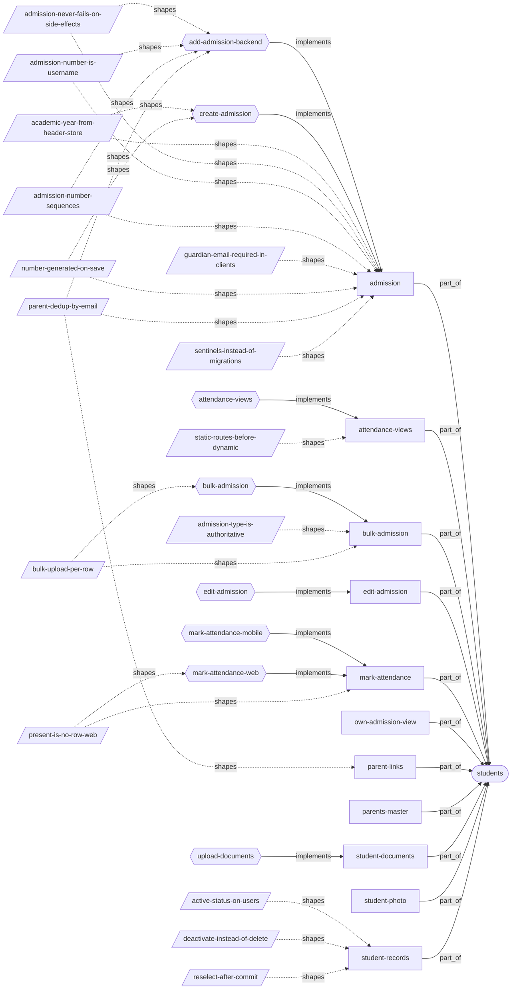
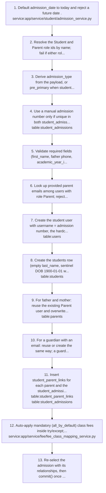
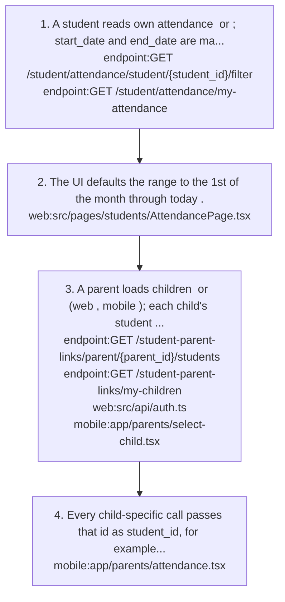
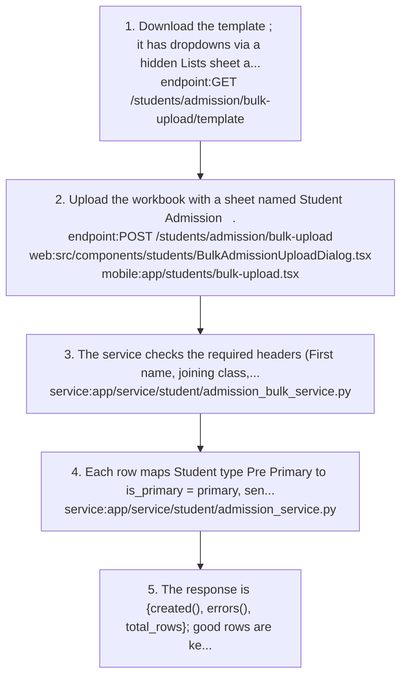
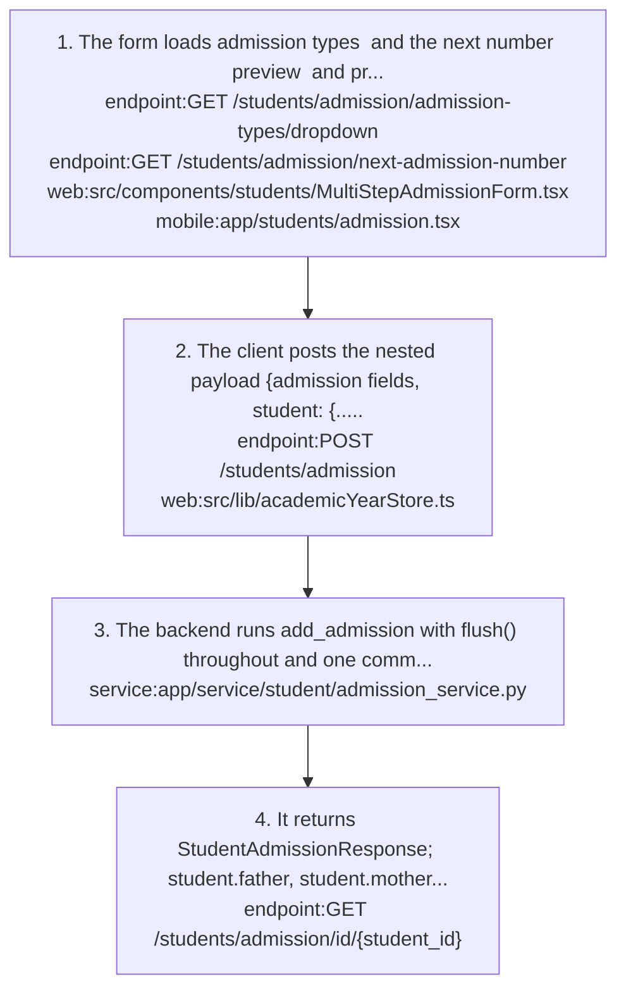
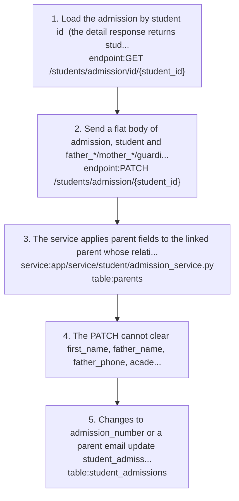
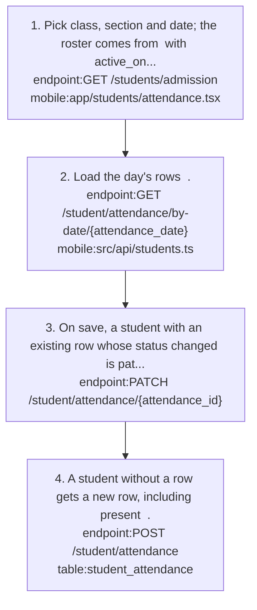
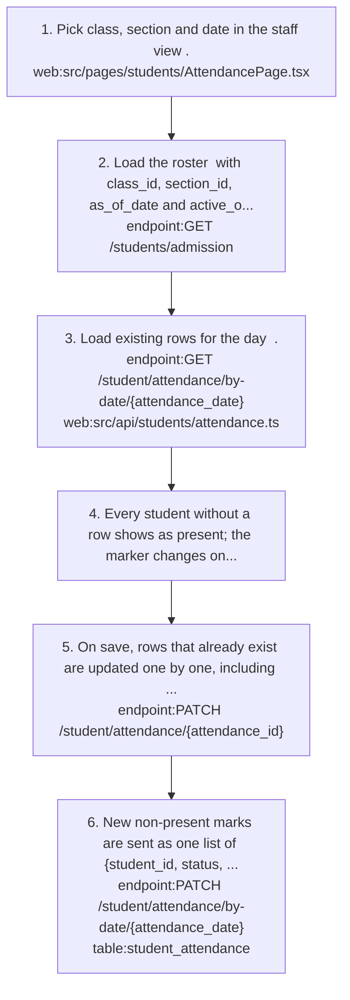
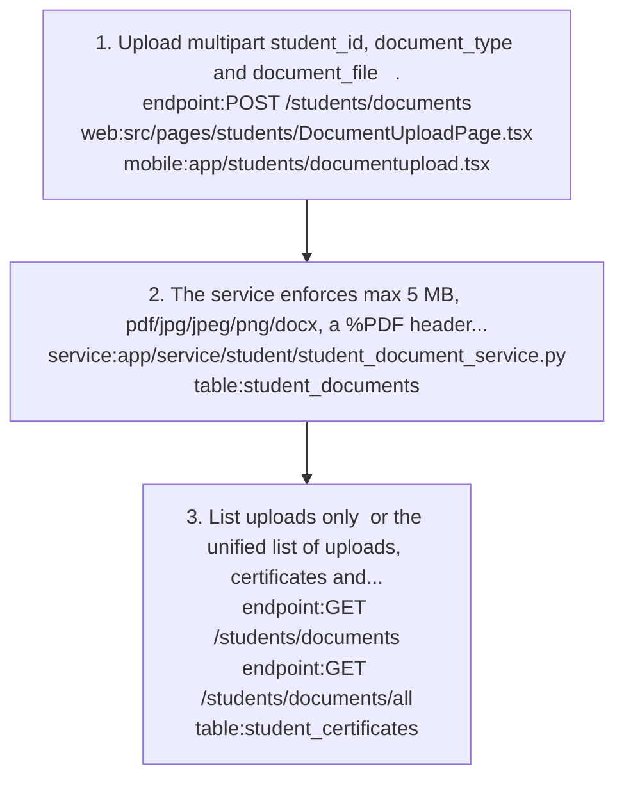

# students: knowledge graph view

_Generated from `docs/graph/graph.jsonl` by `scripts/graph/kg_render.py`. Do not edit this file; change the graph and re-render._

Admission (student plus parent/guardian accounts), student records and active status, parent links, student attendance, student documents and photos.

Module doc: [docs/modules/students.md](../../../docs/modules/students.md)

## Features

### students/admission

Create one admission that also creates the student login, father/mother (and optional guardian) parent logins, parent links and the student_admissions row in one transaction.
- Roles: Admin (student admission create permission)
- Parity: Both clients require the admission number and pre-fill it with the next number; mobile dates are typed DD/MM/YYYY or picked, payload stays YYYY-MM-DD.
- Flows: [students/add-admission-backend](#studentsadd-admission-backend), [students/create-admission](#studentscreate-admission)
- Implemented by: `endpoint:GET /students/admission/admission-types/dropdown`, `endpoint:GET /students/admission/next-admission-number`, `endpoint:POST /students/admission`, `mobile:app/students/admission.tsx`, `service:app/service/student/admission_service.py`, `table:parents`, `table:student_admissions`, `table:student_parent_links`, `table:students`, `table:users`, `web:src/components/students/MultiStepAdmissionForm.tsx`, `web:src/pages/students/AdmissionPage.tsx`
- Shaped by: [students/academic-year-from-header-store](#studentsacademic-year-from-header-store), [students/admission-never-fails-on-side-effects](#studentsadmission-never-fails-on-side-effects), [students/admission-number-is-username](#studentsadmission-number-is-username), [students/admission-number-sequences](#studentsadmission-number-sequences), [students/guardian-email-required-in-clients](#studentsguardian-email-required-in-clients), [students/number-generated-on-save](#studentsnumber-generated-on-save), [students/parent-dedup-by-email](#studentsparent-dedup-by-email), [students/sentinels-instead-of-migrations](#studentssentinels-instead-of-migrations)

### students/attendance-views

Students view their own attendance and parents view a linked child's attendance for a date range.
- Roles: Student (own), Parent (related)
- Parity: Web detects a parent by role name parent; mobile also accepts guardian, father, mother.
- Flows: [students/attendance-views](#studentsattendance-views)
- Implemented by: `endpoint:GET /student-parent-links/my-children`, `endpoint:GET /student-parent-links/parent/{parent_id}/students`, `endpoint:GET /student/attendance/my-attendance`, `endpoint:GET /student/attendance/student/{student_id}/filter`, `mobile:app/parents/attendance.tsx`, `mobile:app/parents/select-child.tsx`, `service:app/service/masters/student_parent_link_service.py`, `service:app/service/student/student_attendance_service.py`, `table:student_attendance`, `web:src/api/auth.ts`, `web:src/pages/students/AttendancePage.tsx`
- Shaped by: [students/static-routes-before-dynamic](#studentsstatic-routes-before-dynamic)

### students/bulk-admission

Upload an Excel sheet named Student Admission; each row is admitted separately and the response lists created rows and row-numbered errors.
- Roles: Admin
- Parity: Mobile offers Auto Fetch (template with include_data=true, pre-filled with existing admissions); web does not.
- Flows: [students/bulk-admission](#studentsbulk-admission)
- Implemented by: `endpoint:GET /students/admission/bulk-upload/template`, `endpoint:POST /students/admission/bulk-upload`, `mobile:app/students/bulk-upload.tsx`, `service:app/service/student/admission_bulk_service.py`, `table:student_admissions`, `web:src/components/students/BulkAdmissionUploadDialog.tsx`
- Shaped by: [students/admission-type-is-authoritative](#studentsadmission-type-is-authoritative), [students/bulk-upload-per-row](#studentsbulk-upload-per-row)

### students/edit-admission

Edit an admission with a flat PATCH body covering admission, student and father_/mother_/guardian_ prefixed parent fields.
- Flows: [students/edit-admission](#studentsedit-admission)
- Implemented by: `endpoint:GET /students/admission/id/{student_id}`, `endpoint:PATCH /students/admission/{student_id}`, `mobile:app/students/admission.tsx`, `service:app/service/student/admission_service.py`, `table:parents`, `table:student_admissions`, `table:students`, `web:src/components/students/MultiStepAdmissionForm.tsx`

### students/mark-attendance

Staff mark daily student attendance per class and section; one row per (student_id, date) with status present/absent/late/half_day/leave.
- Roles: Holders of student_attendance create/update (Admin, Staff, Teacher); teachers are not limited to their classes.
- Parity: Web writes only non-present marks and sends as_of_date; mobile writes a row for every student including present, has no half_day and sends no as_of_date.
- Flows: [students/mark-attendance-mobile](#studentsmark-attendance-mobile), [students/mark-attendance-web](#studentsmark-attendance-web)
- Implemented by: `endpoint:GET /student/attendance/by-date/{attendance_date}`, `endpoint:GET /students/admission`, `endpoint:PATCH /student/attendance/by-date/{attendance_date}`, `endpoint:PATCH /student/attendance/{attendance_id}`, `endpoint:POST /student/attendance`, `mobile:app/students/attendance.tsx`, `service:app/service/student/student_attendance_service.py`, `table:student_attendance`, `web:src/pages/students/AttendancePage.tsx`
- Shaped by: [students/present-is-no-row-web](#studentspresent-is-no-row-web)

### students/own-admission-view

Students see their own admission and parents see their linked children's admissions.
- Roles: Student, Parent
- Parity: Web ParentAdmissionView loads the selected child via GET /students/admission/id/{student_id}; mobile uses my-admission and my-children-admissions.
- Implemented by: `endpoint:GET /students/admission/id/{student_id}`, `endpoint:GET /students/admission/my-admission`, `endpoint:GET /students/admission/my-children-admissions`, `mobile:app/students/myadmission.tsx`, `service:app/service/student/admission_service.py`, `web:src/pages/students/ParentAdmissionView.tsx`

### students/parent-links

Student-parent links connect children to shared parent records; parents fetch their children with the child's student UUID returned as id.
- Implemented by: `endpoint:DELETE /student-parent-links/student/{student_id}/parent/{parent_id}`, `endpoint:GET /student-parent-links/my-children`, `endpoint:GET /student-parent-links/parent/{parent_id}/students`, `endpoint:GET /student-parent-links/student/{student_id}/parents`, `service:app/service/masters/student_parent_link_service.py`, `table:student_parent_links`, `web:src/api/auth.ts`
- Shaped by: [students/parent-dedup-by-email](#studentsparent-dedup-by-email)

### students/parents-master

Create, search, view, edit and delete parent records; POST /parents/ creates the Parent login (username = email, else phone) together with the parents row.
- Roles: Holders of parent_management permissions
- Parity: Web /masters/parents and mobile app/masters/parents.tsx; both require email or phone on create.
- Note: Staff hold parent_management create but not delete by default.
- Implemented by: `endpoint:GET /parents`, `endpoint:GET /parents/salary-ranges/dropdown`, `endpoint:GET /parents/search`, `endpoint:PATCH /parents/{parent_id}`, `endpoint:POST /parents`, `service:app/service/masters/parent_service.py`, `table:parents`, `web:src/pages/masters/parents.tsx`

### students/student-documents

Upload general student documents (free-text document_type, unique per student) and list them, or list uploads, certificates and fee receipts merged newest first.
- Parity: Web document-type dropdown is empty (calls a non-existent route); mobile hardcodes the type list. Downloads fail on both.
- Flows: [students/upload-documents](#studentsupload-documents)
- Implemented by: `endpoint:GET /students/documents`, `endpoint:GET /students/documents/all`, `endpoint:POST /students/documents`, `mobile:app/parents/documents.tsx`, `mobile:app/students/documentupload.tsx`, `mobile:app/students/mydocuments.tsx`, `mobile:app/students/studentdocuments.tsx`, `service:app/service/student/student_document_service.py`, `table:student_certificates`, `table:student_documents`, `web:src/pages/students/DocumentUploadPage.tsx`, `web:src/pages/students/MyDocumentsPage.tsx`, `web:src/pages/students/ParentDocumentsPage.tsx`, `web:src/pages/students/StudentDocumentsPage.tsx`

### students/student-photo

Upload or remove a student photo (jpg/png/webp, max 2 MB) stored at media/{tenant_id}/student/photos/{student_id}.{ext} and returned as photo_url.
- Implemented by: `endpoint:DELETE /students/admission/id/{student_id}/photo`, `endpoint:POST /students/admission/id/{student_id}/photo`, `service:app/service/student/admission_service.py`, `table:students`

### students/student-records

List, search and view students, and activate or deactivate a student via users.is_active.
- Roles: Admin, Staff, Teacher read all; Student own; Parent related (linked children).
- Note: GET /students/admission/ defaults to limit=10 (max 100); active_only=true keeps only active students.
- Implemented by: `endpoint:GET /students/admission`, `endpoint:GET /students/admission/id/{student_id}`, `endpoint:GET /students/admission/search`, `endpoint:GET /students/admission/students/dropdown`, `endpoint:PATCH /students/admission/{student_id}/toggle-active`, `mobile:app/students/[id].tsx`, `mobile:app/students/index.tsx`, `service:app/service/student/admission_service.py`, `table:student_admissions`, `table:students`, `table:users`, `web:src/components/students/AdmissionTable.tsx`, `web:src/pages/students/StudentProfile.tsx`
- Shaped by: [students/active-status-on-users](#studentsactive-status-on-users), [students/deactivate-instead-of-delete](#studentsdeactivate-instead-of-delete), [students/reselect-after-commit](#studentsreselect-after-commit)

## Flows

### students/add-admission-backend

Implements: `feature:students/admission`

1. Default admission_date to today and reject a future date `service:app/service/student/admission_service.py`.
2. Resolve the Student and Parent role ids by name; fail if either role is missing.
3. Derive admission_type from the payload, or pre_primary when student.is_primary == primary, else regular.
4. Use a manual admission number only if unique in both student_admissions.admission_number and users.username `table:student_admissions`; otherwise generate it from the type sequence.
5. Validate required fields (first_name, father phone, academic_year_id, admitted_class_id, address_line1; a blank parent name falls back to the relation label) and reject father and mother sharing one email.
6. Look up provided parent emails among users with role Parent; reject an email already used by a non-Parent user.
7. Create the student user with username = admission number, the hardcoded temporary password and is_first_login = TRUE, then flush() `table:users`.
8. Create the students row (empty last_name, sentinel DOB 1900-01-01 when blank) and flush() `table:students`.
9. For father and mother: reuse the existing Parent user and overwrite its parents row with the new payload, or create a user (email, else {admission_number}.father/.mother) and parents row `table:parents`.
10. For a guardian with an email: reuse or create the same way; a guardian with details but no email is already rejected with 422 by the schema.
11. Insert student_parent_links for each parent and the student_admissions row, then flush() `table:student_parent_links` `table:student_admissions`.
12. Auto-apply mandatory (all_by_default) class fees inside try/except; a failure is logged and the admission continues `service:app/service/fee/fee_class_mapping_service.py`.
13. Re-select the admission with its relationships, then commit() once and return the response.

- Failure: any validation or DB error before commit rolls back the whole admission; nothing partial is saved.

Shaped by: [students/admission-never-fails-on-side-effects](#studentsadmission-never-fails-on-side-effects), [students/admission-number-is-username](#studentsadmission-number-is-username), [students/admission-number-sequences](#studentsadmission-number-sequences), [students/parent-dedup-by-email](#studentsparent-dedup-by-email)

### students/attendance-views

Implements: `feature:students/attendance-views`

1. A student reads own attendance `endpoint:GET /student/attendance/student/{student_id}/filter` or `endpoint:GET /student/attendance/my-attendance`; start_date and end_date are mandatory (422 otherwise).
2. The UI defaults the range to the 1st of the month through today `web:src/pages/students/AttendancePage.tsx`.
3. A parent loads children `endpoint:GET /student-parent-links/parent/{parent_id}/students` or `endpoint:GET /student-parent-links/my-children` (web `web:src/api/auth.ts`, mobile `mobile:app/parents/select-child.tsx`); each child's student UUID is returned as id, with class, section and year.
4. Every child-specific call passes that id as student_id, for example the filter call `mobile:app/parents/attendance.tsx`.

- Note: the X-Student-ID header that clients send for parents is ignored; scoping relies on explicit student_id plus the related-scope check.

### students/bulk-admission

Implements: `feature:students/bulk-admission`

1. Download the template `endpoint:GET /students/admission/bulk-upload/template`; it has dropdowns via a hidden Lists sheet and cascading sub-caste, and include_data=true pre-fills existing admissions.
2. Upload the workbook with a sheet named Student Admission `endpoint:POST /students/admission/bulk-upload` `web:src/components/students/BulkAdmissionUploadDialog.tsx` `mobile:app/students/bulk-upload.tsx`.
3. The service checks the required headers (First name, joining class, Father name, Father phone, Address Line 1) and uses the tenant's active academic year `service:app/service/student/admission_bulk_service.py`.
4. Each row maps Student type Pre Primary to is_primary = primary, sends no admission_type, and calls add_admission on its own `service:app/service/student/admission_service.py`.
5. The response is {created[], errors[], total_rows}; good rows are kept even when others fail.

Shaped by: [students/bulk-upload-per-row](#studentsbulk-upload-per-row)

### students/create-admission

Implements: `feature:students/admission`

1. The form loads admission types `endpoint:GET /students/admission/admission-types/dropdown` and the next number preview `endpoint:GET /students/admission/next-admission-number` and pre-fills the admission number `web:src/components/students/MultiStepAdmissionForm.tsx` `mobile:app/students/admission.tsx`.
2. The client posts the nested payload {admission fields, student: {..., father, mother, guardian?}} `endpoint:POST /students/admission`; on web academic_year_id and admitted_academic_year_id come from the header year store `web:src/lib/academicYearStore.ts`.
3. The backend runs add_admission with flush() throughout and one commit() at the end `service:app/service/student/admission_service.py`.
4. It returns StudentAdmissionResponse; student.father, student.mother and student.guardian are null in this response, so clients re-read `endpoint:GET /students/admission/id/{student_id}` for the parents.

- Result: users, students, parents, student_parent_links and student_admissions rows exist, and mandatory class fees are applied when possible.

Shaped by: [students/academic-year-from-header-store](#studentsacademic-year-from-header-store), [students/number-generated-on-save](#studentsnumber-generated-on-save)

### students/edit-admission

Implements: `feature:students/edit-admission`

1. Load the admission by student id `endpoint:GET /students/admission/id/{student_id}` (the detail response returns student.is_active as null).
2. Send a flat body of admission, student and father_*/mother_*/guardian_* fields `endpoint:PATCH /students/admission/{student_id}`.
3. The service applies parent fields to the linked parent whose relation_to_student matches `service:app/service/student/admission_service.py` `table:parents`.
4. The PATCH cannot clear first_name, father_name, father_phone, academic_year_id, admitted_class_id or admission_number, and cannot add a guardian that has no link yet.
5. Changes to admission_number or a parent email update student_admissions/parents only; users.username and users.email keep the original login identity `table:student_admissions`.

- Note: parents are shared across siblings, so a parent edit through one child changes it for all siblings.

### students/mark-attendance-mobile

Implements: `feature:students/mark-attendance`

1. Pick class, section and date; the roster comes from `endpoint:GET /students/admission` with active_only=true, paged 100 at a time, without as_of_date `mobile:app/students/attendance.tsx`.
2. Load the day's rows `endpoint:GET /student/attendance/by-date/{attendance_date}` `mobile:src/api/students.ts`.
3. On save, a student with an existing row whose status changed is patched `endpoint:PATCH /student/attendance/{attendance_id}`.
4. A student without a row gets a new row, including present `endpoint:POST /student/attendance` `table:student_attendance`.

- Note: single create/update returns 422 for a future date or a date before admission_date and lowercases status.

### students/mark-attendance-web

Implements: `feature:students/mark-attendance`

1. Pick class, section and date in the staff view `web:src/pages/students/AttendancePage.tsx`.
2. Load the roster `endpoint:GET /students/admission` with class_id, section_id, as_of_date and active_only=true, paging 100 at a time until has_next is false; as_of_date hides students admitted later.
3. Load existing rows for the day `endpoint:GET /student/attendance/by-date/{attendance_date}` `web:src/api/students/attendance.ts`.
4. Every student without a row shows as present; the marker changes only exceptions.
5. On save, rows that already exist are updated one by one, including back to present `endpoint:PATCH /student/attendance/{attendance_id}`.
6. New non-present marks are sent as one list of {student_id, status, remarks} to the upsert `endpoint:PATCH /student/attendance/by-date/{attendance_date}`; students before their admission_date are skipped silently `table:student_attendance`.

- Note: by-date PATCH takes raw dicts, so status must already be lowercase, and it cannot clear remarks.

Shaped by: [students/present-is-no-row-web](#studentspresent-is-no-row-web)

### students/upload-documents

Implements: `feature:students/student-documents`

1. Upload multipart student_id, document_type and document_file `endpoint:POST /students/documents` `web:src/pages/students/DocumentUploadPage.tsx` `mobile:app/students/documentupload.tsx`.
2. The service enforces max 5 MB, pdf/jpg/jpeg/png/docx, a %PDF header for PDFs and a document_type unique per student `service:app/service/student/student_document_service.py` `table:student_documents`.
3. List uploads only `endpoint:GET /students/documents` or the unified list of uploads, certificates and fee receipts newest first `endpoint:GET /students/documents/all` `table:student_certificates`.

- Failure: files are saved under ./student_documents/, which is not tenant-scoped and not served, so download links are broken.

## Decisions

### students/academic-year-from-header-store (active)

- **Decision**: On web, academic_year_id and admitted_academic_year_id come from the header academic-year store (the selected year), not a per-form picker.
- **Why**: One source of truth, so users cannot pick a wrong year per form.
- Shapes: `feature:students/admission`, `flow:students/create-admission`, `web:src/lib/academicYearStore.ts`

### students/active-status-on-users (active)

- **Decision**: Student active status lives on users.is_active; the students table has no active column.
- **Why**: Deactivating a student must also block their login, so a single flag on the user record controls both.
- Note: Effect: an inactive student cannot log in and is excluded from /students/dropdown* by default.
- Shapes: `concept:students/student-active-status`, `feature:students/student-records`, `table:users`

### students/admission-never-fails-on-side-effects (active)

- **Decision**: Admission never fails because of side effects: mandatory-fee auto-apply is wrapped in try/except and the confirmation SMS is manual only (send-confirmation), not sent on create.
- **Why**: Creating the student must not be blocked by fee configuration or messaging problems.
- **Tradeoff**: A failed fee auto-apply is only logged, so fees may need to be mapped by hand.
- Shapes: `feature:students/admission`, `flow:students/add-admission-backend`, `service:app/service/fee/fee_class_mapping_service.py`

### students/admission-number-is-username (active)

- **Decision**: The student's login username is the admission number, and a manual number is checked against users.username too.
- **Why**: The school already knows and prints the admission number, and it is unique.
- Shapes: `feature:students/admission`, `flow:students/add-admission-backend`, `table:student_admissions`, `table:users`

### students/admission-number-sequences (active)

- **Decision**: Regular admission numbers ({SEQ:03d}) use one global sequence that never resets; pre-primary numbers ({YEAR}{SEQ:04d}) reset every calendar year of admission_date.
- **Why**: Pre-primary numbers carry the year so they can restart each year; regular numbers have no year prefix, so a reset would collide.
- Shapes: `concept:students/admission-type`, `feature:students/admission`, `flow:students/add-admission-backend`

### students/admission-type-is-authoritative (active)

- **Decision**: admission_type (pre_primary/regular) is the authoritative field; is_primary must not be read as admission type.
- **Why**: is_primary means Day Scholar/Hostel in the UI but Pre Primary in bulk upload and the backend fallback, so its meaning is ambiguous.
- Shapes: `concept:students/admission-type`, `concept:students/is-primary`, `feature:students/bulk-admission`

### students/bulk-upload-per-row (active)

- **Decision**: Bulk admission is per-row, not all-or-nothing: each row runs add_admission separately.
- **Why**: Large sheets usually have a few bad rows; the error list names them by row number so they can be fixed and re-uploaded.
- **Alternatives**: Reject the whole sheet on any error.
- Shapes: `feature:students/bulk-admission`, `flow:students/bulk-admission`, `service:app/service/student/admission_bulk_service.py`

### students/deactivate-instead-of-delete (active)

- **Decision**: Students are deactivated with toggle-active; no client calls DELETE /students/admission/{admission_id}.
- **Why**: Delete is permanent (attendance, documents, certificates, fee mappings, transport, links, user) and is refused with 409 once the student has fee payments, concessions, old dues, exam marks or results, so deactivation is the only path that works for every student.
- Shapes: `endpoint:DELETE /students/admission/{admission_id}`, `endpoint:PATCH /students/admission/{student_id}/toggle-active`, `feature:students/student-records`

### students/guardian-email-required-in-clients (active)

- **Decision**: Both clients require the guardian email once a guardian name is entered.
- **Why**: The guardian login uses the email as username, and the API rejects (422) a guardian with details but no email, so clients catch it before submit.
- Shapes: `concept:students/guardian`, `feature:students/admission`, `mobile:app/students/admission.tsx`, `web:src/components/students/admission-steps/ParentsStepForm.tsx`

### students/number-generated-on-save (active)

- **Decision**: The final admission number is generated at create; GET next-admission-number is only a non-binding preview and reserves nothing.
- **Why**: Two admins previewing at once would otherwise race for the same number.
- **Tradeoff**: The number shown in the form can differ from the one saved if another admission lands first.
- Shapes: `endpoint:GET /students/admission/next-admission-number`, `feature:students/admission`, `flow:students/create-admission`

### students/parent-dedup-by-email (active)

- **Decision**: Parents are deduplicated by email among users with role Parent; a matching parent is reused, overwritten with the new payload and linked to the new child.
- **Why**: Siblings share one parent login and one parent record.
- **Tradeoff**: Admitting a sibling overwrites the shared parent's name and phone; an email held by a non-Parent user is rejected.
- Shapes: `feature:students/admission`, `feature:students/parent-links`, `flow:students/add-admission-backend`, `table:parents`

### students/present-is-no-row-web (active)

- **Decision**: Web student attendance treats present as no row: only non-present marks are written, and changing an existing row back to present is a PATCH, not a DELETE.
- **Why**: Markers then do not need student_attendance:delete, and storage holds only exceptions.
- **Tradeoff**: Mobile writes present rows too, so reports see extra present rows on mobile-marked days.
- Shapes: `feature:students/mark-attendance`, `flow:students/mark-attendance-web`, `table:student_attendance`

### students/reselect-after-commit (active)

- **Decision**: toggle_student_active re-selects the student with selectinload(Student.user) after commit before serialising.
- **Why**: Without the reload the expired relationship caused a 500 while serialising the response; the repo rule is flush() -> select() -> commit().
- Shapes: `feature:students/student-records`, `service:app/service/student/admission_service.py`

### students/sentinels-instead-of-migrations (active)

- **Decision**: Optional admission fields over NOT NULL columns use sentinels: DOB 1900-01-01, empty last_name, and parent name = relation label.
- **Why**: The NOT NULL columns stay without a migration, and sentinel records remain findable for later cleanup.
- **Alternatives**: Migrate the columns to nullable.
- Shapes: `concept:students/placeholder-date-of-birth`, `feature:students/admission`, `table:parents`, `table:students`

### students/static-routes-before-dynamic (active)

- **Decision**: In attendance endpoints, static routes (/search, /my-attendance) are declared above /{attendance_id}.
- **Why**: Otherwise FastAPI parses my-attendance as a UUID path parameter and returns 422.
- Shapes: `endpoint:GET /student/attendance/my-attendance`, `feature:students/attendance-views`

## Concepts

### students/admission-number

The school's identifier for an admission and the student's login username; typed by hand or generated as {YEAR}{SEQ:04d} (pre_primary) or {SEQ:03d} (regular).
- Related: `feature:students/admission`, `table:student_admissions`, `table:users`

### students/admission-type

Admission type is pre_primary or regular (AdmissionTypeEnum); it selects the admission number format and sequence. If omitted it is derived from student.is_primary == primary.
- Related: `feature:students/admission`, `table:student_admissions`

### students/attendance-status

Daily attendance status: present, absent, late, half_day or leave (shared enum app/schemas/common/attendance_status_enum.py), one row per person per date.
- Related: `feature:students/mark-attendance`, `table:staff_attendance`, `table:student_attendance`

### students/guardian

An optional third parent (besides father and mother) stored as a parents row linked with relation guardian; it requires an email, and a guardian with details but no email is rejected.
- Related: `feature:students/admission`, `table:parents`, `table:student_parent_links`

### students/is-primary

student.is_primary has two meanings: in the admission UI not_primary = Day Scholar and primary = Hostel; in bulk upload and the backend fallback primary means Pre Primary.
- Related: `feature:students/bulk-admission`, `table:students`, `web:src/components/students/admission-steps/StudentStepForm.tsx`

### students/placeholder-date-of-birth

The sentinel date 1900-01-01 (PLACEHOLDER_DATE_OF_BIRTH) stored when an admission has no date of birth.
- Related: `table:students`

### students/role-read-scope

Student reads are role-aware via check_user_resource_access: Student own, Parent related (children linked in student_parent_links), Admin/Staff/Teacher all.
- Related: `feature:students/attendance-views`, `feature:students/student-records`, `table:student_parent_links`

### students/shared-parent

One parents row and one Parent login shared by siblings, matched by email at admission; edits through any child apply to all siblings.
- Related: `feature:students/parent-links`, `table:parents`

### students/student-active-status

Whether a student is active, stored on users.is_active; inactive students cannot log in and are hidden from active-only dropdowns.
- Related: `feature:students/student-records`, `table:users`

### students/student-vs-admission-id

List rows carry id = admission id and student.id = student id. /id/{student_id}, PATCH, toggle-active and photo routes take the student id; DELETE and /by-admission/{admission_id} take the admission id.
- Related: `feature:students/student-records`, `table:student_admissions`, `table:students`
