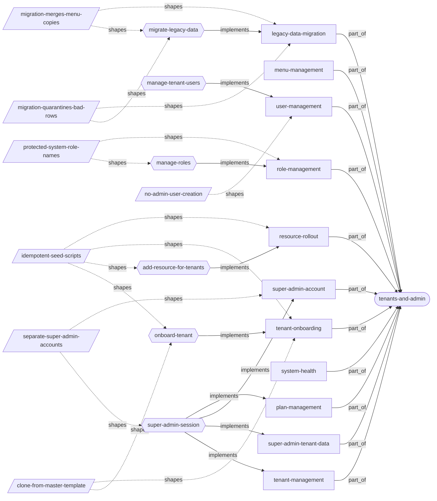
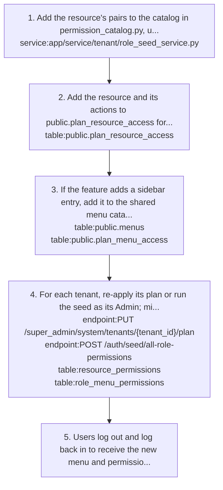
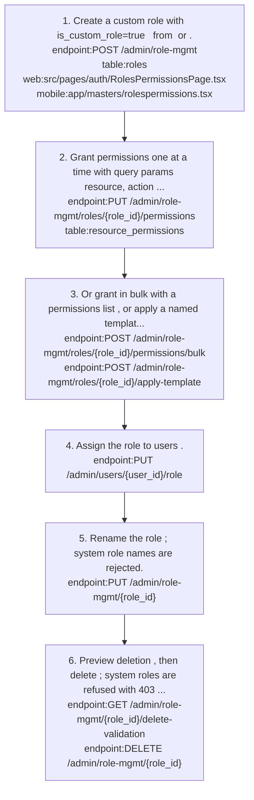
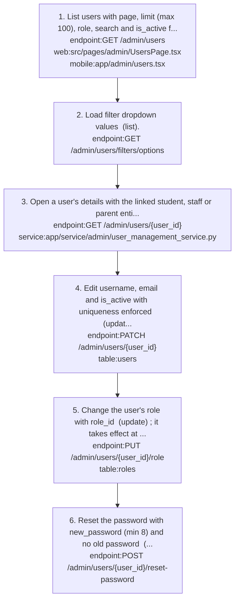
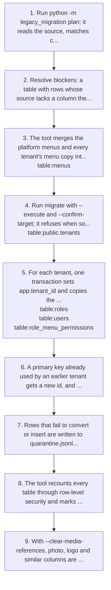
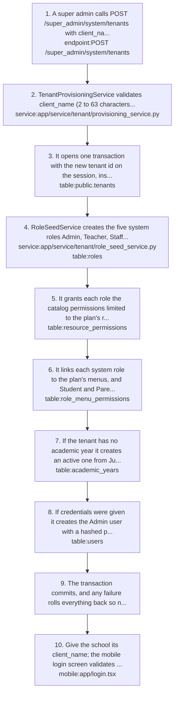
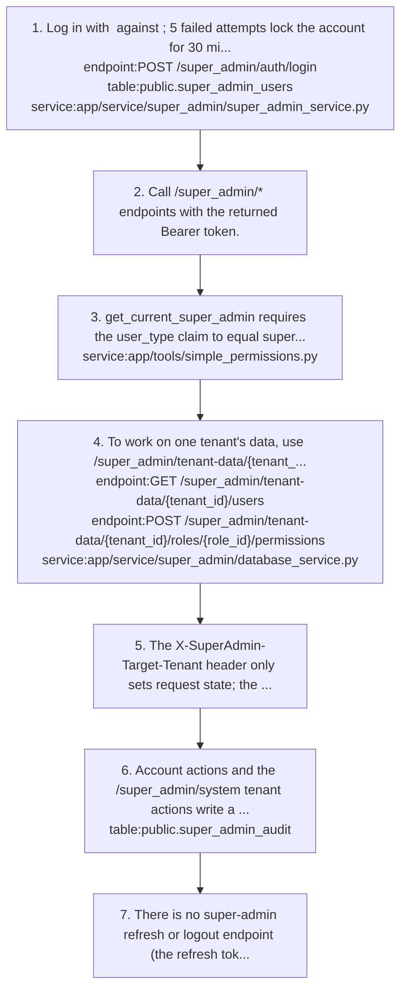

# tenants-and-admin: knowledge graph view

_Generated from `docs/graph/graph.jsonl` by `scripts/graph/kg_render.py`. Do not edit this file; change the graph and re-render._

Public-schema tenant registry and plans, super-admin console APIs, script-based tenant onboarding, and tenant-admin user, role and menu management.

Module doc: [docs/modules/tenants-and-admin.md](../../../docs/modules/tenants-and-admin.md)

## Features

### tenants-and-admin/legacy-data-migration

A command-line tool that copies the old schema-per-tenant data into the shared database, with a read-only plan, a guarded execute step, per-tenant transactions and a quarantine file for rows that cannot be inserted.
- Roles: Operators with database access; there is no API or UI.
- Note: The tool is backend/legacy_migration, outside the app package; media files and tables that exist only in the source are not migrated, and --clear-media-references removes the references that would dangle, and the report lists the source-only tables.
- Flows: [tenants-and-admin/migrate-legacy-data](#tenants-and-adminmigrate-legacy-data)
- Shaped by: [tenants-and-admin/migration-merges-menu-copies](#tenants-and-adminmigration-merges-menu-copies), [tenants-and-admin/migration-quarantines-bad-rows](#tenants-and-adminmigration-quarantines-bad-rows)

### tenants-and-admin/menu-management

Tenant admins create and list menus; the calls act on the shared public.menus catalog, so a new row is visible to every school.
- Roles: Tenant admin.
- Parity: Web has no menu screen; mobile app/admin/menu.tsx lists and creates, but its update and delete call routes that do not exist.
- Implemented by: `endpoint:GET /auth/menus`, `endpoint:POST /auth/menus`, `mobile:app/admin/menu.tsx`, `mobile:src/api/auth.ts`, `service:app/service/auth/menu_service.py`, `table:menus`
- Shaped by: [platform/menus-separate-from-permissions](#platformmenus-separate-from-permissions)

### tenants-and-admin/plan-management

Super admins list, create and edit plans (no delete) and add or remove resource:action entries on a plan.
- Roles: Super admin.
- Note: Plan resource edits change only plan_resource_access; tenants gain nothing until their resource_permissions rows are written too.
- Flows: [tenants-and-admin/super-admin-session](#tenants-and-adminsuper-admin-session)
- Implemented by: `endpoint:DELETE /super_admin/plans/{plan_id}/resources`, `endpoint:GET /super_admin/plans`, `endpoint:GET /super_admin/plans/{plan_id}`, `endpoint:GET /super_admin/plans/{plan_id}/resources`, `endpoint:POST /super_admin/plans`, `endpoint:POST /super_admin/plans/{plan_id}/resources`, `endpoint:PUT /super_admin/plans/{plan_id}`, `service:app/service/super_admin/super_admin_service.py`, `table:public.plan_menu_access`, `table:public.plan_resource_access`, `table:public.plans`
- Shaped by: [platform/role-only-runtime-check](#platformrole-only-runtime-check)

### tenants-and-admin/resource-rollout

Grant a new feature/resource to existing tenants by writing both permission layers (plan and tenant role) and, when needed, sidebar menus.
- Roles: Platform operator running backend/scripts/seed_<feature>_permissions.py-style scripts.
- Flows: [tenants-and-admin/add-resource-for-tenants](#tenants-and-adminadd-resource-for-tenants)
- Implemented by: `table:menus`, `table:public.plan_resource_access`, `table:resource_permissions`, `table:role_menu_permissions`
- Shaped by: [platform/role-only-runtime-check](#platformrole-only-runtime-check), [tenants-and-admin/idempotent-seed-scripts](#tenants-and-adminidempotent-seed-scripts)

### tenants-and-admin/role-management

Tenant admins create, rename and delete custom roles and grant their resource_permissions one at a time, in bulk or from a template.
- Roles: Tenant admin (role_management:*).
- Parity: Web /masters/rolespermissions and mobile app/masters/rolespermissions.tsx both create roles; both call a nonexistent /admin/role-mgmt/roles/{id} for edit and delete, and mobile gets 422s on permission updates and templates.
- Note: The hardcoded permission templates use resource names runtime checks never use (fee_management, student_management), so applying one grants almost nothing.
- Note: Admin, Teacher, Staff, Student and Parent cannot be renamed or deleted; a custom role with assigned users is refused unless force=true, and the forced delete fails with 500.
- Note: Every role-mgmt endpoint requires role_management with the matching action.
- Flows: [tenants-and-admin/manage-roles](#tenants-and-adminmanage-roles)
- Implemented by: `endpoint:DELETE /admin/role-mgmt/{role_id}`, `endpoint:GET /admin/role-mgmt/roles`, `endpoint:GET /admin/role-mgmt/roles/{role_id}/permissions`, `endpoint:GET /admin/role-mgmt/templates`, `endpoint:GET /admin/role-mgmt/{role_id}/delete-validation`, `endpoint:GET /auth/resource-permissions/matrix/all`, `endpoint:POST /admin/role-mgmt`, `endpoint:POST /admin/role-mgmt/roles/{role_id}/apply-template`, `endpoint:POST /admin/role-mgmt/roles/{role_id}/permissions/bulk`, `endpoint:POST /auth/resource-permissions`, `endpoint:POST /auth/resource-permissions/bulk`, `endpoint:PUT /admin/role-mgmt/roles/{role_id}/permissions`, `endpoint:PUT /admin/role-mgmt/{role_id}`, `mobile:app/masters/rolespermissions.tsx`, `mobile:src/api/masters.ts`, `service:app/service/auth/resource_permission_service.py`, `table:resource_permissions`, `table:roles`, `web:src/api/auth.ts`, `web:src/pages/auth/RolesPermissionsPage.tsx`
- Shaped by: [tenants-and-admin/protected-system-role-names](#tenants-and-adminprotected-system-role-names)

### tenants-and-admin/super-admin-account

Platform super admins log in separately, view and edit their own profile, change their password and register other super admins.
- Roles: Super admin.
- Parity: No super-admin login UI on web or mobile.
- Note: After 5 failed attempts the account is locked for 30 minutes.
- Note: There is no super-admin refresh endpoint, so the session ends when the 24 h access token expires.
- Flows: [tenants-and-admin/super-admin-session](#tenants-and-adminsuper-admin-session)
- Implemented by: `endpoint:GET /super_admin/auth/profile`, `endpoint:POST /super_admin/auth/change-password`, `endpoint:POST /super_admin/auth/login`, `endpoint:POST /super_admin/auth/register`, `endpoint:PUT /super_admin/auth/profile`, `service:app/service/super_admin/super_admin_service.py`, `service:app/tools/simple_permissions.py`, `table:public.super_admin_audit`, `table:public.super_admin_users`
- Shaped by: [tenants-and-admin/separate-super-admin-accounts](#tenants-and-adminseparate-super-admin-accounts)

### tenants-and-admin/super-admin-tenant-data

Super admins read any tenant's users, students, stats, reports and roles, and write role permissions into a tenant, through a tenant id in the path.
- Roles: Super admin.
- Note: The tenant id in the path is validated against public.tenants and each query runs in a tenant session for it; the X-SuperAdmin-Target-Tenant header only sets request state.
- Flows: [tenants-and-admin/super-admin-session](#tenants-and-adminsuper-admin-session)
- Implemented by: `endpoint:GET /super_admin/tenant-data/schemas`, `endpoint:GET /super_admin/tenant-data/{tenant_id}/reports`, `endpoint:GET /super_admin/tenant-data/{tenant_id}/roles`, `endpoint:GET /super_admin/tenant-data/{tenant_id}/roles/{role_id}/permissions`, `endpoint:GET /super_admin/tenant-data/{tenant_id}/stats`, `endpoint:GET /super_admin/tenant-data/{tenant_id}/students`, `endpoint:GET /super_admin/tenant-data/{tenant_id}/users`, `endpoint:POST /super_admin/tenant-data/{tenant_id}/roles/{role_id}/permissions`, `service:app/service/super_admin/database_service.py`, `table:resource_permissions`, `table:roles`

### tenants-and-admin/system-health

Super admins see system health and usage statistics; usage-stats answers 500 because its payload holds a SQL func.now() that cannot be JSON-encoded.
- Roles: Super admin.
- Implemented by: `endpoint:GET /super_admin/auth/health`, `endpoint:GET /super_admin/system/health`, `endpoint:GET /super_admin/system/usage-stats`, `service:app/service/super_admin/super_admin_service.py`, `table:public.super_admin_audit`

### tenants-and-admin/tenant-management

Super admins list, create and toggle tenants active or inactive, and assign a plan.
- Roles: Super admin.
- Parity: Web /superorg page exists but calls mismatched /super-admin paths with a tenant token; mobile has none.
- Note: Tenant lookups are cached in memory forever, so deactivating a tenant has no effect until the process restarts.
- Note: PUT /super_admin/system/tenants/{id}/plan deletes and re-inserts tenant menus flat and recreates menu grants only for Admin; do not run it on a live tenant.
- Note: POST /super_admin/system/tenants/ creates the tenant, its roles, plan-limited permissions and menu links in one transaction; the first Admin is created only when a JSON admin body is sent.
- Flows: [tenants-and-admin/super-admin-session](#tenants-and-adminsuper-admin-session)
- Implemented by: `endpoint:GET /super_admin/system/tenants`, `endpoint:POST /super_admin/system/tenants`, `endpoint:PUT /super_admin/system/tenants/{tenant_id}/activate`, `endpoint:PUT /super_admin/system/tenants/{tenant_id}/plan`, `service:app/service/super_admin/super_admin_service.py`, `table:menus`, `table:public.plans`, `table:public.tenants`, `table:role_menu_permissions`, `web:src/api/superadmin.ts`, `web:src/pages/superadmin/SuperAdminDashboard.tsx`
- Shaped by: [platform/schema-per-tenant](#platformschema-per-tenant)

### tenants-and-admin/tenant-onboarding

Create a new school tenant with one super-admin call that seeds roles, plan-limited permissions, menu access, a default academic year and an optional first Admin.
- Roles: Super admin.
- Parity: No super-admin UI on web or mobile; the call is made directly against the API.
- Note: The legacy scripts (create_little_bunny_tenant.py and the seed_* family) clone per-tenant schemas and do not apply to the shared database.
- Flows: [tenants-and-admin/onboard-tenant](#tenants-and-adminonboard-tenant)
- Implemented by: `endpoint:POST /super_admin/system/tenants`, `mobile:app/login.tsx`, `service:app/service/tenant/provisioning_service.py`, `service:app/service/tenant/role_seed_service.py`, `table:academic_years`, `table:issuable_certificate_templates`, `table:public.menus`, `table:public.tenants`, `table:resource_permissions`, `table:role_menu_permissions`, `table:roles`, `table:users`
- Shaped by: [platform/provision-in-one-transaction](#platformprovision-in-one-transaction), [platform/schema-per-tenant](#platformschema-per-tenant), [tenants-and-admin/clone-from-master-template](#tenants-and-adminclone-from-master-template), [tenants-and-admin/idempotent-seed-scripts](#tenants-and-adminidempotent-seed-scripts)

### tenants-and-admin/user-management

Tenant admins list, filter and search all tenant users with their linked student, staff or parent entity, edit username/email/active flag, change role and reset passwords.
- Roles: Tenant admin (role with user_management:*; normally Admin).
- Parity: Web /admin/users and mobile app/admin/users.tsx both list, edit and reset; neither has a UI for changing a user's role.
- Note: Tenant users are never created here; accounts come from staff enrolment and student admission.
- Note: Admin password reset does not set is_first_login, writes no audit row, and does not stop resetting another admin or deactivating oneself.
- Note: update_user uses commit() then refresh(), breaking the repo flush -> select -> commit rule.
- Flows: [tenants-and-admin/manage-tenant-users](#tenants-and-adminmanage-tenant-users)
- Implemented by: `endpoint:GET /admin/users`, `endpoint:GET /admin/users/filters/options`, `endpoint:GET /admin/users/{user_id}`, `endpoint:PATCH /admin/users/{user_id}`, `endpoint:POST /admin/users/{user_id}/reset-password`, `endpoint:PUT /admin/users/{user_id}/role`, `mobile:app/admin/users.tsx`, `mobile:src/api/users.ts`, `service:app/service/admin/user_management_service.py`, `table:roles`, `table:users`, `web:src/api/admin/users.ts`, `web:src/pages/admin/UsersPage.tsx`
- Shaped by: [tenants-and-admin/no-admin-user-creation](#tenants-and-adminno-admin-user-creation)

## Flows

### tenants-and-admin/add-resource-for-tenants

Implements: `feature:tenants-and-admin/resource-rollout`

- Trigger: A new feature/resource must become usable in existing tenants.

1. Add the resource's pairs to the catalog in permission_catalog.py, used by role seeding `service:app/service/tenant/role_seed_service.py`
2. Add the resource and its actions to public.plan_resource_access for every plan that should include it `table:public.plan_resource_access`
3. If the feature adds a sidebar entry, add it to the shared menu catalog and the plan's plan_menu_access `table:public.menus` `table:public.plan_menu_access`
4. For each tenant, re-apply its plan or run the seed as its Admin; missing role permissions and role menu links are inserted `endpoint:PUT /super_admin/system/tenants/{tenant_id}/plan` `endpoint:POST /auth/seed/all-role-permissions` `table:resource_permissions` `table:role_menu_permissions`
5. Users log out and log back in to receive the new menu and permission snapshot.

- Note: Seeding is insert-only (ON CONFLICT DO NOTHING), so a revoked grant stays revoked; re-applying the plan also deletes grants and menu links the plan no longer allows.

Shaped by: [platform/role-only-runtime-check](#platformrole-only-runtime-check), [tenants-and-admin/idempotent-seed-scripts](#tenants-and-adminidempotent-seed-scripts)

### tenants-and-admin/manage-roles

Implements: `feature:tenants-and-admin/role-management`

1. Create a custom role with is_custom_role=true `endpoint:POST /admin/role-mgmt` `table:roles` from `web:src/pages/auth/RolesPermissionsPage.tsx` or `mobile:app/masters/rolespermissions.tsx`.
2. Grant permissions one at a time with query params resource, action and is_granted `endpoint:PUT /admin/role-mgmt/roles/{role_id}/permissions` `table:resource_permissions`.
3. Or grant in bulk with a permissions list `endpoint:POST /admin/role-mgmt/roles/{role_id}/permissions/bulk`, or apply a named template with ?template_name= `endpoint:POST /admin/role-mgmt/roles/{role_id}/apply-template`.
4. Assign the role to users `endpoint:PUT /admin/users/{user_id}/role`.
5. Rename the role `endpoint:PUT /admin/role-mgmt/{role_id}`; system role names are rejected.
6. Preview deletion `endpoint:GET /admin/role-mgmt/{role_id}/delete-validation`, then delete `endpoint:DELETE /admin/role-mgmt/{role_id}`; system roles are refused with 403 and roles with assigned users with 400 unless force=true.

- Result: Users see the new permissions and menus only after logging out and back in.

- Failure: A forced delete of a role with users, or a delete of a role that still has role_menu_permissions rows, fails with 500 (users.role_id is NOT NULL; foreign key).

Shaped by: [tenants-and-admin/protected-system-role-names](#tenants-and-adminprotected-system-role-names)

### tenants-and-admin/manage-tenant-users

Implements: `feature:tenants-and-admin/user-management`

- Precondition: The caller's role grants user_management actions in the tenant resource_permissions; each step below names the action it needs.

1. List users with page, limit (max 100), role, search and is_active filters `endpoint:GET /admin/users` (list), from `web:src/pages/admin/UsersPage.tsx` or `mobile:app/admin/users.tsx`.
2. Load filter dropdown values `endpoint:GET /admin/users/filters/options` (list).
3. Open a user's details with the linked student, staff or parent entity `endpoint:GET /admin/users/{user_id}` (read) `service:app/service/admin/user_management_service.py`.
4. Edit username, email and is_active with uniqueness enforced `endpoint:PATCH /admin/users/{user_id}` (update) `table:users`.
5. Change the user's role with role_id `endpoint:PUT /admin/users/{user_id}/role` (update) `table:roles`; it takes effect at the user's next login.
6. Reset the password with new_password (min 8) and no old password `endpoint:POST /admin/users/{user_id}/reset-password` (update).

### tenants-and-admin/migrate-legacy-data

Implements: `feature:tenants-and-admin/legacy-data-migration`

- Trigger: An operator moves a school from the old per-schema database to the shared database.
- Precondition: The target is at the current Alembic head, and the source is reached through a read-only role.

1. Run python -m legacy_migration plan; it reads the source, matches columns, finds id collisions and orphans, and writes a report without touching any database
2. Resolve blockers: a table with rows whose source lacks a column the new schema requires.
3. The tool merges the platform menus and every tenant's menu copy into one shared catalog and maps each tenant menu id to a catalog id `table:menus`
4. Run migrate with --execute and --confirm-target; it refuses when source and target are the same database, and copies tenants and platform tables first `table:public.tenants`
5. For each tenant, one transaction sets app.tenant_id and copies the tables in foreign-key order `table:roles` `table:users` `table:role_menu_permissions`
6. A primary key already used by an earlier tenant gets a new id, and foreign keys in that tenant are rewritten; a row whose parent is missing has a nullable key set to NULL or is quarantined.
7. Rows that fail to convert or insert are written to quarantine.jsonl with the reason, and the tenant continues.
8. The tool recounts every table through row-level security and marks the tenant failed if a count differs from what it inserted.
9. With --clear-media-references, photo, logo and similar columns are set to NULL and document, certificate and attachment rows that point at files are skipped and logged, because the files are not migrated.

- Result: A report.json with per-table source, inserted and quarantined counts, dropped columns, remapped ids and menu name variants.

- Failure: A failed tenant is rolled back and reported; the others stay migrated, and --replace redoes it.

Shaped by: [platform/shared-schema-rls](#platformshared-schema-rls), [tenants-and-admin/migration-merges-menu-copies](#tenants-and-adminmigration-merges-menu-copies), [tenants-and-admin/migration-quarantines-bad-rows](#tenants-and-adminmigration-quarantines-bad-rows)

### tenants-and-admin/onboard-tenant

Implements: `feature:tenants-and-admin/tenant-onboarding`

- Trigger: A new school signs up. A super admin provisions it with one API call.
- Precondition: The shared menu catalog and the plan with its plan_resource_access and plan_menu_access rows already exist.

1. A super admin calls POST /super_admin/system/tenants with client_name and plan_id as query parameters and an optional JSON body holding the first Admin's username, email and password `endpoint:POST /super_admin/system/tenants`
2. TenantProvisioningService validates client_name (2 to 63 characters of lowercase letters, digits, hyphen or underscore), that the plan exists and is active (404 otherwise), and that the name is free (409 otherwise) `service:app/service/tenant/provisioning_service.py`
3. It opens one transaction with the new tenant id on the session, inserts the tenants row and flushes `table:public.tenants`
4. RoleSeedService creates the five system roles Admin, Teacher, Staff, Student and Parent `service:app/service/tenant/role_seed_service.py` `table:roles`
5. It grants each role the catalog permissions limited to the plan's resource actions; Admin gets every plan action plus role_management `table:resource_permissions`
6. It links each system role to the plan's menus, and Student and Parent only to the student-facing menu URLs `table:role_menu_permissions`
7. If the tenant has no academic year it creates an active one from June 1 to March 31, titled like 2026-2027, because nobody can log in without one `table:academic_years`
8. If credentials were given it creates the Admin user with a hashed password `table:users`
9. The transaction commits, and any failure rolls everything back so no half-created tenant remains.
10. Give the school its client_name; the mobile login screen validates the typed code with GET /auth/academic-years, so no client list needs editing `mobile:app/login.tsx`

- Result: A tenant row with roles, permissions limited to its plan, menu access, an academic year and optionally an Admin. Certificate templates are not seeded.

- Failure: A plan with no plan_resource_access rows fails with 409 and creates nothing.

Shaped by: [platform/provision-in-one-transaction](#platformprovision-in-one-transaction), [platform/role-only-runtime-check](#platformrole-only-runtime-check), [tenants-and-admin/clone-from-master-template](#tenants-and-adminclone-from-master-template), [tenants-and-admin/idempotent-seed-scripts](#tenants-and-adminidempotent-seed-scripts)

### tenants-and-admin/super-admin-session

Implements: `feature:tenants-and-admin/plan-management`, `feature:tenants-and-admin/super-admin-account`, `feature:tenants-and-admin/super-admin-tenant-data`, `feature:tenants-and-admin/tenant-management`

1. Log in with `endpoint:POST /super_admin/auth/login` against `table:public.super_admin_users`; 5 failed attempts lock the account for 30 minutes `service:app/service/super_admin/super_admin_service.py`.
2. Call /super_admin/* endpoints with the returned Bearer token.
3. get_current_super_admin requires the user_type claim to equal super_admin `service:app/tools/simple_permissions.py`.
4. To work on one tenant's data, use /super_admin/tenant-data/{tenant_id}/... `endpoint:GET /super_admin/tenant-data/{tenant_id}/users` `endpoint:POST /super_admin/tenant-data/{tenant_id}/roles/{role_id}/permissions`; the tenant id is checked against public.tenants `service:app/service/super_admin/database_service.py`
5. The X-SuperAdmin-Target-Tenant header only sets request state; the endpoints do not use it.
6. Account actions and the /super_admin/system tenant actions write a row to `table:public.super_admin_audit`; plan edits and tenant-data reads and writes do not.
7. There is no super-admin refresh or logout endpoint (the refresh token from login is rejected by /auth/refresh), so the session ends when the 24 h access token expires.

Shaped by: [tenants-and-admin/separate-super-admin-accounts](#tenants-and-adminseparate-super-admin-accounts)

## Decisions

### tenants-and-admin/clone-from-master-template (superseded)

- **Decision**: cos360_master is a read-only template and new tenants are cloned from it with CREATE TABLE LIKE ... INCLUDING ALL.
- **Why**: Every tenant starts at a known table set and alembic version.
- **Alternatives**: Building each tenant schema by replaying Alembic migrations.
- **Tradeoff**: LIKE does not copy foreign keys and keeps the source enum type OIDs, so clones have no FKs and need fix_tenant_enum_types.py.
- Shapes: `concept:platform/template-schema`, `feature:tenants-and-admin/tenant-onboarding`, `flow:tenants-and-admin/onboard-tenant`
- Superseded by: `decision:platform/provision-in-one-transaction`

### tenants-and-admin/idempotent-seed-scripts

- **Decision**: Seed scripts are insert-only and idempotent (WHERE NOT EXISTS / ON CONFLICT DO NOTHING).
- **Why**: They can be re-run safely against tenants that already have data.
- **Tradeoff**: Changing existing rows needs a delete-and-reinsert script such as reseed_student_parent_permissions.py.
- Shapes: `feature:tenants-and-admin/resource-rollout`, `feature:tenants-and-admin/tenant-onboarding`, `flow:tenants-and-admin/add-resource-for-tenants`, `flow:tenants-and-admin/onboard-tenant`

### tenants-and-admin/migration-merges-menu-copies (active)

- **Decision**: The per-tenant menu copies are merged into the shared menus catalog by url (or by name, level and parent for group menus), and role_menu_permissions is re-pointed to catalog ids.
- **Why**: The shared design has one menu catalog, but every old tenant schema held its own copy with different ids, so ids cannot be carried over.
- **Tradeoff**: A menu renamed in some tenants keeps a single name in the catalog, and a custom tenant menu becomes a catalog row that only that tenant's roles can see.
- **Since**: 2026-10
- Shapes: `feature:tenants-and-admin/legacy-data-migration`, `flow:tenants-and-admin/migrate-legacy-data`

### tenants-and-admin/migration-quarantines-bad-rows (active)

- **Decision**: Rows that cannot be converted or inserted are written to a quarantine file and skipped, instead of aborting the tenant, and a nullable foreign key to a missing parent is set to NULL by default.
- **Why**: The old schemas had no foreign keys and drifted by hand, so some bad rows are expected; aborting a whole school over one orphan would make the migration unusable, while silently dropping rows would lose data.
- **Alternatives**: Fail on the first bad row, or insert with foreign keys disabled.
- **Tradeoff**: Rows that depend on a quarantined row are quarantined too, and the quarantine file holds personal data that must be reviewed and deleted.
- **Since**: 2026-10
- Shapes: `feature:tenants-and-admin/legacy-data-migration`, `flow:tenants-and-admin/migrate-legacy-data`

### tenants-and-admin/no-admin-user-creation (temporary)

- **Decision**: Tenant users are never created from the admin screens; there is no create-user endpoint and accounts come from staff enrolment and student admission.
- **Why**: Not built yet. A create-user path for tenant admins is planned; until then accounts come only from staff enrolment and student admission.
- Shapes: `feature:tenants-and-admin/user-management`, `service:app/service/masters/staff_service.py`, `service:app/service/student/admission_service.py`

### tenants-and-admin/protected-system-role-names

- **Decision**: Admin, Teacher, Staff, Student and Parent cannot be renamed or deleted.
- **Why**: Role names are the join key throughout the system - the first-login role list, entity_id resolution, frontend Teacher/Staff allowlists and seed scripts all match the literal name.
- **Tradeoff**: A custom role gets none of that name-based behaviour.
- Shapes: `concept:tenants-and-admin/system-role`, `endpoint:DELETE /admin/role-mgmt/{role_id}`, `endpoint:PUT /admin/role-mgmt/{role_id}`, `feature:tenants-and-admin/role-management`, `flow:tenants-and-admin/manage-roles`

### tenants-and-admin/separate-super-admin-accounts

- **Decision**: Super admins live in public.super_admin_users with their own login, lockout and audit trail, and their tokens carry user_type super_admin.
- **Why**: Platform access never mixes with tenant users.
- **Tradeoff**: Super-admin tokens share the tenant JWT secret and are told apart only by the user_type claim.
- Shapes: `concept:tenants-and-admin/super-admin`, `endpoint:POST /super_admin/auth/login`, `feature:tenants-and-admin/super-admin-account`, `flow:tenants-and-admin/super-admin-session`, `table:public.super_admin_audit`, `table:public.super_admin_users`

## Concepts

### tenants-and-admin/custom-role

A tenant-created role (is_custom_role=true) whose rights come only from its resource_permissions; it gets no name-based behaviour and cannot be deleted while users are assigned.
- Related: `feature:tenants-and-admin/role-management`, `table:resource_permissions`, `table:roles`

### tenants-and-admin/permission-template

A named bundle of resource:action grants applied to a role via apply-template. The live ones are hardcoded in permission_endpoints.py with stale resource names; public role_templates and permission_templates are legacy and unused.
- Related: `endpoint:GET /admin/role-mgmt/templates`, `endpoint:POST /admin/role-mgmt/roles/{role_id}/apply-template`, `feature:tenants-and-admin/role-management`, `table:public.permission_templates`

### tenants-and-admin/super-admin

A platform-wide operator stored in public.super_admin_users, separate from tenant users, whose JWT carries user_type super_admin.
- Related: `feature:tenants-and-admin/super-admin-account`, `table:public.super_admin_users`

### tenants-and-admin/system-role

One of the five seeded roles Admin, Teacher, Staff, Student and Parent, protected by name from rename and delete.
- Related: `concept:tenants-and-admin/custom-role`, `feature:tenants-and-admin/role-management`, `table:roles`

### tenants-and-admin/tenant-admin

A tenant user whose role grants user_management:* and role_management:*, normally the Admin role.
- Related: `concept:tenants-and-admin/system-role`, `feature:tenants-and-admin/role-management`, `feature:tenants-and-admin/user-management`
