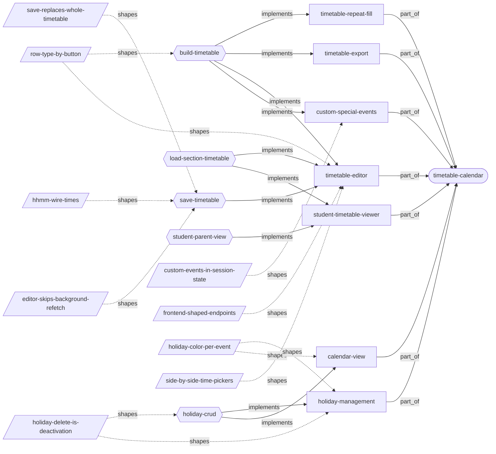
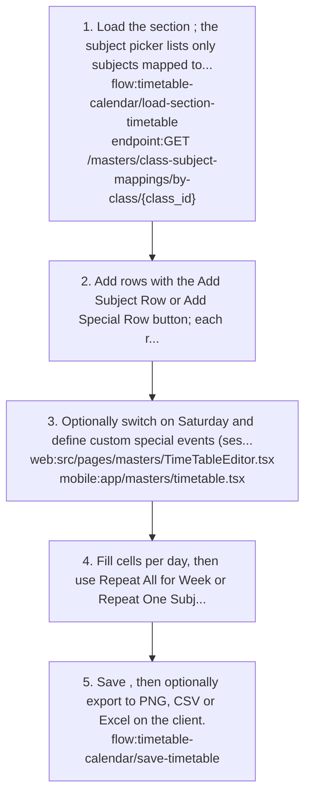
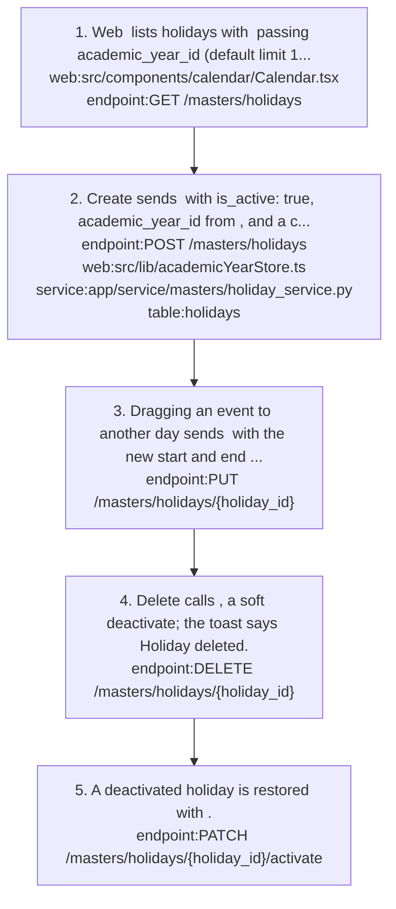
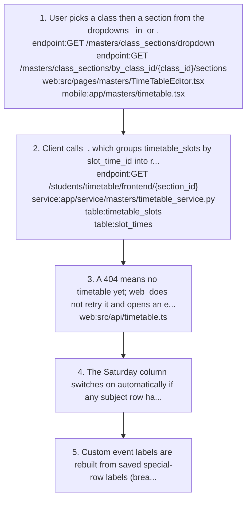
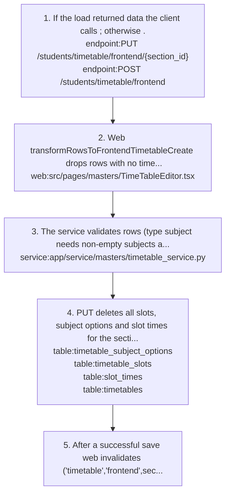
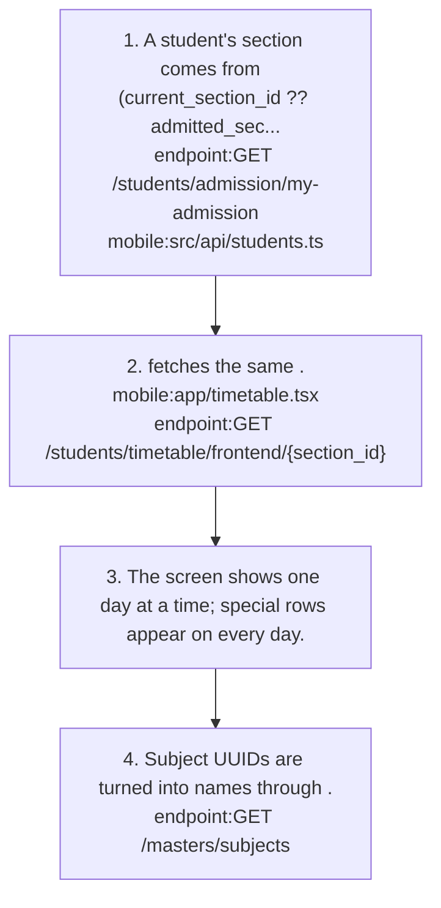

# timetable-calendar: knowledge graph view

_Generated from `docs/graph/graph.jsonl` by `scripts/graph/kg_render.py`. Do not edit this file; change the graph and re-render._

Weekly per-section class timetable (editor on web and mobile, read-only viewer for students and parents on mobile) and the academic-year holiday/event calendar.

Module doc: [docs/modules/timetable-calendar.md](../../../docs/modules/timetable-calendar.md)

## Features

### timetable-calendar/calendar-view

Read-only holiday/event calendar for every role.
- Roles: Everyone with holiday_management:read/list.
- Parity: Web enables only the Month and All Events views (week, day, year are commented out). Mobile app/calendar.tsx has list/grid with an upcoming/past filter and passes limit 100.
- Note: The default role seed grants holiday_management read/list to Admin, Teacher and Staff only; Student and Parent get 403 unless the tenant adds the grant.
- Flows: [timetable-calendar/holiday-crud](#timetable-calendarholiday-crud)
- Implemented by: `endpoint:GET /masters/holidays`, `mobile:app/calendar.tsx`, `web:src/components/calendar/Calendar.tsx`, `web:src/routes/_app/Calender.tsx`
- Shaped by: [timetable-calendar/holiday-color-per-event](#timetable-calendarholiday-color-per-event)

### timetable-calendar/custom-special-events

Special rows (Snacks, Lunch, Dispersal or a custom label such as Assembly) span every day; custom labels are defined in the editor session.
- Note: Custom names are 1-50 alphanumeric characters or spaces, stored upper-cased with underscores (MORNING_PRAYER) as break_label; there is no shared list across sections.
- Flows: [timetable-calendar/build-timetable](#timetable-calendarbuild-timetable)
- Implemented by: `mobile:app/masters/timetable.tsx`, `table:timetable_slots`, `web:src/pages/masters/TimeTableEditor.tsx`
- Shaped by: [timetable-calendar/custom-events-in-session-state](#timetable-calendarcustom-events-in-session-state)

### timetable-calendar/holiday-management

Admin creates, edits, drags, deactivates and restores holidays/events for an academic year (name, description, start/end date, color).
- Roles: Backend enforces holiday_management:create/update/delete; mobile masters/holidays.tsx checks the same names, web Calendar.tsx checks holidays:* instead, so its controls hide unless the alias exists.
- Parity: Drag-and-drop rescheduling is web only; mobile admin uses masters/holidays.tsx.
- Note: Holidays are display-only; attendance, timetable and fee logic do not read them.
- Flows: [timetable-calendar/holiday-crud](#timetable-calendarholiday-crud)
- Implemented by: `endpoint:DELETE /masters/holidays/{holiday_id}`, `endpoint:GET /masters/holidays`, `endpoint:PATCH /masters/holidays/{holiday_id}/activate`, `endpoint:POST /masters/holidays`, `endpoint:PUT /masters/holidays/{holiday_id}`, `mobile:app/masters/holidays.tsx`, `mobile:src/api/masters.ts`, `service:app/service/masters/holiday_service.py`, `table:holidays`, `web:src/api/hooks/masters/holiday.ts`, `web:src/api/masters/holidays.ts`, `web:src/components/calendar/Calendar.tsx`, `web:src/routes/_app/masters/holidays.tsx`
- Shaped by: [masters/soft-deactivate-vs-hard-delete](#masterssoft-deactivate-vs-hard-delete), [timetable-calendar/holiday-color-per-event](#timetable-calendarholiday-color-per-event), [timetable-calendar/holiday-delete-is-deactivation](#timetable-calendarholiday-delete-is-deactivation)

### timetable-calendar/student-timetable-viewer

Read-only per-day timetable for a student's own section or a parent's selected child.
- Roles: Student and parent.
- Parity: Mobile only; web has no viewer and its editor does not auto-select the user's own section.
- Note: The default role seed gives Student and Parent no timetable_management:read, so the viewer gets 403 unless the tenant adds the grant.
- Flows: [timetable-calendar/load-section-timetable](#timetable-calendarload-section-timetable), [timetable-calendar/student-parent-view](#timetable-calendarstudent-parent-view)
- Implemented by: `endpoint:GET /masters/subjects`, `endpoint:GET /students/admission/my-admission`, `endpoint:GET /students/timetable/frontend/{section_id}`, `mobile:app/timetable.tsx`

### timetable-calendar/timetable-editor

Weekly grid per section (rows are time ranges, columns are days) with subject rows and special rows, optional Saturday column; create, replace and delete.
- Roles: Admin edits with timetable_management:create/update/delete; reading needs timetable_management:read, which the default role seed gives only to Admin. Web renders read-only without update.
- Parity: Editor on both clients; both gate on timetable_management.
- Note: The model has no teacher/staff and no academic year; the year is implied by the section's class. Auto-generation, workload and clash checks are not implemented.
- Flows: [timetable-calendar/build-timetable](#timetable-calendarbuild-timetable), [timetable-calendar/load-section-timetable](#timetable-calendarload-section-timetable), [timetable-calendar/save-timetable](#timetable-calendarsave-timetable)
- Implemented by: `endpoint:DELETE /students/timetable/frontend/{section_id}`, `endpoint:GET /students/timetable/frontend/{section_id}`, `endpoint:POST /students/timetable/frontend`, `endpoint:PUT /students/timetable/frontend/{section_id}`, `mobile:app/masters/timetable.tsx`, `mobile:src/api/students.ts`, `service:app/service/masters/timetable_service.py`, `table:slot_times`, `table:timetable_slots`, `table:timetable_subject_options`, `table:timetables`, `web:src/api/timetable.ts`, `web:src/pages/masters/TimeTableEditor.tsx`, `web:src/routes/_app/TimeTable.tsx`
- Shaped by: [timetable-calendar/frontend-shaped-endpoints](#timetable-calendarfrontend-shaped-endpoints), [timetable-calendar/row-type-by-button](#timetable-calendarrow-type-by-button), [timetable-calendar/side-by-side-time-pickers](#timetable-calendarside-by-side-time-pickers)

### timetable-calendar/timetable-export

Export the displayed timetable to PNG, CSV and Excel entirely on the client.
- Parity: Both clients.
- Flows: [timetable-calendar/build-timetable](#timetable-calendarbuild-timetable)
- Implemented by: `mobile:app/masters/timetable.tsx`, `web:src/pages/masters/TimeTableEditor.tsx`

### timetable-calendar/timetable-repeat-fill

Editor shortcuts: Repeat All for Week copies one day's subjects to every other day; Repeat One Subject fills days for a chosen subject.
- Parity: Web Repeat One Subject fills every day of every row that contains the subject; mobile copies one source day across a single selected row.
- Note: Mobile Repeat All can copy an empty source cell as '', which then fails UUID validation.
- Flows: [timetable-calendar/build-timetable](#timetable-calendarbuild-timetable)
- Implemented by: `mobile:app/masters/timetable.tsx`, `web:src/pages/masters/TimeTableEditor.tsx`

## Flows

### timetable-calendar/build-timetable

Implements: `feature:timetable-calendar/custom-special-events`, `feature:timetable-calendar/timetable-editor`, `feature:timetable-calendar/timetable-export`, `feature:timetable-calendar/timetable-repeat-fill`

- Precondition: Class, sections, subjects and class-subject mappings exist for the year.

1. Load the section `flow:timetable-calendar/load-section-timetable`; the subject picker lists only subjects mapped to the class where section_id is null or matches the section `endpoint:GET /masters/class-subject-mappings/by-class/{class_id}`.
2. Add rows with the Add Subject Row or Add Special Row button; each row gets a From and To time (24-hour HH:MM).
3. Optionally switch on Saturday and define custom special events (session only) `web:src/pages/masters/TimeTableEditor.tsx` `mobile:app/masters/timetable.tsx`.
4. Fill cells per day, then use Repeat All for Week or Repeat One Subject to copy subjects across days.
5. Save `flow:timetable-calendar/save-timetable`, then optionally export to PNG, CSV or Excel on the client.

- Note: The backend does not check time overlaps, from < to, or that a subject is mapped to the section.

Shaped by: [timetable-calendar/row-type-by-button](#timetable-calendarrow-type-by-button)

### timetable-calendar/holiday-crud

Implements: `feature:timetable-calendar/calendar-view`, `feature:timetable-calendar/holiday-management`

1. Web `web:src/components/calendar/Calendar.tsx` lists holidays with `endpoint:GET /masters/holidays` passing academic_year_id (default limit 10, active_only true).
2. Create sends `endpoint:POST /masters/holidays` with is_active: true, academic_year_id from `web:src/lib/academicYearStore.ts`, and a color (default #2563eb) `service:app/service/masters/holiday_service.py` `table:holidays`.
3. Dragging an event to another day sends `endpoint:PUT /masters/holidays/{holiday_id}` with the new start and end dates as yyyy-MM-dd.
4. Delete calls `endpoint:DELETE /masters/holidays/{holiday_id}`, a soft deactivate; the toast says Holiday deleted.
5. A deactivated holiday is restored with `endpoint:PATCH /masters/holidays/{holiday_id}/activate`.

- Failure: HolidayCreate.is_active defaults to false, so a client that omits is_active creates a holiday that the default list hides.
- Failure: Month views that pass only academic_year_id show at most 10 holidays; always pass an explicit limit.

- Note: Mobile admin `mobile:app/masters/holidays.tsx` follows the same calls without drag-and-drop.

Shaped by: [timetable-calendar/holiday-delete-is-deactivation](#timetable-calendarholiday-delete-is-deactivation)

### timetable-calendar/load-section-timetable

Implements: `feature:timetable-calendar/student-timetable-viewer`, `feature:timetable-calendar/timetable-editor`

1. User picks a class then a section from the dropdowns `endpoint:GET /masters/class_sections/dropdown` `endpoint:GET /masters/class_sections/by_class_id/{class_id}/sections` in `web:src/pages/masters/TimeTableEditor.tsx` or `mobile:app/masters/timetable.tsx`.
2. Client calls `endpoint:GET /students/timetable/frontend/{section_id}` `service:app/service/masters/timetable_service.py`, which groups timetable_slots by slot_time_id into rows `table:timetable_slots` `table:slot_times`.
3. A 404 means no timetable yet; web `web:src/api/timetable.ts` does not retry it and opens an empty grid in edit mode when the user has update permission.
4. The Saturday column switches on automatically if any subject row has a Saturday key.
5. Custom event labels are rebuilt from saved special-row labels (break_label).

- Note: Returned rows are not chronological (grouped by random slot_time_id UUID); sort by time.from.
- Note: Only subject_options[0] is read back per cell, and a time group is special only if every slot in it is a break.

### timetable-calendar/save-timetable

Implements: `feature:timetable-calendar/timetable-editor`

1. If the load returned data the client calls `endpoint:PUT /students/timetable/frontend/{section_id}`; otherwise `endpoint:POST /students/timetable/frontend`.
2. Web transformRowsToFrontendTimetableCreate `web:src/pages/masters/TimeTableEditor.tsx` drops rows with no time, empty-string day values, and subject rows with no subject at all.
3. The service validates rows (type subject needs non-empty subjects and no label; special needs label and no subjects) and parses HH:MM with strptime `service:app/service/masters/timetable_service.py`.
4. PUT deletes all slots, subject options and slot times for the section and recreates them `table:timetable_subject_options` `table:timetable_slots` `table:slot_times`; POST creates the timetable row `table:timetables`.
5. After a successful save web invalidates ['timetable','frontend',sectionId]; toasts and setIsEditing(false) run in the mutate callbacks.

- Failure: POST keeps only Monday-Friday (Saturday subjects silently dropped, special rows written Mon-Fri); PUT keeps any day key and writes special rows Mon-Sun. Save twice when Saturday matters.
- Failure: Non-UUID subject values (free-text Saturday cell on web, untouched mobile rows with subjects {}) fail with 422.
- Failure: POST on a section that already has a timetable returns 409; clients must choose PUT vs POST from the GET result.
- Failure: POST returns 404 for an unknown section, 400 for an unknown subject id and 422 for a malformed time.

Shaped by: [timetable-calendar/editor-skips-background-refetch](#timetable-calendareditor-skips-background-refetch), [timetable-calendar/hhmm-wire-times](#timetable-calendarhhmm-wire-times), [timetable-calendar/save-replaces-whole-timetable](#timetable-calendarsave-replaces-whole-timetable)

### timetable-calendar/student-parent-view

Implements: `feature:timetable-calendar/student-timetable-viewer`

1. A student's section comes from `endpoint:GET /students/admission/my-admission` (current_section_id ?? admitted_section_id) via `mobile:src/api/students.ts`; a parent's comes from selectedStudent.section_id.
2. `mobile:app/timetable.tsx` fetches the same `endpoint:GET /students/timetable/frontend/{section_id}`.
3. The screen shows one day at a time; special rows appear on every day.
4. Subject UUIDs are turned into names through `endpoint:GET /masters/subjects`.

## Decisions

### timetable-calendar/custom-events-in-session-state

- **Decision**: Custom special events live in editor session state and persist only as break_label on saved rows (Option A); a shared custom_timetable_events table was deferred.
- **Why**: No schema change was needed and labels still persist through break_label.
- **Alternatives**: A shared custom_timetable_events table.
- **Tradeoff**: No shared event list across sections.
- Shapes: `feature:timetable-calendar/custom-special-events`, `mobile:app/masters/timetable.tsx`, `table:timetable_slots`, `web:src/pages/masters/TimeTableEditor.tsx`

### timetable-calendar/editor-skips-background-refetch

- **Decision**: useFrontendTimetable uses placeholderData keepPreviousData and the editor's data-load effect returns early while isFetching && data; toasts and setIsEditing(false) run in mutate callbacks, not an isSuccess effect.
- **Why**: Otherwise the refetch after a save resets the rows and throws the page back into edit mode.
- Shapes: `flow:timetable-calendar/save-timetable`, `web:src/api/timetable.ts`, `web:src/pages/masters/TimeTableEditor.tsx`

### timetable-calendar/frontend-shaped-endpoints

- **Decision**: Timetable clients use row x day /frontend endpoints; the backend translates to and from slot_times/timetable_slots. The normalised /bulk and /slots/bulk routes are unused.
- **Why**: The editor thinks in rows x days.
- **Alternatives**: Normalised slot APIs (POST /students/timetable/bulk, PATCH .../timetable/slots/bulk).
- Shapes: `endpoint:GET /students/timetable/frontend/{section_id}`, `endpoint:PATCH /students/timetable/timetable/slots/bulk`, `endpoint:POST /students/timetable/bulk`, `endpoint:POST /students/timetable/frontend`, `endpoint:PUT /students/timetable/frontend/{section_id}`, `feature:timetable-calendar/timetable-editor`, `service:app/service/masters/timetable_service.py`

### timetable-calendar/hhmm-wire-times

- **Decision**: Timetable times travel as HH:MM strings and the service parses them with strptime('%H:%M'); pickers stay in 24-hour format.
- **Why**: asyncpg's TIME column type needs datetime.time objects, not strings.
- Shapes: `flow:timetable-calendar/save-timetable`, `service:app/service/masters/timetable_service.py`, `table:slot_times`

### timetable-calendar/holiday-color-per-event

- **Decision**: Each holiday stores its own color (VARCHAR(7), #rrggbb); mobile falls back to a colour derived from a hash of the name when empty.
- **Why**: Both clients render the same colour for an event.
- Shapes: `feature:timetable-calendar/calendar-view`, `feature:timetable-calendar/holiday-management`, `table:holidays`

### timetable-calendar/holiday-delete-is-deactivation

- **Decision**: Deleting a holiday sets is_active=false; PATCH /{id}/activate restores it.
- **Why**: History stays for the academic year.
- Shapes: `endpoint:DELETE /masters/holidays/{holiday_id}`, `endpoint:PATCH /masters/holidays/{holiday_id}/activate`, `feature:timetable-calendar/holiday-management`, `flow:timetable-calendar/holiday-crud`, `service:app/service/masters/holiday_service.py`

### timetable-calendar/row-type-by-button

- **Decision**: Row type is chosen by the Add Subject Row / Add Special Row button; there is no type column in the grid, but type stays in the payload.
- **Why**: Reduces clutter; the backend still needs type.
- **Alternatives**: A visible type column.
- Shapes: `feature:timetable-calendar/timetable-editor`, `flow:timetable-calendar/build-timetable`, `web:src/pages/masters/TimeTableEditor.tsx`

### timetable-calendar/save-replaces-whole-timetable

- **Decision**: Saving a timetable (PUT) deletes all slots, subject options and slot times for the section and recreates them.
- **Why**: Simpler than diffing rows, and slot IDs are not referenced anywhere else.
- **Alternatives**: Row-level diffing.
- **Tradeoff**: Slot IDs change on every save.
- Shapes: `endpoint:PUT /students/timetable/frontend/{section_id}`, `flow:timetable-calendar/save-timetable`, `service:app/service/masters/timetable_service.py`

### timetable-calendar/side-by-side-time-pickers

- **Decision**: The web time cell shows From and To pickers side by side in one row (18rem column).
- **Why**: The user rejected stacked pickers because they read as two separate entries.
- **Alternatives**: Stacked From/To pickers.
- Shapes: `feature:timetable-calendar/timetable-editor`, `web:src/pages/masters/TimeTableEditor.tsx`

## Concepts

### timetable-calendar/frontend-timetable-format

Wire format shared by both clients: {section_id, timetable_data:[{time:{from,to}, type, subjects:{Day: uuid}} or {time, type:special, label}]}.
- Related: `decision:timetable-calendar/frontend-shaped-endpoints`, `endpoint:GET /students/timetable/frontend/{section_id}`, `endpoint:PUT /students/timetable/frontend/{section_id}`

### timetable-calendar/holiday-event

A dated calendar entry for an academic year (name up to 50, description up to 100, start/end date, color, is_active). Holidays and events share one table with no type field; they differ only by name and colour.
- Related: `feature:timetable-calendar/holiday-management`, `table:holidays`

### timetable-calendar/section-timetable

One weekly timetable per section (timetables.section_id is unique), stored as timetables -> timetable_slots (one per day per period) -> timetable_subject_options, with times in slot_times.
- Related: `feature:timetable-calendar/timetable-editor`, `table:slot_times`, `table:timetable_slots`, `table:timetable_subject_options`, `table:timetables`

### timetable-calendar/slot-time

A section's period time range: slot_times row with label HH:MM-HH:MM, start_time and end_time.
- Related: `concept:timetable-calendar/section-timetable`, `table:slot_times`

### timetable-calendar/special-row

A timetable row of type special with a label (Snacks, Lunch, Dispersal or a custom event) spanning every day; stored as is_break slots with break_label.
- Related: `concept:timetable-calendar/section-timetable`, `table:timetable_slots`

### timetable-calendar/subject-row

A timetable row of type subject that assigns one subject UUID per day key (Monday..Saturday) for a time range.
- Related: `concept:timetable-calendar/section-timetable`
