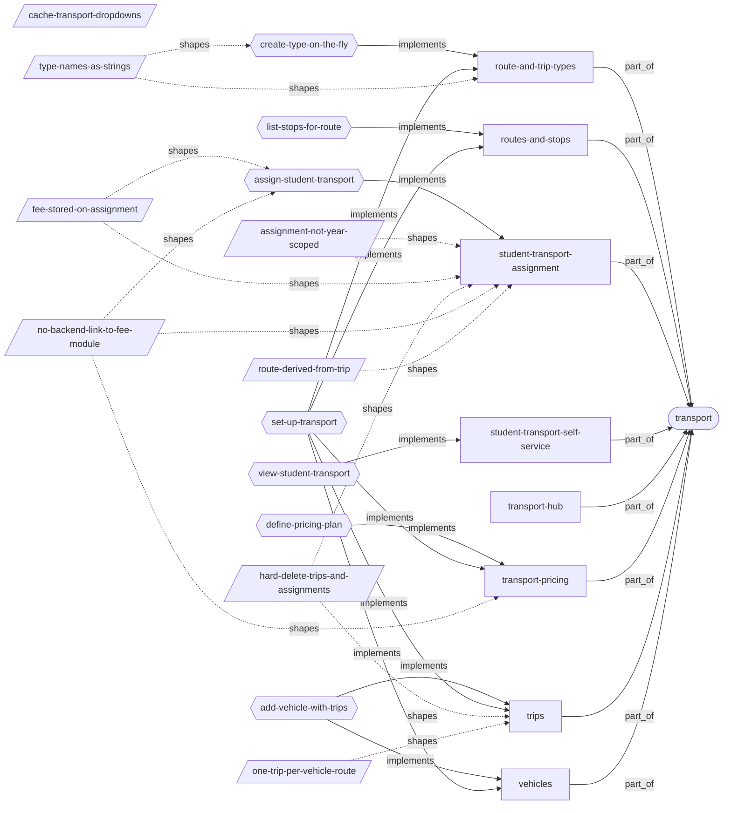
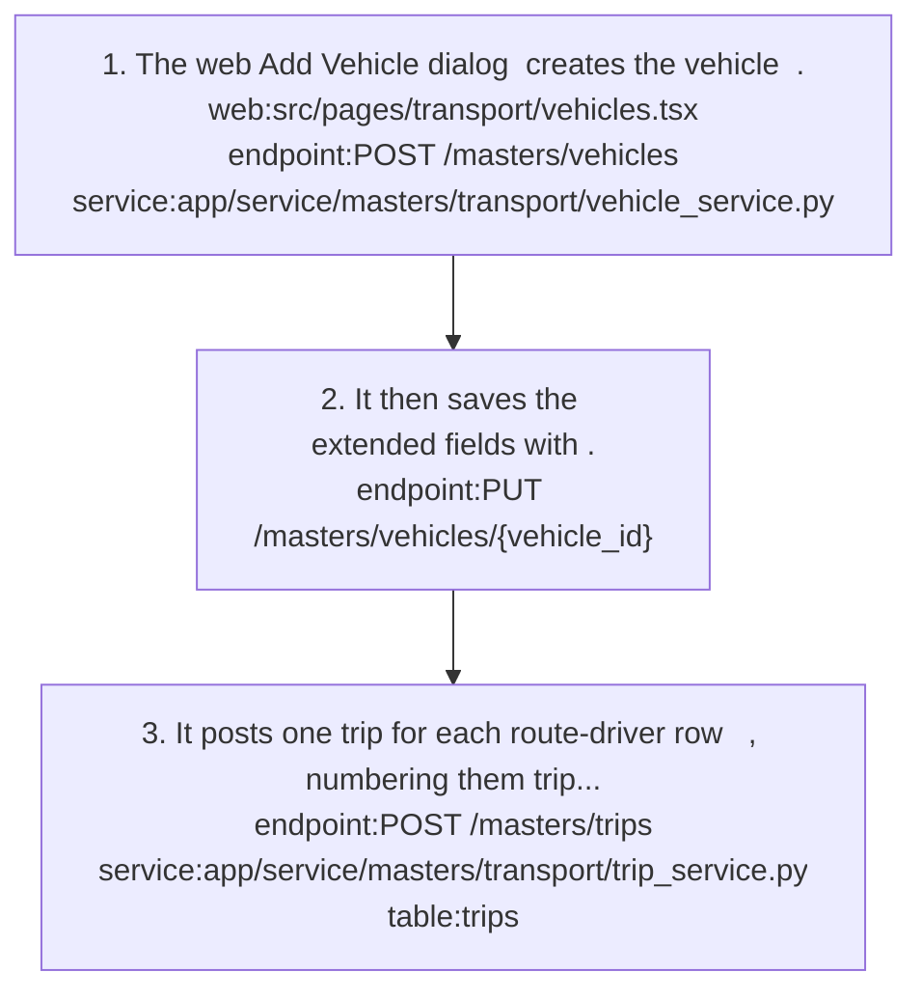
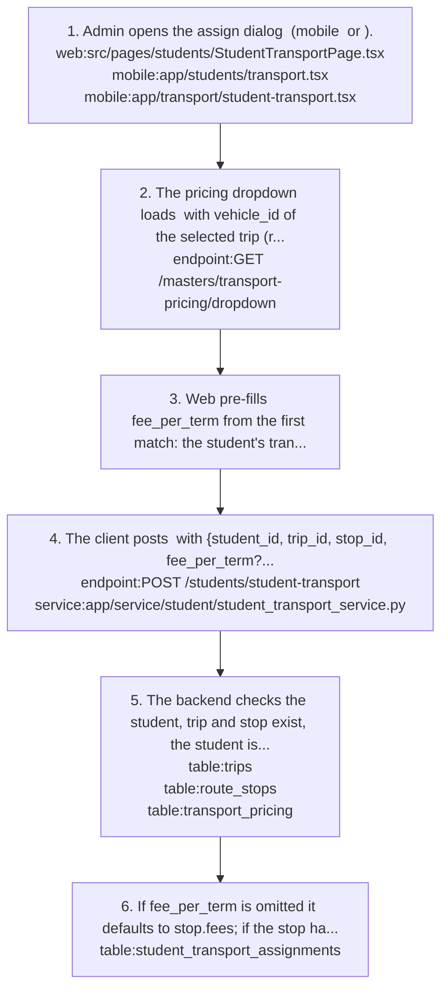
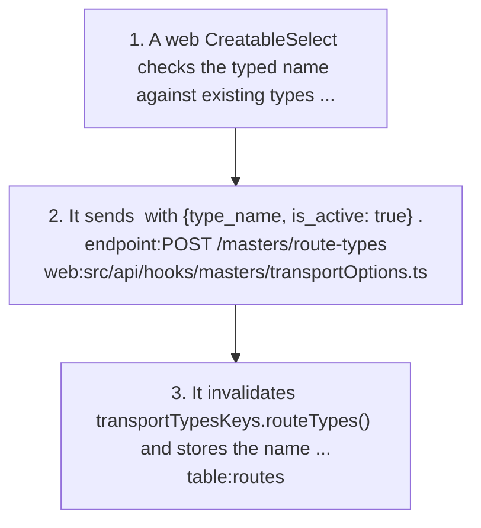
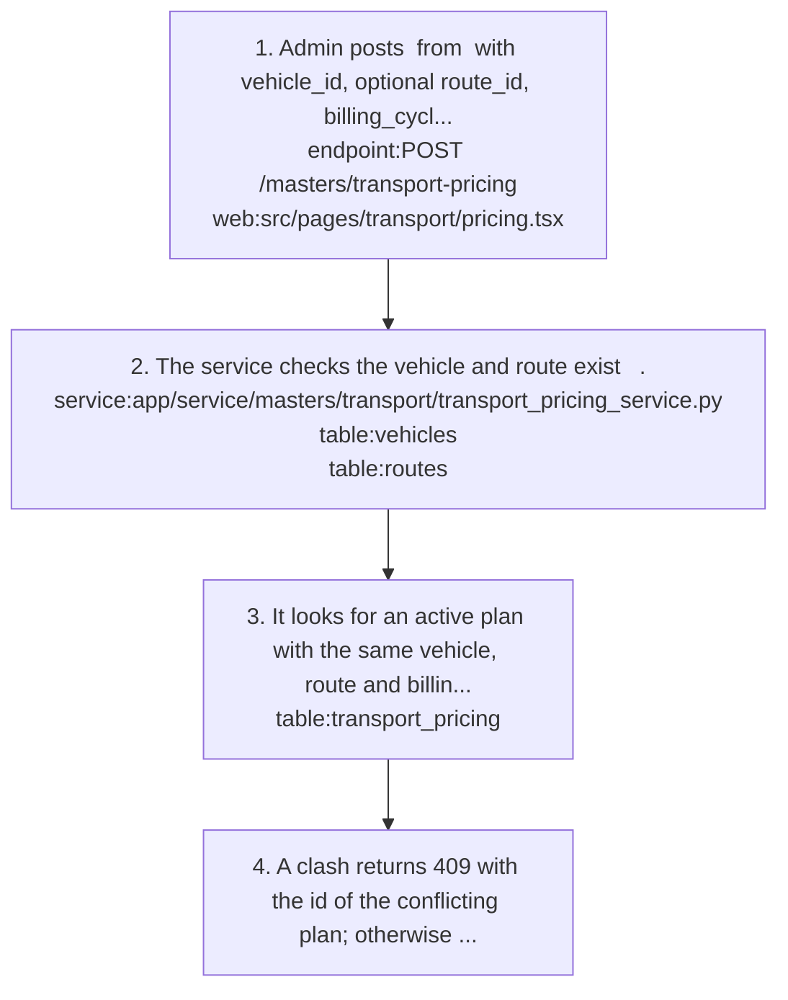
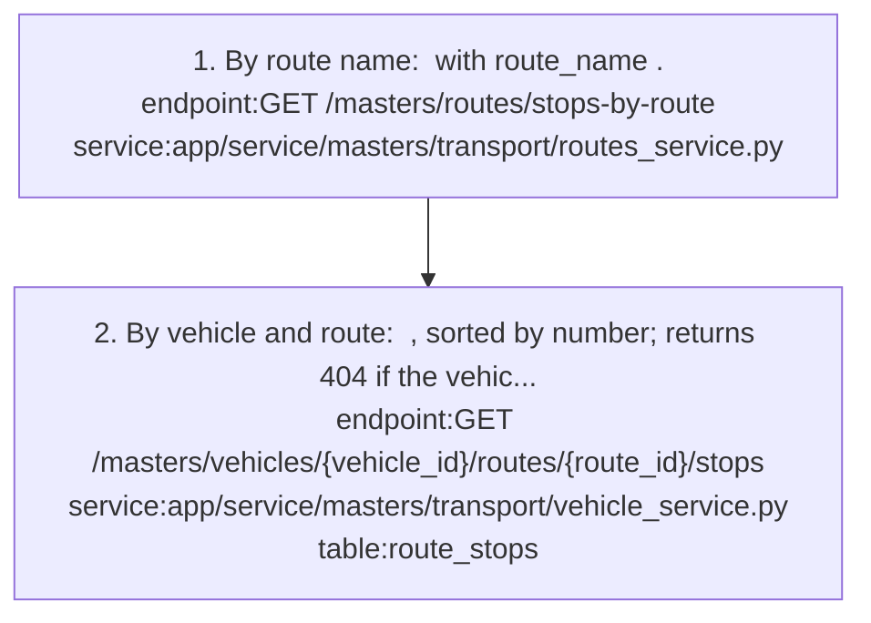
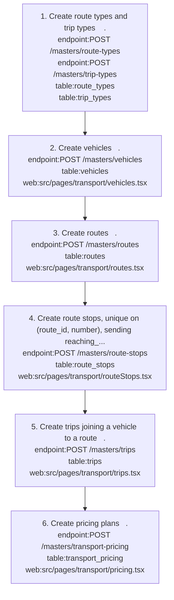
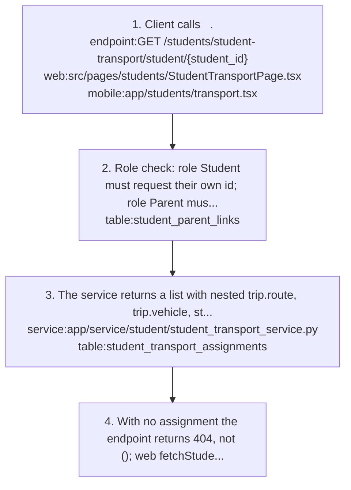

# transport: knowledge graph view

_Generated from `docs/graph/graph.jsonl` by `scripts/graph/kg_render.py`. Do not edit this file; change the graph and re-render._

School transport: route and trip types, routes and stops, vehicles, trips (vehicle on a route with a driver), transport pricing plans, and each student's trip and stop assignment.

Module doc: [docs/modules/transport.md](../../../docs/modules/transport.md)

## Features

### transport/route-and-trip-types

Maintain the route-type and trip-type dictionaries (unique type_name) that feed route dropdowns.
- Roles: route_types and trip_types permissions.
- Note: Payload and response field is type_name, never name (422).
- Flows: [transport/create-type-on-the-fly](#transportcreate-type-on-the-fly), [transport/set-up-transport](#transportset-up-transport)
- Implemented by: `endpoint:GET /masters/route-types/all`, `endpoint:GET /masters/route-types/dropdown`, `endpoint:GET /masters/trip-types/all`, `endpoint:POST /masters/route-types`, `endpoint:POST /masters/trip-types`, `service:app/service/masters/transport/route_type_service.py`, `service:app/service/masters/transport/trip_type_service.py`, `table:route_types`, `table:trip_types`, `web:src/api/hooks/masters/transportOptions.ts`
- Shaped by: [transport/type-names-as-strings](#transporttype-names-as-strings)

### transport/routes-and-stops

Maintain routes (unique route_name, start and end stops, typed number_of_stops, times) and their ordered stops with pickup/drop times and a default stop fee.
- Roles: routes and route_stops permissions.
- Parity: Both clients. Defaults differ: mobile sets reaching_time 07:00 and fees 0, web 08:30 and 25.
- Note: GET /masters/route-stops ignores route_id and active_only and returns all active stops across routes.
- Flows: [transport/list-stops-for-route](#transportlist-stops-for-route), [transport/set-up-transport](#transportset-up-transport)
- Implemented by: `endpoint:GET /masters/route-stops`, `endpoint:GET /masters/routes/all_routes`, `endpoint:GET /masters/routes/routeid/{route_id}`, `endpoint:GET /masters/routes/stops-by-route`, `endpoint:POST /masters/route-stops`, `endpoint:POST /masters/routes`, `mobile:app/transport/route-stops.tsx`, `mobile:app/transport/routes.tsx`, `service:app/service/masters/transport/route_stop_service.py`, `service:app/service/masters/transport/routes_service.py`, `table:route_stops`, `table:routes`, `web:src/pages/transport/routeStops.tsx`, `web:src/pages/transport/routes.tsx`

### transport/student-transport-assignment

Assign a student to a trip and stop with fee_per_term and an optional pricing plan; a student cannot be on the same trip twice.
- Roles: Admin, staff and teacher (student_transport permission).
- Parity: Web assigns from /students/studenttransport (with fee pre-fill); mobile has two assign screens, only app/students/transport.tsx offers the pricing picker. Student Trips screens are another view of the same API.
- Note: Assignments are hard-deleted and have no is_active, fee_term_id or academic_year_id.
- Flows: [transport/assign-student-transport](#transportassign-student-transport)
- Implemented by: `endpoint:DELETE /students/student-transport/{transport_id}`, `endpoint:GET /students/student-transport`, `endpoint:PATCH /students/student-transport/{transport_id}`, `endpoint:POST /students/student-transport`, `mobile:app/students/transport.tsx`, `mobile:app/transport/student-transport.tsx`, `mobile:app/transport/student-trips.tsx`, `service:app/service/student/student_transport_service.py`, `table:student_transport_assignments`, `web:src/pages/students/StudentTransportPage.tsx`, `web:src/pages/transport/studentTransport.tsx`, `web:src/pages/transport/studentTrips.tsx`
- Shaped by: [transport/assignment-not-year-scoped](#transportassignment-not-year-scoped), [transport/fee-stored-on-assignment](#transportfee-stored-on-assignment), [transport/hard-delete-trips-and-assignments](#transporthard-delete-trips-and-assignments), [transport/no-backend-link-to-fee-module](#transportno-backend-link-to-fee-module), [transport/route-derived-from-trip](#transportroute-derived-from-trip)

### transport/student-transport-self-service

A student sees their own assignment and a parent sees linked children's, with nested trip route, vehicle, stop times and pricing.
- Roles: Student (own), Parent (linked children); others need student_transport:read.
- Parity: Web /students/studenttransport has Student, Parent and Admin views; mobile app/students/transport.tsx adds a stop search.
- Flows: [transport/view-student-transport](#transportview-student-transport)
- Implemented by: `endpoint:GET /students/student-transport/student/{student_id}`, `mobile:app/students/transport.tsx`, `service:app/service/student/student_transport_service.py`, `web:src/pages/students/StudentTransportPage.tsx`

### transport/transport-hub

Transport landing page with cards for Routes, Route Stops, Vehicles, Trips, Pricing, Student Transport and Student Trips.
- Parity: Web builds cards from backend menuItems; mobile hard-codes 7 sections in app/transport/index.tsx. Only add a mobile section if the backend menu seeds it.
- Implemented by: `mobile:app/transport/index.tsx`

### transport/transport-pricing

Billing-cycle plans (annual, semester, monthly, custom) per vehicle and optionally one route, with amount > 0 and start_date < end_date; active plans may not overlap.
- Roles: transport_pricing permission.
- Note: List and dropdown return active plans only; the dropdown has no date-range or route filter.
- Flows: [transport/define-pricing-plan](#transportdefine-pricing-plan), [transport/set-up-transport](#transportset-up-transport)
- Implemented by: `endpoint:GET /masters/transport-pricing`, `endpoint:GET /masters/transport-pricing/dropdown`, `endpoint:POST /masters/transport-pricing`, `endpoint:PUT /masters/transport-pricing/{pricing_id}`, `mobile:app/transport/pricing.tsx`, `service:app/service/masters/transport/transport_pricing_service.py`, `table:transport_pricing`, `web:src/pages/transport/pricing.tsx`
- Shaped by: [transport/no-backend-link-to-fee-module](#transportno-backend-link-to-fee-module)

### transport/trips

A trip joins one vehicle to one route with an optional driver (users.id) and a trip_number; one trip per vehicle-route pair.
- Roles: transport_trips permission (not trips).
- Flows: [transport/add-vehicle-with-trips](#transportadd-vehicle-with-trips), [transport/set-up-transport](#transportset-up-transport)
- Implemented by: `endpoint:DELETE /masters/trips/{trip_id}`, `endpoint:GET /masters/trips`, `endpoint:POST /masters/trips`, `mobile:app/transport/trips.tsx`, `service:app/service/masters/transport/trip_service.py`, `table:trips`, `table:users`, `web:src/pages/transport/trips.tsx`
- Shaped by: [transport/hard-delete-trips-and-assignments](#transporthard-delete-trips-and-assignments), [transport/one-trip-per-vehicle-route](#transportone-trip-per-vehicle-route)

### transport/vehicles

Maintain vehicles (unique registration_number, free-text vehicle_type, inspection and pollution dates, optional driver, insurance, AC, fees and number_of_trips).
- Roles: vehicles permission.
- Note: The vehicle API has no fee_category_id/fee_type_id; web sends them and Pydantic drops them.
- Flows: [transport/add-vehicle-with-trips](#transportadd-vehicle-with-trips), [transport/set-up-transport](#transportset-up-transport)
- Implemented by: `endpoint:GET /masters/vehicles`, `endpoint:GET /masters/vehicles/{vehicle_id}/routes`, `endpoint:GET /masters/vehicles/{vehicle_id}/trips`, `endpoint:POST /masters/vehicles`, `endpoint:PUT /masters/vehicles/{vehicle_id}`, `mobile:app/transport/vehicles.tsx`, `service:app/service/masters/transport/vehicle_service.py`, `table:vehicles`, `web:src/pages/transport/vehicles.tsx`

## Flows

### transport/add-vehicle-with-trips

Implements: `feature:transport/trips`, `feature:transport/vehicles`

1. The web Add Vehicle dialog `web:src/pages/transport/vehicles.tsx` creates the vehicle `endpoint:POST /masters/vehicles` `service:app/service/masters/transport/vehicle_service.py`.
2. It then saves the extended fields with `endpoint:PUT /masters/vehicles/{vehicle_id}`.
3. It posts one trip for each route-driver row `endpoint:POST /masters/trips` `service:app/service/masters/transport/trip_service.py` `table:trips`, numbering them trip_number = 1..n.

- Failure: A duplicate vehicle-route pair returns 400.

- Note: The create dialog sets last_inspected_date and pollution_renewal_date to today.

### transport/assign-student-transport

Implements: `feature:transport/student-transport-assignment`

1. Admin opens the assign dialog `web:src/pages/students/StudentTransportPage.tsx` (mobile `mobile:app/students/transport.tsx` or `mobile:app/transport/student-transport.tsx`).
2. The pricing dropdown loads `endpoint:GET /masters/transport-pricing/dropdown` with vehicle_id of the selected trip (required).
3. Web pre-fills fee_per_term from the first match: the student's transport fee mapping (fee type whose category or name matches /transport|bus/i), then the pricing plan amount, then the stop fees; the value stays editable.
4. The client posts `endpoint:POST /students/student-transport` with {student_id, trip_id, stop_id, fee_per_term?, pricing_id?} `service:app/service/student/student_transport_service.py`.
5. The backend checks the student, trip and stop exist, the student is not already on that trip, and pricing_id is active `table:trips` `table:route_stops` `table:transport_pricing`.
6. If fee_per_term is omitted it defaults to stop.fees; if the stop has no fee the request fails with 'enter the amount manually'. The assignment is written `table:student_transport_assignments`.

- Note: The backend does not check that stop_id is on the trip's route, and the stop list shows stops from every route.
- Note: Pricing amount is a Decimal sent as a JSON string; wrap it in Number(). fee_per_term is a Float.

Shaped by: [transport/fee-stored-on-assignment](#transportfee-stored-on-assignment), [transport/no-backend-link-to-fee-module](#transportno-backend-link-to-fee-module)

### transport/create-type-on-the-fly

Implements: `feature:transport/route-and-trip-types`

1. A web CreatableSelect checks the typed name against existing types case-insensitively.
2. It sends `endpoint:POST /masters/route-types` with {type_name, is_active: true} `web:src/api/hooks/masters/transportOptions.ts`.
3. It invalidates transportTypesKeys.routeTypes() and stores the name (not an id) in route.route_type `table:routes`.

- Note: Enter is handled in onKeyDown with stopPropagation so the form does not submit.
- Note: The create hooks exist in transportOptions.ts, but no current transport page imports them or a CreatableSelect.

Shaped by: [transport/type-names-as-strings](#transporttype-names-as-strings)

### transport/define-pricing-plan

Implements: `feature:transport/transport-pricing`

1. Admin posts `endpoint:POST /masters/transport-pricing` from `web:src/pages/transport/pricing.tsx` with vehicle_id, optional route_id, billing_cycle, cycle_name, amount and dates.
2. The service checks the vehicle and route exist `service:app/service/masters/transport/transport_pricing_service.py` `table:vehicles` `table:routes`.
3. It looks for an active plan with the same vehicle, route and billing_cycle whose dates overlap; a NULL-route plan is compared only with other NULL-route plans `table:transport_pricing`.
4. A clash returns 409 with the id of the conflicting plan; otherwise the plan is saved.

- Failure: If more than one plan already overlaps, scalar_one_or_none raises MultipleResultsFound and returns 500.

### transport/list-stops-for-route

Implements: `feature:transport/routes-and-stops`

1. By route name: `endpoint:GET /masters/routes/stops-by-route` with route_name `service:app/service/masters/transport/routes_service.py`.
2. By vehicle and route: `endpoint:GET /masters/vehicles/{vehicle_id}/routes/{route_id}/stops` `service:app/service/masters/transport/vehicle_service.py`, sorted by number; returns 404 if the vehicle is not on that route `table:route_stops`.

### transport/set-up-transport

Implements: `feature:transport/route-and-trip-types`, `feature:transport/routes-and-stops`, `feature:transport/transport-pricing`, `feature:transport/trips`, `feature:transport/vehicles`

1. Create route types and trip types `endpoint:POST /masters/route-types` `endpoint:POST /masters/trip-types` `table:route_types` `table:trip_types`.
2. Create vehicles `endpoint:POST /masters/vehicles` `table:vehicles` `web:src/pages/transport/vehicles.tsx`.
3. Create routes `endpoint:POST /masters/routes` `table:routes` `web:src/pages/transport/routes.tsx`.
4. Create route stops, unique on (route_id, number), sending reaching_time and whole-number fees `endpoint:POST /masters/route-stops` `table:route_stops` `web:src/pages/transport/routeStops.tsx`.
5. Create trips joining a vehicle to a route `endpoint:POST /masters/trips` `table:trips` `web:src/pages/transport/trips.tsx`.
6. Create pricing plans `endpoint:POST /masters/transport-pricing` `table:transport_pricing` `web:src/pages/transport/pricing.tsx`.

### transport/view-student-transport

Implements: `feature:transport/student-transport-self-service`

1. Client calls `endpoint:GET /students/student-transport/student/{student_id}` `web:src/pages/students/StudentTransportPage.tsx` `mobile:app/students/transport.tsx`.
2. Role check: role Student must request their own id; role Parent must be linked through `table:student_parent_links`; anyone else needs student_transport:read. Role names are exact string matches.
3. The service returns a list with nested trip.route, trip.vehicle, stop (with pickup and drop times), student and pricing `service:app/service/student/student_transport_service.py` `table:student_transport_assignments`.
4. With no assignment the endpoint returns 404, not []; web fetchStudentTransportsByStudent turns the 404 into [].

## Decisions

### transport/assignment-not-year-scoped (unintended)

- **Decision**: Student transport assignments have no academic_year_id (and no fee_term_id); an assignment carries over into the next year until deleted.
- **Why**: Not a deliberate choice; assignments were never tied to an academic year.
- Shapes: `feature:transport/student-transport-assignment`, `table:student_transport_assignments`

### transport/cache-transport-dropdowns (unintended)

- **Decision**: Route-type, trip-type, route and vehicle dropdowns are cached in memory for 5 minutes with @cache_dropdown (app/tools/cache_utils.py).
- **Why**: Not a deliberate design choice; the cache decorator was added without a recorded need.
- **Tradeoff**: Invalidation only affects the current worker, so others can serve stale data for up to 5 minutes; the cache key includes the tenant id only when db is passed positionally.
- Shapes: `endpoint:GET /masters/route-types/dropdown`, `endpoint:GET /masters/routes/dropdown`, `endpoint:GET /masters/trip-types/dropdown`, `endpoint:GET /masters/vehicles/dropdown`

### transport/fee-stored-on-assignment

- **Decision**: A student's transport fee is stored on the assignment (fee_per_term), defaulting from the stop fee or a pricing plan.
- **Why**: So each student's fee can be overridden.
- Shapes: `feature:transport/student-transport-assignment`, `flow:transport/assign-student-transport`, `table:student_transport_assignments`

### transport/hard-delete-trips-and-assignments (unintended)

- **Decision**: Trips and student transport assignments are hard-deleted, while other transport masters use a soft delete (is_active = False).
- **Why**: Not a deliberate choice. Trips and assignments should follow the same soft-delete rule as the other transport masters.
- **Tradeoff**: Deleting a trip with assignments fails on the NOT NULL FK student_transport_assignments.trip_id.
- Shapes: `feature:transport/student-transport-assignment`, `feature:transport/trips`, `table:student_transport_assignments`, `table:trips`

### transport/no-backend-link-to-fee-module (unintended)

- **Decision**: Transport has no backend link to the fee module; transport fees are collected by creating a fee type such as Transport or Bus and mapping it to the student.
- **Why**: Not a deliberate choice; transport and fee were built separately and never connected.
- **Tradeoff**: fee_per_term and pricing are informational; fee summary, payments and reports never read them. The only coupling is the web pre-fill heuristic in the assign flow.
- Shapes: `feature:fee/student-fee-mapping`, `feature:transport/student-transport-assignment`, `feature:transport/transport-pricing`, `flow:transport/assign-student-transport`

### transport/one-trip-per-vehicle-route (unintended)

- **Decision**: trips is unique on (vehicle_id, route_id); a duplicate returns 400.
- **Why**: Not a deliberate choice. A vehicle should be able to run several trips on the same route (for example morning and evening).
- **Tradeoff**: Morning and evening runs need different routes, not just different trip_numbers.
- Shapes: `feature:transport/trips`, `table:trips`

### transport/route-derived-from-trip

- **Decision**: An assignment stores trip_id and stop_id only; its route and vehicle are derived from the trip, and route_id is not stored.
- **Why**: The trip already defines the route and vehicle, so storing them again on the assignment could let them disagree.
- Shapes: `feature:transport/student-transport-assignment`, `table:student_transport_assignments`

### transport/type-names-as-strings

- **Decision**: route_type and trip_type are stored on routes as plain name strings with no foreign key to route_types/trip_types.
- **Why**: Backward compatibility and to avoid a migration.
- **Alternatives**: route_type_id/trip_type_id UUID FK columns with nested objects (described in archived handovers, never shipped).
- **Tradeoff**: Referential integrity is given up; renaming or deleting a type does not change existing routes, and old rows may hold lowercase values or NULL.
- Shapes: `feature:transport/route-and-trip-types`, `flow:transport/create-type-on-the-fly`, `table:routes`

## Concepts

### transport/fee-per-term

The transport fee recorded on an assignment, defaulting from the pricing amount or stop fee; informational only, never read by the fee module.
- Related: `decision:transport/no-backend-link-to-fee-module`, `table:student_transport_assignments`

### transport/route

A named path with starting and ending stop names, a hand-typed number_of_stops, start and end times and is_active; route_name is unique.
- Related: `concept:transport/route-stop`, `table:routes`

### transport/route-stop

A stop on a route with a sequence number (unique per route), pickup and drop times, the deprecated but still required reaching_time, and a whole-number default fee.
- Related: `concept:transport/route`, `table:route_stops`

### transport/route-type

A dictionary value (route_types.type_name) offered in route dropdowns; the route stores the chosen name as a plain string.
- Related: `table:route_types`, `table:routes`

### transport/student-transport-assignment

A student's link to a trip and a stop with fee_per_term and an optional pricing plan; not year-scoped.
- Related: `feature:transport/student-transport-assignment`, `table:student_transport_assignments`

### transport/student-trips-legacy

The legacy student_trips table, which has no routed API; Student Trips screens are another view of /students/student-transport.
- Related: `mobile:app/transport/student-trips.tsx`, `table:student_trips`, `web:src/pages/transport/studentTrips.tsx`

### transport/transport-pricing

A billing-cycle plan (annual, semester, monthly or custom) for a vehicle and optionally one route, with an amount and a date range; active plans for the same vehicle, route and cycle may not overlap.
- Related: `feature:transport/transport-pricing`, `table:transport_pricing`

### transport/trip

One vehicle running one route, with an optional driver and a trip_number; the unit a student is assigned to.
- Related: `concept:transport/route`, `concept:transport/vehicle`, `table:trips`

### transport/trip-type

A dictionary value (trip_types.type_name) offered in route dropdowns; stored on the route as a plain string.
- Related: `table:routes`, `table:trip_types`

### transport/vehicle

A school vehicle with a unique registration_number and free-text vehicle_type (Bus, Van, Auto).
- Related: `table:vehicles`
